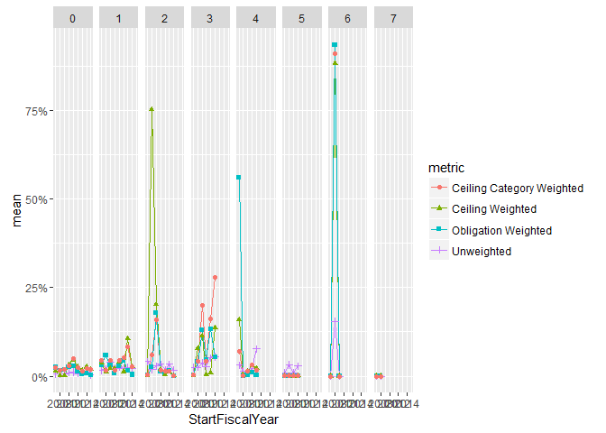
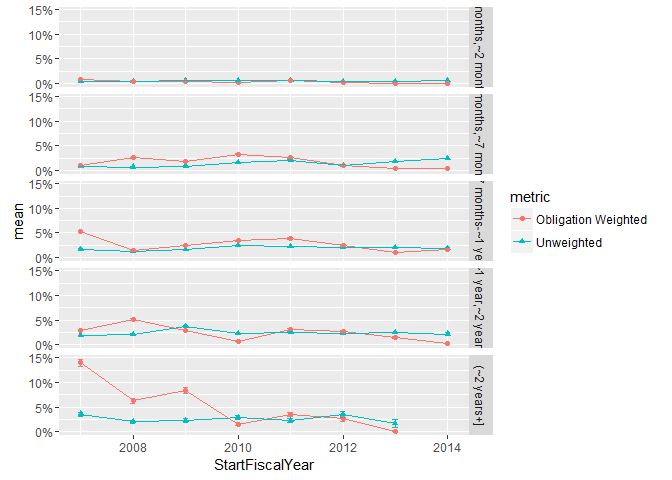
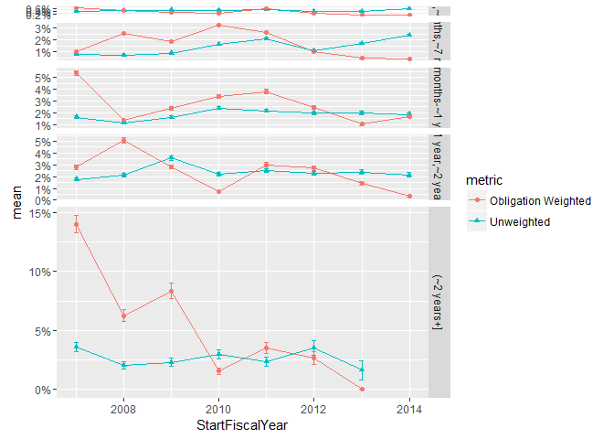
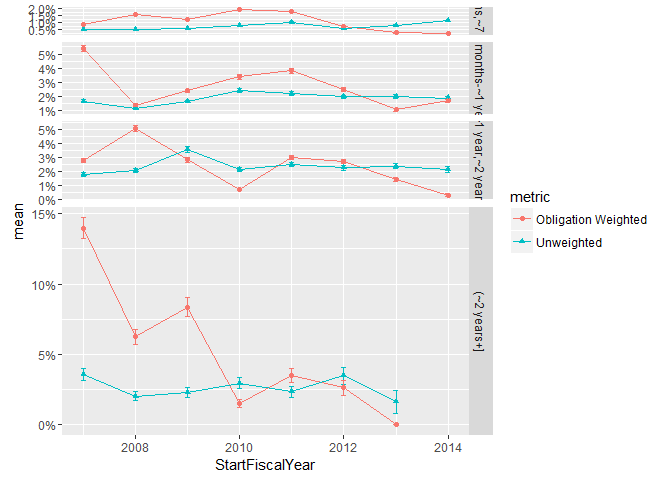
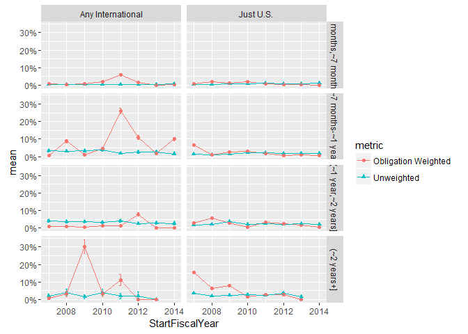
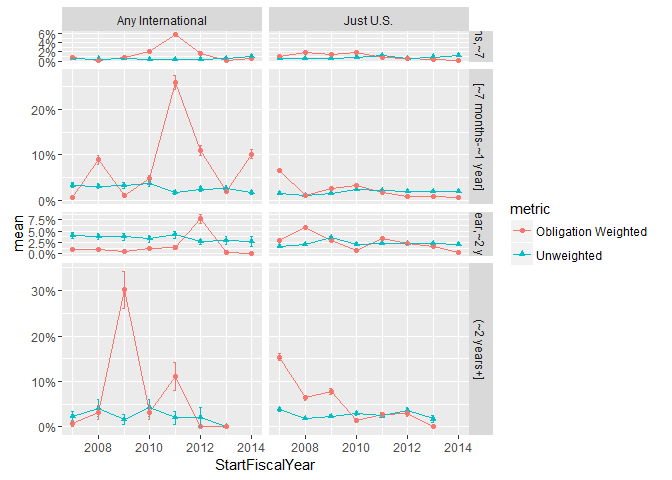
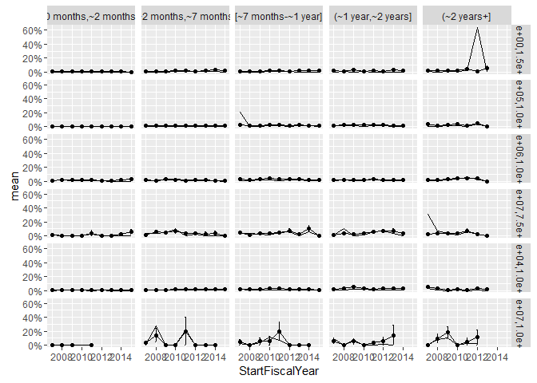
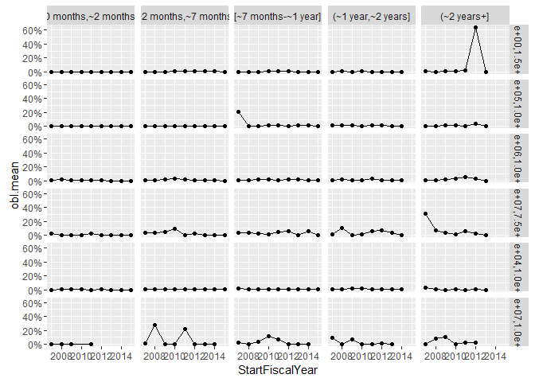
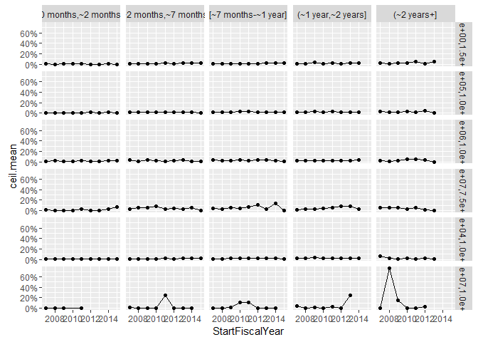

# ContractTermination
Greg Sanders  
Friday, March 20, 2015  

Is Terminated exploration
============================================================================


```r
##install.packages("ggplot2")

##library("ggplot2")
# 
setwd("K:\\Development\\Defense")

Path<-"K:\\2007-01 PROFESSIONAL SERVICES\\R scripts and data\\"
source(paste(Path,"lookups.r",sep=""))
```

```
## Loading required package: stringr
```

```
## Loading required package: plyr
```

```r
source(paste(Path,"helper.r",sep=""))
```

```
## Loading required package: ggplot2
```

```
## Loading required package: grid
```

```
## Loading required package: scales
```

```
## Loading required package: reshape2
```

```
## Loading required package: lubridate
```

```
## 
## Attaching package: 'lubridate'
```

```
## The following object is masked from 'package:plyr':
## 
##     here
```

```
## The following object is masked from 'package:base':
## 
##     date
```

```r
source("ContractCleanup.r")

require(ggplot2)
require(scales)
require(Hmisc)
```

```
## Loading required package: Hmisc
```

```
## Loading required package: lattice
```

```
## Loading required package: survival
```

```
## Loading required package: Formula
```

```
## 
## Attaching package: 'Hmisc'
```

```
## The following object is masked _by_ '.GlobalEnv':
## 
##     subplot
```

```
## The following objects are masked from 'package:plyr':
## 
##     is.discrete, summarize
```

```
## The following objects are masked from 'package:base':
## 
##     format.pval, round.POSIXt, trunc.POSIXt, units
```

```r
Coloration<-read.csv(
    paste(Path,"Lookups\\","lookup_coloration.csv",sep=""),
    header=TRUE, sep=",", na.strings="", dec=".", strip.white=TRUE, 
    stringsAsFactors=FALSE
    )

Coloration<-ddply(Coloration
                  , c(.(R), .(G), .(B))
                  , transform
                  , ColorRGB=as.character(
                      if(min(is.na(c(R,G,B)))) {NA} 
                      else {rgb(max(R),max(G),max(B),max=255)}
                      )
                  )
```

Contracts are classified using a mix of numerical and categorical variables. While the changes in numerical variables are easy to grasp and summarize, a contract may have one line item that is competed and another that is not. As is detailed in the exploration on R&D, we are only considering information available prior to contract start. The percentage of contract obligations that were competed is a valuable benchmark, but is highly influenced by factors that occured after contract start..

## Contract Terminations


Contract terminations and the number of change orders can be calculated for the entire sample.  Contract termination is determined using the *Reason for Modification* field in FPDS.  A contract is considered to be terminated if it has at least one modification with the following values:

* "Terminate for Default (complete or partial)"
* "Terminate for Convenience (complete or partial)"
* "Terminate for Cause"
* "Legal Contract Cancellation"

These four catetegories and the "Close Out" category are used to mark a contract as closed.  Many contracts in FPDS and in the sample are never marked closed.  


```r
CompleteModelAndDetail  <- read.csv(
    paste("LargeDatasets\\defense_contract_CSIScontractID_detail.csv", sep = ""),
    header = TRUE, sep = ",", dec = ".", strip.white = TRUE, 
    na.strings = c("NULL","NA",""),
    stringsAsFactors = TRUE
    )

CompleteModelAndDetail<-FormatContractModel(CompleteModelAndDetail)

#ContractWeighted <- apply_lookups(Path,ContractWeighted)


CompleteModelAndDetail$TermNum<-as.integer(as.character(factor(CompleteModelAndDetail$Term,
                                  levels=c("Terminated","Unterminated"),
                                  labels=c(1,0))))
CompleteModelAndDetail$ObligationWT<-CompleteModelAndDetail$Action.Obligation
CompleteModelAndDetail$ObligationWT[CompleteModelAndDetail$ObligationWT<0]<-NA

CompleteModelAndDetail<-subset(CompleteModelAndDetail,StartFiscalYear>=2007)
CompleteModelAndDetail<-ddply(CompleteModelAndDetail,
                         .(Ceil),
                         
                         plyr::mutate,
                         ceil.median.wt = median(UnmodifiedContractBaseAndAllOptionsValue)
)


CompleteModelAndDetail$UnmodifiedYearsFloat<-difftime(CompleteModelAndDetail$UnmodifiedCompletionDate,
              CompleteModelAndDetail$MinOfEffectiveDate,
              unit="weeks")/52.25
CompleteModelAndDetail$UnmodifiedYearsCat<-floor(CompleteModelAndDetail$UnmodifiedYearsFloat)
CompleteModelAndDetail$Dur[CompleteModelAndDetail$UnmodifiedYearsCat<0]<-NA


if (all(levels(CompleteModelAndDetail$Dur) %in% c("[ -42275,     61)",
                                               "[     61,    214)",
                                               "[    214,    366)",
                                               "[    366,    732)",
                                               "[    732,2920903]"))){
    CompleteModelAndDetail$Dur<-factor(CompleteModelAndDetail$Dur, 
                                   
                                   levels=c("[ -42275,     61)",
                                               "[     61,    214)",
                                               "[    214,    366)",
                                               "[    366,    732)",
                                               "[    732,2920903]"),
                                   labels=c("[0 months,~2 months)",
                                               "[~2 months,~7 months)",
                                               "[~7 months-~1 year]",
                                               "(~1 year,~2 years]",
                                               "(~2 years+]"),
                                   ordered=TRUE
                                   )
    }
```

**A Histogram of the IsTerminated data** showing the distribution of whether or not a contract was terminated each year from 2007.  


```r
# TerminatedDurSummary<-ddply(subset(CompleteModelAndDetail,StartFiscalYear>=2007 & 
#                   !is.na(Ceil)&
#                   UnmodifiedCompletionDate<=as.Date("2015-09-30")&
#                       !is.na(Term)),
#                             .(Ceil,
#                               Dur,
#                               StartFiscalYear,
#                               Term
#                             ),
#                             plyr::summarise,
#                             Action.Obligation=sum(Action.Obligation),
#                             Count=length(CSIScontractID)
#                   )
# 
# 
# TerminatedDurSummary<-ddply(TerminatedDurSummary,.(Ceil,
#                                                   Dur,
#                                              StartFiscalYear
#                                              ),transform,
#                       pContractCeilDurStart=Count/sum(Count),
#                       pObligationCeilDurStart=Action.Obligation/sum(Action.Obligation)
#       )
# 
# 
# ggplot(TerminatedDurSummary,
#        aes(x=StartFiscalYear,
#            y=Count,
#            color=Term))+geom_line()+    geom_point(aes(shape=metric))+facet_grid(Ceil ~ Dur ) +scale_y_log10(labels=scales::comma)
# 
# 
# 
# 
# 
# 
# ggplot(
#   data = TerminatedEndSummary,
#   aes_string(x = "Term"),
#   ) + geom_bar() + 
#     facet_grid( Ceil ~ .,
#                 scales = "free_y",
#                 space = "free_y") + scale_y_continuous(expand = c(0,50)) 
# 
# 
# 
# 
# 
# ggplot(
#   data = subset(TerminatedEndSummary,Term=="Terminated"),
#   aes_string(x = "Ceil")
#   )+ geom_bar()+
#     scale_x_discrete("Original Ceiling (Current $ Value)")+scale_y_continuous("Number of Partially or Completely \nTerminated Contracts",labels = comma)+theme(axis.text.x=element_text(angle=90,size=12))
# 
# 
# 
# 
# 
# 
# TerminatedEndSummary$Graph[TerminatedEndSummary$Term=="Terminated"]<-TRUE
# 
# TerminatedEndSummary$Graph[TerminatedEndSummary$Term=="Unterminated"]<-FALSE
# 
# 
# head(TerminatedEndSummary)
# 
# ggplot(
#   data = subset(TerminatedEndSummary,Term=="Terminated"),
#   aes(x = Ceil,weight=Action.Obligation/1000000000)
#   )+ geom_bar()+
#     scale_x_discrete("Original Ceiling (Current $ Value)")+scale_y_continuous("Obligations to Partially or Completely\nTerminated Contracts (Current $ Billions)",labels = comma)+theme(axis.text.x=element_text(angle=90,size=12))
# 
# 
# ggplot(
#   data = subset(TerminatedEndSummary,Term=="Terminated"),
#   aes_string(x = "Ceil",weight="pContract")
# #   main="Percentage of Contracts going to Partially or Completely Terminated Contracts\nBy Initial Contract Ceiling"
#   )+ geom_bar()+ scale_y_continuous("Percent of Contracts Partially or Completely Terminated\nby Original Ceiling Category", labels=percent)+
#     scale_x_discrete("Original Ceiling (Current $ Value)")+theme(axis.text.x=element_text(angle=90,size=12))
# 
# 
# ggplot(
#   data = subset(TerminatedEndSummary,Term=="Terminated"),
#   aes_string(x = "Ceil",weight="pObligation"),
#   main="Percentage of Contract Obligations going to Partially or Completely Terminated Contracts\nBy Initial Contract Ceiling"
#   )+ geom_bar()+ scale_y_continuous("Percent of Obligations to Terminated Contracts \nin Original Ceiling Category", labels=percent)+
#     scale_x_discrete("Original Ceiling (Current $ Value)")+theme(axis.text.x=element_text(angle=90,size=12))
# 
# 
# # 
# # LatticePercentLineWrapper("VAR.name"
# #                                     ,"VAR.proper.name"
# #                                     ,"VAR.X.label"
# #                                     ,"VAR.Y.label"
# #                                     ,Coloration
# #                                     ,subset(TerminatedEndSummary,!is.na(Term))
# #                                     ,NULL
# #                                     ,"Ceil"
# #                                     ,"Count"
# #                                     ,"Term"
# #                                     ,NA
# #                                     ,NA
# #                                     )
# 
# # 
# # + 
# #     facet_grid( Ceil ~ .,
# #                 scales = "free_y",
# #                 space = "free_y") 
# # 

head(CompleteModelAndDetail)
```

```
##   CSIScontractID        FxCb           Fee     IDV     Comp       Who
## 1       60507481 Fixed-Price FFP or No Fee     IDV No Comp. Other DoD
## 2       25586015 Fixed-Price FFP or No Fee Def/Pur No Comp.      Army
## 3        8055346 Fixed-Price FFP or No Fee Def/Pur    Comp.      Army
## 4       60382503 Fixed-Price FFP or No Fee     IDV    Comp. Other DoD
## 5       22386605 Fixed-Price FFP or No Fee     IDV    Comp. Other DoD
## 6       22617055 Fixed-Price FFP or No Fee     IDV    Comp. Other DoD
##                          What      Intl      PSR           LowCeil
## 1 Facilities and Construction Just U.S. Products [0.0e+00,1.5e+04)
## 2                       Other Just U.S. Products [0.0e+00,1.5e+04)
## 3 Facilities and Construction Just U.S. Products [0.0e+00,1.5e+04)
## 4                       Other Just U.S. Products [0.0e+00,1.5e+04)
## 5 Facilities and Construction Just U.S. Products [0.0e+00,1.5e+04)
## 6                       Other Just U.S. Products [0.0e+00,1.5e+04)
##                Ceil                  Dur SingleOffer Offr
## 1 [0.0e+00,1.5e+04) [0 months,~2 months)      Single    1
## 2 [0.0e+00,1.5e+04) [0 months,~2 months)      Single    1
## 3 [0.0e+00,1.5e+04) [0 months,~2 months)       Multi  3-4
## 4 [0.0e+00,1.5e+04) [0 months,~2 months)       Multi  3-4
## 5 [0.0e+00,1.5e+04) [0 months,~2 months)       Multi    2
## 6 [0.0e+00,1.5e+04) [0 months,~2 months)       Multi    2
##                Soft     UCA            CRai NChg            Veh
## 1 Not Software Eng.    <NA> [-0.001, 0.001)    0           <NA>
## 2 Not Software Eng. Not UCA [-0.001, 0.001)    0        Def/Pur
## 3 Not Software Eng.    <NA> [-0.001, 0.001)    0        Def/Pur
## 4 Not Software Eng.    <NA> [-0.001, 0.001)    0           <NA>
## 5 Not Software Eng. Not UCA [-0.001, 0.001)    0 MULTIPLE AWARD
## 6 Not Software Eng. Not UCA [-0.001, 0.001)    0   SINGLE AWARD
##   UnmodifiedNumberOfOffersReceived         Term
## 1                                1 Unterminated
## 2                                1 Unterminated
## 3                                3 Unterminated
## 4                                4 Unterminated
## 5                                2 Unterminated
## 6                                2 Unterminated
##   UnmodifiedContractBaseAndAllOptionsValue SumOfisChangeOrder
## 1                                   264.70                  0
## 2                                  6650.00                  0
## 3                                  7429.47                  0
## 4                                   248.10                  0
## 5                                  8785.00                  0
## 6                                  4494.00                  0
##   pChangeOrderUnmodifiedBaseAndAll pChangeOrderObligated UnmodifiedDays
## 1                                0                     0       27.95833
## 2                                0                     0       41.04167
## 3                                0                     0        7.00000
## 4                                0                     0        5.00000
## 5                                0                     0        3.00000
## 6                                0                     0        6.00000
##   MinOfEffectiveDate Action.Obligation ContractCount StartFiscalYear
## 1         2015-03-05            264.70             1            2015
## 2         2012-10-26           6650.00             1            2013
## 3         2009-12-03           7429.47             1            2010
## 4         2015-02-13            248.10             1            2015
## 5         2007-08-18           8785.00             1            2007
## 6         2008-08-13           4494.00             1            2008
##   UnmodifiedCompletionDate EndAfterPeriod TermNum ObligationWT
## 1               2015-03-31          FALSE       0       264.70
## 2               2012-12-05          FALSE       0      6650.00
## 3               2009-12-09          FALSE       0      7429.47
## 4               2015-02-17          FALSE       0       248.10
## 5               2007-08-20          FALSE       0      8785.00
## 6               2008-08-18          FALSE       0      4494.00
##   ceil.median.wt UnmodifiedYearsFloat UnmodifiedYearsCat
## 1           4472    0.073706995 weeks            0 weeks
## 2           4472    0.109478241 weeks            0 weeks
## 3           4472    0.016404648 weeks            0 weeks
## 4           4472    0.010936432 weeks            0 weeks
## 5           4472    0.005468216 weeks            0 weeks
## 6           4472    0.013670540 weeks            0 weeks
```


```r
# 
# ggplot(TerminatedEndSummary,
#        aes(x=StartFiscalYear,
#            y=Count,
#            color=Term))+geom_line()+    geom_point(aes(shape=metric))+facet_grid(Ceil ~ EndAfterPeriod ) +scale_y_log10()
```


```r
TerminatedUnmodifiedYearsCatStat<-rbind(ddply(subset(CompleteModelAndDetail,
                                !is.na(Dur) & StartFiscalYear>=2007 & 
                                    !is.na(UnmodifiedYearsCat) &
                                    UnmodifiedCompletionDate<as.Date("2015-09-30")&
                                    !is.na(Term)),
                         .(UnmodifiedYearsCat,
                           StartFiscalYear
                         ),
                         
                         plyr::summarise,
                         Action.Obligation=sum(Action.Obligation),
                         Count=length(CSIScontractID),
                         mean = mean(TermNum),
                         sd   = NA ,# sd(TermNum),
                         se   = NA, #sd / sqrt(Count),
                         metric="Unweighted"
                          # ceil.mean = wtd.mean(TermNum,UnmodifiedContractBaseAndAllOptionsValue),
                         # ceil.cat.mean = wtd.mean(TermNum,ceil.median.wt)
))


TerminatedUnmodifiedYearsCatStat<-rbind(TerminatedUnmodifiedYearsCatStat,
                         ddply(subset(CompleteModelAndDetail,
                                !is.na(Dur) & StartFiscalYear>=2007 & 
                                    !is.na(Ceil) &
                                    UnmodifiedCompletionDate<as.Date("2015-09-30")&
                                    !is.na(Term)),
                         .(UnmodifiedYearsCat,
                           StartFiscalYear
                         ),
                         
                         plyr::summarise,
                         Action.Obligation=sum(Action.Obligation),
                         Count=length(CSIScontractID),
                         mean = wtd.mean(TermNum,ObligationWT),
                         sd   = NA ,# sd(TermNum),
                         se   = NA, #sd / sqrt(Count),
                         metric="Obligation Weighted"
                          # ceil.mean = wtd.mean(TermNum,UnmodifiedContractBaseAndAllOptionsValue),
                         # ceil.cat.mean = wtd.mean(TermNum,ceil.median.wt)

))

TerminatedUnmodifiedYearsCatStat<-rbind(TerminatedUnmodifiedYearsCatStat,
                         ddply(subset(CompleteModelAndDetail,
                                !is.na(Dur) & StartFiscalYear>=2007 & 
                                    !is.na(Ceil) &
                                    UnmodifiedCompletionDate<as.Date("2015-09-30")&
                                    !is.na(Term)),
                         .(UnmodifiedYearsCat,
                           StartFiscalYear
                         ),
                         
                         plyr::summarise,
                         Action.Obligation=sum(Action.Obligation),
                         Count=length(CSIScontractID),
                         mean = wtd.mean(TermNum,UnmodifiedContractBaseAndAllOptionsValue),
                         sd   = NA ,# sd(TermNum),
                         se   = NA, #sd / sqrt(Count),
                         metric="Ceiling Weighted"
                         # obl.mean = ,
                         # ceil.mean = wtd.mean(TermNum,UnmodifiedContractBaseAndAllOptionsValue),
                         # ceil.cat.mean = wtd.mean(TermNum,ceil.median.wt)

))


TerminatedUnmodifiedYearsCatStat<-rbind(TerminatedUnmodifiedYearsCatStat,
                         ddply(subset(CompleteModelAndDetail,
                                !is.na(Dur) & StartFiscalYear>=2007 & 
                                    !is.na(Ceil) &
                                    UnmodifiedCompletionDate<as.Date("2015-09-30")&
                                    !is.na(Term)),
                         .(UnmodifiedYearsCat,
                           StartFiscalYear
                         ),
                         
                         plyr::summarise,
                         Action.Obligation=sum(Action.Obligation),
                         Count=length(CSIScontractID),
                         mean = wtd.mean(TermNum,ceil.median.wt),
                         sd   = NA ,# sd(TermNum),
                         se   = NA, #sd / sqrt(Count),
                         metric="Ceiling Category Weighted"

))


# 
# pd <- position_dodge(0.1) # move them .05 to the left and right
# 
# ggplot(tgc, aes(x=dose, y=len, colour=supp)) + 
#     geom_errorbar(aes(ymin=len-se, ymax=len+se), width=.1, position=pd) 

ggplot(TerminatedUnmodifiedYearsCatStat,aes(x=StartFiscalYear,y=mean,color=metric))+
    geom_line()+
        geom_point(aes(shape=metric))+
    facet_grid(.~ UnmodifiedYearsCat ) +
    scale_y_continuous(label=percent)+
    geom_errorbar(aes(ymin=mean-se, ymax=mean+se), width=.1) #, position=pd
```

```
## Warning: Removed 176 rows containing missing values (geom_errorbar).
```

<!-- -->


```r
TerminatedDurStat<-rbind(                         ddply(subset(CompleteModelAndDetail,
                                !is.na(Dur) & StartFiscalYear>=2007 & 
                                    StartFiscalYear<=2014 & 
                                    !is.na(Ceil) &
                                    UnmodifiedCompletionDate<as.Date("2015-09-30")&
                                    !is.na(Term)),
                         .(Dur,
                           StartFiscalYear
                         ),
                         
                         plyr::summarise,
                         Action.Obligation=sum(Action.Obligation),
                         Count=length(CSIScontractID),
                         mean = mean(TermNum),
                         sd   = sd(TermNum),
                         se   = sd / sqrt(Count),
                         metric="Unweighted"
                          # ceil.mean = wtd.mean(TermNum,UnmodifiedContractBaseAndAllOptionsValue),
                         # ceil.cat.mean = wtd.mean(TermNum,ceil.median.wt)
))


TerminatedDurStat<-rbind(TerminatedDurStat,
                         ddply(subset(CompleteModelAndDetail,
                                !is.na(Dur) & StartFiscalYear>=2007 & 
                                    StartFiscalYear<=2014 & 
                                    !is.na(Ceil) &
                                    UnmodifiedCompletionDate<as.Date("2015-09-30")&
                                    !is.na(Term)),
                         .(Dur,
                           StartFiscalYear
                         ),
                         
                         plyr::summarise,
                         Action.Obligation=sum(Action.Obligation),
                         Count=length(CSIScontractID),
                         mean = wtd.mean(TermNum,ObligationWT),
                         sd   = sqrt(wtd.var(TermNum,ObligationWT)) ,
                         se   = sd / sqrt(Count),
                         metric="Obligation Weighted"
                          # ceil.mean = wtd.mean(TermNum,UnmodifiedContractBaseAndAllOptionsValue),
                         # ceil.cat.mean = wtd.mean(TermNum,ceil.median.wt)
))

TerminatedDurStat<-rbind(TerminatedDurStat,
                         ddply(subset(CompleteModelAndDetail,
                                !is.na(Dur) & StartFiscalYear>=2007 & 
                                    StartFiscalYear<=2014 & 
                                    !is.na(Ceil) &
                                    UnmodifiedCompletionDate<as.Date("2015-09-30")&
                                    !is.na(Term)),
                         .(Dur,
                           StartFiscalYear
                         ),
                         
                         plyr::summarise,
                         Action.Obligation=sum(Action.Obligation),
                         Count=length(CSIScontractID),
                         mean = wtd.mean(TermNum,UnmodifiedContractBaseAndAllOptionsValue),
                         sd   = sqrt(wtd.var(TermNum,UnmodifiedContractBaseAndAllOptionsValue)) ,
                         se   = sd / sqrt(Count),
                         metric="Ceiling Weighted"
                         # obl.mean = ,
                         # ceil.mean = wtd.mean(TermNum,UnmodifiedContractBaseAndAllOptionsValue),
                         # ceil.cat.mean = wtd.mean(TermNum,ceil.median.wt)

))


TerminatedDurStat<-rbind(TerminatedDurStat,
                         ddply(subset(CompleteModelAndDetail,
                                !is.na(Dur) & StartFiscalYear>=2007 & 
                                    StartFiscalYear<=2014 & 
                                    !is.na(Ceil) &
                                    UnmodifiedCompletionDate<as.Date("2015-09-30")&
                                    !is.na(Term)),
                         .(Dur,
                           StartFiscalYear
                         ),
                         
                         plyr::summarise,
                         Action.Obligation=sum(Action.Obligation),
                         Count=length(CSIScontractID),
                         mean = wtd.mean(TermNum,ceil.median.wt),
                         sd   = sqrt(wtd.var(TermNum,ceil.median.wt)) ,
                         se   = sd / sqrt(Count),
                         metric="Ceiling Category Weighted"

))


# 
# pd <- position_dodge(0.1) # move them .05 to the left and right
# 
# ggplot(tgc, aes(x=dose, y=len, colour=supp)) + 
#     geom_errorbar(aes(ymin=len-se, ymax=len+se), width=.1, position=pd) 

ggplot(subset(TerminatedDurStat,!metric %in% c("Ceiling Weighted","Ceiling Category Weighted")),
       aes(x=StartFiscalYear,y=mean,color=metric))+
    geom_line()+
        geom_point(aes(shape=metric))+
    facet_grid( Dur  ~.) +
    scale_y_continuous(label=percent)+
    geom_errorbar(aes(ymin=mean-se, ymax=mean+se), width=.1) #, position=pd
```

<!-- -->

```r
ggplot(subset(TerminatedDurStat,!metric %in% c("Ceiling Weighted","Ceiling Category Weighted")),
       aes(x=StartFiscalYear,y=mean,color=metric))+
    geom_line()+
        geom_point(aes(shape=metric))+
    facet_grid( Dur  ~., space = "free_y", scales="free_y") +
    scale_y_continuous(label=percent)+
    geom_errorbar(aes(ymin=mean-se, ymax=mean+se), width=.1) #, position=pd
```

<!-- -->


```r
ddply(TerminatedDurStat,
      .(Dur),
      plyr::summarise,
      Count=sum(Count),
      Action.Obligation=sum(Action.Obligation))
```

```
##                     Dur   Count Action.Obligation
## 1  [0 months,~2 months) 3048428      148932482284
## 2 [~2 months,~7 months) 1288212      200141426118
## 3   [~7 months-~1 year]  430072      275149475921
## 4    (~1 year,~2 years]  276384      361481988634
## 5           (~2 years+]   41348      216346113322
```

```r
CompleteModelAndDetail$Dur.Simple<-as.character(CompleteModelAndDetail$Dur)
CompleteModelAndDetail$Dur.Simple[CompleteModelAndDetail$Dur.Simple %in% c("[0 months,~2 months)",
                                  "[~2 months,~7 months)")]<-"[0 months,~7 months)"
CompleteModelAndDetail$Dur.Simple<-factor(CompleteModelAndDetail$Dur.Simple,
                                          levels=c("[0 months,~7 months)",
                                                   "[~7 months-~1 year]",
                                               "(~1 year,~2 years]",
                                               "(~2 years+]"),
                                   ordered=TRUE
                                   )


TerminatedDur.SimpleStat<-rbind(                         ddply(subset(CompleteModelAndDetail,
                                !is.na(Dur) & StartFiscalYear>=2007 & 
                                    StartFiscalYear<=2014 & 
                                    !is.na(Ceil) &
                                    UnmodifiedCompletionDate<as.Date("2015-09-30")&
                                    !is.na(Term)),
                         .(Dur.Simple,
                           StartFiscalYear
                         ),
                         
                         plyr::summarise,
                         Action.Obligation=sum(Action.Obligation),
                         Count=length(CSIScontractID),
                         mean = mean(TermNum),
                         sd   = sd(TermNum),
                         se   = sd / sqrt(Count),
                         metric="Unweighted"
                          # ceil.mean = wtd.mean(TermNum,UnmodifiedContractBaseAndAllOptionsValue),
                         # ceil.cat.mean = wtd.mean(TermNum,ceil.median.wt)
))


TerminatedDur.SimpleStat<-rbind(TerminatedDur.SimpleStat,
                         ddply(subset(CompleteModelAndDetail,
                                !is.na(Dur) & StartFiscalYear>=2007 & 
                                    StartFiscalYear<=2014 & 
                                    !is.na(Ceil) &
                                    UnmodifiedCompletionDate<as.Date("2015-09-30")&
                                    !is.na(Term)),
                         .(Dur.Simple,
                           StartFiscalYear
                         ),
                         
                         plyr::summarise,
                         Action.Obligation=sum(Action.Obligation),
                         Count=length(CSIScontractID),
                         mean = wtd.mean(TermNum,ObligationWT),
                         sd   = sqrt(wtd.var(TermNum,ObligationWT)) ,
                         se   = sd / sqrt(Count),
                         metric="Obligation Weighted"
                          # ceil.mean = wtd.mean(TermNum,UnmodifiedContractBaseAndAllOptionsValue),
                         # ceil.cat.mean = wtd.mean(TermNum,ceil.median.wt)
))

TerminatedDur.SimpleStat<-rbind(TerminatedDur.SimpleStat,
                         ddply(subset(CompleteModelAndDetail,
                                !is.na(Dur) & StartFiscalYear>=2007 & 
                                    StartFiscalYear<=2014 & 
                                    !is.na(Ceil) &
                                    UnmodifiedCompletionDate<as.Date("2015-09-30")&
                                    !is.na(Term)),
                         .(Dur.Simple,
                           StartFiscalYear
                         ),
                         
                         plyr::summarise,
                         Action.Obligation=sum(Action.Obligation),
                         Count=length(CSIScontractID),
                         mean = wtd.mean(TermNum,UnmodifiedContractBaseAndAllOptionsValue),
                         sd   = sqrt(wtd.var(TermNum,UnmodifiedContractBaseAndAllOptionsValue)) ,
                         se   = sd / sqrt(Count),
                         metric="Ceiling Weighted"
                         # obl.mean = ,
                         # ceil.mean = wtd.mean(TermNum,UnmodifiedContractBaseAndAllOptionsValue),
                         # ceil.cat.mean = wtd.mean(TermNum,ceil.median.wt)

))


TerminatedDur.SimpleStat<-rbind(TerminatedDur.SimpleStat,
                         ddply(subset(CompleteModelAndDetail,
                                !is.na(Dur) & StartFiscalYear>=2007 & 
                                    StartFiscalYear<=2014 & 
                                    !is.na(Ceil) &
                                    UnmodifiedCompletionDate<as.Date("2015-09-30")&
                                    !is.na(Term)),
                         .(Dur.Simple,
                           StartFiscalYear
                         ),
                         
                         plyr::summarise,
                         Action.Obligation=sum(Action.Obligation),
                         Count=length(CSIScontractID),
                         mean = wtd.mean(TermNum,ceil.median.wt),
                         sd   = sqrt(wtd.var(TermNum,ceil.median.wt)) ,
                         se   = sd / sqrt(Count),
                         metric="Ceiling Category Weighted"

))


# 
# pd <- position_dodge(0.1) # move them .05 to the left and right
# 
# ggplot(tgc, aes(x=dose, y=len, colour=supp)) + 
#     geom_errorbar(aes(ymin=len-se, ymax=len+se), width=.1, position=pd) 

ggplot(subset(TerminatedDur.SimpleStat,!metric %in% c("Ceiling Weighted","Ceiling Category Weighted")),
       aes(x=StartFiscalYear,y=mean,color=metric))+
    geom_line()+
    geom_point(aes(shape=metric))+
    facet_grid( Dur.Simple  ~.) +
    scale_y_continuous(label=percent)+
    geom_errorbar(aes(ymin=mean-se, ymax=mean+se), width=.1) #, position=pd
```

<!-- -->

```r
ggplot(subset(TerminatedDur.SimpleStat,!metric %in% c("Ceiling Weighted","Ceiling Category Weighted")),
       aes(x=StartFiscalYear,y=mean,color=metric))+
    geom_line()+
        geom_point(aes(shape=metric))+
    facet_grid( Dur.Simple  ~., space = "free_y", scales="free_y") +
    scale_y_continuous(label=percent)+
    geom_errorbar(aes(ymin=mean-se, ymax=mean+se), width=.1) #, position=pd
```

<!-- -->


```r
TerminatedDur.SimpleIntlStat<-rbind(                         ddply(subset(CompleteModelAndDetail,
                                !is.na(Dur) & StartFiscalYear>=2007 & 
                                    StartFiscalYear<=2014 & 
                                    !is.na(Ceil) &
                                    !is.na(Intl) &
                                    UnmodifiedCompletionDate<as.Date("2015-09-30")&
                                    !is.na(Term)),
                         .(Dur.Simple,
                           StartFiscalYear,
                           Intl
                         ),
                         
                         plyr::summarise,
                         Action.Obligation=sum(Action.Obligation),
                         Count=length(CSIScontractID),
                         mean = mean(TermNum),
                         sd   = sd(TermNum),
                         se   = sd / sqrt(Count),
                         metric="Unweighted"
                          # ceil.mean = wtd.mean(TermNum,UnmodifiedContractBaseAndAllOptionsValue),
                         # ceil.cat.mean = wtd.mean(TermNum,ceil.median.wt)
))


TerminatedDur.SimpleIntlStat<-rbind(TerminatedDur.SimpleIntlStat,
                         ddply(subset(CompleteModelAndDetail,
                                !is.na(Dur) & StartFiscalYear>=2007 & 
                                    StartFiscalYear<=2014 & 
                                    !is.na(Ceil) &
                                    !is.na(Intl) &
                                    UnmodifiedCompletionDate<as.Date("2015-09-30")&
                                    !is.na(Term)),
                         .(Dur.Simple,
                           StartFiscalYear,
                           Intl
                         ),
                         
                         plyr::summarise,
                         Action.Obligation=sum(Action.Obligation),
                         Count=length(CSIScontractID),
                         mean = wtd.mean(TermNum,ObligationWT),
                         sd   = sqrt(wtd.var(TermNum,ObligationWT)) ,
                         se   = sd / sqrt(Count),
                         metric="Obligation Weighted"
                          # ceil.mean = wtd.mean(TermNum,UnmodifiedContractBaseAndAllOptionsValue),
                         # ceil.cat.mean = wtd.mean(TermNum,ceil.median.wt)
))

TerminatedDur.SimpleIntlStat<-rbind(TerminatedDur.SimpleIntlStat,
                         ddply(subset(CompleteModelAndDetail,
                                !is.na(Dur) & StartFiscalYear>=2007 & 
                                    StartFiscalYear<=2014 & 
                                    !is.na(Ceil) &
                                    !is.na(Intl) &
                                    UnmodifiedCompletionDate<as.Date("2015-09-30")&
                                    !is.na(Term)),
                         .(Dur.Simple,
                           StartFiscalYear,
                           Intl
                         ),
                         
                         plyr::summarise,
                         Action.Obligation=sum(Action.Obligation),
                         Count=length(CSIScontractID),
                         mean = wtd.mean(TermNum,UnmodifiedContractBaseAndAllOptionsValue),
                         sd   = sqrt(wtd.var(TermNum,UnmodifiedContractBaseAndAllOptionsValue)) ,
                         se   = sd / sqrt(Count),
                         metric="Ceiling Weighted"
                         # obl.mean = ,
                         # ceil.mean = wtd.mean(TermNum,UnmodifiedContractBaseAndAllOptionsValue),
                         # ceil.cat.mean = wtd.mean(TermNum,ceil.median.wt)

))


TerminatedDur.SimpleIntlStat<-rbind(TerminatedDur.SimpleIntlStat,
                         ddply(subset(CompleteModelAndDetail,
                                !is.na(Dur) & StartFiscalYear>=2007 & 
                                    StartFiscalYear<=2014 & 
                                    !is.na(Ceil) &
                                    !is.na(Intl) &
                                    UnmodifiedCompletionDate<as.Date("2015-09-30")&
                                    !is.na(Term)),
                         .(Dur.Simple,
                           StartFiscalYear,
                           Intl
                         ),
                         
                         plyr::summarise,
                         Action.Obligation=sum(Action.Obligation),
                         Count=length(CSIScontractID),
                         mean = wtd.mean(TermNum,ceil.median.wt),
                         sd   = sqrt(wtd.var(TermNum,ceil.median.wt)) ,
                         se   = sd / sqrt(Count),
                         metric="Ceiling Category Weighted"

))


# 
# pd <- position_dodge(0.1) # move them .05 to the left and right
# 
# ggplot(tgc, aes(x=dose, y=len, colour=supp)) + 
#     geom_errorbar(aes(ymin=len-se, ymax=len+se), width=.1, position=pd) 

ddply(TerminatedDur.SimpleIntlStat,
      .(Dur.Simple,
        Intl),
      plyr::summarise,
      Count=sum(Count),
      Action.Obligation=sum(Action.Obligation))
```

```
##             Dur.Simple              Intl   Count Action.Obligation
## 1 [0 months,~7 months) Any International  497496       70080700934
## 2 [0 months,~7 months)         Just U.S. 3839144      278993207469
## 3  [~7 months-~1 year] Any International   27548       30813453281
## 4  [~7 months-~1 year]         Just U.S.  402524      244336022640
## 5   (~1 year,~2 years] Any International   19080       43675253029
## 6   (~1 year,~2 years]         Just U.S.  257304      317806735606
## 7          (~2 years+] Any International    2836       13610905946
## 8          (~2 years+]         Just U.S.   38512      202735207376
```

```r
ggplot(subset(TerminatedDur.SimpleIntlStat,!metric %in% c("Ceiling Weighted","Ceiling Category Weighted")),
       aes(x=StartFiscalYear,y=mean,color=metric))+
    geom_line()+
        geom_point(aes(shape=metric))+
    facet_grid( Dur.Simple  ~ Intl) +
    scale_y_continuous(label=percent)+
    geom_errorbar(aes(ymin=mean-se, ymax=mean+se), width=.1) #, position=pd
```

<!-- -->

```r
ggplot(subset(TerminatedDur.SimpleIntlStat,!metric %in% c("Ceiling Weighted","Ceiling Category Weighted")),
       aes(x=StartFiscalYear,y=mean,color=metric))+
    geom_line()+
        geom_point(aes(shape=metric))+
    facet_grid( Dur.Simple  ~ Intl, space = "free_y", scales="free_y") +
    scale_y_continuous(label=percent)+
    geom_errorbar(aes(ymin=mean-se, ymax=mean+se), width=.1) #, position=pd
```

<!-- -->


```r
TerminatedDurCeilStat<-ddply(subset(CompleteModelAndDetail,
                                !is.na(Dur) & StartFiscalYear>=2007 & 
                                    !is.na(Ceil) &
                                    UnmodifiedCompletionDate<as.Date("2015-09-30")&
                                    !is.na(Term)),
                         .(Ceil,
                           Dur,
                           StartFiscalYear
                         ),
                         
                         plyr::summarise,
                         Action.Obligation=sum(Action.Obligation),
                         Count=length(CSIScontractID),
                         N    = length(TermNum),
                         mean = mean(TermNum),
                         sd   = sd(TermNum),
                         se   = sd / sqrt(N),
                         obl.mean = wtd.mean(TermNum,ObligationWT,na.rm=TRUE),
                         ceil.mean = wtd.mean(TermNum,UnmodifiedContractBaseAndAllOptionsValue)
)
# 
# pd <- position_dodge(0.1) # move them .05 to the left and right
# 
# ggplot(tgc, aes(x=dose, y=len, colour=supp)) + 
#     geom_errorbar(aes(ymin=len-se, ymax=len+se), width=.1, position=pd) 

ggplot(TerminatedDurCeilStat,aes(x=StartFiscalYear))+
    geom_line(aes(y=mean))+
    # geom_line(aes(y=ceil.mean))+
    geom_line(aes(y=obl.mean))+
    geom_point(aes(y=mean))+
    facet_grid(Ceil ~ Dur ) +
    scale_y_continuous(label=percent)+
    geom_errorbar(aes(ymin=mean-se, ymax=mean+se), width=.1) #, position=pd
```

```
## Warning: Removed 1 rows containing missing values (geom_errorbar).
```

<!-- -->

```r
ggplot(TerminatedDurCeilStat,
       aes(x=StartFiscalYear,
           y=obl.mean))+geom_line()+    geom_point()+facet_grid(Ceil ~ Dur ) +
    scale_y_continuous(label=percent)
```

<!-- -->

```r
         # geom_errorbar(aes(ymin=mean-se, ymax=mean+se), width=.1) #, position=pd


ggplot(TerminatedDurCeilStat,
       aes(x=StartFiscalYear,
           y=ceil.mean))+geom_line()+    geom_point()+facet_grid(Ceil ~ Dur ) +
    scale_y_continuous(label=percent)
```

<!-- -->

```r
         # geom_errorbar(aes(ymin=mean-se, ymax=mean+se), width=.1) #, position=pd
```


