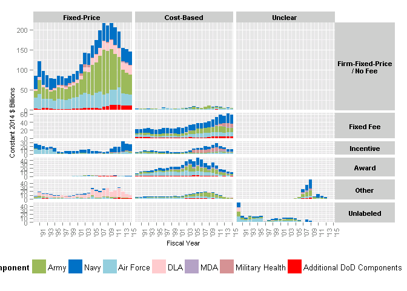
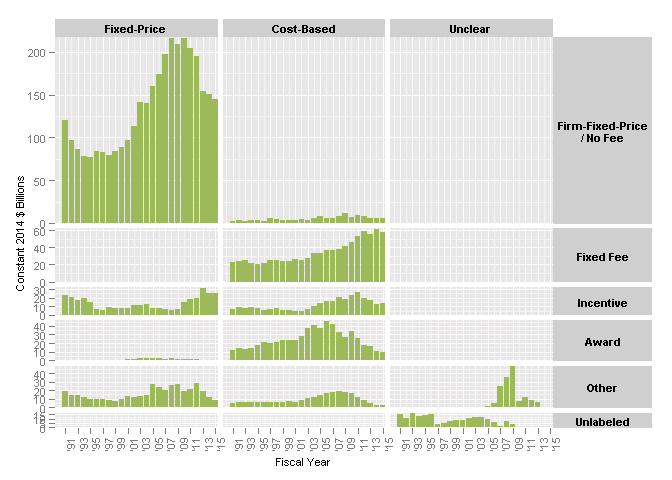

# DoD Fixed-Price Study: Contract Duration Classification
Greg Sanders  
Tuesday, January 13, 2015  


```
## Loading required package: ggplot2
## Loading required package: stringr
## Loading required package: plyr
## Loading required package: Hmisc
## Loading required package: grid
## Loading required package: lattice
## Loading required package: survival
## Loading required package: Formula
## 
## Attaching package: 'Hmisc'
## 
## The following objects are masked from 'package:plyr':
## 
##     is.discrete, summarize
## 
## The following objects are masked from 'package:base':
## 
##     format.pval, round.POSIXt, trunc.POSIXt, units
## 
## Loading required package: lubridate
## 
## Attaching package: 'lubridate'
## 
## The following object is masked from 'package:plyr':
## 
##     here
## 
## Loading required package: knitr
## Loading required package: scales
## Loading required package: reshape2
```


```r
PricingMechanism  <- read.csv(
    paste("data\\Overall_Summary_SP_FundingMechanismFeeHistoryBucketSubCustomerPlatform.csv", sep = ""),
    header = TRUE, sep = ",", dec = ".", strip.white = TRUE, 
    na.strings = c("NULL","NA",""),
    stringsAsFactors = TRUE
)

#These will probably be moved into apply_lookups at some point
PricingMechanism<-apply_lookups(Path,PricingMechanism)
```

```
## Joining by: Customer, SubCustomer
## Joining by: ProductOrServiceArea
## Joining by: PlatformPortfolio
## Joining by: Pricing.Mechanism
## Joining by: Fiscal.Year
```

```
## Warning in apply_lookups(Path, PricingMechanism): NaNs produced
```

```r
# 
# as.numeric(as.duration(
#     ymd(ContractSample$SignedMonth)-ContractSample$StartFiscalYear)
#     /dyears(1)
#     )

PricingMechanism<-subset(PricingMechanism,Customer=="Defense")


SummaryKable(PricingMechanism,"Pricing.Mechanism","Detail")
```


Table: Detail

     Pricing.Mechanism                                Total       Max   MaxYear   Avg. '90-'99   Avg. '00-'07   Avg. '08-'09   Avg. '10-'12   Avg. '13-'14  Drawdown % Change   BCA % Change   Percent 
---  -------------------------------------------  ---------  --------  --------  -------------  -------------  -------------  -------------  -------------  ------------------  -------------  --------
7    Firm Fixed Price                              3335.260   216.288      2010         87.471        139.176        212.770        205.476        152.588  -3.4%               -25.7%         50.8%   
4    Cost Plus Fixed Fee                            829.539    61.413      2014         23.147         30.352         40.030         52.784         58.422  31.9%               10.7%          12.6%   
3    Cost Plus Award Fee                            604.976    45.849      2006         16.124         34.918         29.607         26.011         13.575  -12.1%              -47.8%         9.2%    
12   Fixed Price with Economic Price Adjustment     380.390    28.191      2012         10.419         15.860         25.913         22.452         15.067  -13.4%              -32.9%         5.8%    
9    Fixed Price Incentive                          347.324    31.797      2013         15.031          9.300          6.076         17.606         28.820  189.8%              63.7%          5.3%    
5    Cost Plus Incentive                            285.410    27.023      2011          6.979          9.604         19.226         23.371         15.115  21.6%               -35.3%         4.3%    
17   Time and Materials                             197.253    16.672      2008          5.156         10.353         15.525          9.283          1.988  -40.2%              -78.6%         3.0%    
18   Unlabeled                                      149.490    48.588      1990         14.949          0.000          0.000          0.000          0.000  NaN%                NaN%           2.3%    
1    Combination (two or more)                      148.693    47.985      2009          0.000          4.061         41.420          8.990          3.197  -78.3%              -64.4%         2.3%    
2    Cost No Fee                                    128.028    11.258      2009          3.338          5.049          9.475          8.028          5.613  -15.3%              -30.1%         2.0%    
14   Not Reported                                    77.711    11.542      2003          0.000          8.398          5.150          0.076         -0.001  -98.5%              -102.0%        1.2%    
13   Labor Hours                                     28.236     2.806      2010          0.697          1.068          2.073          2.261          0.895  9.1%                -60.4%         0.4%    
8    Fixed Price Award Fee                           22.209     2.410      2003          0.000          1.689          1.744          1.479          0.385  -15.2%              -73.9%         0.3%    
11   Fixed Price Redetermination                     15.478     1.393      2001          0.684          0.711          0.835          0.301          0.189  -64.0%              -37.0%         0.2%    
10   Fixed Price Level of Effort                      6.634     1.449      2013          0.000          0.062          0.464          0.908          1.244  95.8%               37.0%          0.1%    
6    Cost Sharing                                     5.964     1.035      1995          0.342          0.142          0.209          0.182          0.220  -12.9%              20.6%          0.1%    
16   Other (none of the above)                        0.073     0.013      2001          0.000          0.008          0.001          0.002          0.001  21.9%               -58.7%         0.0%    
15   Order Dependent (IDV only)                       0.001     0.001      2007          0.000          0.000          0.000          0.000          0.000  -Inf%               -100.0%        0.0%    

```r
SummaryKable(PricingMechanism,"Base","Base")
```


Table: Base

     Base              Total       Max   MaxYear   Avg. '90-'99   Avg. '00-'07   Avg. '08-'09   Avg. '10-'12   Avg. '13-'14  Drawdown % Change   BCA % Change   Percent 
---  ------------  ---------  --------  --------  -------------  -------------  -------------  -------------  -------------  ------------------  -------------  --------
2    Fixed-Price    4100.661   251.338      2010        113.606        166.737        247.338        247.312        197.049  -0.0%               -20.3%         62.5%   
1    Cost-Based     2086.041   128.262      2010         55.782         91.547        116.607        122.827         97.073  5.3%                -21.0%         31.8%   
3    Unclear         375.967    51.554      2009         14.949         12.467         46.571          9.068          3.196  -80.5%              -64.7%         5.7%    

```r
SummaryKable(PricingMechanism,"Fee","Fee")
```


Table: Fee

     Fee                             Total       Max   MaxYear   Avg. '90-'99   Avg. '00-'07   Avg. '08-'09   Avg. '10-'12   Avg. '13-'14  Drawdown % Change   BCA % Change   Percent 
---  --------------------------  ---------  --------  --------  -------------  -------------  -------------  -------------  -------------  ------------------  -------------  --------
2    Firm-Fixed-Price / No Fee    3463.289   223.927      2008         90.809        144.225        222.245        213.503        158.201  -3.9%               -25.9%         52.8%   
3    Fixed Fee                     829.539    61.413      2014         23.147         30.352         40.030         52.784         58.422  31.9%               10.7%          12.6%   
5    Other                         776.758    93.099      2009         16.956         32.123         86.231         44.196         22.582  -48.7%              -48.9%         11.8%   
4    Incentive                     638.698    49.495      2013         22.352         19.046         25.511         41.159         44.155  61.3%               7.3%           9.7%    
1    Award                         627.185    48.011      2006         16.124         36.607         31.351         27.489         13.961  -12.3%              -49.2%         9.6%    
6    Unlabeled                     227.201    48.588      1990         14.949          8.398          5.150          0.076         -0.001  -98.5%              -102.0%        3.5%    


```r
LatticePlotWrapper("DoD Component"
                             ,NULL
                             ,"Fiscal Year"
                             ,"Contract Obligations (2014 Billions)"
                             ,Coloration
                             ,PricingMechanism
                             ,VAR.ncol=NA
                             ,"Fiscal.Year"
                             ,"Obligation.2014"
                             ,"SubCustomer.component"
                   ,"Fee"
                             ,"Base"
                             
#                              ,MovingAverage=1
#                              ,MovingSides=1
                             ,DataLabels=FALSE
                             #                       ,VAR.override.coloration=NA
)+theme(axis.text.x=element_text(angle=90))+scale_x_date(breaks=date_breaks("2 years"),
                                                          labels=date_format("'%y"))+
        theme(legend.position="bottom")+
    coord_cartesian(xlim = c(as.Date("6/1/1989","%m/%d/%Y"),
                                                                 as.Date("6/1/2014","%m/%d/%Y")))
```

```
## Scale for 'x' is already present. Adding another scale for 'x', which will replace the existing scale.
```

```
## Warning in loop_apply(n, do.ply): Stacking not well defined when ymin != 0
```

```
## Warning in loop_apply(n, do.ply): Stacking not well defined when ymin != 0
```

```
## Warning in loop_apply(n, do.ply): Stacking not well defined when ymin != 0
```

```
## Warning in loop_apply(n, do.ply): Stacking not well defined when ymin != 0
```

```
## Warning in loop_apply(n, do.ply): Stacking not well defined when ymin != 0
```

```
## Warning in loop_apply(n, do.ply): Stacking not well defined when ymin != 0
```

```
## Warning in loop_apply(n, do.ply): Stacking not well defined when ymin != 0
```

```
## Warning in loop_apply(n, do.ply): Stacking not well defined when ymin != 0
```

```
## Warning in loop_apply(n, do.ply): Stacking not well defined when ymin != 0
```

```
## Warning in grid.Call(L_textBounds, as.graphicsAnnot(x$label), x$x, x$y, :
## font family not found in Windows font database
```

```
## Warning in grid.Call.graphics(L_text, as.graphicsAnnot(x$label), x$x, x$y,
## : font family not found in Windows font database
```

 


```r
LatticePlotWrapper("DoD Component"
                             ,NULL
                             ,"Fiscal Year"
                             ,"Contract Obligations (2014 Billions)"
                             ,Coloration
                             ,PricingMechanism
                             ,VAR.ncol=NA
                             ,"Fiscal.Year"
                             ,"Obligation.2014"
                             ,"SubCustomer.sum"
                   ,"Fee"
                             ,"Base"
                             
#                              ,MovingAverage=1
#                              ,MovingSides=1
                             ,DataLabels=FALSE
                             #                       ,VAR.override.coloration=NA
)+theme(axis.text.x=element_text(angle=90))+scale_x_date(breaks=date_breaks("2 years"),
                                                          labels=date_format("'%y"))+
        theme(legend.position="bottom")+
    coord_cartesian(xlim = c(as.Date("6/1/1989","%m/%d/%Y"),
                                                                 as.Date("6/1/2014","%m/%d/%Y")))
```

```
## Scale for 'x' is already present. Adding another scale for 'x', which will replace the existing scale.
```

```
## Warning in loop_apply(n, do.ply): Stacking not well defined when ymin != 0
```

```
## Warning in loop_apply(n, do.ply): Stacking not well defined when ymin != 0
```

```
## Warning in grid.Call(L_textBounds, as.graphicsAnnot(x$label), x$x, x$y, :
## font family not found in Windows font database
```

```
## Warning in grid.Call.graphics(L_text, as.graphicsAnnot(x$label), x$x, x$y,
## : font family not found in Windows font database
```

 


```r
LatticePlotWrapper("DoD Component"
                             ,NULL
                             ,"Fiscal Year"
                             ,"Contract Obligations (2014 Billions)"
                             ,Coloration
                             ,subset(PricingMechanism, year(Fiscal.Year)>1990)
                             ,VAR.ncol=NA
                             ,"Fiscal.Year"
                             ,"Obligation.2014"
                             ,"Customer"
                   ,"Fee"
                             ,"Base"
                             
#                              ,MovingAverage=1
#                              ,MovingSides=1
                             ,DataLabels=FALSE
                             #                       ,VAR.override.coloration=NA
) +theme(axis.text.x=element_text(angle=90))+
    scale_x_date(breaks=date_breaks("2 years"),
                 labels=date_format("'%y"))+
    coord_cartesian(xlim = c(as.Date("6/1/1989","%m/%d/%Y"),
                                                                 as.Date("6/1/2014","%m/%d/%Y")))
```

```
## Scale for 'x' is already present. Adding another scale for 'x', which will replace the existing scale.
```

```
## Warning in loop_apply(n, do.ply): Stacking not well defined when ymin != 0
```

```
## Warning in grid.Call(L_textBounds, as.graphicsAnnot(x$label), x$x, x$y, :
## font family not found in Windows font database
```

```
## Warning in grid.Call.graphics(L_text, as.graphicsAnnot(x$label), x$x, x$y,
## : font family not found in Windows font database
```

 
