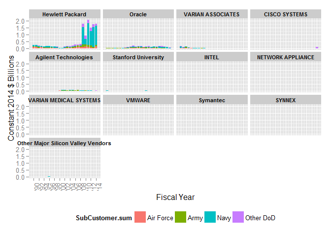
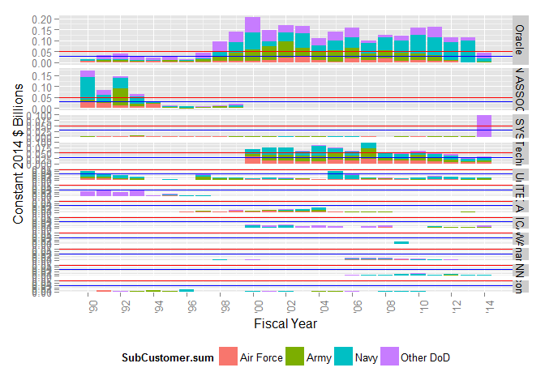
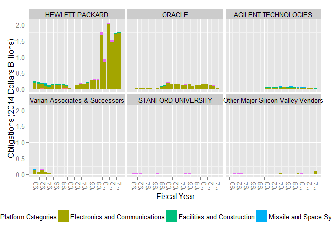
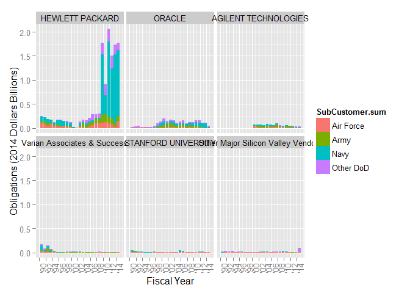
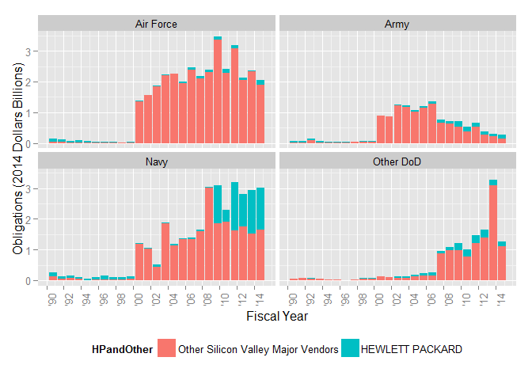

# DoD Fixed-Price Study: Contract Duration Classification
Greg Sanders  
Tuesday, January 13, 2015  


```
## Loading required package: ggplot2
## Loading required package: stringr
## Loading required package: plyr
## Loading required package: Hmisc
## Loading required package: grid
## Loading required package: lattice
## Loading required package: survival
## Loading required package: Formula
## 
## Attaching package: 'Hmisc'
## 
## The following objects are masked from 'package:plyr':
## 
##     is.discrete, summarize
## 
## The following objects are masked from 'package:base':
## 
##     format.pval, round.POSIXt, trunc.POSIXt, units
## 
## Loading required package: lubridate
## 
## Attaching package: 'lubridate'
## 
## The following object is masked from 'package:plyr':
## 
##     here
## 
## Loading required package: knitr
## Loading required package: scales
## Loading required package: reshape2
```


```r
SiliconTopVendor  <- read.csv(
    paste("data\\Overall_Location_SP_SiliconValleyTopVendorHistoryPlatformSubCustomer.csv", sep = ""),
    header = TRUE, sep = ",", dec = ".", strip.white = TRUE, 
    na.strings = c("NULL","NA",""),
    stringsAsFactors = TRUE
)

#These will probably be moved into apply_lookups at some point
SiliconTopVendor<-apply_lookups(Path,SiliconTopVendor)
```

```
## Joining by: Customer, SubCustomer
## Joining by: ProductOrServiceArea
## Joining by: PlatformPortfolio
## Joining by: Fiscal.Year
```

```
## Warning in apply_lookups(Path, SiliconTopVendor): NaNs produced
```

```r
# 
# as.numeric(as.duration(
#     ymd(ContractSample$SignedMonth)-ContractSample$StartFiscalYear)
#     /dyears(1)
#     )

SiliconTopVendor$ConfirmedSiliconValley<-0
SiliconTopVendor$ConfirmedSiliconValley[SiliconTopVendor$IsSiliconValley==1]<-1


SiliconTopVendor<-subset(SiliconTopVendor,Customer=="Defense")
SiliconTopVendor<-ddply(SiliconTopVendor,
                        .(ParentID),
                        transform,
                        ParentConsolidated=ifelse(sum(Obligation.2014,na.rm=TRUE)>=0.25 & ConfirmedSiliconValley==1,
                                                  as.character(ParentID),"Other Major Silicon Valley Vendors"),
                        ParentConsolidatedAll=ifelse(sum(Obligation.2014,na.rm=TRUE)>=0.25 | ConfirmedSiliconValley==1,
                                                  as.character(ParentID),"Other Major Silicon Valley Vendors"),
                        Parent05m=ifelse(sum(Obligation.2014,na.rm=TRUE)>=0.05,
                                                  as.character(ParentID),"Vendors below $50 million"),
                        SumOfObligation.2014=sum(Obligation.2014,na.rm=TRUE)
)

SiliconTopVendor$ParentConsolidated<-as.character(SiliconTopVendor$ParentConsolidated)

SiliconTopVendor$ParentConsolidated[SiliconTopVendor$ParentID %in%
                                        c('VARIAN SEMICONDUCTOR EQUIPMENT','VARIAN ASSOCIATES','VARIAN MEDICAL SYSTEMS')]<-
    "Varian Associates & Successors"

ParentOrderDF<-ddply(SiliconTopVendor,
                     .(ParentConsolidated),
                     summarise,
                     Obligation.2014=sum(Obligation.2014,na.rm=TRUE)
)
ParentOrderDF<-ParentOrderDF[order(-ParentOrderDF$Obligation.2014),]

ParentOrderList<-ParentOrderDF$ParentConsolidated
ParentOrderList<-c(unlist(as.character(ParentOrderList[ParentOrderList!="Other Major Silicon Valley Vendors"])),
                   "Other Major Silicon Valley Vendors")

SiliconTopVendor$ParentConsolidated<-factor(SiliconTopVendor$ParentConsolidated,ParentOrderList)


SiliconTopVendor$HPandOther<-"Other Silicon Valley Major Vendors"
SiliconTopVendor$HPandOther[SiliconTopVendor$ParentID =="HEWLETT PACKARD"]<-"HEWLETT PACKARD"
SiliconTopVendor$HPandOther<-ordered(SiliconTopVendor$HPandOther,
                                     c("Other Silicon Valley Major Vendors","HEWLETT PACKARD"))

SummaryKable(SiliconTopVendor,NULL,"Summary")
```


Table: Summary

  Total     Max   MaxYear   Avg. '90-'99   Avg. '00-'07   Avg. '08-'09   Avg. '10-'12   Avg. '13-'14  Drawdown % Change   BCA % Change 
-------  ------  --------  -------------  -------------  -------------  -------------  -------------  ------------------  -------------
 92.855   8.866      2013          0.308          4.608          7.861          7.244          7.727  -7.9%               6.7%         

```r
SummaryKable(SiliconTopVendor,"Parent05m","Vendor")
```


Table: Vendor

     Parent05m                          Total     Max   MaxYear   Avg. '90-'99   Avg. '00-'07   Avg. '08-'09   Avg. '10-'12   Avg. '13-'14  Drawdown % Change   BCA % Change   Percent 
---  -------------------------------  -------  ------  --------  -------------  -------------  -------------  -------------  -------------  ------------------  -------------  --------
21   LOCKHEED MARTIN                   61.562   6.265      2013          0.000          3.602          4.650          4.466          5.022  -4.0%               12.4%          66.3%   
15   HEWLETT PACKARD                   13.041   2.059      2011          0.171          0.161          1.037          1.489          1.750  43.7%               17.5%          14.0%   
11   BAE SYSTEMS                        5.186   2.045      2008          0.000          0.100          1.389          0.466          0.103  -66.4%              -77.9%         5.6%    
1    Vendors below $50 million          3.191   0.277      2000          0.004          0.209          0.231          0.213          0.190  -7.8%               -10.5%         3.4%    
25   ORACLE                             2.475   0.204      2000          0.045          0.148          0.123          0.145          0.079  17.8%               -45.6%         2.7%    
24   NORTHROP GRUMMAN                   1.307   0.198      2009          0.000          0.041          0.182          0.133          0.108  -27.0%              -19.1%         1.4%    
10   AGILENT TECHNOLOGIES               0.899   0.096      2007          0.000          0.073          0.050          0.052          0.031  4.6%                -40.9%         1.0%    
34   VARIAN ASSOCIATES                  0.581   0.173      1990          0.056          0.002          0.002          0.000          0.000  -84.6%              -100.0%        0.6%    
2    18579925                           0.483   0.094      2013          0.000          0.013          0.035          0.063          0.062  78.8%               -1.2%          0.5%    
14   GENERAL DYNAMICS                   0.429   0.048      2007          0.000          0.029          0.040          0.027          0.017  -33.3%              -36.5%         0.5%    
27   STANFORD UNIVERSITY                0.394   0.043      2005          0.017          0.016          0.010          0.016          0.013  61.5%               -17.3%         0.4%    
19   KAISER AEROPSACE & ELECTRONICS     0.363   0.091      2004          0.000          0.043          0.009          0.000          0.000  -101.9%             -100.0%        0.4%    
31   TEXTRON                            0.347   0.038      2013          0.000          0.023          0.017          0.024          0.030  36.2%               26.8%          0.4%    
32   TRW [NORTHROP GRUMMAN]             0.310   0.089      2013          0.000          0.000          0.000          0.055          0.073  Inf%                33.1%          0.3%    
20   L3 COMMUNICATIONS                  0.239   0.075      2005          0.000          0.027          0.009          0.001          0.000  -86.0%              -79.0%         0.3%    
6    9125535                            0.224   0.224      2014          0.000          0.000          0.000          0.000          0.112  NaN%                Inf%           0.2%    
5    85302958                           0.157   0.157      2000          0.000          0.020          0.000          0.000          0.000  NaN%                NaN%           0.2%    
17   IN Q TEL                           0.146   0.031      2012          0.000          0.003          0.005          0.021          0.026  309.6%              23.8%          0.2%    
3    626626782                          0.146   0.024      2010          0.000          0.009          0.018          0.014          0.000  -22.6%              -96.4%         0.2%    
30   TELEDYNE TECHNOLOGIES              0.141   0.028      2011          0.000          0.006          0.015          0.019          0.004  21.8%               -78.7%         0.2%    
35   VARIAN MEDICAL SYSTEMS             0.129   0.017      2002          0.000          0.010          0.008          0.005          0.008  -42.3%              82.8%          0.1%    
12   CISCO SYSTEMS                      0.126   0.097      2014          0.002          0.001          0.000          0.001          0.049  5606.7%             3426.1%        0.1%    
26   RAYTHEON                           0.117   0.048      2002          0.000          0.012          0.000          0.001          0.009  -786.0%             509.0%         0.1%    
18   INTEL                              0.115   0.028      1993          0.011          0.000          0.000          0.000          0.000  1076.5%             -57.3%         0.1%    
23   NETWORK APPLIANCE                  0.091   0.021      2004          0.002          0.009          0.000          0.000          0.000  -71.5%              198.6%         0.1%    
13   CPI HOLDING COMPANY                0.088   0.013      2002          0.000          0.010          0.001          0.000          0.003  -87.4%              2129.4%        0.1%    
9    957980436                          0.079   0.009      2010          0.000          0.005          0.008          0.006          0.003  -19.6%              -44.6%         0.1%    
22   LORAL SPACE &                      0.078   0.055      2000          0.000          0.007          0.000          0.004          0.005  Inf%                18.9%          0.1%    
33   UNITED DEFENSE                     0.074   0.070      2005          0.000          0.009          0.000          0.000          0.000  NaN%                NaN%           0.1%    
16   IBM                                0.072   0.013      2009          0.000          0.002          0.007          0.010          0.005  52.4%               -47.5%         0.1%    
29   SYNNEX                             0.058   0.011      2010          0.000          0.002          0.006          0.008          0.005  28.0%               -42.7%         0.1%    
28   SUN MICROSYSTEMS                   0.054   0.026      2000          0.000          0.007          0.000          0.000          0.000  -90.9%              -100.0%        0.1%    
4    66497793                           0.053   0.008      2003          0.000          0.005          0.003          0.002          0.001  -49.8%              -53.5%         0.1%    
7    9213596                            0.051   0.033      2002          0.000          0.004          0.000          0.000          0.009  NaN%                Inf%           0.1%    
8    9438300                            0.051   0.014      2013          0.000          0.001          0.005          0.003          0.010  -40.6%              211.3%         0.1%    

```r
SummaryKable(SiliconTopVendor,"ParentConsolidated","Vendor")
```


Table: Vendor

     ParentConsolidated                     Total     Max   MaxYear   Avg. '90-'99   Avg. '00-'07   Avg. '08-'09   Avg. '10-'12   Avg. '13-'14  Drawdown % Change   BCA % Change   Percent 
---  -----------------------------------  -------  ------  --------  -------------  -------------  -------------  -------------  -------------  ------------------  -------------  --------
6    Other Major Silicon Valley Vendors    75.335   6.976      2013          0.019          4.197          6.632          5.537          5.846  -16.5%              5.6%           81.1%   
1    HEWLETT PACKARD                       13.041   2.059      2011          0.171          0.161          1.037          1.489          1.750  43.7%               17.5%          14.0%   
2    ORACLE                                 2.475   0.204      2000          0.045          0.148          0.123          0.145          0.079  17.8%               -45.6%         2.7%    
3    AGILENT TECHNOLOGIES                   0.899   0.096      2007          0.000          0.073          0.050          0.052          0.031  4.6%                -40.9%         1.0%    
4    Varian Associates & Successors         0.711   0.173      1990          0.056          0.012          0.010          0.005          0.008  -52.3%              68.8%          0.8%    
5    STANFORD UNIVERSITY                    0.394   0.043      2005          0.017          0.016          0.010          0.016          0.013  61.5%               -17.3%         0.4%    

```r
SummaryKable(SiliconTopVendor,"HPandOther","HP and Other")
```


Table: HP and Other

HPandOther                             Total     Max   MaxYear   Avg. '90-'99   Avg. '00-'07   Avg. '08-'09   Avg. '10-'12   Avg. '13-'14  Drawdown % Change   BCA % Change   Percent 
-----------------------------------  -------  ------  --------  -------------  -------------  -------------  -------------  -------------  ------------------  -------------  --------
Other Silicon Valley Major Vendors    79.814   7.136      2013          0.137          4.447          6.825          5.755          5.977  -15.7%              3.9%           86.0%   
HEWLETT PACKARD                       13.041   2.059      2011          0.171          0.161          1.037          1.489          1.750  43.7%               17.5%          14.0%   


```r
SiliconTopVendor<-ddply(SiliconTopVendor,
                    .(ParentID,Fiscal.Year),
                    transform,
                    Annual.Obligation.2014=sum(Obligation.2014,na.rm=TRUE)
    )

SiliconTopVendor<-ddply(SiliconTopVendor,
                        .(ParentID),
                        transform,
                        ParentPeak=ifelse(max(Annual.Obligation.2014,na.rm=TRUE)>=0.01,
                                                  as.character(ParentID),"Other Major Silicon Valley Vendors")
)


ParentOrderDF<-ddply(SiliconTopVendor,
                     .(ParentPeak),
                     summarise,
                     Max.Obligation.2014=max(Annual.Obligation.2014,na.rm=TRUE)
)
ParentOrderDF<-ParentOrderDF[order(-ParentOrderDF$Max.Obligation.2014),]

ParentOrderList<-ParentOrderDF$ParentPeak

SiliconTopVendor$ParentPeak<-ordered(SiliconTopVendor$ParentPeak,ParentOrderList)


ggplot(data = subset(arrange(SiliconTopVendor,SubCustomer.sum),
                
                         IsSiliconValley==1),
       aes(x=Fiscal.Year,
           y=Obligation.2014,
           fill=SubCustomer.sum
       )
)+ 
    geom_bar(stat="identity") + 
    facet_wrap(  "ParentPeak" )+
    scale_x_date("Fiscal Year",
                 labels=date_format("'%y"),
                 # breaks="2 years",
                 minor_breaks="1 year",
                 breaks=c(as.Date("1990-01-01"),
                          as.Date("1992-01-01"),
                          as.Date("1994-01-01"),
                          as.Date("1996-01-01"),
                          as.Date("1998-01-01"),
                          as.Date("2000-01-01"),
                          as.Date("2002-01-01"),
                          as.Date("2004-01-01"),
                          as.Date("2006-01-01"),
                          as.Date("2008-01-01"),
                          as.Date("2010-01-01"),
                          as.Date("2012-01-01"),
                          as.Date("2014-01-01"))
                 # breaks=date_breaks("year")
                 # minor_breaks = "1 year"
                 # breaks=date_breaks("year"),
                 # breaks=c(as.Date("1990-01-01"),as.Date("2014-12-31"))
    )+
    theme(axis.text.x=element_text(angle = 90))+
    scale_y_continuous("Obligations (2014 Billions Dollars)",labels=comma)+
    theme(legend.position="bottom")+theme(strip.text.y=element_text(size=axis.text.size,family="times",face="bold",angle=0))
```

```
## Warning in loop_apply(n, do.ply): Removed 8 rows containing missing values
## (position_stack).
```

```
## Warning in loop_apply(n, do.ply): Stacking not well defined when ymin != 0
```

```
## Warning in loop_apply(n, do.ply): Removed 1 rows containing missing values
## (position_stack).
```

```
## Warning in loop_apply(n, do.ply): Stacking not well defined when ymin != 0
```

```
## Warning in loop_apply(n, do.ply): Removed 2 rows containing missing values
## (position_stack).
```

```
## Warning in loop_apply(n, do.ply): Stacking not well defined when ymin != 0
```

```
## Warning in loop_apply(n, do.ply): Stacking not well defined when ymin != 0
```

```
## Warning in loop_apply(n, do.ply): Stacking not well defined when ymin != 0
```

```
## Warning in loop_apply(n, do.ply): Stacking not well defined when ymin != 0
```

```
## Warning in loop_apply(n, do.ply): Stacking not well defined when ymin != 0
```

```
## Warning in loop_apply(n, do.ply): Stacking not well defined when ymin != 0
```

```
## Warning in loop_apply(n, do.ply): Stacking not well defined when ymin != 0
```

```
## Warning in loop_apply(n, do.ply): Stacking not well defined when ymin != 0
```

```
## Warning in loop_apply(n, do.ply): Stacking not well defined when ymin != 0
```

```
## Warning in loop_apply(n, do.ply): Stacking not well defined when ymin != 0
```

```
## Warning in loop_apply(n, do.ply): Stacking not well defined when ymin != 0
```

 

```r
#      geom_rect(ymin = 0.02, ymax = 0.05, 
#               xmin = -Inf, xmax = Inf, 
#               fill = 'blue',
#               aes(alpha=0.25)


# SiliconTopVendorAnnual$Obligation.2014<-SiliconTopVendorAnnual$Obligation.2014*1000000000

ggplot(data = subset(arrange(SiliconTopVendor,SubCustomer.sum),
                     ParentID!="HEWLETT PACKARD" &
                         IsSiliconValley==1),
       aes(x=Fiscal.Year,
           y=Obligation.2014,
           fill=SubCustomer.sum
       )
)+ 
    geom_bar(stat="identity") + 
    facet_grid(  ParentPeak ~.,
                    scales="free_y", #The scales actually do stay fixed
                     space="free_y")+#But only because the space is free)
    scale_x_date("Fiscal Year",
                 labels=date_format("'%y"),
                 # breaks="2 years",
                 minor_breaks="1 year",
                 breaks=c(as.Date("1990-01-01"),
                          as.Date("1992-01-01"),
                          as.Date("1994-01-01"),
                          as.Date("1996-01-01"),
                          as.Date("1998-01-01"),
                          as.Date("2000-01-01"),
                          as.Date("2002-01-01"),
                          as.Date("2004-01-01"),
                          as.Date("2006-01-01"),
                          as.Date("2008-01-01"),
                          as.Date("2010-01-01"),
                          as.Date("2012-01-01"),
                          as.Date("2014-01-01"))
                 # breaks=date_breaks("year")
                 # minor_breaks = "1 year"
                 # breaks=date_breaks("year"),
                 # breaks=c(as.Date("1990-01-01"),as.Date("2014-12-31"))
    )+
    theme(axis.text.x=element_text(angle = 90))+
    scale_y_continuous("Obligations (2014 Billions Dollars)",labels=comma)+
    theme(legend.position="bottom")+theme(strip.text.y=element_text(size=axis.text.size,family="times",face="bold",angle=0))+
    geom_hline(y=0.03, color="blue")+geom_hline(y=0.05, color="red")
```

```
## Warning in loop_apply(n, do.ply): Removed 1 rows containing missing values
## (position_stack).
```

```
## Warning in loop_apply(n, do.ply): Stacking not well defined when ymin != 0
```

```
## Warning in loop_apply(n, do.ply): Removed 2 rows containing missing values
## (position_stack).
```

```
## Warning in loop_apply(n, do.ply): Stacking not well defined when ymin != 0
```

```
## Warning in loop_apply(n, do.ply): Stacking not well defined when ymin != 0
```

```
## Warning in loop_apply(n, do.ply): Stacking not well defined when ymin != 0
```

```
## Warning in loop_apply(n, do.ply): Stacking not well defined when ymin != 0
```

```
## Warning in loop_apply(n, do.ply): Stacking not well defined when ymin != 0
```

```
## Warning in loop_apply(n, do.ply): Stacking not well defined when ymin != 0
```

```
## Warning in loop_apply(n, do.ply): Stacking not well defined when ymin != 0
```

```
## Warning in loop_apply(n, do.ply): Stacking not well defined when ymin != 0
```

```
## Warning in loop_apply(n, do.ply): Stacking not well defined when ymin != 0
```

```
## Warning in loop_apply(n, do.ply): Stacking not well defined when ymin != 0
```

```
## Warning in loop_apply(n, do.ply): Stacking not well defined when ymin != 0
```

```
## Warning in grid.Call(L_textBounds, as.graphicsAnnot(x$label), x$x, x$y, :
## font family not found in Windows font database
```

```
## Warning in grid.Call.graphics(L_text, as.graphicsAnnot(x$label), x$x, x$y,
## : font family not found in Windows font database
```

 

```r
#      geom_rect(ymin = 0.02, ymax = 0.05, 
#               xmin = -Inf, xmax = Inf, 
#               fill = 'blue',
#               aes(alpha=0.25)


SummaryKable(SiliconTopVendor,"ParentPeak","Vendor",3)
```


Table: Vendor

     ParentPeak                             Total     Max   MaxYear   Avg. '90-'99   Avg. '00-'07   Avg. '08-'09   Avg. '10-'12   Avg. '13-'14  Drawdown % Change   BCA % Change   Percent 
---  -----------------------------------  -------  ------  --------  -------------  -------------  -------------  -------------  -------------  ------------------  -------------  --------
1    LOCKHEED MARTIN                       61.562   6.265      2013          0.000          3.602          4.650          4.466          5.022  -4.0%               12.4%          66.3%   
2    HEWLETT PACKARD                       13.041   2.059      2011          0.171          0.161          1.037          1.489          1.750  43.7%               17.5%          14.0%   
3    BAE SYSTEMS                            5.186   2.045      2008          0.000          0.100          1.389          0.466          0.103  -66.4%              -77.9%         5.6%    
52   Other Major Silicon Valley Vendors     2.745   0.225      2010          0.004          0.178          0.206          0.196          0.140  -5.0%               -28.6%         3.0%    
5    ORACLE                                 2.475   0.204      2000          0.045          0.148          0.123          0.145          0.079  17.8%               -45.6%         2.7%    
6    NORTHROP GRUMMAN                       1.307   0.198      2009          0.000          0.041          0.182          0.133          0.108  -27.0%              -19.1%         1.4%    
10   AGILENT TECHNOLOGIES                   0.899   0.096      2007          0.000          0.073          0.050          0.052          0.031  4.6%                -40.9%         1.0%    
7    VARIAN ASSOCIATES                      0.581   0.173      1990          0.056          0.002          0.002          0.000          0.000  -84.6%              -100.0%        0.6%    
11   18579925                               0.483   0.094      2013          0.000          0.013          0.035          0.063          0.062  78.8%               -1.2%          0.5%    
17   GENERAL DYNAMICS                       0.429   0.048      2007          0.000          0.029          0.040          0.027          0.017  -33.3%              -36.5%         0.5%    
19   STANFORD UNIVERSITY                    0.394   0.043      2005          0.017          0.016          0.010          0.016          0.013  61.5%               -17.3%         0.4%    
12   KAISER AEROPSACE & ELECTRONICS         0.363   0.091      2004          0.000          0.043          0.009          0.000          0.000  -101.9%             -100.0%        0.4%    
21   TEXTRON                                0.347   0.038      2013          0.000          0.023          0.017          0.024          0.030  36.2%               26.8%          0.4%    
13   TRW [NORTHROP GRUMMAN]                 0.310   0.089      2013          0.000          0.000          0.000          0.055          0.073  Inf%                33.1%          0.3%    
14   L3 COMMUNICATIONS                      0.239   0.075      2005          0.000          0.027          0.009          0.001          0.000  -86.0%              -79.0%         0.3%    
4    9125535                                0.224   0.224      2014          0.000          0.000          0.000          0.000          0.112  NaN%                Inf%           0.2%    
8    85302958                               0.157   0.157      2000          0.000          0.020          0.000          0.000          0.000  NaN%                NaN%           0.2%    
26   IN Q TEL                               0.146   0.031      2012          0.000          0.003          0.005          0.021          0.026  309.6%              23.8%          0.2%    
31   626626782                              0.146   0.024      2010          0.000          0.009          0.018          0.014          0.000  -22.6%              -96.4%         0.2%    
28   TELEDYNE TECHNOLOGIES                  0.141   0.028      2011          0.000          0.006          0.015          0.019          0.004  21.8%               -78.7%         0.2%    
33   VARIAN MEDICAL SYSTEMS                 0.129   0.017      2002          0.000          0.010          0.008          0.005          0.008  -42.3%              82.8%          0.1%    
9    CISCO SYSTEMS                          0.126   0.097      2014          0.002          0.001          0.000          0.001          0.049  5606.7%             3426.1%        0.1%    
18   RAYTHEON                               0.117   0.048      2002          0.000          0.012          0.000          0.001          0.009  -786.0%             509.0%         0.1%    
29   INTEL                                  0.115   0.028      1993          0.011          0.000          0.000          0.000          0.000  1076.5%             -57.3%         0.1%    
32   NETWORK APPLIANCE                      0.091   0.021      2004          0.002          0.009          0.000          0.000          0.000  -71.5%              198.6%         0.1%    
39   CPI HOLDING COMPANY                    0.088   0.013      2002          0.000          0.010          0.001          0.000          0.003  -87.4%              2129.4%        0.1%    
16   LORAL SPACE &                          0.078   0.055      2000          0.000          0.007          0.000          0.004          0.005  Inf%                18.9%          0.1%    
15   UNITED DEFENSE                         0.074   0.070      2005          0.000          0.009          0.000          0.000          0.000  NaN%                NaN%           0.1%    
37   IBM                                    0.072   0.013      2009          0.000          0.002          0.007          0.010          0.005  52.4%               -47.5%         0.1%    
48   SYNNEX                                 0.058   0.011      2010          0.000          0.002          0.006          0.008          0.005  28.0%               -42.7%         0.1%    
30   SUN MICROSYSTEMS                       0.054   0.026      2000          0.000          0.007          0.000          0.000          0.000  -90.9%              -100.0%        0.1%    
25   9213596                                0.051   0.033      2002          0.000          0.004          0.000          0.000          0.009  NaN%                Inf%           0.1%    
35   9438300                                0.051   0.014      2013          0.000          0.001          0.005          0.003          0.010  -40.6%              211.3%         0.1%    
46   Symantec                               0.048   0.011      2008          0.000          0.002          0.009          0.003          0.000  -59.1%              -98.7%         0.1%    
38   13114806                               0.044   0.013      2001          0.000          0.005          0.000          0.000          0.000  -88.3%              -947.4%        0.0%    
24   829000723                              0.043   0.033      2013          0.000          0.000          0.000          0.003          0.018  Inf%                557.0%         0.0%    
20   33178765                               0.042   0.042      2000          0.000          0.005          0.000          0.000          0.000  NaN%                NaN%           0.0%    
43   162344035                              0.042   0.012      2012          0.000          0.000          0.005          0.006          0.007  14.8%               19.4%          0.0%    
50   938647021                              0.039   0.010      2009          0.000          0.000          0.006          0.005          0.004  -13.8%              -29.9%         0.0%    
47   94982386                               0.039   0.011      2002          0.000          0.004          0.001          0.000          0.000  -89.8%              25.5%          0.0%    
23   ROCKWELL COLLINS                       0.033   0.033      2014          0.000          0.000          0.000          0.000          0.016  -276.2%             -8232.3%       0.0%    
27   128196156                              0.030   0.030      2005          0.000          0.004          0.000          0.000          0.000  NaN%                NaN%           0.0%    
49   622670529                              0.027   0.011      2012          0.000          0.002          0.000          0.004          0.000  722.5%              -91.0%         0.0%    
40   877032409                              0.026   0.013      2000          0.000          0.003          0.000          0.000          0.000  NaN%                NaN%           0.0%    
36   SILICON GRAPHICS                       0.026   0.014      2000          0.000          0.003          0.000          0.000          0.000  0.1%                -100.0%        0.0%    
44   119301831                              0.025   0.011      2014          0.000          0.000          0.000          0.003          0.009  Inf%                223.5%         0.0%    
22   429505241                              0.024   0.036      2001          0.000          0.003          0.000          0.000          0.000  NaN%                NaN%           0.0%    
45   116715082                              0.021   0.011      2002          0.000          0.003          0.000          0.000          0.000  NaN%                NaN%           0.0%    
51   786383687                              0.020   0.010      2006          0.000          0.003          0.000          0.000          0.000  15894046.7%         -100.0%        0.0%    
42   VMWARE                                 0.017   0.012      2009          0.000          0.000          0.006          0.001          0.001  -91.2%              64.4%          0.0%    
34   160049180                              0.016   0.015      2008          0.000          0.000          0.007          0.000          0.000  -94.8%              -100.0%        0.0%    
41   869004879                              0.016   0.012      2000          0.000          0.002          0.000          0.000          0.000  NaN%                NaN%           0.0%    


```r
SiliconTopVendor<-
    ddply(SiliconTopVendor,
          .(PlatformPortfolio),
          transform,
          PlatformPortfolioSC=ifelse(sum(Obligation.2014,na.rm=TRUE)>=0.25,
                                     as.character(PlatformPortfolio),"Remaining Platform Categories")
    )


SummaryKable(SiliconTopVendor,"PlatformPortfolio","Platform")
```


Table: Platform

     PlatformPortfolio                  Total     Max   MaxYear   Avg. '90-'99   Avg. '00-'07   Avg. '08-'09   Avg. '10-'12   Avg. '13-'14  Drawdown % Change   BCA % Change   Percent 
---  -------------------------------  -------  ------  --------  -------------  -------------  -------------  -------------  -------------  ------------------  -------------  --------
5    Missile and Space Systems         61.467   6.323      2013          0.012          3.497          4.586          4.586          5.221  -0.0%               13.8%          66.2%   
2    Electronics and Communications    19.855   2.425      2011          0.201          0.646          1.460          1.860          2.090  27.4%               12.4%          21.4%   
4    Land Vehicles                      5.314   2.001      2008          0.000          0.122          1.366          0.466          0.104  -65.9%              -77.6%         5.7%    
7    Other R&D and Knowledge Based      2.611   0.260      2009          0.029          0.151          0.220          0.152          0.109  -30.7%              -28.5%         2.8%    
3    Facilities and Construction        1.421   0.130      2001          0.044          0.076          0.058          0.055          0.048  -5.4%               -12.1%         1.5%    
1    Aircraft and Drones                1.026   0.132      2013          0.005          0.058          0.072          0.062          0.092  -14.6%              48.5%          1.1%    
6    Other Products                     0.520   0.061      2005          0.012          0.029          0.031          0.025          0.017  -20.0%              -31.8%         0.6%    
9    Ships & Submarines                 0.292   0.038      2008          0.001          0.011          0.028          0.030          0.023  7.9%                -23.9%         0.3%    
10   Weapons and Ammunition             0.238   0.060      2008          0.004          0.010          0.035          0.003          0.019  -91.0%              514.2%         0.3%    
8    Other Services                     0.110   0.012      2001          0.002          0.008          0.005          0.005          0.003  -2.8%               -25.2%         0.1%    
11   Unlabeled                          0.002   0.001      2006          0.000          0.000          0.000          0.000          0.000  -100.0%             NaN%           0.0%    

```r
ggplot(data = arrange(subset(SiliconTopVendor,
                             IsSiliconValley==1)
                      ,PlatformPortfolioSC),
       aes(x=Fiscal.Year,
           y=Obligation.2014,
           fill=PlatformPortfolioSC
       )
)+ 
    geom_bar(stat="identity") + 
    facet_wrap( ~ ParentConsolidated)+
    #                 scales="free_y", #The scales actually do stay fixed
    #                 , space="free_y"#But only because the space is free)+
    scale_x_date("Fiscal Year",
                 labels=date_format("'%y"),
                 # breaks="2 years",
                 minor_breaks="1 year",
                 breaks=c(as.Date("1990-01-01"),
                          as.Date("1992-01-01"),
                          as.Date("1994-01-01"),
                          as.Date("1996-01-01"),
                          as.Date("1998-01-01"),
                          as.Date("2000-01-01"),
                          as.Date("2002-01-01"),
                          as.Date("2004-01-01"),
                          as.Date("2006-01-01"),
                          as.Date("2008-01-01"),
                          as.Date("2010-01-01"),
                          as.Date("2012-01-01"),
                          as.Date("2014-01-01"))
                 # breaks=date_breaks("year")
                 # minor_breaks = "1 year"
                 #   breaks=date_breaks("year"),
                 # breaks=c(as.Date("1990-01-01"),as.Date("2014-12-31"))
    )+
    theme(axis.text.x=element_text(angle = 90))+
    scale_y_continuous("Obligations (2014 Dollars Billions)",labels=comma)+
    theme(legend.position="bottom")
```

```
## Warning in loop_apply(n, do.ply): Removed 8 rows containing missing values
## (position_stack).
```

```
## Warning in loop_apply(n, do.ply): Stacking not well defined when ymin != 0
```

```
## Warning in loop_apply(n, do.ply): Removed 1 rows containing missing values
## (position_stack).
```

```
## Warning in loop_apply(n, do.ply): Stacking not well defined when ymin != 0
```

```
## Warning in loop_apply(n, do.ply): Stacking not well defined when ymin != 0
```

```
## Warning in loop_apply(n, do.ply): Removed 2 rows containing missing values
## (position_stack).
```

```
## Warning in loop_apply(n, do.ply): Stacking not well defined when ymin != 0
```

```
## Warning in loop_apply(n, do.ply): Stacking not well defined when ymin != 0
```

```
## Warning in loop_apply(n, do.ply): Stacking not well defined when ymin != 0
```

 


```r
SummaryKable(SiliconTopVendor,"SubCustomer.sum","Defense Component")
```


Table: Defense Component

     SubCustomer.sum     Total     Max   MaxYear   Avg. '90-'99   Avg. '00-'07   Avg. '08-'09   Avg. '10-'12   Avg. '13-'14  Drawdown % Change   BCA % Change   Percent 
---  ----------------  -------  ------  --------  -------------  -------------  -------------  -------------  -------------  ------------------  -------------  --------
1    Air Force          34.588   3.470      2009          0.067          1.993          2.933          2.572          2.197  -12.3%              -14.6%         37.2%   
3    Navy               31.915   3.197      2011          0.129          1.276          3.073          2.768          2.982  -9.9%               7.8%           34.4%   
4    Other DoD          13.593   3.275      2013          0.051          0.264          1.147          1.379          2.267  20.3%               64.4%          14.6%   
2    Army               12.759   1.349      2006          0.060          1.075          0.708          0.525          0.281  -25.8%              -46.5%         13.7%   

```r
ggplot(data = subset(SiliconTopVendor[order(SiliconTopVendor$SubCustomer.sum),],
                     Customer=="Defense" & year(Fiscal.Year)<=2014& IsSiliconValley==1) ,# subset(ContractSurvival,StartFiscalYear>=2007 & StartFiscalYear<=2013),
       aes(x=Fiscal.Year,
           y=Obligation.2014,
           fill=SubCustomer.sum
       )
)+ 
    geom_bar(stat="identity") + 
    facet_wrap( ~ ParentConsolidated)+
    #                 scales="free_y", #The scales actually do stay fixed
    #                 , space="free_y"#But only because the space is free)+
    scale_x_date("Fiscal Year",
                 labels=date_format("'%y"),
                 # breaks="2 years",
                 minor_breaks="1 year",
                 breaks=c(as.Date("1990-01-01"),
                          as.Date("1992-01-01"),
                          as.Date("1994-01-01"),
                          as.Date("1996-01-01"),
                          as.Date("1998-01-01"),
                          as.Date("2000-01-01"),
                          as.Date("2002-01-01"),
                          as.Date("2004-01-01"),
                          as.Date("2006-01-01"),
                          as.Date("2008-01-01"),
                          as.Date("2010-01-01"),
                          as.Date("2012-01-01"),
                          as.Date("2014-01-01"))
                 # breaks=date_breaks("year")
                 # minor_breaks = "1 year"
                 # breaks=date_breaks("year"),
                 # breaks=c(as.Date("1990-01-01"),as.Date("2014-12-31"))
    )+
    theme(axis.text.x=element_text(angle = 90))+
    scale_y_continuous("Obligations (2014 Dollars Billions)",labels=comma)+
    theme(legend.position="bottom")
```

```
## Warning in loop_apply(n, do.ply): Removed 8 rows containing missing values
## (position_stack).
```

```
## Warning in loop_apply(n, do.ply): Stacking not well defined when ymin != 0
```

```
## Warning in loop_apply(n, do.ply): Removed 1 rows containing missing values
## (position_stack).
```

```
## Warning in loop_apply(n, do.ply): Stacking not well defined when ymin != 0
```

```
## Warning in loop_apply(n, do.ply): Stacking not well defined when ymin != 0
```

```
## Warning in loop_apply(n, do.ply): Removed 2 rows containing missing values
## (position_stack).
```

```
## Warning in loop_apply(n, do.ply): Stacking not well defined when ymin != 0
```

```
## Warning in loop_apply(n, do.ply): Stacking not well defined when ymin != 0
```

```
## Warning in loop_apply(n, do.ply): Stacking not well defined when ymin != 0
```

 

```r
ggplot(data = arrange(subset(SiliconTopVendor,IsSiliconValley==1),HPandOther),
       aes(x=Fiscal.Year,
           y=Obligation.2014,
           fill=HPandOther
       )
)+ 
    geom_bar(stat="identity") + 
    facet_wrap( ~ SubCustomer.sum)+
    scale_x_date("Fiscal Year",
                 labels=date_format("'%y"),
                 # breaks="2 years",
                 minor_breaks="1 year",
                 breaks=c(as.Date("1990-01-01"),
                          as.Date("1992-01-01"),
                          as.Date("1994-01-01"),
                          as.Date("1996-01-01"),
                          as.Date("1998-01-01"),
                          as.Date("2000-01-01"),
                          as.Date("2002-01-01"),
                          as.Date("2004-01-01"),
                          as.Date("2006-01-01"),
                          as.Date("2008-01-01"),
                          as.Date("2010-01-01"),
                          as.Date("2012-01-01"),
                          as.Date("2014-01-01"))
    )+
    theme(axis.text.x=element_text(angle = 90))+
    scale_y_continuous("Obligations (2014 Dollars Billions)",labels=comma)+
    theme(legend.position="bottom")
```

```
## Warning in loop_apply(n, do.ply): Stacking not well defined when ymin != 0
```

```
## Warning in loop_apply(n, do.ply): Removed 2 rows containing missing values
## (position_stack).
```

```
## Warning in loop_apply(n, do.ply): Stacking not well defined when ymin != 0
```

```
## Warning in loop_apply(n, do.ply): Removed 8 rows containing missing values
## (position_stack).
```

```
## Warning in loop_apply(n, do.ply): Stacking not well defined when ymin != 0
```

```
## Warning in loop_apply(n, do.ply): Removed 1 rows containing missing values
## (position_stack).
```

```
## Warning in loop_apply(n, do.ply): Stacking not well defined when ymin != 0
```

 


```r
DefenseContract  <- read.csv(
    paste("data\\Defense_Location_SP_SiliconValleyCompetitionVendorSizeHistoryBucketPlatformSubCustomer.csv", sep = ""),
    header = TRUE, sep = ",", dec = ".", strip.white = TRUE, 
    na.strings = c("NULL","NA",""),
    stringsAsFactors = TRUE
)

#These will probably be moved into apply_lookups at some point
DefenseContract<-apply_lookups(Path,DefenseContract)
```

```
## Joining by: Customer, SubCustomer
## Joining by: ProductOrServiceArea
## Joining by: PlatformPortfolio
## Joining by: Vendor.Size
## Joining by: CompetitionClassification, ClassifyNumberOfOffers
## Joining by: Fiscal.Year
```

```
## Warning in apply_lookups(Path, DefenseContract): NaNs produced
```

```r
SiliconContract<-subset(DefenseContract,Customer=="Defense" & IsSiliconValley==1)

SummaryKable(DefenseContract,"IsSiliconValley","Summary")
```


Table: Summary

      IsSiliconValley      Total       Max   MaxYear   Avg. '90-'99   Avg. '00-'07   Avg. '08-'09   Avg. '10-'12   Avg. '13-'14  Drawdown % Change   BCA % Change   Percent 
---  ----------------  ---------  --------  --------  -------------  -------------  -------------  -------------  -------------  ------------------  -------------  --------
2                  NA   6544.625   409.945      2009        184.028        270.324        409.263        377.486        295.383  -7.8%               -21.8%         99.7%   
1                   1     18.045     2.308      2011          0.308          0.427          1.254          1.721          1.936  37.3%               12.4%          0.3%    

