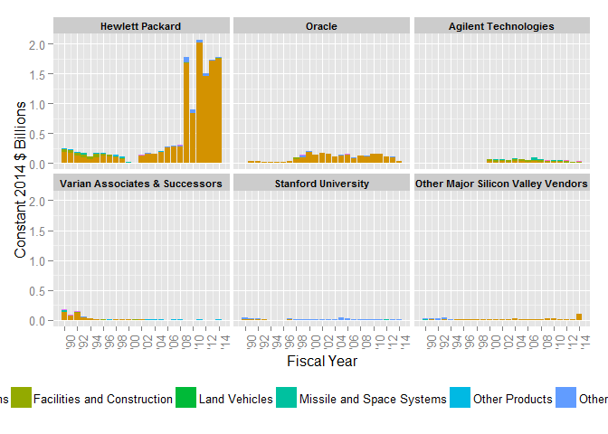

# DoD Fixed-Price Study: Contract Duration Classification
Greg Sanders  
Tuesday, January 13, 2015  


```
## Loading required package: ggplot2
## Loading required package: stringr
## Loading required package: plyr
## Loading required package: Hmisc
## Loading required package: grid
## Loading required package: lattice
## Loading required package: survival
## Loading required package: splines
## Loading required package: Formula
## 
## Attaching package: 'Hmisc'
## 
## The following objects are masked from 'package:plyr':
## 
##     is.discrete, summarize
## 
## The following objects are masked from 'package:base':
## 
##     format.pval, round.POSIXt, trunc.POSIXt, units
## 
## Loading required package: lubridate
## 
## Attaching package: 'lubridate'
## 
## The following object is masked from 'package:plyr':
## 
##     here
## 
## Loading required package: knitr
## Loading required package: scales
## Loading required package: pander
```


```r
SiliconTopVendor  <- read.csv(
    paste("data\\Overall_Location_SP_SiliconValleyTopVendorHistoryPlatformSubCustomer.csv", sep = ""),
    header = TRUE, sep = ",", dec = ".", strip.white = TRUE, 
    na.strings = c("NULL","NA",""),
    stringsAsFactors = TRUE
    )

#These will probably be moved into apply_lookups at some point
SiliconTopVendor<-apply_lookups(Path,SiliconTopVendor)
```

```
## Joining by: Customer, SubCustomer
## Joining by: PlatformPortfolio
## Joining by: Fiscal.Year
```

```
## Warning in apply_lookups(Path, SiliconTopVendor): NaNs produced
```

```r
# 
# as.numeric(as.duration(
#     ymd(ContractSample$SignedMonth)-ContractSample$StartFiscalYear)
#     /dyears(1)
#     )

SiliconTopVendor<-subset(SiliconTopVendor,Customer=="Defense")
SiliconTopVendor<-ddply(SiliconTopVendor,
                        .(ParentID),
                        transform,
                        ParentConsolidated=ifelse(sum(Obligation.2014,na.rm=TRUE)>=0.25,
                                                  as.character(ParentID),"Other Major Silicon Valley Vendors")
)

SiliconTopVendor$ParentConsolidated<-as.character(SiliconTopVendor$ParentConsolidated)

SiliconTopVendor$ParentConsolidated[SiliconTopVendor$ParentID %in%
                                        c('VARIAN SEMICONDUCTOR EQUIPMENT','VARIAN ASSOCIATES','VARIAN MEDICAL SYSTEMS')]<-
    "Varian Associates & Successors"

ParentOrderDF<-ddply(SiliconTopVendor,
      .(ParentConsolidated),
      summarise,
      Obligation.2014=sum(Obligation.2014,na.rm=TRUE)
)
ParentOrderDF<-ParentOrderDF[order(-ParentOrderDF$Obligation.2014),]

ParentOrderList<-ParentOrderDF$ParentConsolidated
ParentOrderList<-c(unlist(as.character(ParentOrderList[ParentOrderList!="Other Major Silicon Valley Vendors"])),
                   "Other Major Silicon Valley Vendors")

SiliconTopVendor$ParentConsolidated<-factor(SiliconTopVendor$ParentConsolidated,ParentOrderList)


OverallSummary<-
    ddply(SiliconTopVendor,
                        .(),
                        summarise,
                        TotalObligation=sum(Obligation.2014,na.rm=TRUE),
          Avg.1990.1999=sum(ifelse(year(Fiscal.Year)>=1990 & year(Fiscal.Year)<=1999, Obligation.2014,0),na.rm=TRUE)/10,
          Avg.2000.2009=sum(ifelse(year(Fiscal.Year)>=2000 & year(Fiscal.Year)<=2009, Obligation.2014,0),na.rm=TRUE)/10,
          Avg.2010.2012=sum(ifelse(year(Fiscal.Year)>=2010 & year(Fiscal.Year)<=2012, Obligation.2014,0),na.rm=TRUE)/3,
          Avg.2013.2014=sum(ifelse(year(Fiscal.Year)>=2013 & year(Fiscal.Year)<=2014, Obligation.2014,0),na.rm=TRUE)/2
)


OverallSummary$BCAavgChange<-OverallSummary$Avg.2013.2014/OverallSummary$Avg.2010.2012-1
OverallSummary$DrawdownAvgChange<-OverallSummary$Avg.2010.2012/OverallSummary$Avg.2000.2009-1
OverallSummary$CenturyAvgChange<-OverallSummary$Avg.2000.2009/OverallSummary$Avg.1990.1999-1

panderOptions("table.split.table", Inf) 
panderOptions("table.style", "rmarkdown")
pander(OverallSummary)
```


|  .id  |  TotalObligation  |  Avg.1990.1999  |  Avg.2000.2009  |  Avg.2010.2012  |  Avg.2013.2014  |  BCAavgChange  |  DrawdownAvgChange  |  CenturyAvgChange  |
|:-----:|:-----------------:|:---------------:|:---------------:|:---------------:|:---------------:|:--------------:|:-------------------:|:------------------:|
|  NA   |       18.04       |     0.3084      |     0.5925      |      1.721      |      1.936      |     0.1244     |        1.905        |       0.9213       |

```r
# , digits=2
      # ,caption="Overall")
```


```r
SiliconTopVendor<-
    ddply(SiliconTopVendor,
                        .(PlatformPortfolio),
                        transform,
                        PlatformPortfolioSC=ifelse(sum(Obligation.2014,na.rm=TRUE)>=0.25,
                                                  as.character(PlatformPortfolio),"Remaining Platform Categories")
)


PlatformSummary<-
    ddply(SiliconTopVendor,
                        .(PlatformPortfolio),
                        summarise,
                        TotalObligation=sum(Obligation.2014,na.rm=TRUE),
          Avg.1990.1999=sum(ifelse(year(Fiscal.Year)>=1990 & year(Fiscal.Year)<=1999, Obligation.2014,0),na.rm=TRUE)/10,
          Avg.2000.2009=sum(ifelse(year(Fiscal.Year)>=2000 & year(Fiscal.Year)<=2009, Obligation.2014,0),na.rm=TRUE)/10,
          Avg.2010.2012=sum(ifelse(year(Fiscal.Year)>=2010 & year(Fiscal.Year)<=2012, Obligation.2014,0),na.rm=TRUE)/3,
          Avg.2013.2014=sum(ifelse(year(Fiscal.Year)>=2013 & year(Fiscal.Year)<=2014, Obligation.2014,0),na.rm=TRUE)/2
)

PlatformSummary$BCAavgChange<-PlatformSummary$Avg.2013.2014/PlatformSummary$Avg.2010.2012-1
PlatformSummary$DrawdownAvgChange<-PlatformSummary$Avg.2010.2012/PlatformSummary$Avg.2000.2009-1
PlatformSummary$CenturyAvgChange<-PlatformSummary$Avg.2000.2009/PlatformSummary$Avg.1990.1999-1


kable(PlatformSummary, digits=2
      ,caption="Platform")
```


Table: Platform

PlatformPortfolio                 TotalObligation   Avg.1990.1999   Avg.2000.2009   Avg.2010.2012   Avg.2013.2014   BCAavgChange   DrawdownAvgChange   CenturyAvgChange
-------------------------------  ----------------  --------------  --------------  --------------  --------------  -------------  ------------------  -----------------
Aircraft and Drones                          0.08            0.00            0.00            0.00            0.00           0.36               -0.73              -0.35
Electronics and Communications              15.55            0.20            0.50            1.60            1.86           0.16                2.20               1.50
Facilities and Construction                  0.86            0.04            0.03            0.02            0.02          -0.05               -0.20              -0.32
Land Vehicles                                0.00            0.00            0.00            0.00            0.00          -0.51               -0.82              -0.70
Missile and Space Systems                    0.26            0.01            0.01            0.01            0.00          -0.84                0.31              -0.11
Other Products                               0.21            0.01            0.01            0.00            0.01           1.41               -0.66              -0.36
Other R&D and Knowledge Based                0.93            0.03            0.04            0.07            0.04          -0.43                0.95               0.24
Other Services                               0.06            0.00            0.00            0.00            0.00          -0.09               -0.63               1.19
Ships & Submarines                           0.05            0.00            0.00            0.01            0.01           0.16                4.08              -0.33
Weapons and Ammunition                       0.04            0.00            0.00            0.00            0.00          -0.02               -0.77              -0.92
Unlabeled                                    0.00            0.00            0.00            0.00            0.00            NaN               -1.00                Inf

```r
ggplot(data = subset(SiliconTopVendor[order(SiliconTopVendor$PlatformPortfolioSC),],
                     Customer=="Defense" & year(Fiscal.Year)<=2014),# subset(ContractSurvival,StartFiscalYear>=2007 & StartFiscalYear<=2013),
       aes(x=Fiscal.Year,
           y=Obligation.2014,
           fill=PlatformPortfolioSC
           )
       )+ 
    geom_bar(stat="identity") + 
    facet_wrap( ~ ParentConsolidated)+
#                 scales="free_y", #The scales actually do stay fixed
#                 , space="free_y"#But only because the space is free)+
    scale_x_date("Fiscal Year",
                 labels=date_format("'%y"),
                 # breaks="2 years",
                 minor_breaks="1 year",
                 breaks=c(as.Date("1990-01-01"),
                          as.Date("1992-01-01"),
                          as.Date("1994-01-01"),
                          as.Date("1996-01-01"),
                          as.Date("1998-01-01"),
                          as.Date("2000-01-01"),
                          as.Date("2002-01-01"),
                          as.Date("2004-01-01"),
                          as.Date("2006-01-01"),
                          as.Date("2008-01-01"),
                          as.Date("2010-01-01"),
                          as.Date("2012-01-01"),
                          as.Date("2014-01-01"))
                 # breaks=date_breaks("year")
                 # minor_breaks = "1 year"
                 # breaks=date_breaks("year"),
                 # breaks=c(as.Date("1990-01-01"),as.Date("2014-12-31"))
                 )+
    theme(axis.text.x=element_text(angle = 90))+
    scale_y_continuous("Obligations (2014 Dollars Billions)",labels=comma)
```

```
## Warning: Removed 8 rows containing missing values (position_stack).
```

```
## Warning: Stacking not well defined when ymin != 0
```

```
## Warning: Removed 1 rows containing missing values (position_stack).
```

```
## Warning: Stacking not well defined when ymin != 0
```

```
## Warning: Stacking not well defined when ymin != 0
```

```
## Warning: Removed 2 rows containing missing values (position_stack).
```

```
## Warning: Stacking not well defined when ymin != 0
```

```
## Warning: Stacking not well defined when ymin != 0
```

```
## Warning: Stacking not well defined when ymin != 0
```

 


```r
SubCustomerSummary<-
    ddply(SiliconTopVendor,
                        .(SubCustomer.sum),
                        summarise,
                        TotalObligation=sum(Obligation.2014,na.rm=TRUE),
          Avg.1990.1999=sum(ifelse(year(Fiscal.Year)>=1990 & year(Fiscal.Year)<=1999, Obligation.2014,0),na.rm=TRUE)/10,
          Avg.2000.2009=sum(ifelse(year(Fiscal.Year)>=2000 & year(Fiscal.Year)<=2009, Obligation.2014,0),na.rm=TRUE)/10,
          Avg.2010.2012=sum(ifelse(year(Fiscal.Year)>=2010 & year(Fiscal.Year)<=2012, Obligation.2014,0),na.rm=TRUE)/3,
          Avg.2013.2014=sum(ifelse(year(Fiscal.Year)>=2013 & year(Fiscal.Year)<=2014, Obligation.2014,0),na.rm=TRUE)/2
)
SubCustomerSummary$BCAavgChange<-SubCustomerSummary$Avg.2013.2014/SubCustomerSummary$Avg.2010.2012-1
SubCustomerSummary$DrawdownAvgChange<-SubCustomerSummary$Avg.2010.2012/SubCustomerSummary$Avg.2000.2009-1
SubCustomerSummary$CenturyAvgChange<-SubCustomerSummary$Avg.2000.2009/SubCustomerSummary$Avg.1990.1999-1

kable(SubCustomerSummary, digits=2
      ,caption="Defense Component")
```


Table: Defense Component

SubCustomer.sum    TotalObligation   Avg.1990.1999   Avg.2000.2009   Avg.2010.2012   Avg.2013.2014   BCAavgChange   DrawdownAvgChange   CenturyAvgChange
----------------  ----------------  --------------  --------------  --------------  --------------  -------------  ------------------  -----------------
Air Force                     2.04            0.07            0.08            0.12            0.09          -0.26                0.43               0.25
Army                          2.76            0.06            0.14            0.19            0.11          -0.39                0.36               1.27
Navy                         10.13            0.13            0.25            1.12            1.48           0.32                3.48               0.93
Other DoD                     3.11            0.05            0.12            0.29            0.25          -0.13                1.41               1.35

```r
ggplot(data = subset(SiliconTopVendor[order(SiliconTopVendor$SubCustomer.sum),],
                     Customer=="Defense" & year(Fiscal.Year)<=2014),# subset(ContractSurvival,StartFiscalYear>=2007 & StartFiscalYear<=2013),
       aes(x=Fiscal.Year,
           y=Obligation.2014,
           fill=SubCustomer.sum
           )
       )+ 
    geom_bar(stat="identity") + 
    facet_wrap( ~ ParentConsolidated)+
#                 scales="free_y", #The scales actually do stay fixed
#                 , space="free_y"#But only because the space is free)+
    scale_x_date("Fiscal Year",
                 labels=date_format("'%y"),
                 # breaks="2 years",
                 minor_breaks="1 year",
                 breaks=c(as.Date("1990-01-01"),
                          as.Date("1992-01-01"),
                          as.Date("1994-01-01"),
                          as.Date("1996-01-01"),
                          as.Date("1998-01-01"),
                          as.Date("2000-01-01"),
                          as.Date("2002-01-01"),
                          as.Date("2004-01-01"),
                          as.Date("2006-01-01"),
                          as.Date("2008-01-01"),
                          as.Date("2010-01-01"),
                          as.Date("2012-01-01"),
                          as.Date("2014-01-01"))
                 # breaks=date_breaks("year")
                 # minor_breaks = "1 year"
                 # breaks=date_breaks("year"),
                 # breaks=c(as.Date("1990-01-01"),as.Date("2014-12-31"))
                 )+
    theme(axis.text.x=element_text(angle = 90))+
    scale_y_continuous("Obligations (2014 Dollars Billions)",labels=comma)
```

```
## Warning: Removed 8 rows containing missing values (position_stack).
```

```
## Warning: Stacking not well defined when ymin != 0
```

```
## Warning: Removed 1 rows containing missing values (position_stack).
```

```
## Warning: Stacking not well defined when ymin != 0
```

```
## Warning: Stacking not well defined when ymin != 0
```

```
## Warning: Removed 2 rows containing missing values (position_stack).
```

```
## Warning: Stacking not well defined when ymin != 0
```

```
## Warning: Stacking not well defined when ymin != 0
```

```
## Warning: Stacking not well defined when ymin != 0
```

 


```r
# n <- 100
# x <- rnorm(n)
# y <- 2*x + rnorm(n)
# out <- lm(y ~ x)
# library(pander)
# panderOptions("digits", 2)
# pander(out)
```


```r
# n <- 100
# x <- rnorm(n)
# y <- 2*x + rnorm(n)
# out <- lm(y ~ x)
# library(xtable)
# tab <- xtable(summary(out)$coef, digits=c(0, 2, 2, 1, 2))
# print(tab, type="html")
```
