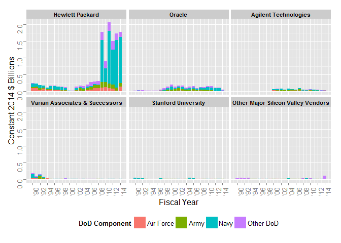

# DoD Fixed-Price Study: Contract Duration Classification
Greg Sanders  
Tuesday, January 13, 2015  


```
## Loading required package: ggplot2
## Loading required package: stringr
## Loading required package: plyr
## Loading required package: Hmisc
## Loading required package: grid
## Loading required package: lattice
## Loading required package: survival
## Loading required package: Formula
## 
## Attaching package: 'Hmisc'
## 
## The following objects are masked from 'package:plyr':
## 
##     is.discrete, summarize
## 
## The following objects are masked from 'package:base':
## 
##     format.pval, round.POSIXt, trunc.POSIXt, units
## 
## Loading required package: lubridate
## 
## Attaching package: 'lubridate'
## 
## The following object is masked from 'package:plyr':
## 
##     here
## 
## Loading required package: knitr
## Loading required package: scales
## Loading required package: reshape2
```


```r
SiliconTopVendor  <- read.csv(
    paste("data\\Overall_Location_SP_SiliconValleyTopVendorHistoryPlatformSubCustomer.csv", sep = ""),
    header = TRUE, sep = ",", dec = ".", strip.white = TRUE, 
    na.strings = c("NULL","NA",""),
    stringsAsFactors = TRUE
)

#These will probably be moved into apply_lookups at some point
SiliconTopVendor<-apply_lookups(Path,SiliconTopVendor)
```

```
## Joining by: Customer, SubCustomer
## Joining by: PlatformPortfolio
## Joining by: Fiscal.Year
```

```
## Warning in apply_lookups(Path, SiliconTopVendor): NaNs produced
```

```r
# 
# as.numeric(as.duration(
#     ymd(ContractSample$SignedMonth)-ContractSample$StartFiscalYear)
#     /dyears(1)
#     )

SiliconTopVendor<-subset(SiliconTopVendor,Customer=="Defense")
SiliconTopVendor<-ddply(SiliconTopVendor,
                        .(ParentID),
                        transform,
                        ParentConsolidated=ifelse(sum(Obligation.2014,na.rm=TRUE)>=0.25,
                                                  as.character(ParentID),"Other Major Silicon Valley Vendors")
)

SiliconTopVendor$ParentConsolidated<-as.character(SiliconTopVendor$ParentConsolidated)

SiliconTopVendor$ParentConsolidated[SiliconTopVendor$ParentID %in%
                                        c('VARIAN SEMICONDUCTOR EQUIPMENT','VARIAN ASSOCIATES','VARIAN MEDICAL SYSTEMS')]<-
    "Varian Associates & Successors"

ParentOrderDF<-ddply(SiliconTopVendor,
                     .(ParentConsolidated),
                     summarise,
                     Obligation.2014=sum(Obligation.2014,na.rm=TRUE)
)
ParentOrderDF<-ParentOrderDF[order(-ParentOrderDF$Obligation.2014),]

ParentOrderList<-ParentOrderDF$ParentConsolidated
ParentOrderList<-c(unlist(as.character(ParentOrderList[ParentOrderList!="Other Major Silicon Valley Vendors"])),
                   "Other Major Silicon Valley Vendors")

SiliconTopVendor$ParentConsolidated<-factor(SiliconTopVendor$ParentConsolidated,ParentOrderList)


SummaryKable(SiliconTopVendor,NULL,"Summary")
```


Table: Summary

 Total   Avg. '90-'99   Avg. '00-'09   Avg. '10-'12   Avg. '13-'14  Century % Change   Drawdown % Change   BCA % Change 
------  -------------  -------------  -------------  -------------  -----------------  ------------------  -------------
 18.04           0.31           0.59           1.72           1.94  92.1%              190.5%              12.4%        

```r
SummaryKable(SiliconTopVendor,"ParentID","Vendor")
```


Table: Vendor

     ParentID                          Total   Avg. '90-'99   Avg. '00-'09   Avg. '10-'12   Avg. '13-'14  Century % Change   Drawdown % Change   BCA % Change   Percent 
---  -------------------------------  ------  -------------  -------------  -------------  -------------  -----------------  ------------------  -------------  --------
9    HEWLETT PACKARD                   13.04           0.17           0.34           1.49           1.75  96.6%              342.8%              17.5%          72.3%   
17   ORACLE                             2.47           0.05           0.14           0.14           0.08  217.8%             1.0%                -45.6%         13.7%   
2    AGILENT TECHNOLOGIES               0.90           0.00           0.07           0.05           0.03  Inf%               -24.1%              -40.9%         5.0%    
25   VARIAN ASSOCIATES                  0.58           0.06           0.00           0.00           0.00  -96.6%             -79.7%              -100.0%        3.2%    
21   STANFORD UNIVERSITY                0.39           0.02           0.01           0.02           0.01  -12.8%             7.2%                -17.3%         2.2%    
26   VARIAN MEDICAL SYSTEMS             0.13           0.00           0.01           0.00           0.01  Inf%               -53.4%              82.8%          0.7%    
6    CISCO SYSTEMS                      0.13           0.00           0.00           0.00           0.05  -74.6%             174.4%              3426.1%        0.7%    
10   INTEL                              0.11           0.01           0.00           0.00           0.00  -99.2%             13.4%               -57.3%         0.6%    
16   NETWORK APPLIANCE                  0.09           0.00           0.01           0.00           0.00  353.0%             -98.5%              198.6%         0.5%    
24   SYNNEX                             0.06           0.00           0.00           0.01           0.00  Inf%               213.8%              -42.7%         0.3%    
23   Symantec                           0.05           0.00           0.00           0.00           0.00  1064.1%            0.8%                -98.7%         0.3%    
5    APPLIED MATERIALS                  0.03           0.00           0.00           0.00           0.00  -72.1%             -59.3%              -100.0%        0.2%    
28   VMWARE                             0.02           0.00           0.00           0.00           0.00  Inf%               -60.6%              64.4%          0.1%    
4    APPLE COMPUTER                     0.02           0.00           0.00           0.00           0.00  594.9%             -36.7%              -66.5%         0.1%    
15   LSI                                0.01           0.00           0.00           0.00           0.00  -99.9%             519.0%              -100.0%        0.0%    
13   KLA TENCOR                         0.01           0.00           0.00           0.00           0.00  186.6%             -81.6%              -1.7%          0.0%    
7    GILEAD SCIENCES                    0.00           0.00           0.00           0.00           0.00  -98.6%             208.9%              -100.0%        0.0%    
22   SUNPOWER                           0.00           0.00           0.00           0.00           0.00  127.7%             -99.3%              365.7%         0.0%    
1    ADOBE                              0.00           0.00           0.00           0.00           0.00  2060.8%            -99.3%              -100.0%        0.0%    
11   INTUIT                             0.00           0.00           0.00           0.00           0.00  Inf%               2110.5%             2.3%           0.0%    
19   SANDISK                            0.00           0.00           0.00           0.00           0.00  -100.0%            NaN%                NaN%           0.0%    
29   YAHOO!                             0.00           0.00           0.00           0.00           0.00  Inf%               -100.0%             NaN%           0.0%    
27   VARIAN SEMICONDUCTOR EQUIPMENT     0.00           0.00           0.00           0.00           0.00  Inf%               -100.0%             NaN%           0.0%    
8    GOOGLE                             0.00           0.00           0.00           0.00           0.00  Inf%               -84.7%              -64.3%         0.0%    
18   SALESFORCE COM                     0.00           0.00           0.00           0.00           0.00  Inf%               946.3%              45.7%          0.0%    
20   SANMINA                            0.00           0.00           0.00           0.00           0.00  Inf%               -100.0%             NaN%           0.0%    
14   LAM RESEARCH                       0.00           0.00           0.00           0.00           0.00  -100.0%            NaN%                NaN%           0.0%    
3    AMD                                0.00           0.00           0.00           0.00           0.00  Inf%               -100.0%             NaN%           0.0%    
12   JUNIPER NETWORKS                   0.00           0.00           0.00           0.00           0.00  NaN%               NaN%                NaN%           0.0%    

```r
SummaryKable(SiliconTopVendor,"ParentConsolidated","Vendor")
```


Table: Vendor

     ParentConsolidated                    Total   Avg. '90-'99   Avg. '00-'09   Avg. '10-'12   Avg. '13-'14  Century % Change   Drawdown % Change   BCA % Change   Percent 
---  -----------------------------------  ------  -------------  -------------  -------------  -------------  -----------------  ------------------  -------------  --------
1    HEWLETT PACKARD                       13.04           0.17           0.34           1.49           1.75  96.6%              342.8%              17.5%          72.3%   
2    ORACLE                                 2.47           0.05           0.14           0.14           0.08  217.8%             1.0%                -45.6%         13.7%   
3    AGILENT TECHNOLOGIES                   0.90           0.00           0.07           0.05           0.03  Inf%               -24.1%              -40.9%         5.0%    
4    Varian Associates & Successors         0.71           0.06           0.01           0.00           0.01  -78.9%             -57.9%              68.8%          3.9%    
6    Other Major Silicon Valley Vendors     0.53           0.02           0.02           0.01           0.06  -5.6%              -17.7%              272.0%         2.9%    
5    STANFORD UNIVERSITY                    0.39           0.02           0.01           0.02           0.01  -12.8%             7.2%                -17.3%         2.2%    


```r
SiliconTopVendor<-
    ddply(SiliconTopVendor,
          .(PlatformPortfolio),
          transform,
          PlatformPortfolioSC=ifelse(sum(Obligation.2014,na.rm=TRUE)>=0.25,
                                     as.character(PlatformPortfolio),"Remaining Platform Categories")
    )


SummaryKable(SiliconTopVendor,"PlatformPortfolio","Platform")
```


Table: Platform

     PlatformPortfolio                 Total   Avg. '90-'99   Avg. '00-'09   Avg. '10-'12   Avg. '13-'14  Century % Change   Drawdown % Change   BCA % Change   Percent 
---  -------------------------------  ------  -------------  -------------  -------------  -------------  -----------------  ------------------  -------------  --------
2    Electronics and Communications    15.55           0.20           0.50           1.60           1.86  149.7%             220.2%              15.7%          86.2%   
7    Other R&D and Knowledge Based      0.93           0.03           0.04           0.07           0.04  24.5%              94.9%               -42.7%         5.1%    
3    Facilities and Construction        0.86           0.04           0.03           0.02           0.02  -32.0%             -20.5%              -4.6%          4.8%    
5    Missile and Space Systems          0.26           0.01           0.01           0.01           0.00  -11.0%             31.4%               -84.1%         1.5%    
6    Other Products                     0.21           0.01           0.01           0.00           0.01  -36.3%             -66.1%              140.7%         1.2%    
1    Aircraft and Drones                0.08           0.00           0.00           0.00           0.00  -34.9%             -72.8%              36.3%          0.4%    
8    Other Services                     0.06           0.00           0.00           0.00           0.00  119.0%             -63.1%              -9.0%          0.3%    
9    Ships & Submarines                 0.05           0.00           0.00           0.01           0.01  -33.1%             407.8%              15.9%          0.3%    
10   Weapons and Ammunition             0.04           0.00           0.00           0.00           0.00  -92.4%             -77.1%              -2.3%          0.2%    
4    Land Vehicles                      0.00           0.00           0.00           0.00           0.00  -69.9%             -82.2%              -50.8%         0.0%    
11   Unlabeled                          0.00           0.00           0.00           0.00           0.00  Inf%               -100.0%             NaN%           0.0%    

```r
ggplot(data = subset(SiliconTopVendor[order(SiliconTopVendor$PlatformPortfolioSC),],
                     Customer=="Defense" & year(Fiscal.Year)<=2014),# subset(ContractSurvival,StartFiscalYear>=2007 & StartFiscalYear<=2013),
       aes(x=Fiscal.Year,
           y=Obligation.2014,
           fill=PlatformPortfolioSC
       )
)+ 
    geom_bar(stat="identity") + 
    facet_wrap( ~ ParentConsolidated)+
    #                 scales="free_y", #The scales actually do stay fixed
    #                 , space="free_y"#But only because the space is free)+
    scale_x_date("Fiscal Year",
                 labels=date_format("'%y"),
                 # breaks="2 years",
                 minor_breaks="1 year",
                 breaks=c(as.Date("1990-01-01"),
                          as.Date("1992-01-01"),
                          as.Date("1994-01-01"),
                          as.Date("1996-01-01"),
                          as.Date("1998-01-01"),
                          as.Date("2000-01-01"),
                          as.Date("2002-01-01"),
                          as.Date("2004-01-01"),
                          as.Date("2006-01-01"),
                          as.Date("2008-01-01"),
                          as.Date("2010-01-01"),
                          as.Date("2012-01-01"),
                          as.Date("2014-01-01"))
                 # breaks=date_breaks("year")
                 # minor_breaks = "1 year"
                 # breaks=date_breaks("year"),
                 # breaks=c(as.Date("1990-01-01"),as.Date("2014-12-31"))
    )+
    theme(axis.text.x=element_text(angle = 90))+
    scale_y_continuous("Obligations (2014 Dollars Billions)",labels=comma)+
    theme(legend.position="bottom")
```

```
## Warning in loop_apply(n, do.ply): Removed 8 rows containing missing values
## (position_stack).
```

```
## Warning in loop_apply(n, do.ply): Stacking not well defined when ymin != 0
```

```
## Warning in loop_apply(n, do.ply): Removed 1 rows containing missing values
## (position_stack).
```

```
## Warning in loop_apply(n, do.ply): Stacking not well defined when ymin != 0
```

```
## Warning in loop_apply(n, do.ply): Stacking not well defined when ymin != 0
```

```
## Warning in loop_apply(n, do.ply): Removed 2 rows containing missing values
## (position_stack).
```

```
## Warning in loop_apply(n, do.ply): Stacking not well defined when ymin != 0
```

```
## Warning in loop_apply(n, do.ply): Stacking not well defined when ymin != 0
```

```
## Warning in loop_apply(n, do.ply): Stacking not well defined when ymin != 0
```

 


```r
SummaryKable(SiliconTopVendor,"SubCustomer.sum","Defense Component")
```


Table: Defense Component

     SubCustomer.sum    Total   Avg. '90-'99   Avg. '00-'09   Avg. '10-'12   Avg. '13-'14  Century % Change   Drawdown % Change   BCA % Change   Percent 
---  ----------------  ------  -------------  -------------  -------------  -------------  -----------------  ------------------  -------------  --------
3    Navy               10.13           0.13           0.25           1.12           1.48  93.4%              348.2%              31.9%          56.1%   
4    Other DoD           3.11           0.05           0.12           0.29           0.25  135.4%             141.2%              -13.4%         17.2%   
2    Army                2.76           0.06           0.14           0.19           0.11  127.0%             36.1%               -39.1%         15.3%   
1    Air Force           2.04           0.07           0.08           0.12           0.09  24.9%              43.3%               -26.4%         11.3%   

```r
ggplot(data = subset(SiliconTopVendor[order(SiliconTopVendor$SubCustomer.sum),],
                     Customer=="Defense" & year(Fiscal.Year)<=2014),# subset(ContractSurvival,StartFiscalYear>=2007 & StartFiscalYear<=2013),
       aes(x=Fiscal.Year,
           y=Obligation.2014,
           fill=SubCustomer.sum
       )
)+ 
    geom_bar(stat="identity") + 
    facet_wrap( ~ ParentConsolidated)+
    #                 scales="free_y", #The scales actually do stay fixed
    #                 , space="free_y"#But only because the space is free)+
    scale_x_date("Fiscal Year",
                 labels=date_format("'%y"),
                 # breaks="2 years",
                 minor_breaks="1 year",
                 breaks=c(as.Date("1990-01-01"),
                          as.Date("1992-01-01"),
                          as.Date("1994-01-01"),
                          as.Date("1996-01-01"),
                          as.Date("1998-01-01"),
                          as.Date("2000-01-01"),
                          as.Date("2002-01-01"),
                          as.Date("2004-01-01"),
                          as.Date("2006-01-01"),
                          as.Date("2008-01-01"),
                          as.Date("2010-01-01"),
                          as.Date("2012-01-01"),
                          as.Date("2014-01-01"))
                 # breaks=date_breaks("year")
                 # minor_breaks = "1 year"
                 # breaks=date_breaks("year"),
                 # breaks=c(as.Date("1990-01-01"),as.Date("2014-12-31"))
    )+
    theme(axis.text.x=element_text(angle = 90))+
    scale_y_continuous("Obligations (2014 Dollars Billions)",labels=comma)+
    theme(legend.position="bottom")
```

```
## Warning in loop_apply(n, do.ply): Removed 8 rows containing missing values
## (position_stack).
```

```
## Warning in loop_apply(n, do.ply): Stacking not well defined when ymin != 0
```

```
## Warning in loop_apply(n, do.ply): Removed 1 rows containing missing values
## (position_stack).
```

```
## Warning in loop_apply(n, do.ply): Stacking not well defined when ymin != 0
```

```
## Warning in loop_apply(n, do.ply): Stacking not well defined when ymin != 0
```

```
## Warning in loop_apply(n, do.ply): Removed 2 rows containing missing values
## (position_stack).
```

```
## Warning in loop_apply(n, do.ply): Stacking not well defined when ymin != 0
```

```
## Warning in loop_apply(n, do.ply): Stacking not well defined when ymin != 0
```

```
## Warning in loop_apply(n, do.ply): Stacking not well defined when ymin != 0
```

 


```r
DefenseContract  <- read.csv(
    paste("data\\Defense_Location_SP_SiliconValleyCompetitionVendorSizeHistoryBucketPlatformSubCustomer.csv", sep = ""),
    header = TRUE, sep = ",", dec = ".", strip.white = TRUE, 
    na.strings = c("NULL","NA",""),
    stringsAsFactors = TRUE
)

#These will probably be moved into apply_lookups at some point
DefenseContract<-apply_lookups(Path,DefenseContract)
```

```
## Joining by: Customer, SubCustomer
## Joining by: ProductOrServiceArea
## Joining by: PlatformPortfolio
## Joining by: Vendor.Size
## Joining by: CompetitionClassification, ClassifyNumberOfOffers
## Joining by: Fiscal.Year
```

```
## Warning in apply_lookups(Path, DefenseContract): NaNs produced
```

```r
SiliconContract<-subset(DefenseContract,Customer=="Defense" & IsSiliconValley==1)

SummaryKable(DefenseContract,"IsSiliconValley","Summary")
```


Table: Summary

      IsSiliconValley     Total   Avg. '90-'99   Avg. '00-'09   Avg. '10-'12   Avg. '13-'14  Century % Change   Drawdown % Change   BCA % Change   Percent 
---  ----------------  --------  -------------  -------------  -------------  -------------  -----------------  ------------------  -------------  --------
2                  NA   6544.62         184.03         298.11         377.49         295.38  62.0%              26.6%               -21.8%         99.7%   
1                   1     18.04           0.31           0.59           1.72           1.94  92.1%              190.5%              12.4%          0.3%    

