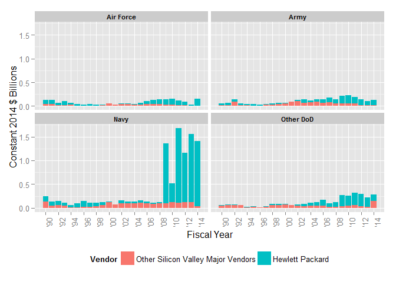

# DoD Fixed-Price Study: Contract Duration Classification
Greg Sanders  
Tuesday, January 13, 2015  


```
## Loading required package: ggplot2
## Loading required package: stringr
## Loading required package: plyr
## Loading required package: Hmisc
## Loading required package: grid
## Loading required package: lattice
## Loading required package: survival
## Loading required package: splines
## Loading required package: Formula
## 
## Attaching package: 'Hmisc'
## 
## The following objects are masked from 'package:plyr':
## 
##     is.discrete, summarize
## 
## The following objects are masked from 'package:base':
## 
##     format.pval, round.POSIXt, trunc.POSIXt, units
## 
## Loading required package: lubridate
## 
## Attaching package: 'lubridate'
## 
## The following object is masked from 'package:plyr':
## 
##     here
## 
## Loading required package: knitr
## Loading required package: scales
## Loading required package: reshape2
```


```r
SiliconTopVendor  <- read.csv(
    paste("data\\Overall_Location_SP_SiliconValleyTopVendorHistoryPlatformSubCustomer.csv", sep = ""),
    header = TRUE, sep = ",", dec = ".", strip.white = TRUE, 
    na.strings = c("NULL","NA",""),
    stringsAsFactors = TRUE
)

#These will probably be moved into apply_lookups at some point
SiliconTopVendor<-apply_lookups(Path,SiliconTopVendor)
```

```
## Joining by: Customer, SubCustomer
## Joining by: ProductOrServiceArea
## Joining by: PlatformPortfolio
## Joining by: Fiscal.Year
```

```
## Warning in apply_lookups(Path, SiliconTopVendor): NaNs produced
```

```r
# 
# as.numeric(as.duration(
#     ymd(ContractSample$SignedMonth)-ContractSample$StartFiscalYear)
#     /dyears(1)
#     )

SiliconTopVendor<-subset(SiliconTopVendor,Customer=="Defense")
SiliconTopVendor<-ddply(SiliconTopVendor,
                        .(ParentID),
                        transform,
                        ParentConsolidated=ifelse(sum(Obligation.2014,na.rm=TRUE)>=0.25,
                                                  as.character(ParentID),"Other Major Silicon Valley Vendors"),
                        SumOfObligation.2014=sum(Obligation.2014,na.rm=TRUE)
)

SiliconTopVendor$ParentConsolidated<-as.character(SiliconTopVendor$ParentConsolidated)

SiliconTopVendor$ParentConsolidated[SiliconTopVendor$ParentID %in%
                                        c('VARIAN SEMICONDUCTOR EQUIPMENT','VARIAN ASSOCIATES','VARIAN MEDICAL SYSTEMS')]<-
    "Varian Associates & Successors"

ParentOrderDF<-ddply(SiliconTopVendor,
                     .(ParentConsolidated),
                     summarise,
                     Obligation.2014=sum(Obligation.2014,na.rm=TRUE)
)
ParentOrderDF<-ParentOrderDF[order(-ParentOrderDF$Obligation.2014),]

ParentOrderList<-ParentOrderDF$ParentConsolidated
ParentOrderList<-c(unlist(as.character(ParentOrderList[ParentOrderList!="Other Major Silicon Valley Vendors"])),
                   "Other Major Silicon Valley Vendors")

SiliconTopVendor$ParentConsolidated<-factor(SiliconTopVendor$ParentConsolidated,ParentOrderList)


SiliconTopVendor$HPandOther<-"Other Silicon Valley Major Vendors"
SiliconTopVendor$HPandOther[SiliconTopVendor$ParentID =="HEWLETT PACKARD"]<-"HEWLETT PACKARD"
SiliconTopVendor$HPandOther<-ordered(SiliconTopVendor$HPandOther,
                                     c("Other Silicon Valley Major Vendors","HEWLETT PACKARD"))

SummaryKable(SiliconTopVendor,NULL,"Summary")
```


Table: Summary

  Total     Max   MaxYear   Avg. '90-'99   Avg. '00-'07   Avg. '08-'09   Avg. '10-'12   Avg. '13-'14  Drawdown % Change   BCA % Change 
-------  ------  --------  -------------  -------------  -------------  -------------  -------------  ------------------  -------------
 92.855   8.866      2013          0.308          4.608          7.861          7.244          7.727  -7.9%               6.7%         

```r
SummaryKable(subset(SiliconTopVendor,SumOfObligation.2014>0.05),"ParentID","Vendor")
```


Table: Vendor

<<<<<<< HEAD
       ParentID                                                   Total      Max   MaxYear   Avg. '90-'99   Avg. '00-'07   Avg. '08-'09   Avg. '10-'12   Avg. '13-'14  Drawdown % Change   BCA % Change   Percent 
-----  -------------------------------------------------------  -------  -------  --------  -------------  -------------  -------------  -------------  -------------  ------------------  -------------  --------
1929   LOCKHEED MARTIN                                           61.562    6.265      2013          0.000          3.602          4.650          4.466          5.022  -4.0%               12.4%          66.3%   
1911   HEWLETT PACKARD                                           13.041    2.059      2011          0.171          0.161          1.037          1.489          1.750  43.7%               17.5%          14.0%   
1888   BAE SYSTEMS                                                5.186    2.045      2008          0.000          0.100          1.389          0.466          0.103  -66.4%              -77.9%         5.6%    
1940   ORACLE                                                     2.475    0.204      2000          0.045          0.148          0.123          0.145          0.079  17.8%               -45.6%         2.7%    
1939   NORTHROP GRUMMAN                                           1.307    0.198      2009          0.000          0.041          0.182          0.133          0.108  -27.0%              -19.1%         1.4%    
1881   AGILENT TECHNOLOGIES                                       0.899    0.096      2007          0.000          0.073          0.050          0.052          0.031  4.6%                -40.9%         1.0%    
1976   VARIAN ASSOCIATES                                          0.581    0.173      1990          0.056          0.002          0.002          0.000          0.000  -84.6%              -100.0%        0.6%    
577    18579925                                                   0.483    0.094      2013          0.000          0.013          0.035          0.063          0.062  78.8%               -1.2%          0.5%    
1905   GENERAL DYNAMICS                                           0.429    0.048      2007          0.000          0.029          0.040          0.027          0.017  -33.3%              -36.5%         0.5%    
1960   STANFORD UNIVERSITY                                        0.394    0.043      2005          0.017          0.016          0.010          0.016          0.013  61.5%               -17.3%         0.4%    
1924   KAISER AEROPSACE & ELECTRONICS                             0.363    0.091      2004          0.000          0.043          0.009          0.000          0.000  -101.9%             -100.0%        0.4%    
1968   TEXTRON                                                    0.347    0.038      2013          0.000          0.023          0.017          0.024          0.030  36.2%               26.8%          0.4%    
1972   TRW [NORTHROP GRUMMAN]                                     0.310    0.089      2013          0.000          0.000          0.000          0.055          0.073  Inf%                33.1%          0.3%    
1926   L3 COMMUNICATIONS                                          0.239    0.075      2005          0.000          0.027          0.009          0.001          0.000  -86.0%              -79.0%         0.3%    
1668   9125535                                                    0.224    0.224      2014          0.000          0.000          0.000          0.000          0.112  NaN%                Inf%           0.2%    
1601   85302958                                                   0.157    0.157      2000          0.000          0.020          0.000          0.000          0.000  NaN%                NaN%           0.2%    
1917   IN Q TEL                                                   0.146    0.031      2012          0.000          0.003          0.005          0.021          0.026  309.6%              23.8%          0.2%    
1160   626626782                                                  0.146    0.024      2010          0.000          0.009          0.018          0.014          0.000  -22.6%              -96.4%         0.2%    
1966   TELEDYNE TECHNOLOGIES                                      0.141    0.028      2011          0.000          0.006          0.015          0.019          0.004  21.8%               -78.7%         0.2%    
1977   VARIAN MEDICAL SYSTEMS                                     0.129    0.017      2002          0.000          0.010          0.008          0.005          0.008  -42.3%              82.8%          0.1%    
1893   CISCO SYSTEMS                                              0.126    0.097      2014          0.002          0.001          0.000          0.001          0.049  5606.7%             3426.1%        0.1%    
1945   RAYTHEON                                                   0.117    0.048      2002          0.000          0.012          0.000          0.001          0.009  -786.0%             509.0%         0.1%    
1919   INTEL                                                      0.115    0.028      1993          0.011          0.000          0.000          0.000          0.000  1076.5%             -57.3%         0.1%    
1938   NETWORK APPLIANCE                                          0.091    0.021      2004          0.002          0.009          0.000          0.000          0.000  -71.5%              198.6%         0.1%    
1895   CPI HOLDING COMPANY                                        0.088    0.013      2002          0.000          0.010          0.001          0.000          0.003  -87.4%              2129.4%        0.1%    
1780   957980436                                                  0.079    0.009      2010          0.000          0.005          0.008          0.006          0.003  -19.6%              -44.6%         0.1%    
1930   LORAL SPACE &                                              0.078    0.055      2000          0.000          0.007          0.000          0.004          0.005  Inf%                18.9%          0.1%    
1973   UNITED DEFENSE                                             0.074    0.070      2005          0.000          0.009          0.000          0.000          0.000  NaN%                NaN%           0.1%    
1916   IBM                                                        0.072    0.013      2009          0.000          0.002          0.007          0.010          0.005  52.4%               -47.5%         0.1%    
1965   SYNNEX                                                     0.058    0.011      2010          0.000          0.002          0.006          0.008          0.005  28.0%               -42.7%         0.1%    
1962   SUN MICROSYSTEMS                                           0.054    0.026      2000          0.000          0.007          0.000          0.000          0.000  -90.9%              -100.0%        0.1%    
1201   66497793                                                   0.053    0.008      2003          0.000          0.005          0.003          0.002          0.001  -49.8%              -53.5%         0.1%    
1673   9213596                                                    0.051    0.033      2002          0.000          0.004          0.000          0.000          0.009  NaN%                Inf%           0.1%    
1734   9438300                                                    0.051    0.014      2013          0.000          0.001          0.005          0.003          0.010  -40.6%              211.3%         0.1%    
1674   92206403                                                   0.050    0.009      2009          0.000          0.002          0.006          0.006          0.001  1.6%                -77.7%         0.1%    
1424   805412665                                                  0.049    0.007      2007          0.000          0.003          0.003          0.003          0.004  -13.4%              33.3%          0.1%    
1964   Symantec                                                   0.048    0.011      2008          0.000          0.002          0.009          0.003          0.000  -59.1%              -98.7%         0.1%    
236    13114806                                                   0.044    0.013      2001          0.000          0.005          0.000          0.000          0.000  -88.3%              -947.4%        0.0%    
1524   829000723                                                  0.043    0.033      2013          0.000          0.000          0.000          0.003          0.018  Inf%                557.0%         0.0%    
761    33178765                                                   0.042    0.042      2000          0.000          0.005          0.000          0.000          0.000  NaN%                NaN%           0.0%    
473    162344035                                                  0.042    0.012      2012          0.000          0.000          0.005          0.006          0.007  14.8%               19.4%          0.0%    
1719   938647021                                                  0.039    0.010      2009          0.000          0.000          0.006          0.005          0.004  -13.8%              -29.9%         0.0%    
952    50191704                                                   0.039    0.010      2010          0.000          0.000          0.006          0.008          0.002  41.9%               -72.4%         0.0%    
1775   94982386                                                   0.039    0.011      2002          0.000          0.004          0.001          0.000          0.000  -89.8%              25.5%          0.0%    
571    183365410                                                  0.037    0.005      2009          0.000          0.002          0.005          0.004          0.002  -27.2%              -44.9%         0.0%    
659    197791668                                                  0.036    0.006      2013          0.000          0.001          0.003          0.004          0.006  35.0%               31.8%          0.0%    
224    13000518                                                   0.036    0.007      2012          0.000          0.002          0.000          0.004          0.004  852.0%              -13.5%         0.0%    
1265   782708523                                                  0.035    0.005      2013          0.000          0.002          0.004          0.003          0.003  -39.5%              -4.2%          0.0%    
1479   8248593                                                    0.033    0.008      2007          0.000          0.002          0.003          0.001          0.002  -55.9%              11.6%          0.0%    
1947   ROCKWELL COLLINS                                           0.033    0.033      2014          0.000          0.000          0.000          0.000          0.016  -276.2%             -8232.3%       0.0%    
697    22810311                                                   0.032    0.008      2011          0.000          0.000          0.002          0.006          0.004  316.4%              -31.0%         0.0%    
208    128196156                                                  0.030    0.030      2005          0.000          0.004          0.000          0.000          0.000  NaN%                NaN%           0.0%    
1984   XILINX                                                     0.029    0.006      2008          0.000          0.002          0.005          0.002          0.000  -54.3%              -99.6%         0.0%    
1886   APPLIED SIGNAL TECHNOLOGY                                  0.029    0.006      2000          0.000          0.003          0.002          0.001          0.000  -46.1%              -100.0%        0.0%    
812    37002750                                                   0.029    0.005      2003          0.000          0.004          0.000          0.000          0.000  -101.7%             -100.0%        0.0%    
1885   APPLIED MATERIALS                                          0.029    0.010      1996          0.002          0.001          0.000          0.000          0.000  Inf%                -100.0%        0.0%    
1936   NATIONAL SEMICONDUCTOR                                     0.029    0.007      2007          0.000          0.001          0.007          0.002          0.000  -63.9%              -100.0%        0.0%    
1133   622670529                                                  0.027    0.011      2012          0.000          0.002          0.000          0.004          0.000  722.5%              -91.0%         0.0%    
77     112219014                                                  0.027    0.009      2011          0.000          0.000          0.003          0.005          0.003  90.2%               -50.4%         0.0%    
1630   877032409                                                  0.026    0.013      2000          0.000          0.003          0.000          0.000          0.000  NaN%                NaN%           0.0%    
1958   SILICON GRAPHICS                                           0.026    0.014      2000          0.000          0.003          0.000          0.000          0.000  0.1%                -100.0%        0.0%    
550    1806665                                                    0.025    0.007      2007          0.000          0.002          0.002          0.002          0.000  -8.8%               -90.4%         0.0%    
136    119301831                                                  0.025    0.011      2014          0.000          0.000          0.000          0.003          0.009  Inf%                223.5%         0.0%    
1157   626122519                                                  0.025    0.005      2000          0.000          0.002          0.001          0.001          0.000  -36.1%              -75.8%         0.0%    
868    429505241                                                  0.024    0.036      2001          0.000          0.003          0.000          0.000          0.000  NaN%                NaN%           0.0%    
1918   INTEGRAL SYSTEMS                                           0.024    0.009      2009          0.000          0.001          0.006          0.002          0.001  -68.4%              -23.3%         0.0%    
895    43719210                                                   0.024    0.003      2004          0.000          0.002          0.002          0.001          0.000  -54.1%              -54.5%         0.0%    
1392   800238888                                                  0.023    0.007      2009          0.000          0.000          0.007          0.003          0.000  -54.2%              -100.0%        0.0%    
388    149732315                                                  0.023    0.004      2000          0.000          0.002          0.001          0.002          0.000  46.3%               -79.0%         0.0%    
1252   77190742                                                   0.023    0.003      2004          0.000          0.002          0.001          0.001          0.001  1.3%                1.6%           0.0%    
28     102778115                                                  0.022    0.004      2002          0.000          0.003          0.001          0.000          0.000  -100.0%             NaN%           0.0%    
587    187502299                                                  0.021    0.007      2004          0.000          0.003          0.000          0.000          0.000  -101.0%             -100.0%        0.0%    
110    116715082                                                  0.021    0.011      2002          0.000          0.003          0.000          0.000          0.000  NaN%                NaN%           0.0%    
1198   6645514                                                    0.021    0.005      2009          0.000          0.000          0.005          0.003          0.000  -34.8%              -87.1%         0.0%    
1622   872903864                                                  0.020    0.004      2002          0.000          0.002          0.001          0.000          0.000  -97.9%              -100.0%        0.0%    
1306   786383687                                                  0.020    0.010      2006          0.000          0.003          0.000          0.000          0.000  15894046.7%         -100.0%        0.0%    
1372   797735883                                                  0.019    0.004      2012          0.000          0.001          0.001          0.002          0.001  204.6%              -55.4%         0.0%    
709    24230633                                                   0.019    0.003      2012          0.000          0.001          0.002          0.002          0.001  9.6%                -43.9%         0.0%    
1314   786823575                                                  0.019    0.005      2007          0.000          0.002          0.001          0.001          0.000  -5.1%               -100.0%        0.0%    
366    148011240                                                  0.018    0.007      2010          0.000          0.001          0.002          0.003          0.000  43.0%               -91.4%         0.0%    
1777   956711444                                                  0.018    0.005      2002          0.000          0.001          0.001          0.001          0.001  62.5%               -3.7%          0.0%    
1980   VMWARE                                                     0.017    0.012      2009          0.000          0.000          0.006          0.001          0.001  -91.2%              64.4%          0.0%    
1776   94985108                                                   0.017    0.007      2000          0.000          0.002          0.000          0.000          0.000  NaN%                -Inf%          0.0%    
1983   XEROX                                                      0.017    0.004      2001          0.000          0.002          0.000          0.000          0.000  -76.4%              -24.4%         0.0%    
492    167859037                                                  0.016    0.007      2009          0.000          0.000          0.003          0.003          0.000  -3.0%               -100.0%        0.0%    
463    160049180                                                  0.016    0.015      2008          0.000          0.000          0.007          0.000          0.000  -94.8%              -100.0%        0.0%    
1873   98529738                                                   0.016    0.005      2003          0.000          0.001          0.000          0.001          0.001  137.4%              -35.0%         0.0%    
893    43688410                                                   0.016    0.003      2005          0.000          0.001          0.001          0.001          0.001  38.0%               -39.0%         0.0%    
1618   869004879                                                  0.016    0.012      2000          0.000          0.002          0.000          0.000          0.000  NaN%                NaN%           0.0%    
979    54805346                                                   0.015    0.007      2001          0.000          0.002          0.000          0.000          0.000  NaN%                NaN%           0.0%    
1884   APPLE COMPUTER                                             0.015    0.003      2008          0.000          0.001          0.003          0.001          0.000  -76.1%              -66.5%         0.0%    
1420   804682573                                                  0.015    0.005      2005          0.000          0.001          0.001          0.001          0.001  -12.5%              5.8%           0.0%    
1209   68453351                                                   0.015    0.003      2008          0.000          0.001          0.003          0.001          0.001  -73.5%              42.7%          0.0%    
1700   928805761                                                  0.015    0.002      2007          0.000          0.001          0.001          0.001          0.000  -0.3%               -99.5%         0.0%    
41     104068093                                                  0.015    0.003      2011          0.000          0.001          0.000          0.002          0.002  338.1%              -5.3%          0.0%    
1056   606205433                                                  0.014    0.004      2003          0.000          0.002          0.000          0.000          0.000  -100.0%             NaN%           0.0%    
316    142118061                                                  0.014    0.004      2014          0.000          0.000          0.002          0.002          0.002  -9.2%               41.7%          0.0%    
1607   861086320                                                  0.013    0.003      2014          0.000          0.000          0.000          0.001          0.003  454.2%              98.6%          0.0%    
432    155335508                                                  0.013    0.003      2002          0.000          0.002          0.000          0.000          0.000  -100.0%             NaN%           0.0%    
133    119168693                                                  0.013    0.006      2010          0.000          0.000          0.001          0.004          0.000  207.5%              -96.1%         0.0%    
1955   SIEMENS                                                    0.013    0.005      2002          0.000          0.002          0.000          0.000          0.000  87.9%               -100.0%        0.0%    
1633   877452664                                                  0.013    0.002      2011          0.000          0.001          0.001          0.002          0.000  81.1%               -74.0%         0.0%    
954    50514736                                                   0.013    0.003      2003          0.000          0.001          0.000          0.000          0.000  -78.0%              232.7%         0.0%    
1529   82911843                                                   0.012    0.004      2007          0.000          0.002          0.000          0.000          0.000  -99.8%              -2432.8%       0.0%    
1897   DRS                                                        0.012    0.006      2000          0.000          0.002          0.000          0.000          0.000  NaN%                NaN%           0.0%    
1189   64744436                                                   0.012    0.003      2012          0.000          0.001          0.000          0.002          0.001  1585.7%             -65.7%         0.0%    
1694   927588897                                                  0.012    0.002      2010          0.000          0.000          0.002          0.002          0.001  -2.2%               -37.3%         0.0%    
616    191602226                                                  0.012    0.002      2002          0.000          0.001          0.000          0.000          0.000  300.2%              -10.8%         0.0%    
600    18862370                                                   0.012    0.005      2009          0.000          0.000          0.004          0.001          0.000  -82.7%              -65.9%         0.0%    
1699   928221035                                                  0.012    0.004      2000          0.000          0.001          0.000          0.000          0.000  NaN%                NaN%           0.0%    
921    447281775                                                  0.011    0.003      2003          0.000          0.001          0.001          0.000          0.000  -86.0%              -77.9%         0.0%    
982    55395487                                                   0.011    0.002      2007          0.000          0.001          0.001          0.001          0.000  -15.9%              -84.6%         0.0%    
4      10070824                                                   0.011    0.003      2003          0.000          0.001          0.000          0.000          0.000  -100.0%             NaN%           0.0%    
318    142296073                                                  0.011    0.006      2008          0.000          0.001          0.003          0.000          0.000  -100.0%             NaN%           0.0%    
1937   NETIQ                                                      0.011    0.004      2014          0.000          0.001          0.000          0.000          0.002  -36.5%              1607.3%        0.0%    
900    438498354                                                  0.011    0.003      2003          0.000          0.001          0.001          0.000          0.000  -62.3%              -100.0%        0.0%    
1233   74710901                                                   0.011    0.004      2007          0.000          0.001          0.000          0.001          0.000  37.5%               -20.8%         0.0%    
409    153457528                                                  0.010    0.004      2011          0.000          0.000          0.001          0.003          0.000  288.5%              -100.0%        0.0%    
1720   938782596                                                  0.010    0.003      2011          0.000          0.000          0.001          0.002          0.000  56.1%               -96.3%         0.0%    
826    387630515                                                  0.010    0.004      2009          0.000          0.000          0.003          0.000          0.000  -84.8%              -98.1%         0.0%    
961    52007499                                                   0.010    0.009      2010          0.000          0.000          0.000          0.003          0.000  Inf%                -100.0%        0.0%    
824    38491002                                                   0.010    0.002      2010          0.000          0.000          0.000          0.001          0.001  494.2%              -39.4%         0.0%    
411    153552104                                                  0.010    0.003      2002          0.000          0.001          0.000          0.000          0.000  NaN%                NaN%           0.0%    
1883   ANCORE [OSI]                                               0.010    0.004      2005          0.000          0.001          0.001          0.001          0.000  -35.4%              -100.0%        0.0%    
1808   961761058                                                  0.010    0.004      2010          0.000          0.000          0.000          0.002          0.002  Inf%                -13.0%         0.0%    
774    339565654                                                  0.010    0.007      2014          0.000          0.000          0.000          0.000          0.005  Inf%                6332.2%        0.0%    
358    146780031                                                  0.010    0.003      2011          0.000          0.000          0.001          0.002          0.000  128.1%              -97.9%         0.0%    
1860   969363816                                                  0.009    0.005      2012          0.000          0.000          0.000          0.002          0.002  Inf%                49.6%          0.0%    
1441   806929456                                                  0.009    0.002      2009          0.000          0.000          0.001          0.002          0.001  43.0%               -20.5%         0.0%    
471    161499579                                                  0.009    0.006      2002          0.000          0.001          0.000          0.000          0.000  216.5%              -19.9%         0.0%    
1877   98564656                                                   0.009    0.002      2006          0.000          0.001          0.000          0.000          0.000  -100.0%             NaN%           0.0%    
211    128529943                                                  0.009    0.003      2014          0.000          0.000          0.001          0.000          0.002  -72.8%              974.7%         0.0%    
1048   604185405                                                  0.009    0.003      2004          0.000          0.001          0.001          0.000          0.000  -97.7%              -100.0%        0.0%    
1957   SIGNAL TECHNOL                                             0.009    0.003      2002          0.000          0.001          0.000          0.000          0.000  294.0%              -100.0%        0.0%    
332    144519985                                                  0.009    0.006      2012          0.000          0.000          0.000          0.002          0.001  1533.0%             -53.8%         0.0%    
445    15703833                                                   0.009    0.002      2002          0.000          0.001          0.000          0.000          0.000  391.9%              -100.0%        0.0%    
55     10926798                                                   0.009    0.008      2005          0.000          0.001          0.000          0.000          0.000  Inf%                -100.0%        0.0%    
797    362192473                                                  0.009    0.003      2007          0.000          0.001          0.001          0.000          0.000  -91.2%              -100.0%        0.0%    
1906   GEOMETRICS                                                 0.009    0.002      2010          0.000          0.000          0.001          0.001          0.001  -5.5%               -29.1%         0.0%    
641    195168513                                                  0.009    0.002      2014          0.000          0.000          0.000          0.001          0.002  71.2%               269.4%         0.0%    
1942   QUANTUM 3D                                                 0.008    0.002      2013          0.000          0.000          0.001          0.001          0.001  -32.0%              61.0%          0.0%    
1730   942715665                                                  0.008    0.005      2011          0.000          0.000          0.000          0.002          0.000  1388.1%             -100.0%        0.0%    
105    114754042                                                  0.008    0.002      2006          0.000          0.001          0.001          0.000          0.000  -100.0%             NaN%           0.0%    
1921   ITT                                                        0.008    0.007      2000          0.000          0.001          0.000          0.000          0.000  NaN%                NaN%           0.0%    
780    34398144                                                   0.008    0.005      2007          0.000          0.001          0.000          0.000          0.000  31.1%               -100.0%        0.0%    
1344   790634364                                                  0.008    0.001      2002          0.000          0.001          0.001          0.000          0.000  -87.3%              -113.6%        0.0%    
1903   Fujitsu                                                    0.008    0.002      2005          0.000          0.001          0.001          0.000          0.000  -32.4%              -70.2%         0.0%    
1974   UNITED TECH                                                0.008    0.003      2004          0.000          0.001          0.000          0.000          0.000  -Inf%               -100.0%        0.0%    
214    128824484                                                  0.008    0.008      2014          0.000          0.000          0.000          0.000          0.004  NaN%                Inf%           0.0%    
314    141937065                                                  0.008    0.002      2006          0.000          0.001          0.001          0.000          0.000  -100.2%             436.0%         0.0%    
725    28873719                                                   0.008    0.003      2000          0.000          0.001          0.000          0.000          0.000  -59.7%              -10.0%         0.0%    
349    145954637                                                  0.008    0.002      2010          0.000          0.000          0.001          0.002          0.000  117.8%              -100.0%        0.0%    
1533   829385509                                                  0.008    0.002      2010          0.000          0.000          0.001          0.001          0.000  13.3%               -65.2%         0.0%    
330    14390079                                                   0.007    0.003      2009          0.000          0.000          0.003          0.000          0.000  -89.2%              -100.0%        0.0%    
553    181261843                                                  0.007    0.002      2003          0.000          0.001          0.000          0.000          0.000  NaN%                NaN%           0.0%    
1931   LSI                                                        0.007    0.006      1991          0.001          0.000          0.000          0.000          0.000  211.5%              -100.0%        0.0%    
220    12931213                                                   0.007    0.002      2003          0.000          0.001          0.000          0.000          0.000  NaN%                NaN%           0.0%    
513    172390481                                                  0.007    0.002      2011          0.000          0.000          0.001          0.001          0.001  52.7%               -35.2%         0.0%    
113    118010102                                                  0.007    0.002      2009          0.000          0.001          0.002          0.000          0.000  -100.3%             6651.6%        0.0%    
560    181939559                                                  0.007    0.003      2005          0.000          0.001          0.000          0.000          0.000  NaN%                NaN%           0.0%    
138    119963973                                                  0.007    0.001      2010          0.000          0.000          0.001          0.001          0.001  50.6%               -11.3%         0.0%    
684    21200571                                                   0.007    0.001      2001          0.000          0.000          0.000          0.001          0.000  12.7%               -21.0%         0.0%    
833    39885421                                                   0.007    0.003      2000          0.000          0.001          0.000          0.000          0.000  NaN%                NaN%           0.0%    
801    3638517                                                    0.007    0.003      2006          0.000          0.001          0.000          0.000          0.000  NaN%                NaN%           0.0%    
889    435714019                                                  0.007    0.002      2014          0.000          0.000          0.001          0.001          0.001  48.0%               28.3%          0.0%    
510    171285179                                                  0.006    0.003      2009          0.000          0.000          0.001          0.001          0.001  -40.2%              -28.1%         0.0%    
1749   945788743                                                  0.006    0.001      2013          0.000          0.000          0.000          0.001          0.001  155.5%              -34.5%         0.0%    
292    137315552                                                  0.006    0.002      2005          0.000          0.000          0.001          0.000          0.000  -100.0%             NaN%           0.0%    
1311   786612481                                                  0.006    0.002      2002          0.000          0.001          0.000          0.000          0.000  -107.4%             -100.0%        0.0%    
668    199117698                                                  0.006    0.002      2006          0.000          0.001          0.000          0.000          0.000  -100.0%             NaN%           0.0%    
189    125981485                                                  0.006    0.002      2014          0.000          0.000          0.001          0.001          0.001  46.0%               55.6%          0.0%    
1361   793657128                                                  0.006    0.002      2008          0.000          0.000          0.001          0.001          0.001  -43.9%              -21.0%         0.0%    
1084   611454406                                                  0.006    0.004      2005          0.000          0.001          0.000          0.000          0.000  NaN%                NaN%           0.0%    
1421   804727709                                                  0.006    0.001      2002          0.000          0.001          0.000          0.000          0.000  -32.5%              -75.1%         0.0%    
1313   78682354                                                   0.006    0.006      2013          0.000          0.000          0.000          0.000          0.003  NaN%                Inf%           0.0%    
836    39890611                                                   0.006    0.001      2014          0.000          0.000          0.000          0.000          0.001  -18.5%              230.2%         0.0%    
1402   801357034                                                  0.006    0.005      2014          0.000          0.000          0.000          0.000          0.003  Inf%                4377.9%        0.0%    
1467   809639131                                                  0.006    0.001      2005          0.000          0.001          0.000          0.000          0.000  1711.3%             103.5%         0.0%    
1767   94866142                                                   0.006    0.003      2000          0.000          0.001          0.000          0.000          0.000  -36.8%              -20.8%         0.0%    
14     102106432                                                  0.006    0.001      2008          0.000          0.000          0.001          0.001          0.000  -2.1%               -7.5%          0.0%    
340    145092974                                                  0.006    0.001      2012          0.000          0.000          0.001          0.001          0.000  5.4%                -28.4%         0.0%    
434    15577708                                                   0.006    0.003      2004          0.000          0.001          0.000          0.000          0.000  152.3%              -100.0%        0.0%    
1834   966559163                                                  0.005    0.003      2005          0.000          0.001          0.000          0.000          0.000  NaN%                NaN%           0.0%    
1190   64759418                                                   0.005    0.001      2002          0.000          0.000          0.000          0.000          0.000  -17.8%              34.8%          0.0%    
1168   627366466                                                  0.005    0.001      2014          0.000          0.000          0.001          0.001          0.001  -39.8%              18.8%          0.0%    
180    124848438                                                  0.005    0.001      2006          0.000          0.000          0.000          0.001          0.000  98.7%               -77.5%         0.0%    
985    555898964                                                  0.005    0.002      2002          0.000          0.001          0.000          0.000          0.000  -100.0%             NaN%           0.0%    
81     112694997                                                  0.005    0.002      2005          0.000          0.000          0.000          0.001          0.000  34.7%               -50.2%         0.0%    
1287   78485457                                                   0.005    0.003      2013          0.000          0.000          0.000          0.000          0.003  NaN%                Inf%           0.0%    
1925   KLA TENCOR                                                 0.005    0.003      2005          0.000          0.000          0.000          0.000          0.000  13.2%               -1.7%          0.0%    
1850   968627539                                                  0.005    0.002      2005          0.000          0.001          0.000          0.000          0.000  -Inf%               -100.0%        0.0%    
1894   COMPUTER SCIENCES                                          0.005    0.001      2007          0.000          0.000          0.000          0.000          0.000  96.1%               -65.1%         0.0%    
1934   MILPITAS CA                                                0.005    0.003      2003          0.000          0.001          0.000          0.000          0.000  NaN%                NaN%           0.0%    
248    131618597                                                  0.005    0.001      2010          0.000          0.000          0.001          0.001          0.000  -19.9%              -54.4%         0.0%    
773    339245140                                                  0.005    0.005      2011          0.000          0.000          0.000          0.002          0.000  Inf%                -100.0%        0.0%    
1400   801342494                                                  0.005    0.004      2000          0.000          0.001          0.000          0.000          0.000  NaN%                NaN%           0.0%    
452    15831290                                                   0.005    0.001      2010          0.000          0.000          0.000          0.001          0.000  127.7%              -43.1%         0.0%    
8      102061061                                                  0.005    0.003      2011          0.000          0.000          0.000          0.001          0.000  Inf%                -92.7%         0.0%    
1108   618189443                                                  0.005    0.001      2008          0.000          0.000          0.001          0.000          0.000  -79.8%              -100.0%        0.0%    
144    121364525                                                  0.004    0.002      2004          0.000          0.001          0.000          0.000          0.000  NaN%                NaN%           0.0%    
1667   9118886                                                    0.004    0.003      2002          0.000          0.000          0.000          0.000          0.000  -52.5%              121.4%         0.0%    
1163   626836733                                                  0.004    0.002      2007          0.000          0.000          0.001          0.000          0.000  -80.3%              -100.0%        0.0%    
1907   GILEAD SCIENCES                                            0.004    0.002      1992          0.000          0.000          0.000          0.000          0.000  23.4%               -100.0%        0.0%    
1757   946815826                                                  0.004    0.002      2014          0.000          0.000          0.000          0.000          0.001  Inf%                2392.6%        0.0%    
536    178051900                                                  0.004    0.001      2007          0.000          0.000          0.000          0.000          0.000  -41.5%              -36.2%         0.0%    
542    179576715                                                  0.004    0.001      2011          0.000          0.000          0.000          0.001          0.001  Inf%                -50.0%         0.0%    
167    122537686                                                  0.004    0.003      2007          0.000          0.000          0.000          0.000          0.000  -100.0%             NaN%           0.0%    
1821   963612697                                                  0.004    0.002      2012          0.000          0.000          0.000          0.001          0.001  Inf%                -43.4%         0.0%    
209    128229502                                                  0.004    0.002      2010          0.000          0.000          0.000          0.001          0.001  320.2%              25.8%          0.0%    
1098   614862709                                                  0.004    0.002      2006          0.000          0.000          0.001          0.000          0.000  -100.0%             NaN%           0.0%    
789    360602221                                                  0.004    0.001      2013          0.000          0.000          0.000          0.000          0.001  27.2%               26.9%          0.0%    
161    121390645                                                  0.004    0.001      2008          0.000          0.000          0.001          0.000          0.000  -90.5%              -84.8%         0.0%    
1956   SIERRA NEVADA                                              0.004    0.004      2005          0.000          0.000          0.000          0.000          0.000  -100.0%             Inf%           0.0%    
1718   938515913                                                  0.004    0.002      2004          0.000          0.000          0.000          0.000          0.000  -34.0%              -100.0%        0.0%    
197    126675896                                                  0.004    0.001      2004          0.000          0.000          0.000          0.000          0.000  -100.0%             NaN%           0.0%    
373    148222045                                                  0.004    0.001      2007          0.000          0.000          0.001          0.000          0.000  -70.7%              -63.9%         0.0%    
69     111291303                                                  0.004    0.002      2006          0.000          0.000          0.000          0.000          0.000  NaN%                NaN%           0.0%    
1239   76307172                                                   0.004    0.001      2006          0.000          0.000          0.000          0.000          0.000  43.2%               -19.5%         0.0%    
1963   SUNPOWER                                                   0.004    0.002      2005          0.000          0.000          0.000          0.000          0.000  Inf%                365.7%         0.0%    
1870   97674670                                                   0.004    0.000      2012          0.000          0.000          0.000          0.000          0.000  3.5%                -100.0%        0.0%    
888    435713946                                                  0.004    0.003      2000          0.000          0.000          0.000          0.000          0.000  NaN%                NaN%           0.0%    
1486   825278372                                                  0.004    0.001      2008          0.000          0.000          0.001          0.001          0.000  -28.5%              -42.0%         0.0%    
876    432905018                                                  0.004    0.001      2013          0.000          0.000          0.000          0.000          0.001  Inf%                123.2%         0.0%    
140    120861104                                                  0.004    0.001      2003          0.000          0.000          0.000          0.000          0.000  NaN%                NaN%           0.0%    
887    435599428                                                  0.004    0.001      2001          0.000          0.000          0.000          0.000          0.000  -88.2%              -100.0%        0.0%    
886    435110287                                                  0.004    0.004      2014          0.000          0.000          0.000          0.000          0.002  NaN%                Inf%           0.0%    
920    447281718                                                  0.004    0.003      2001          0.000          0.000          0.000          0.000          0.000  NaN%                NaN%           0.0%    
67     110628406                                                  0.004    0.001      2008          0.000          0.000          0.001          0.000          0.000  -73.2%              -54.3%         0.0%    
1597   848536975                                                  0.004    0.001      2005          0.000          0.000          0.000          0.000          0.000  -82.0%              -78.2%         0.0%    
707    24053373                                                   0.003    0.001      2000          0.000          0.000          0.001          0.000          0.000  -71.5%              -100.0%        0.0%    
359    147128219                                                  0.003    0.001      2011          0.000          0.000          0.000          0.000          0.000  90.2%               -18.4%         0.0%    
1842   968147020                                                  0.003    0.003      2014          0.000          0.000          0.000          0.000          0.002  Inf%                3114.5%        0.0%    
107    115713492                                                  0.003    0.001      2004          0.000          0.000          0.000          0.000          0.000  63.5%               -100.0%        0.0%    
1484   825129760                                                  0.003    0.001      2010          0.000          0.000          0.000          0.000          0.000  249.3%              -100.0%        0.0%    
1253   77192086                                                   0.003    0.001      2013          0.000          0.000          0.000          0.000          0.000  33.8%               -19.2%         0.0%    
637    194860156                                                  0.003    0.002      2012          0.000          0.000          0.000          0.001          0.001  Inf%                -34.9%         0.0%    
378    148398378                                                  0.003    0.001      2009          0.000          0.000          0.001          0.001          0.000  -0.8%               -108.3%        0.0%    
1782   958220790                                                  0.003    0.002      2012          0.000          0.000          0.000          0.001          0.000  Inf%                -90.5%         0.0%    
1286   78483870                                                   0.003    0.003      2014          0.000          0.000          0.000          0.000          0.002  NaN%                Inf%           0.0%    
586    187502109                                                  0.003    0.001      2014          0.000          0.000          0.000          0.000          0.001  117.6%              183.1%         0.0%    
1521   828688205                                                  0.003    0.003      2012          0.000          0.000          0.000          0.001          0.000  Inf%                -100.0%        0.0%    
1979   VERITAS SOFTWARE                                           0.003    0.001      2000          0.000          0.000          0.000          0.000          0.000  NaN%                NaN%           0.0%    
1641   878512433                                                  0.003    0.002      2004          0.000          0.000          0.000          0.000          0.000  NaN%                NaN%           0.0%    
1896   CREDENCE                                                   0.003    0.002      2007          0.000          0.000          0.000          0.000          0.000  -100.0%             -100.0%        0.0%    
251    131635765                                                  0.003    0.001      2002          0.000          0.000          0.000          0.000          0.000  NaN%                NaN%           0.0%    
109    11659609                                                   0.003    0.001      2013          0.000          0.000          0.000          0.000          0.001  Inf%                344.6%         0.0%    
71     111293663                                                  0.003    0.002      2010          0.000          0.000          0.000          0.001          0.000  Inf%                -96.0%         0.0%    
1829   965649528                                                  0.003    0.001      2000          0.000          0.000          0.000          0.000          0.000  NaN%                NaN%           0.0%    
1795   95990297                                                   0.003    0.001      2003          0.000          0.000          0.000          0.000          0.000  -67.8%              -88.4%         0.0%    
538    178525101                                                  0.003    0.002      2010          0.000          0.000          0.000          0.001          0.000  Inf%                -51.4%         0.0%    
124    118176940                                                  0.003    0.003      2002          0.000          0.000          0.000          0.000          0.000  NaN%                NaN%           0.0%    
1830   965715717                                                  0.003    0.001      2012          0.000          0.000          0.000          0.000          0.001  Inf%                155.9%         0.0%    
1797   960162576                                                  0.003    0.002      2002          0.000          0.000          0.000          0.000          0.000  -Inf%               -100.0%        0.0%    
1594   84808745                                                   0.003    0.001      2011          0.000          0.000          0.000          0.000          0.001  70.1%               15.6%          0.0%    
1015   58044111                                                   0.003    0.001      2005          0.000          0.000          0.000          0.000          0.000  -100.0%             -Inf%          0.0%    
384    149283884                                                  0.003    0.003      2008          0.000          0.000          0.001          0.000          0.000  -101.2%             -100.0%        0.0%    
1418   804543262                                                  0.003    0.001      2007          0.000          0.000          0.000          0.000          0.000  -72.3%              -100.0%        0.0%    
748    30982263                                                   0.003    0.002      2014          0.000          0.000          0.000          0.000          0.001  -67.0%              725.3%         0.0%    
1483   825064744                                                  0.003    0.001      2009          0.000          0.000          0.001          0.000          0.000  -100.0%             NaN%           0.0%    
341    145183328                                                  0.003    0.001      2007          0.000          0.000          0.000          0.000          0.000  -50.5%              -54.0%         0.0%    
700    23369320                                                   0.003    0.001      2005          0.000          0.000          0.000          0.000          0.000  NaN%                NaN%           0.0%    
181    125123125                                                  0.003    0.001      2001          0.000          0.000          0.000          0.000          0.000  -52.0%              -10.1%         0.0%    
1665   90820309                                                   0.003    0.001      2007          0.000          0.000          0.000          0.000          0.000  -100.1%             -100.0%        0.0%    
1696   927775478                                                  0.003    0.001      2004          0.000          0.000          0.000          0.000          0.000  -25.9%              -92.1%         0.0%    
426    155096407                                                  0.003    0.001      2006          0.000          0.000          0.000          0.000          0.000  -104.3%             -100.0%        0.0%    
1090   612920785                                                  0.003    0.001      2010          0.000          0.000          0.000          0.000          0.000  74.5%               -89.8%         0.0%    
1640   878301444                                                  0.003    0.002      2001          0.000          0.000          0.000          0.000          0.000  NaN%                NaN%           0.0%    
155    121382600                                                  0.003    0.001      2000          0.000          0.000          0.000          0.000          0.000  NaN%                NaN%           0.0%    
1488   825412554                                                  0.003    0.001      2009          0.000          0.000          0.000          0.000          0.000  -92.7%              -100.0%        0.0%    
1187   64715188                                                   0.003    0.001      2006          0.000          0.000          0.000          0.000          0.000  -385.2%             -100.0%        0.0%    
418    154737675                                                  0.003    0.002      2009          0.000          0.000          0.001          0.000          0.000  -74.5%              -124.6%        0.0%    
1381   799277660                                                  0.003    0.001      2006          0.000          0.000          0.000          0.000          0.000  NaN%                NaN%           0.0%    
1457   808453588                                                  0.003    0.001      2014          0.000          0.000          0.000          0.000          0.001  391.6%              202.3%         0.0%    
1404   801652389                                                  0.003    0.002      2006          0.000          0.000          0.000          0.000          0.000  NaN%                NaN%           0.0%    
1874   98532666                                                   0.003    0.001      2008          0.000          0.000          0.001          0.000          0.000  -100.0%             NaN%           0.0%    
1416   804179141                                                  0.003    0.001      2000          0.000          0.000          0.000          0.000          0.000  NaN%                NaN%           0.0%    
1891   CAE                                                        0.002    0.002      2011          0.000          0.000          0.000          0.001          0.000  Inf%                -98.2%         0.0%    
1194   655128262                                                  0.002    0.000      2009          0.000          0.000          0.000          0.000          0.000  -15.0%              -39.6%         0.0%    
123    118172733                                                  0.002    0.001      2006          0.000          0.000          0.000          0.000          0.000  -102.0%             -100.0%        0.0%    
685    21232868                                                   0.002    0.001      2006          0.000          0.000          0.000          0.000          0.000  -100.0%             -Inf%          0.0%    
1871   98043784                                                   0.002    0.001      2001          0.000          0.000          0.000          0.000          0.000  NaN%                NaN%           0.0%    
1455   808269588                                                  0.002    0.001      2009          0.000          0.000          0.001          0.000          0.000  -59.4%              -100.0%        0.0%    
29     102780962                                                  0.002    0.001      2012          0.000          0.000          0.000          0.000          0.000  3268.3%             -97.3%         0.0%    
1799   960592087                                                  0.002    0.001      2008          0.000          0.000          0.001          0.000          0.000  -100.0%             NaN%           0.0%    
402    152768008                                                  0.002    0.001      2010          0.000          0.000          0.000          0.000          0.000  -58.9%              11.7%          0.0%    
1453   807854427                                                  0.002    0.001      2011          0.000          0.000          0.000          0.001          0.000  681.8%              -56.5%         0.0%    
964    53245452                                                   0.002    0.002      2002          0.000          0.000          0.000          0.000          0.000  -269.7%             -96.4%         0.0%    
687    21331686                                                   0.002    0.001      2005          0.000          0.000          0.000          0.000          0.000  -100.0%             NaN%           0.0%    
309    141565080                                                  0.002    0.002      2009          0.000          0.000          0.001          0.000          0.000  -74.1%              -100.0%        0.0%    
315    141943030                                                  0.002    0.001      2005          0.000          0.000          0.000          0.000          0.000  -100.0%             NaN%           0.0%    
1546   830699877                                                  0.002    0.001      2012          0.000          0.000          0.000          0.000          0.000  Inf%                -20.3%         0.0%    
882    434838413                                                  0.002    0.001      2005          0.000          0.000          0.000          0.000          0.000  NaN%                NaN%           0.0%    
1738   944209977                                                  0.002    0.001      2006          0.000          0.000          0.000          0.000          0.000  NaN%                NaN%           0.0%    
1011   56820715                                                   0.002    0.000      2013          0.000          0.000          0.000          0.000          0.000  -35.6%              189.0%         0.0%    
1858   969133102                                                  0.002    0.001      2012          0.000          0.000          0.000          0.000          0.001  Inf%                35.0%          0.0%    
1174   63019863                                                   0.002    0.001      2008          0.000          0.000          0.001          0.000          0.000  -72.4%              -108.6%        0.0%    
970    5424689                                                    0.002    0.001      2004          0.000          0.000          0.000          0.000          0.000  Inf%                -100.0%        0.0%    
892    436752810                                                  0.002    0.001      2003          0.000          0.000          0.000          0.000          0.000  -84.3%              -100.0%        0.0%    
838    3COM [HEWLETT PACKARD]                                     0.002    0.001      2000          0.000          0.000          0.000          0.000          0.000  NaN%                NaN%           0.0%    
1969   THALES                                                     0.002    0.000      2002          0.000          0.000          0.000          0.000          0.000  -96.3%              -100.0%        0.0%    
1126   621683200                                                  0.002    0.001      2005          0.000          0.000          0.000          0.000          0.000  Inf%                -75.0%         0.0%    
1422   805119653                                                  0.002    0.001      2014          0.000          0.000          0.000          0.000          0.000  1962.9%             7.3%           0.0%    
1880   ADOBE                                                      0.002    0.001      2002          0.000          0.000          0.000          0.000          0.000  Inf%                -100.0%        0.0%    
1810   961961856                                                  0.002    0.001      2012          0.000          0.000          0.000          0.001          0.000  Inf%                -100.0%        0.0%    
16     102111549                                                  0.002    0.000      2005          0.000          0.000          0.000          0.000          0.000  -19.4%              10.5%          0.0%    
450    158040423                                                  0.002    0.001      2005          0.000          0.000          0.000          0.000          0.000  -70.2%              -100.0%        0.0%    
649    19657050                                                   0.002    0.001      2003          0.000          0.000          0.000          0.000          0.000  NaN%                NaN%           0.0%    
1452   807805366                                                  0.002    0.001      2013          0.000          0.000          0.000          0.000          0.000  -8.2%               -2.6%          0.0%    
1423   805290897                                                  0.002    0.001      2004          0.000          0.000          0.000          0.000          0.000  376.9%              47.9%          0.0%    
694    22633798                                                   0.002    0.001      2014          0.000          0.000          0.000          0.000          0.001  NaN%                Inf%           0.0%    
619    19186670                                                   0.002    0.001      2001          0.000          0.000          0.000          0.000          0.000  -100.0%             NaN%           0.0%    
1648   883624843                                                  0.002    0.000      2002          0.000          0.000          0.000          0.000          0.000  -25.5%              135.9%         0.0%    
135    11926184                                                   0.002    0.001      2014          0.000          0.000          0.000          0.000          0.001  NaN%                Inf%           0.0%    
1837   966934259                                                  0.002    0.001      2007          0.000          0.000          0.000          0.000          0.000  -46.5%              -100.0%        0.0%    
1074   609376368                                                  0.002    0.001      2007          0.000          0.000          0.000          0.000          0.000  -100.5%             -100.0%        0.0%    
744    29564965                                                   0.002    0.001      2012          0.000          0.000          0.000          0.001          0.000  Inf%                -70.1%         0.0%    
1156   626055016                                                  0.002    0.001      2010          0.000          0.000          0.000          0.000          0.000  -30.5%              -100.0%        0.0%    
1373   797856572                                                  0.002    0.001      2008          0.000          0.000          0.000          0.000          0.000  -59.4%              -67.6%         0.0%    
148    121368476                                                  0.002    0.001      2006          0.000          0.000          0.000          0.000          0.000  -21.5%              -54.0%         0.0%    
1086   611883232                                                  0.002    0.001      2004          0.000          0.000          0.000          0.000          0.000  -98.2%              -100.0%        0.0%    
1647   88169727                                                   0.002    0.000      2008          0.000          0.000          0.000          0.000          0.000  -35.0%              -51.5%         0.0%    
1733   943516443                                                  0.002    0.001      2005          0.000          0.000          0.000          0.000          0.000  NaN%                Inf%           0.0%    
682    21192000                                                   0.002    0.001      2000          0.000          0.000          0.000          0.000          0.000  NaN%                NaN%           0.0%    
1952   SCHLUMBERGER T                                             0.002    0.001      2000          0.000          0.000          0.000          0.000          0.000  NaN%                NaN%           0.0%    
1568   834570533                                                  0.002    0.000      2006          0.000          0.000          0.000          0.000          0.000  -77.7%              -100.0%        0.0%    
1787   958627432                                                  0.002    0.001      2008          0.000          0.000          0.000          0.000          0.000  -84.5%              -100.0%        0.0%    
1383   799450473                                                  0.002    0.002      2000          0.000          0.000          0.000          0.000          0.000  NaN%                NaN%           0.0%    
1763   947892469                                                  0.002    0.001      2000          0.000          0.000          0.000          0.000          0.000  NaN%                NaN%           0.0%    
468    161169099                                                  0.002    0.001      2000          0.000          0.000          0.000          0.000          0.000  -100.0%             NaN%           0.0%    
806    366894363                                                  0.002    0.002      2000          0.000          0.000          0.000          0.000          0.000  NaN%                NaN%           0.0%    
526    17530630                                                   0.002    0.001      2010          0.000          0.000          0.000          0.000          0.000  970.0%              -100.0%        0.0%    
1553   831336651                                                  0.002    0.001      2010          0.000          0.000          0.000          0.001          0.000  Inf%                -100.0%        0.0%    
1593   847302445                                                  0.002    0.001      2004          0.000          0.000          0.000          0.000          0.000  NaN%                NaN%           0.0%    
1130   622240612                                                  0.002    0.000      2010          0.000          0.000          0.000          0.000          0.000  1.0%                -100.0%        0.0%    
1915   I2                                                         0.002    0.001      2000          0.000          0.000          0.000          0.000          0.000  NaN%                NaN%           0.0%    
298    138846428                                                  0.002    0.001      2004          0.000          0.000          0.000          0.000          0.000  NaN%                NaN%           0.0%    
1558   831729397                                                  0.002    0.001      2001          0.000          0.000          0.000          0.000          0.000  NaN%                NaN%           0.0%    
1076   609441712                                                  0.002    0.001      2005          0.000          0.000          0.000          0.000          0.000  NaN%                NaN%           0.0%    
1438   806813481                                                  0.002    0.001      2012          0.000          0.000          0.000          0.000          0.000  Inf%                -67.7%         0.0%    
239    131494267                                                  0.002    0.000      2005          0.000          0.000          0.000          0.000          0.000  -70.8%              32.7%          0.0%    
357    146756908                                                  0.002    0.001      2012          0.000          0.000          0.000          0.000          0.000  Inf%                110.7%         0.0%    
320    142558779                                                  0.002    0.001      2010          0.000          0.000          0.000          0.000          0.000  142.3%              -79.0%         0.0%    
1664   90718545                                                   0.002    0.000      2010          0.000          0.000          0.000          0.000          0.000  Inf%                105.0%         0.0%    
1278   784119950                                                  0.002    0.001      2001          0.000          0.000          0.000          0.000          0.000  NaN%                NaN%           0.0%    
999    557250458                                                  0.002    0.002      2005          0.000          0.000          0.000          0.000          0.000  NaN%                NaN%           0.0%    
1845   968278759                                                  0.002    0.001      2014          0.000          0.000          0.000          0.000          0.001  Inf%                1291.3%        0.0%    
1182   63547830                                                   0.002    0.000      2000          0.000          0.000          0.000          0.000          0.000  88.7%               -100.0%        0.0%    
235    13089495                                                   0.002    0.001      2001          0.000          0.000          0.000          0.000          0.000  Inf%                17.4%          0.0%    
690    21885447                                                   0.002    0.001      2001          0.000          0.000          0.000          0.000          0.000  NaN%                NaN%           0.0%    
465    16069192                                                   0.002    0.002      2002          0.000          0.000          0.000          0.000          0.000  NaN%                NaN%           0.0%    
1280   78416604                                                   0.002    0.001      2000          0.000          0.000          0.000          0.000          0.000  NaN%                NaN%           0.0%    
46     106707370                                                  0.002    0.001      2007          0.000          0.000          0.000          0.000          0.000  -101.8%             -100.0%        0.0%    
1375   79807488                                                   0.002    0.001      2006          0.000          0.000          0.000          0.000          0.000  -100.0%             NaN%           0.0%    
188    125688478                                                  0.002    0.001      2000          0.000          0.000          0.000          0.000          0.000  NaN%                NaN%           0.0%    
1360   79363269                                                   0.001    0.001      2014          0.000          0.000          0.000          0.000          0.001  NaN%                Inf%           0.0%    
151    121375711                                                  0.001    0.001      2009          0.000          0.000          0.001          0.000          0.000  -89.3%              -100.0%        0.0%    
915    44412802                                                   0.001    0.000      2005          0.000          0.000          0.000          0.000          0.000  NaN%                NaN%           0.0%    
1139   623441532                                                  0.001    0.001      2000          0.000          0.000          0.000          0.000          0.000  NaN%                Inf%           0.0%    
1867   97018717                                                   0.001    0.001      2005          0.000          0.000          0.000          0.000          0.000  -100.0%             NaN%           0.0%    
1552   831303891                                                  0.001    0.001      2012          0.000          0.000          0.000          0.000          0.000  Inf%                -78.1%         0.0%    
472    161937750                                                  0.001    0.001      2000          0.000          0.000          0.000          0.000          0.000  -100.0%             NaN%           0.0%    
705    24042079                                                   0.001    0.000      2009          0.000          0.000          0.000          0.000          0.000  -38.6%              -62.8%         0.0%    
1735   9439878                                                    0.001    0.000      2000          0.000          0.000          0.000          0.000          0.000  -100.3%             -14677.0%      0.0%    
1744   945107118                                                  0.001    0.001      2006          0.000          0.000          0.000          0.000          0.000  -70.0%              -111.3%        0.0%    
1393   80031917                                                   0.001    0.000      2009          0.000          0.000          0.000          0.000          0.000  0.7%                -100.0%        0.0%    
1127   621871545                                                  0.001    0.001      2011          0.000          0.000          0.000          0.000          0.000  146.3%              -46.4%         0.0%    
1840   967886938                                                  0.001    0.001      2001          0.000          0.000          0.000          0.000          0.000  -95.0%              -153.9%        0.0%    
820    38144739                                                   0.001    0.001      2014          0.000          0.000          0.000          0.000          0.001  NaN%                Inf%           0.0%    
469    161205604                                                  0.001    0.001      2000          0.000          0.000          0.000          0.000          0.000  NaN%                NaN%           0.0%    
914    443408240                                                  0.001    0.001      2000          0.000          0.000          0.000          0.000          0.000  NaN%                NaN%           0.0%    
765    338454485                                                  0.001    0.001      2010          0.000          0.000          0.000          0.000          0.000  Inf%                -100.0%        0.0%    
369    148103307                                                  0.001    0.001      2010          0.000          0.000          0.000          0.000          0.000  332.2%              -78.6%         0.0%    
1143   623594038                                                  0.001    0.001      2011          0.000          0.000          0.000          0.000          0.000  253.3%              -100.0%        0.0%    
1263   782206502                                                  0.001    0.000      2010          0.000          0.000          0.000          0.000          0.000  477.3%              -100.0%        0.0%    
1838   967477712                                                  0.001    0.000      2010          0.000          0.000          0.000          0.000          0.000  -34.3%              -100.0%        0.0%    
1073   609171293                                                  0.001    0.000      2009          0.000          0.000          0.000          0.000          0.000  -44.4%              -94.5%         0.0%    
775    339742381                                                  0.001    0.001      2013          0.000          0.000          0.000          0.000          0.001  Inf%                2571.8%        0.0%    
814    37700655                                                   0.001    0.001      2012          0.000          0.000          0.000          0.000          0.000  Inf%                38.6%          0.0%    
1663   90652020                                                   0.001    0.000      2005          0.000          0.000          0.000          0.000          0.000  NaN%                Inf%           0.0%    
1269   782922561                                                  0.001    0.001      2000          0.000          0.000          0.000          0.000          0.000  NaN%                NaN%           0.0%    
807    366894686                                                  0.001    0.001      2002          0.000          0.000          0.000          0.000          0.000  NaN%                NaN%           0.0%    
1207   67643572                                                   0.001    0.001      2003          0.000          0.000          0.000          0.000          0.000  NaN%                NaN%           0.0%    
1856   9690538                                                    0.001    0.000      2010          0.000          0.000          0.000          0.000          0.000  267.8%              -21.3%         0.0%    
466    160869947                                                  0.001    0.002      2010          0.000          0.000          0.000          0.000          0.000  Inf%                -100.0%        0.0%    
58     10936615                                                   0.001    0.000      2014          0.000          0.000          0.000          0.000          0.000  Inf%                362.9%         0.0%    
1199   66459769                                                   0.001    0.000      2002          0.000          0.000          0.000          0.000          0.000  3.5%                -100.0%        0.0%    
1131   622579613                                                  0.001    0.000      2004          0.000          0.000          0.000          0.000          0.000  NaN%                NaN%           0.0%    
94     113524180                                                  0.001    0.000      2004          0.000          0.000          0.000          0.000          0.000  -95.6%              -27.2%         0.0%    
1331   789563785                                                  0.001    0.001      2009          0.000          0.000          0.000          0.000          0.000  -60.7%              -100.0%        0.0%    
1899   EMC                                                        0.001    0.000      2007          0.000          0.000          0.000          0.000          0.000  -88.8%              -80.2%         0.0%    
1070   608394073                                                  0.001    0.001      2007          0.000          0.000          0.000          0.000          0.000  -100.0%             NaN%           0.0%    
918    44414683                                                   0.001    0.000      2004          0.000          0.000          0.000          0.000          0.000  NaN%                NaN%           0.0%    
50     108548723                                                  0.001    0.001      2009          0.000          0.000          0.000          0.000          0.000  -100.0%             -100.0%        0.0%    
638    194937939                                                  0.001    0.001      2010          0.000          0.000          0.000          0.000          0.000  385.4%              -43.2%         0.0%    
183    125200837                                                  0.001    0.000      2014          0.000          0.000          0.000          0.000          0.000  Inf%                277.9%         0.0%    
1230   73523750                                                   0.001    0.001      2005          0.000          0.000          0.000          0.000          0.000  NaN%                NaN%           0.0%    
326    143638679                                                  0.001    0.001      2004          0.000          0.000          0.000          0.000          0.000  NaN%                NaN%           0.0%    
881    434386876                                                  0.001    0.000      2005          0.000          0.000          0.000          0.000          0.000  -72.3%              -100.0%        0.0%    
1179   63545115                                                   0.001    0.000      2000          0.000          0.000          0.000          0.000          0.000  -92.6%              241.8%         0.0%    
284    135502156                                                  0.001    0.000      2008          0.000          0.000          0.000          0.000          0.000  -62.4%              -93.4%         0.0%    
422    155093172                                                  0.001    0.001      2010          0.000          0.000          0.000          0.000          0.000  83.7%               -100.0%        0.0%    
603    188978811                                                  0.001    0.001      2001          0.000          0.000          0.000          0.000          0.000  NaN%                NaN%           0.0%    
36     103403523                                                  0.001    0.001      2002          0.000          0.000          0.000          0.000          0.000  NaN%                NaN%           0.0%    
380    148543494                                                  0.001    0.000      2006          0.000          0.000          0.000          0.000          0.000  -152.1%             -100.0%        0.0%    
913    443324777                                                  0.001    0.000      2011          0.000          0.000          0.000          0.000          0.000  -28.0%              -57.0%         0.0%    
701    23369802                                                   0.001    0.001      2013          0.000          0.000          0.000          0.000          0.001  Inf%                1442.6%        0.0%    
1698   928213412                                                  0.001    0.001      2000          0.000          0.000          0.000          0.000          0.000  NaN%                NaN%           0.0%    
1652   884728650                                                  0.001    0.001      2007          0.000          0.000          0.000          0.000          0.000  -Inf%               -100.0%        0.0%    
1578   837556919                                                  0.001    0.001      2000          0.000          0.000          0.000          0.000          0.000  NaN%                NaN%           0.0%    
1912   HITACHI                                                    0.001    0.001      2001          0.000          0.000          0.000          0.000          0.000  -100.0%             NaN%           0.0%    
485    16670593                                                   0.001    0.001      2005          0.000          0.000          0.000          0.000          0.000  NaN%                NaN%           0.0%    
1589   844325428                                                  0.001    0.001      2006          0.000          0.000          0.000          0.000          0.000  NaN%                NaN%           0.0%    
1920   INTUIT                                                     0.001    0.000      2010          0.000          0.000          0.000          0.000          0.000  Inf%                2.3%           0.0%    
1151   62511126                                                   0.001    0.001      2004          0.000          0.000          0.000          0.000          0.000  201.1%              -100.0%        0.0%    
1704   929877637                                                  0.001    0.001      2002          0.000          0.000          0.000          0.000          0.000  NaN%                NaN%           0.0%    
938    4820341                                                    0.001    0.000      2002          0.000          0.000          0.000          0.000          0.000  NaN%                NaN%           0.0%    
1460   808846299                                                  0.001    0.001      2001          0.000          0.000          0.000          0.000          0.000  NaN%                NaN%           0.0%    
295    138024224                                                  0.001    0.001      2005          0.000          0.000          0.000          0.000          0.000  NaN%                NaN%           0.0%    
207    12818188                                                   0.001    0.001      2002          0.000          0.000          0.000          0.000          0.000  NaN%                NaN%           0.0%    
1111   619052764                                                  0.001    0.000      2005          0.000          0.000          0.000          0.000          0.000  -80.2%              -100.0%        0.0%    
1501   826999232                                                  0.001    0.001      2012          0.000          0.000          0.000          0.000          0.000  Inf%                -100.0%        0.0%    
1709   933188229                                                  0.001    0.001      2003          0.000          0.000          0.000          0.000          0.000  NaN%                NaN%           0.0%    
1846   968380928                                                  0.001    0.001      2013          0.000          0.000          0.000          0.000          0.001  NaN%                Inf%           0.0%    
210    128288565                                                  0.001    0.000      2004          0.000          0.000          0.000          0.000          0.000  NaN%                NaN%           0.0%    
128    118503080                                                  0.001    0.001      2003          0.000          0.000          0.000          0.000          0.000  NaN%                NaN%           0.0%    
896    43723717                                                   0.001    0.001      2000          0.000          0.000          0.000          0.000          0.000  NaN%                NaN%           0.0%    
990    55635791                                                   0.001    0.001      2000          0.000          0.000          0.000          0.000          0.000  NaN%                NaN%           0.0%    
185    125250709                                                  0.001    0.001      2004          0.000          0.000          0.000          0.000          0.000  NaN%                NaN%           0.0%    
1000   557561946                                                  0.001    0.001      2010          0.000          0.000          0.000          0.000          0.000  Inf%                -86.8%         0.0%    
1650   883894040                                                  0.001    0.001      2006          0.000          0.000          0.000          0.000          0.000  -100.0%             -Inf%          0.0%    
141    120979786                                                  0.001    0.000      2004          0.000          0.000          0.000          0.000          0.000  -100.0%             NaN%           0.0%    
1637   878080555                                                  0.001    0.001      2005          0.000          0.000          0.000          0.000          0.000  NaN%                NaN%           0.0%    
339    145090036                                                  0.001    0.001      2005          0.000          0.000          0.000          0.000          0.000  -Inf%               -100.0%        0.0%    
777    3403313                                                    0.001    0.001      2008          0.000          0.000          0.000          0.000          0.000  -100.0%             NaN%           0.0%    
965    53427386                                                   0.001    0.001      2003          0.000          0.000          0.000          0.000          0.000  NaN%                NaN%           0.0%    
37     103422838                                                  0.001    0.000      2005          0.000          0.000          0.000          0.000          0.000  -98.4%              -100.0%        0.0%    
1444   807053012                                                  0.001    0.001      2007          0.000          0.000          0.000          0.000          0.000  NaN%                NaN%           0.0%    
1950   SANDISK                                                    0.001    0.001      1996          0.000          0.000          0.000          0.000          0.000  NaN%                NaN%           0.0%    
1953   SECURE COMPUTING                                           0.001    0.001      2003          0.000          0.000          0.000          0.000          0.000  -100.0%             NaN%           0.0%    
856    428073191                                                  0.001    0.001      2003          0.000          0.000          0.000          0.000          0.000  NaN%                NaN%           0.0%    
1985   YAHOO!                                                     0.001    0.001      2004          0.000          0.000          0.000          0.000          0.000  NaN%                NaN%           0.0%    
1527   829057921                                                  0.001    0.000      2012          0.000          0.000          0.000          0.000          0.000  13292.5%            -39.2%         0.0%    
1364   794206417                                                  0.001    0.001      2002          0.000          0.000          0.000          0.000          0.000  NaN%                NaN%           0.0%    
508    170784164                                                  0.001    0.001      2014          0.000          0.000          0.000          0.000          0.000  Inf%                567.0%         0.0%    
944    49233687                                                   0.001    0.001      2001          0.000          0.000          0.000          0.000          0.000  NaN%                NaN%           0.0%    
1890   BOEING                                                     0.001    0.001      2009          0.000          0.000          0.000          0.000          0.000  -100.0%             NaN%           0.0%    
852    42480072                                                   0.001    0.000      2014          0.000          0.000          0.000          0.000          0.000  Inf%                650.8%         0.0%    
1285   784819745                                                  0.001    0.001      2009          0.000          0.000          0.000          0.000          0.000  -100.0%             NaN%           0.0%    
453    159014823                                                  0.001    0.001      2010          0.000          0.000          0.000          0.000          0.000  Inf%                -100.0%        0.0%    
1690   926661687                                                  0.001    0.000      2012          0.000          0.000          0.000          0.000          0.000  -27.3%              -45.3%         0.0%    
994    55641914                                                   0.001    0.000      2003          0.000          0.000          0.000          0.000          0.000  NaN%                NaN%           0.0%    
1040   602788580                                                  0.001    0.000      2004          0.000          0.000          0.000          0.000          0.000  -22.0%              120.0%         0.0%    
178    124624292                                                  0.001    0.001      2005          0.000          0.000          0.000          0.000          0.000  -100.0%             NaN%           0.0%    
1755   946529674                                                  0.001    0.001      2007          0.000          0.000          0.000          0.000          0.000  NaN%                NaN%           0.0%    
1031   59490953                                                   0.001    0.001      2003          0.000          0.000          0.000          0.000          0.000  NaN%                NaN%           0.0%    
464    160068169                                                  0.001    0.000      2014          0.000          0.000          0.000          0.000          0.000  -96.8%              3973.2%        0.0%    
1395   801004586                                                  0.001    0.001      2010          0.000          0.000          0.000          0.000          0.000  432.6%              -100.0%        0.0%    
580    18663709                                                   0.001    0.002      2012          0.000          0.000          0.000          0.001         -0.001  Inf%                -180.6%        0.0%    
1221   70474184                                                   0.001    0.001      2008          0.000          0.000          0.000          0.000          0.000  -100.0%             NaN%           0.0%    
523    17507091                                                   0.001    0.001      2007          0.000          0.000          0.000          0.000          0.000  -60.8%              144.9%         0.0%    
575    185600632                                                  0.001    0.000      2001          0.000          0.000          0.000          0.000          0.000  NaN%                NaN%           0.0%    
1013   57440174                                                   0.001    0.000      2004          0.000          0.000          0.000          0.000          0.000  NaN%                NaN%           0.0%    
232    130602142                                                  0.001    0.001      2008          0.000          0.000          0.000          0.000          0.000  -98.0%              -100.0%        0.0%    
1180   63546808                                                   0.001    0.000      2003          0.000          0.000          0.000          0.000          0.000  -5.2%               -82.8%         0.0%    
129    118562409                                                  0.001    0.000      2011          0.000          0.000          0.000          0.000          0.000  771.3%              -78.4%         0.0%    
784    34635730                                                   0.001    0.000      2012          0.000          0.000          0.000          0.000          0.000  1095.4%             -31.8%         0.0%    
1596   848509881                                                  0.001    0.001      2000          0.000          0.000          0.000          0.000          0.000  NaN%                NaN%           0.0%    
1052   605383582                                                  0.001    0.000      2014          0.000          0.000          0.000          0.000          0.000  Inf%                67.8%          0.0%    
267    133043054                                                  0.001    0.000      2014          0.000          0.000          0.000          0.000          0.000  11.3%               43.6%          0.0%    
1147   623902616                                                  0.001    0.000      2004          0.000          0.000          0.000          0.000          0.000  NaN%                NaN%           0.0%    
683    21195540                                                   0.001    0.000      2013          0.000          0.000          0.000          0.000          0.000  -49.8%              136.1%         0.0%    
1839   967524414                                                  0.001    0.000      2011          0.000          0.000          0.000          0.000          0.000  69.7%               -75.3%         0.0%    
42     104467134                                                  0.001    0.001      2004          0.000          0.000          0.000          0.000          0.000  NaN%                NaN%           0.0%    
1396   8011236                                                    0.001    0.000      2014          0.000          0.000          0.000          0.000          0.000  Inf%                374.8%         0.0%    
677    20523924                                                   0.001    0.000      2002          0.000          0.000          0.000          0.000          0.000  NaN%                NaN%           0.0%    
1301   785961244                                                  0.001    0.000      2013          0.000          0.000          0.000          0.000          0.000  Inf%                616.7%         0.0%    
1342   790542039                                                  0.001    0.000      2000          0.000          0.000          0.000          0.000          0.000  NaN%                NaN%           0.0%    
570    183354356                                                  0.001    0.001      2000          0.000          0.000          0.000          0.000          0.000  NaN%                NaN%           0.0%    
53     10918076                                                   0.001    0.001      2000          0.000          0.000          0.000          0.000          0.000  NaN%                NaN%           0.0%    
1324   788324135                                                  0.001    0.000      2004          0.000          0.000          0.000          0.000          0.000  64.3%               -100.0%        0.0%    
1371   796373769                                                  0.001    0.000      2004          0.000          0.000          0.000          0.000          0.000  -120.2%             -100.0%        0.0%    
1646   879163939                                                  0.001    0.000      2007          0.000          0.000          0.000          0.000          0.000  -100.0%             NaN%           0.0%    
303    140702528                                                  0.001    0.000      2006          0.000          0.000          0.000          0.000          0.000  NaN%                -Inf%          0.0%    
1302   78615951                                                   0.001    0.001      2014          0.000          0.000          0.000          0.000          0.000  NaN%                Inf%           0.0%    
392    150358062                                                  0.001    0.000      2011          0.000          0.000          0.000          0.000          0.000  7.5%                -100.0%        0.0%    
568    183328819                                                  0.001    0.001      2010          0.000          0.000          0.000          0.000          0.000  553.3%              -91.0%         0.0%    
97     113920925                                                  0.001    0.000      2003          0.000          0.000          0.000          0.000          0.000  -100.0%             NaN%           0.0%    
1107   61808254                                                   0.001    0.000      2010          0.000          0.000          0.000          0.000          0.000  Inf%                -100.0%        0.0%    
1054   605523646                                                  0.001    0.001      2004          0.000          0.000          0.000          0.000          0.000  NaN%                NaN%           0.0%    
1450   807770107                                                  0.001    0.000      2010          0.000          0.000          0.000          0.000          0.000  Inf%                -100.0%        0.0%    
1498   826546017                                                  0.001    0.000      2014          0.000          0.000          0.000          0.000          0.000  Inf%                94.9%          0.0%    
368    148100402                                                  0.001    0.001      2004          0.000          0.000          0.000          0.000          0.000  NaN%                NaN%           0.0%    
486    167099691                                                  0.001    0.000      2010          0.000          0.000          0.000          0.000          0.000  152.1%              -100.0%        0.0%    
583    187071642                                                  0.001    0.000      2009          0.000          0.000          0.000          0.000          0.000  -57.1%              -2.0%          0.0%    
1978   VARIAN SEMICONDUCTOR EQUIPMENT                             0.001    0.000      2001          0.000          0.000          0.000          0.000          0.000  NaN%                NaN%           0.0%    
1505   827382735                                                  0.001    0.000      2010          0.000          0.000          0.000          0.000          0.000  Inf%                -103.4%        0.0%    
1676   92213073                                                   0.001    0.000      2004          0.000          0.000          0.000          0.000          0.000  89.6%               -100.0%        0.0%    
931    46635632                                                   0.001    0.001      2000          0.000          0.000          0.000          0.000          0.000  Inf%                -100.0%        0.0%    
1639   878270693                                                  0.001    0.001      2013          0.000          0.000          0.000          0.000          0.000  Inf%                285.8%         0.0%    
372    148220833                                                  0.001    0.000      2007          0.000          0.000          0.000          0.000          0.000  -71.0%              344.8%         0.0%    
678    20755403                                                   0.001    0.000      2012          0.000          0.000          0.000          0.000          0.000  142.2%              -11.5%         0.0%    
1295   78542102                                                   0.001    0.000      2004          0.000          0.000          0.000          0.000          0.000  NaN%                NaN%           0.0%    
1196   655477680                                                  0.001    0.000      2009          0.000          0.000          0.000          0.000          0.000  -4.0%               -86.3%         0.0%    
1611   867052581                                                  0.001    0.000      2008          0.000          0.000          0.000          0.000          0.000  -100.0%             NaN%           0.0%    
1328   789439338                                                  0.001    0.001      2000          0.000          0.000          0.000          0.000          0.000  NaN%                NaN%           0.0%    
899    437908387                                                  0.001    0.000      2007          0.000          0.000          0.000          0.000          0.000  -100.0%             NaN%           0.0%    
1322   788104206                                                  0.001    0.001      2000          0.000          0.000          0.000          0.000          0.000  NaN%                NaN%           0.0%    
1087   612088526                                                  0.001    0.000      2004          0.000          0.000          0.000          0.000          0.000  NaN%                NaN%           0.0%    
1684   92616184                                                   0.001    0.000      2013          0.000          0.000          0.000          0.000          0.000  -47.6%              2691.3%        0.0%    
959    51660749                                                   0.001    0.000      2004          0.000          0.000          0.000          0.000          0.000  NaN%                NaN%           0.0%    
1577   837556844                                                  0.001    0.000      2006          0.000          0.000          0.000          0.000          0.000  NaN%                NaN%           0.0%    
574    185081635                                                  0.001    0.000      2013          0.000          0.000          0.000          0.000          0.000  -90.6%              2723.8%        0.0%    
1619   869010090                                                  0.001    0.000      2007          0.000          0.000          0.000          0.000          0.000  -100.0%             NaN%           0.0%    
334    144732497                                                  0.001    0.000      2004          0.000          0.000          0.000          0.000          0.000  NaN%                NaN%           0.0%    
1042   603496449                                                  0.001    0.000      2012          0.000          0.000          0.000          0.000          0.000  84.5%               -63.2%         0.0%    
1183   63547947                                                   0.001    0.000      2010          0.000          0.000          0.000          0.000          0.000  670.0%              -37.9%         0.0%    
736    29298924                                                   0.001    0.000      2010          0.000          0.000          0.000          0.000          0.000  31.5%               -56.6%         0.0%    
1747   945324895                                                  0.001    0.000      2000          0.000          0.000          0.000          0.000          0.000  NaN%                NaN%           0.0%    
1235   75917851                                                   0.001    0.000      2011          0.000          0.000          0.000          0.000          0.000  3273.5%             -24.5%         0.0%    
1268   782770879                                                  0.001    0.000      2008          0.000          0.000          0.000          0.000          0.000  -95.2%              -100.0%        0.0%    
1831   965733017                                                  0.001    0.000      2000          0.000          0.000          0.000          0.000          0.000  -100.0%             Inf%           0.0%    
598    188451413                                                  0.001    0.000      2001          0.000          0.000          0.000          0.000          0.000  NaN%                NaN%           0.0%    
1556   831641548                                                  0.001    0.001      2012          0.000          0.000          0.000          0.000          0.000  Inf%                -100.0%        0.0%    
410    153467279                                                  0.001    0.000      2012          0.000          0.000          0.000          0.000          0.000  Inf%                -29.9%         0.0%    
169    122929610                                                  0.001    0.000      2005          0.000          0.000          0.000          0.000          0.000  -2842.4%            -100.0%        0.0%    
786    35191600                                                   0.001    0.000      2001          0.000          0.000          0.000          0.000          0.000  NaN%                NaN%           0.0%    
1587   8431744                                                    0.001    0.001      2000          0.000          0.000          0.000          0.000          0.000  NaN%                NaN%           0.0%    
68     111210790                                                  0.001    0.000      2004          0.000          0.000          0.000          0.000          0.000  -Inf%               -100.0%        0.0%    
1017   5840256                                                    0.001    0.000      2010          0.000          0.000          0.000          0.000          0.000  -25.6%              -36.4%         0.0%    
1954   SECURIFY                                                   0.001    0.000      2008          0.000          0.000          0.000          0.000          0.000  -100.0%             NaN%           0.0%    
634    194617007                                                  0.001    0.000      2001          0.000          0.000          0.000          0.000          0.000  NaN%                NaN%           0.0%    
1752   946114261                                                  0.001    0.000      2007          0.000          0.000          0.000          0.000          0.000  88.2%               -46.7%         0.0%    
156    121384846                                                  0.001    0.000      2004          0.000          0.000          0.000          0.000          0.000  -98.2%              -100.0%        0.0%    
112    117933387                                                  0.001    0.000      2010          0.000          0.000          0.000          0.000          0.000  Inf%                -100.0%        0.0%    
1658   895795516                                                  0.001    0.000      2008          0.000          0.000          0.000          0.000          0.000  -100.0%             NaN%           0.0%    
1740   9444274                                                    0.001    0.001      2001          0.000          0.000          0.000          0.000          0.000  NaN%                NaN%           0.0%    
1037   602523177                                                  0.001    0.000      2007          0.000          0.000          0.000          0.000          0.000  337.1%              -100.0%        0.0%    
557    181778465                                                  0.001    0.000      2000          0.000          0.000          0.000          0.000          0.000  NaN%                NaN%           0.0%    
87     113297485                                                  0.001    0.000      2000          0.000          0.000          0.000          0.000          0.000  -7.1%               -11.8%         0.0%    
551    180675613                                                  0.001    0.000      2008          0.000          0.000          0.000          0.000          0.000  -51.5%              -100.0%        0.0%    
1614   867390742                                                  0.001    0.000      2002          0.000          0.000          0.000          0.000          0.000  -25.0%              -100.0%        0.0%    
1470   809978856                                                  0.001    0.000      2010          0.000          0.000          0.000          0.000          0.000  14.4%               -100.0%        0.0%    
1110   618954820                                                  0.001    0.000      2010          0.000          0.000          0.000          0.000          0.000  171.7%              -100.0%        0.0%    
622    192336282                                                  0.001    0.000      2009          0.000          0.000          0.000          0.000          0.000  -100.0%             NaN%           0.0%    
1154   625542915                                                  0.001    0.001      2004          0.000          0.000          0.000          0.000          0.000  NaN%                NaN%           0.0%    
120    118170646                                                  0.001    0.000      2004          0.000          0.000          0.000          0.000          0.000  -79.1%              -100.0%        0.0%    
1211   69136661                                                   0.001    0.000      2005          0.000          0.000          0.000          0.000          0.000  30.6%               -91.3%         0.0%    
1849   968619192                                                  0.001    0.000      2014          0.000          0.000          0.000          0.000          0.000  NaN%                Inf%           0.0%    
390    150069503                                                  0.001    0.001      2009          0.000          0.000          0.000          0.000          0.000  -97.9%              -100.0%        0.0%    
1678   9226283                                                    0.001    0.000      2005          0.000          0.000          0.000          0.000          0.000  120.6%              -71.6%         0.0%    
527    175479161                                                  0.001    0.000      2007          0.000          0.000          0.000          0.000          0.000  349.0%              -100.0%        0.0%    
195    126342232                                                  0.001    0.000      2009          0.000          0.000          0.000          0.000          0.000  -90.8%              -100.0%        0.0%    
837    39891429                                                   0.001    0.000      2010          0.000          0.000          0.000          0.000          0.000  -44.9%              -27.3%         0.0%    
514    172596272                                                  0.001    0.000      2008          0.000          0.000          0.000          0.000          0.000  -100.0%             NaN%           0.0%    
936    47897863                                                   0.001    0.000      2005          0.000          0.000          0.000          0.000          0.000  NaN%                NaN%           0.0%    
1405   801798914                                                  0.001    0.001      2008          0.000          0.000          0.000          0.000          0.000  -100.0%             NaN%           0.0%    
647    19623904                                                   0.001    0.000      2001          0.000          0.000          0.000          0.000          0.000  NaN%                NaN%           0.0%    
1451   807796529                                                  0.001    0.001      2001          0.000          0.000          0.000          0.000          0.000  NaN%                NaN%           0.0%    
5      101734445                                                  0.001    0.001      2002          0.000          0.000          0.000          0.000          0.000  NaN%                NaN%           0.0%    
957    514242023                                                  0.001    0.000      2008          0.000          0.000          0.000          0.000          0.000  -100.0%             NaN%           0.0%    
49     108347381                                                  0.001    0.000      2010          0.000          0.000          0.000          0.000          0.000  -18.1%              -100.0%        0.0%    
925    4556724                                                    0.001    0.000      2009          0.000          0.000          0.000          0.000          0.000  -77.9%              -100.0%        0.0%    
537    178516282                                                  0.001    0.000      2010          0.000          0.000          0.000          0.000          0.000  -21.8%              -100.0%        0.0%    
912    443284609                                                  0.001    0.000      2008          0.000          0.000          0.000          0.000          0.000  -100.0%             NaN%           0.0%    
1576   837374826                                                  0.001    0.000      2008          0.000          0.000          0.000          0.000          0.000  -61.8%              -100.0%        0.0%    
1305   786267315                                                  0.001    0.001      2013          0.000          0.000          0.000          0.000          0.000  NaN%                Inf%           0.0%    
975    54647453                                                   0.001    0.001      2002          0.000          0.000          0.000          0.000          0.000  NaN%                NaN%           0.0%    
698    22923960                                                   0.001    0.000      2005          0.000          0.000          0.000          0.000          0.000  NaN%                NaN%           0.0%    
1284   784776267                                                  0.001    0.000      2012          0.000          0.000          0.000          0.000          0.000  Inf%                -100.0%        0.0%    
1493   826035680                                                  0.001    0.000      2010          0.000          0.000          0.000          0.000          0.000  -34.5%              -93.9%         0.0%    
1636   877719112                                                  0.000    0.000      2001          0.000          0.000          0.000          0.000          0.000  NaN%                NaN%           0.0%    
1609   861324812                                                  0.000    0.000      2006          0.000          0.000          0.000          0.000          0.000  -100.0%             NaN%           0.0%    
894    43718600                                                   0.000    0.000      2000          0.000          0.000          0.000          0.000          0.000  NaN%                NaN%           0.0%    
121    118171834                                                  0.000    0.000      2010          0.000          0.000          0.000          0.000          0.000  -23.2%              -12.9%         0.0%    
1049   604253179                                                  0.000    0.000      2000          0.000          0.000          0.000          0.000          0.000  NaN%                NaN%           0.0%    
312    141918982                                                  0.000    0.000      2005          0.000          0.000          0.000          0.000          0.000  -100.0%             NaN%           0.0%    
1815   962779604                                                  0.000    0.000      2014          0.000          0.000          0.000          0.000          0.000  Inf%                659.8%         0.0%    
857    428073605                                                  0.000    0.000      2003          0.000          0.000          0.000          0.000          0.000  NaN%                NaN%           0.0%    
79     112538611                                                  0.000    0.000      2008          0.000          0.000          0.000          0.000          0.000  -100.0%             NaN%           0.0%    
1089   612480520                                                  0.000    0.000      2013          0.000          0.000          0.000          0.000          0.000  Inf%                140.7%         0.0%    
1517   828277058                                                  0.000    0.000      2011          0.000          0.000          0.000          0.000          0.000  Inf%                -100.0%        0.0%    
1786   958568743                                                  0.000    0.000      2011          0.000          0.000          0.000          0.000          0.000  52.6%               -100.0%        0.0%    
146    121366280                                                  0.000    0.000      2000          0.000          0.000          0.000          0.000          0.000  NaN%                NaN%           0.0%    
1707   932481518                                                  0.000    0.000      2004          0.000          0.000          0.000          0.000          0.000  NaN%                -Inf%          0.0%    
1852   968791777                                                  0.000    0.000      2012          0.000          0.000          0.000          0.000          0.000  Inf%                -33.4%         0.0%    
504    169957206                                                  0.000    0.000      2012          0.000          0.000          0.000          0.000          0.000  231.4%              69.5%          0.0%    
660    197794068                                                  0.000    0.000      2008          0.000          0.000          0.000          0.000          0.000  -103.5%             -100.0%        0.0%    
1456   808275924                                                  0.000    0.000      2011          0.000          0.000          0.000          0.000          0.000  407.2%              -100.0%        0.0%    
1532   829284483                                                  0.000    0.000      2014          0.000          0.000          0.000          0.000          0.000  NaN%                Inf%           0.0%    
130    118578793                                                  0.000    0.000      2002          0.000          0.000          0.000          0.000          0.000  NaN%                NaN%           0.0%    
848    42345491                                                   0.000    0.000      2000          0.000          0.000          0.000          0.000          0.000  NaN%                NaN%           0.0%    
244    131611907                                                  0.000    0.000      2003          0.000          0.000          0.000          0.000          0.000  128.9%              -78.5%         0.0%    
1192   64761687                                                   0.000    0.000      2007          0.000          0.000          0.000          0.000          0.000  -22.9%              -8.3%          0.0%    
781    34498365                                                   0.000    0.000      2008          0.000          0.000          0.000          0.000          0.000  -96.7%              -112.9%        0.0%    
1094   613899186                                                  0.000    0.000      2014          0.000          0.000          0.000          0.000          0.000  NaN%                Inf%           0.0%    
1613   867269565                                                  0.000    0.000      2011          0.000          0.000          0.000          0.000          0.000  -40.8%              -54.2%         0.0%    
563    182170113                                                  0.000    0.000      2005          0.000          0.000          0.000          0.000          0.000  -100.0%             NaN%           0.0%    
1407   802051722                                                  0.000    0.000      2000          0.000          0.000          0.000          0.000          0.000  NaN%                Inf%           0.0%    
885    435066972                                                  0.000    0.000      2008          0.000          0.000          0.000          0.000          0.000  -74.9%              -100.0%        0.0%    
549    180563058                                                  0.000    0.000      2002          0.000          0.000          0.000          0.000          0.000  -183.1%             -100.0%        0.0%    
1413   803753755                                                  0.000    0.000      2004          0.000          0.000          0.000          0.000          0.000  NaN%                NaN%           0.0%    
993    55637318                                                   0.000    0.000      2012          0.000          0.000          0.000          0.000          0.000  1025.1%             -100.0%        0.0%    
631    19389589                                                   0.000    0.000      2007          0.000          0.000          0.000          0.000          0.000  -23.4%              42.2%          0.0%    
397    151614773                                                  0.000    0.000      2007          0.000          0.000          0.000          0.000          0.000  32.1%               -100.0%        0.0%    
1008   565083503                                                  0.000    0.000      2009          0.000          0.000          0.000          0.000          0.000  -98.7%              -100.0%        0.0%    
1002   560421294                                                  0.000    0.000      2009          0.000          0.000          0.000          0.000          0.000  -70.2%              -103.3%        0.0%    
1171   630057201                                                  0.000    0.000      2010          0.000          0.000          0.000          0.000          0.000  Inf%                -100.0%        0.0%    
381    148550028                                                  0.000    0.000      2005          0.000          0.000          0.000          0.000          0.000  NaN%                NaN%           0.0%    
39     103804282                                                  0.000    0.000      2005          0.000          0.000          0.000          0.000          0.000  NaN%                NaN%           0.0%    
533    177514283                                                  0.000    0.000      2006          0.000          0.000          0.000          0.000          0.000  NaN%                NaN%           0.0%    
865    429194363                                                  0.000    0.000      2000          0.000          0.000          0.000          0.000          0.000  NaN%                NaN%           0.0%    
1800   96113340                                                   0.000    0.000      2011          0.000          0.000          0.000          0.000          0.000  749.6%              -15.6%         0.0%    
974    54539817                                                   0.000    0.000      2000          0.000          0.000          0.000          0.000          0.000  NaN%                NaN%           0.0%    
1889   BMC SOFTWARE                                               0.000    0.000      2004          0.000          0.000          0.000          0.000          0.000  NaN%                NaN%           0.0%    
1116   620891697                                                  0.000    0.000      2013          0.000          0.000          0.000          0.000          0.000  203.7%              267.3%         0.0%    
1472   81244378                                                   0.000    0.000      2003          0.000          0.000          0.000          0.000          0.000  -Inf%               -100.0%        0.0%    
1385   799534789                                                  0.000    0.000      2010          0.000          0.000          0.000          0.000          0.000  -33.2%              -100.0%        0.0%    
157    121385264                                                  0.000    0.000      2002          0.000          0.000          0.000          0.000          0.000  NaN%                NaN%           0.0%    
963    53235362                                                   0.000    0.000      2005          0.000          0.000          0.000          0.000          0.000  -100.0%             NaN%           0.0%    
1670   9131483                                                    0.000    0.000      2006          0.000          0.000          0.000          0.000          0.000  -78.5%              311.7%         0.0%    
242    131609588                                                  0.000    0.000      2000          0.000          0.000          0.000          0.000          0.000  NaN%                NaN%           0.0%    
1236   76298173                                                   0.000    0.000      2012          0.000          0.000          0.000          0.000          0.000  209.1%              -42.8%         0.0%    
783    34588819                                                   0.000    0.000      2007          0.000          0.000          0.000          0.000          0.000  -100.0%             NaN%           0.0%    
515    173161311                                                  0.000    0.000      2012          0.000          0.000          0.000          0.000          0.000  192.3%              -76.9%         0.0%    
1063   60692977                                                   0.000    0.000      2004          0.000          0.000          0.000          0.000          0.000  -100.0%             Inf%           0.0%    
934    47535344                                                   0.000    0.000      2001          0.000          0.000          0.000          0.000          0.000  NaN%                NaN%           0.0%    
173    123383247                                                  0.000    0.000      2012          0.000          0.000          0.000          0.000          0.000  327.4%              -100.0%        0.0%    
175    123845278                                                  0.000    0.000      2010          0.000          0.000          0.000          0.000          0.000  24.2%               -74.0%         0.0%    
322    143339245                                                  0.000    0.000      2007          0.000          0.000          0.000          0.000          0.000  NaN%                -Inf%          0.0%    
1914   HYPERION SOFTWARE                                          0.000    0.000      2000          0.000          0.000          0.000          0.000          0.000  NaN%                NaN%           0.0%    
122    118172246                                                  0.000    0.000      2004          0.000          0.000          0.000          0.000          0.000  -82.5%              -100.0%        0.0%    
749    31085173                                                   0.000    0.000      2002          0.000          0.000          0.000          0.000          0.000  NaN%                NaN%           0.0%    
1803   961369717                                                  0.000    0.000      2000          0.000          0.000          0.000          0.000          0.000  NaN%                NaN%           0.0%    
458    159753581                                                  0.000    0.000      2002          0.000          0.000          0.000          0.000          0.000  NaN%                NaN%           0.0%    
382    148676948                                                  0.000    0.000      2005          0.000          0.000          0.000          0.000          0.000  -100.0%             NaN%           0.0%    
412    153558858                                                  0.000    0.000      2008          0.000          0.000          0.000          0.000          0.000  -5.9%               -91.9%         0.0%    
1203   66520404                                                   0.000    0.000      2000          0.000          0.000          0.000          0.000          0.000  NaN%                NaN%           0.0%    
1555   831562041                                                  0.000    0.000      2011          0.000          0.000          0.000          0.000          0.000  Inf%                -100.0%        0.0%    
1176   630868958                                                  0.000    0.000      2006          0.000          0.000          0.000          0.000          0.000  NaN%                NaN%           0.0%    
1282   784318248                                                  0.000    0.000      2011          0.000          0.000          0.000          0.000          0.000  Inf%                -100.0%        0.0%    
1102   61621009                                                   0.000    0.000      2009          0.000          0.000          0.000          0.000          0.000  -100.0%             NaN%           0.0%    
1932   MERCURY INTERACTIVE                                        0.000    0.000      2005          0.000          0.000          0.000          0.000          0.000  NaN%                NaN%           0.0%    
493    167987465                                                  0.000    0.000      2009          0.000          0.000          0.000          0.000          0.000  -34.1%              -100.0%        0.0%    
115    118163245                                                  0.000    0.000      2014          0.000          0.000          0.000          0.000          0.000  Inf%                166.0%         0.0%    
488    167215313                                                  0.000    0.000      2013          0.000          0.000          0.000          0.000          0.000  180.8%              81.8%          0.0%    
855    42728220                                                   0.000    0.000      2000          0.000          0.000          0.000          0.000          0.000  NaN%                NaN%           0.0%    
370    148216328                                                  0.000    0.000      2007          0.000          0.000          0.000          0.000          0.000  -100.0%             NaN%           0.0%    
1159   626504781                                                  0.000    0.000      2007          0.000          0.000          0.000          0.000          0.000  -88.7%              -100.0%        0.0%    
1436   806507018                                                  0.000    0.000      2007          0.000          0.000          0.000          0.000          0.000  -100.0%             NaN%           0.0%    
1671   9138488                                                    0.000    0.000      2002          0.000          0.000          0.000          0.000          0.000  NaN%                NaN%           0.0%    
816    38139093                                                   0.000    0.000      2000          0.000          0.000          0.000          0.000          0.000  NaN%                NaN%           0.0%    
787    3523066                                                    0.000    0.000      2014          0.000          0.000          0.000          0.000          0.000  Inf%                1884.6%        0.0%    
1853   968828723                                                  0.000    0.000      2007          0.000          0.000          0.000          0.000          0.000  -100.0%             NaN%           0.0%    
1695   927749986                                                  0.000    0.000      2000          0.000          0.000          0.000          0.000          0.000  NaN%                NaN%           0.0%    
1333   789568664                                                  0.000    0.000      2011          0.000          0.000          0.000          0.000          0.000  Inf%                -100.0%        0.0%    
666    198713539                                                  0.000    0.000      2011          0.000          0.000          0.000          0.000          0.000  369.5%              -18.0%         0.0%    
1825   963920301                                                  0.000    0.000      2006          0.000          0.000          0.000          0.000          0.000  -100.0%             NaN%           0.0%    
1683   92614510                                                   0.000    0.000      2002          0.000          0.000          0.000          0.000          0.000  NaN%                NaN%           0.0%    
541    17926457                                                   0.000    0.000      2004          0.000          0.000          0.000          0.000          0.000  NaN%                NaN%           0.0%    
1445   807187083                                                  0.000    0.000      2001          0.000          0.000          0.000          0.000          0.000  NaN%                NaN%           0.0%    
1623   874294770                                                  0.000    0.000      2001          0.000          0.000          0.000          0.000          0.000  NaN%                NaN%           0.0%    
860    428963425                                                  0.000    0.000      2000          0.000          0.000          0.000          0.000          0.000  NaN%                NaN%           0.0%    
1583   83858063                                                   0.000    0.000      2003          0.000          0.000          0.000          0.000          0.000  NaN%                NaN%           0.0%    
456    159697226                                                  0.000    0.000      2012          0.000          0.000          0.000          0.000          0.000  132.3%              64.6%          0.0%    
99     114011922                                                  0.000    0.000      2002          0.000          0.000          0.000          0.000          0.000  NaN%                -Inf%          0.0%    
1887   ASPECT DEVELOPMENT                                         0.000    0.000      2000          0.000          0.000          0.000          0.000          0.000  NaN%                NaN%           0.0%    
871    429700800                                                  0.000    0.000      2001          0.000          0.000          0.000          0.000          0.000  NaN%                NaN%           0.0%    
1662   90529285                                                   0.000    0.000      2004          0.000          0.000          0.000          0.000          0.000  -100.0%             NaN%           0.0%    
984    555602663                                                  0.000    0.000      2006          0.000          0.000          0.000          0.000          0.000  74.9%               -104.5%        0.0%    
1352   791896835                                                  0.000    0.000      2012          0.000          0.000          0.000          0.000          0.000  Inf%                55.7%          0.0%    
769    338734495                                                  0.000    0.000      2010          0.000          0.000          0.000          0.000          0.000  691.1%              -12.1%         0.0%    
1812   962315599                                                  0.000    0.000      2010          0.000          0.000          0.000          0.000          0.000  Inf%                -53.9%         0.0%    
1771   94972973                                                   0.000    0.000      2013          0.000          0.000          0.000          0.000          0.000  Inf%                111.7%         0.0%    
835    39887245                                                   0.000    0.000      2000          0.000          0.000          0.000          0.000          0.000  NaN%                NaN%           0.0%    
25     102768330                                                  0.000    0.000      2014          0.000          0.000          0.000          0.000          0.000  Inf%                51.4%          0.0%    
1666   90974833                                                   0.000    0.000      2009          0.000          0.000          0.000          0.000          0.000  -100.0%             -Inf%          0.0%    
1879   999576101                                                  0.000    0.000      2003          0.000          0.000          0.000          0.000          0.000  NaN%                NaN%           0.0%    
739    29350530                                                   0.000    0.000      2008          0.000          0.000          0.000          0.000          0.000  -76.6%              -100.0%        0.0%    
932    4683681                                                    0.000    0.000      2010          0.000          0.000          0.000          0.000          0.000  Inf%                -100.0%        0.0%    
1113   619392645                                                  0.000    0.000      2009          0.000          0.000          0.000          0.000          0.000  -36.3%              -100.0%        0.0%    
1030   59437017                                                   0.000    0.000      2000          0.000          0.000          0.000          0.000          0.000  NaN%                NaN%           0.0%    
863    428984798                                                  0.000    0.000      2003          0.000          0.000          0.000          0.000          0.000  -100.0%             NaN%           0.0%    
1722   939882148                                                  0.000    0.000      2000          0.000          0.000          0.000          0.000          0.000  -37.7%              -40.5%         0.0%    
1264   782529205                                                  0.000    0.000      2009          0.000          0.000          0.000          0.000          0.000  -98.3%              -100.0%        0.0%    
310    141692777                                                  0.000    0.000      2007          0.000          0.000          0.000          0.000          0.000  3.3%                -100.0%        0.0%    
897    437563765                                                  0.000    0.000      2008          0.000          0.000          0.000          0.000          0.000  -74.7%              -95.8%         0.0%    
1193   65375367                                                   0.000    0.000      2009          0.000          0.000          0.000          0.000          0.000  -100.0%             NaN%           0.0%    
415    153927611                                                  0.000    0.000      2002          0.000          0.000          0.000          0.000          0.000  NaN%                NaN%           0.0%    
1320   78773328                                                   0.000    0.000      2014          0.000          0.000          0.000          0.000          0.000  NaN%                Inf%           0.0%    
449    157979613                                                  0.000    0.000      2010          0.000          0.000          0.000          0.000          0.000  39.3%               -100.0%        0.0%    
1270   782984983                                                  0.000    0.000      2000          0.000          0.000          0.000          0.000          0.000  65.5%               -6.4%          0.0%    
633    194477001                                                  0.000    0.001      2006          0.000          0.000          0.000          0.000          0.000  -100.0%             -100.0%        0.0%    
567    183312321                                                  0.000    0.000      2006          0.000          0.000          0.000          0.000          0.000  -100.0%             NaN%           0.0%    
1909   GOOGLE                                                     0.000    0.000      2006          0.000          0.000          0.000          0.000          0.000  -85.2%              -64.3%         0.0%    
566    183296003                                                  0.000    0.000      2007          0.000          0.000          0.000          0.000          0.000  144.8%              -4.8%          0.0%    
166    122516516                                                  0.000    0.000      2005          0.000          0.000          0.000          0.000          0.000  -100.0%             Inf%           0.0%    
956    50521574                                                   0.000    0.000      2000          0.000          0.000          0.000          0.000          0.000  NaN%                NaN%           0.0%    
875    43256395                                                   0.000    0.000      2002          0.000          0.000          0.000          0.000          0.000  Inf%                -100.0%        0.0%    
1898   DYNCORP INTERNATIONAL                                      0.000    0.000      2001          0.000          0.000          0.000          0.000          0.000  NaN%                NaN%           0.0%    
1274   783487226                                                  0.000    0.000      2004          0.000          0.000          0.000          0.000          0.000  NaN%                NaN%           0.0%    
1308   786587980                                                  0.000    0.000      2008          0.000          0.000          0.000          0.000          0.000  -83.0%              -55.2%         0.0%    
743    29515574                                                   0.000    0.000      2005          0.000          0.000          0.000          0.000          0.000  NaN%                NaN%           0.0%    
1205   66538976                                                   0.000    0.000      2000          0.000          0.000          0.000          0.000          0.000  -100.0%             NaN%           0.0%    
1135   622993384                                                  0.000    0.000      2003          0.000          0.000          0.000          0.000          0.000  Inf%                399.1%         0.0%    
1051   605034891                                                  0.000    0.000      2005          0.000          0.000          0.000          0.000          0.000  111.5%              -100.0%        0.0%    
495    168260610                                                  0.000    0.000      2014          0.000          0.000          0.000          0.000          0.000  53.5%               186.0%         0.0%    
363    147767045                                                  0.000    0.000      2000          0.000          0.000          0.000          0.000          0.000  NaN%                NaN%           0.0%    
1781   9579892                                                    0.000    0.000      2000          0.000          0.000          0.000          0.000          0.000  -Inf%               -100.0%        0.0%    
686    21239814                                                   0.000    0.000      2012          0.000          0.000          0.000          0.000          0.000  Inf%                -100.0%        0.0%    
751    31870328                                                   0.000    0.000      2014          0.000          0.000          0.000          0.000          0.000  NaN%                Inf%           0.0%    
1509   827576864                                                  0.000    0.000      2012          0.000          0.000          0.000          0.000          0.000  -17.2%              -100.0%        0.0%    
758    32887387                                                   0.000    0.000      2008          0.000          0.000          0.000          0.000          0.000  -12.4%              -62.1%         0.0%    
1967   TERA RESEARCH                                              0.000    0.000      2003          0.000          0.000          0.000          0.000          0.000  NaN%                NaN%           0.0%    
606    1898407                                                    0.000    0.000      2004          0.000          0.000          0.000          0.000          0.000  NaN%                NaN%           0.0%    
317    14229442                                                   0.000    0.000      2008          0.000          0.000          0.000          0.000          0.000  -100.0%             NaN%           0.0%    
1892   CENTRIC SOFTWARE                                           0.000    0.000      2000          0.000          0.000          0.000          0.000          0.000  NaN%                NaN%           0.0%    
1316   786907527                                                  0.000    0.000      2000          0.000          0.000          0.000          0.000          0.000  NaN%                NaN%           0.0%    
240    131607707                                                  0.000    0.000      2000          0.000          0.000          0.000          0.000          0.000  NaN%                NaN%           0.0%    
1363   794046235                                                  0.000    0.000      2013          0.000          0.000          0.000          0.000          0.000  100.4%              271.3%         0.0%    
223    12984162                                                   0.000    0.000      2005          0.000          0.000          0.000          0.000          0.000  NaN%                NaN%           0.0%    
854    42724906                                                   0.000    0.000      2003          0.000          0.000          0.000          0.000          0.000  NaN%                NaN%           0.0%    
1528   829058143                                                  0.000    0.000      2010          0.000          0.000          0.000          0.000          0.000  Inf%                -100.0%        0.0%    
1152   625193425                                                  0.000    0.000      2010          0.000          0.000          0.000          0.000          0.000  365.0%              -100.0%        0.0%    
17     102111804                                                  0.000    0.000      2000          0.000          0.000          0.000          0.000          0.000  NaN%                NaN%           0.0%    
1574   836130252                                                  0.000    0.000      2004          0.000          0.000          0.000          0.000          0.000  NaN%                NaN%           0.0%    
858    428396394                                                  0.000    0.000      2005          0.000          0.000          0.000          0.000          0.000  -100.0%             NaN%           0.0%    
613    19122998                                                   0.000    0.000      2010          0.000          0.000          0.000          0.000          0.000  Inf%                -101.7%        0.0%    
193    126244578                                                  0.000    0.000      2003          0.000          0.000          0.000          0.000          0.000  NaN%                NaN%           0.0%    
1382   799399691                                                  0.000    0.000      2002          0.000          0.000          0.000          0.000          0.000  NaN%                NaN%           0.0%    
263    132343380                                                  0.000    0.000      2013          0.000          0.000          0.000          0.000          0.000  Inf%                19.5%          0.0%    
792    361284404                                                  0.000    0.000      2011          0.000          0.000          0.000          0.000          0.000  Inf%                -69.4%         0.0%    
1389   799912951                                                  0.000    0.000      2004          0.000          0.000          0.000          0.000          0.000  NaN%                NaN%           0.0%    
328    143695356                                                  0.000    0.000      2007          0.000          0.000          0.000          0.000          0.000  -100.0%             NaN%           0.0%    
1828   965532526                                                  0.000    0.000      2006          0.000          0.000          0.000          0.000          0.000  NaN%                NaN%           0.0%    
1369   796213775                                                  0.000    0.000      2002          0.000          0.000          0.000          0.000          0.000  -66.0%              366.7%         0.0%    
75     112058925                                                  0.000    0.000      2010          0.000          0.000          0.000          0.000          0.000  68.7%               -91.3%         0.0%    
1496   826464596                                                  0.000    0.000      2001          0.000          0.000          0.000          0.000          0.000  NaN%                NaN%           0.0%    
1003   560451838                                                  0.000    0.000      2012          0.000          0.000          0.000          0.000          0.000  57.9%               -108.5%        0.0%    
305    140738696                                                  0.000    0.000      2006          0.000          0.000          0.000          0.000          0.000  NaN%                NaN%           0.0%    
1904   GALE ASSOCIATES                                            0.000    0.000      2000          0.000          0.000          0.000          0.000          0.000  NaN%                NaN%           0.0%    
1477   8199346                                                    0.000    0.000      2001          0.000          0.000          0.000          0.000          0.000  NaN%                NaN%           0.0%    
1092   613304427                                                  0.000    0.000      2006          0.000          0.000          0.000          0.000          0.000  NaN%                NaN%           0.0%    
1604   859239345                                                  0.000    0.000      2002          0.000          0.000          0.000          0.000          0.000  -38.5%              -60.2%         0.0%    
1200   66491564                                                   0.000    0.000      2002          0.000          0.000          0.000          0.000          0.000  -31.1%              -100.0%        0.0%    
475    16285994                                                   0.000    0.000      2014          0.000          0.000          0.000          0.000          0.000  NaN%                Inf%           0.0%    
1370   796342371                                                  0.000    0.000      2014          0.000          0.000          0.000          0.000          0.000  Inf%                3603.6%        0.0%    
307    141059621                                                  0.000    0.000      2010          0.000          0.000          0.000          0.000          0.000  702.3%              -87.0%         0.0%    
972    544078434                                                  0.000    0.000      2013          0.000          0.000          0.000          0.000          0.000  Inf%                148.9%         0.0%    
82     112766816                                                  0.000    0.000      2003          0.000          0.000          0.000          0.000          0.000  -100.0%             Inf%           0.0%    
1875   98536766                                                   0.000    0.000      2012          0.000          0.000          0.000          0.000          0.000  Inf%                -97.2%         0.0%    
842    41376321                                                   0.000    0.000      2013          0.000          0.000          0.000          0.000          0.000  NaN%                Inf%           0.0%    
676    20280777                                                   0.000    0.000      2006          0.000          0.000          0.000          0.000          0.000  NaN%                NaN%           0.0%    
1814   962441718                                                  0.000    0.000      2011          0.000          0.000          0.000          0.000          0.000  Inf%                -100.0%        0.0%    
371    148216757                                                  0.000    0.000      2004          0.000          0.000          0.000          0.000          0.000  81.3%               -100.0%        0.0%    
1044   603739889                                                  0.000    0.000      2001          0.000          0.000          0.000          0.000          0.000  Inf%                -100.0%        0.0%    
1279   784154150                                                  0.000    0.000      2007          0.000          0.000          0.000          0.000          0.000  -100.0%             -Inf%          0.0%    
1229   73420957                                                   0.000    0.000      2005          0.000          0.000          0.000          0.000          0.000  Inf%                -100.0%        0.0%    
1655   89125673                                                   0.000    0.000      2000          0.000          0.000          0.000          0.000          0.000  -100.0%             NaN%           0.0%    
941    49211738                                                   0.000    0.000      2010          0.000          0.000          0.000          0.000          0.000  Inf%                -100.0%        0.0%    
935    47625470                                                   0.000    0.000      2001          0.000          0.000          0.000          0.000          0.000  NaN%                NaN%           0.0%    
1459   808647429                                                  0.000    0.000      2008          0.000          0.000          0.000          0.000          0.000  -100.0%             NaN%           0.0%    
158    121387591                                                  0.000    0.000      2007          0.000          0.000          0.000          0.000          0.000  -100.0%             NaN%           0.0%    
778    341833895                                                  0.000    0.000      2007          0.000          0.000          0.000          0.000          0.000  -100.0%             NaN%           0.0%    
880    434280970                                                  0.000    0.000      2007          0.000          0.000          0.000          0.000          0.000  -100.0%             NaN%           0.0%    
1631   877252437                                                  0.000    0.000      2001          0.000          0.000          0.000          0.000          0.000  NaN%                NaN%           0.0%    
573    184750891                                                  0.000    0.000      2004          0.000          0.000          0.000          0.000          0.000  NaN%                NaN%           0.0%    
395    151018996                                                  0.000    0.000      2008          0.000          0.000          0.000          0.000          0.000  -100.0%             NaN%           0.0%    
474    162430297                                                  0.000    0.000      2008          0.000          0.000          0.000          0.000          0.000  -100.0%             NaN%           0.0%    
891    436551063                                                  0.000    0.000      2004          0.000          0.000          0.000          0.000          0.000  NaN%                NaN%           0.0%    
1741   944523385                                                  0.000    0.000      2012          0.000          0.000          0.000          0.000          0.000  Inf%                -74.0%         0.0%    
904    438760894                                                  0.000    0.000      2012          0.000          0.000          0.000          0.000          0.000  Inf%                -53.0%         0.0%    
1353   791984669                                                  0.000    0.000      2009          0.000          0.000          0.000          0.000          0.000  -57.9%              -83.3%         0.0%    
1471   81156825                                                   0.000    0.000      2008          0.000          0.000          0.000          0.000          0.000  -100.0%             NaN%           0.0%    
289    135941289                                                  0.000    0.000      2014          0.000          0.000          0.000          0.000          0.000  108.2%              197.3%         0.0%    
1590   84567473                                                   0.000    0.000      2003          0.000          0.000          0.000          0.000          0.000  NaN%                NaN%           0.0%    
1563   832829126                                                  0.000    0.000      2010          0.000          0.000          0.000          0.000          0.000  Inf%                -76.0%         0.0%    
738    29309069                                                   0.000    0.000      2001          0.000          0.000          0.000          0.000          0.000  NaN%                NaN%           0.0%    
350    146013375                                                  0.000    0.000      2006          0.000          0.000          0.000          0.000          0.000  -100.0%             NaN%           0.0%    
1567   83296603                                                   0.000    0.000      2009          0.000          0.000          0.000          0.000          0.000  -98.5%              2002.5%        0.0%    
1772   94978772                                                   0.000    0.000      2002          0.000          0.000          0.000          0.000          0.000  -100.0%             NaN%           0.0%    
356    146751347                                                  0.000    0.000      2010          0.000          0.000          0.000          0.000          0.000  256.3%              -100.0%        0.0%    
1941   PRUDENTIAL                                                 0.000    0.000      2001          0.000          0.000          0.000          0.000          0.000  NaN%                NaN%           0.0%    
793    361498996                                                  0.000    0.000      2013          0.000          0.000          0.000          0.000          0.000  NaN%                Inf%           0.0%    
153    121378186                                                  0.000    0.000      2000          0.000          0.000          0.000          0.000          0.000  NaN%                NaN%           0.0%    
1790   95979274                                                   0.000    0.000      2001          0.000          0.000          0.000          0.000          0.000  NaN%                NaN%           0.0%    
1266   782715999                                                  0.000    0.000      2009          0.000          0.000          0.000          0.000          0.000  -100.0%             NaN%           0.0%    
26     102769940                                                  0.000    0.000      2000          0.000          0.000          0.000          0.000          0.000  NaN%                NaN%           0.0%    
1250   77178382                                                   0.000    0.000      2005          0.000          0.000          0.000          0.000          0.000  NaN%                NaN%           0.0%    
1390   799990049                                                  0.000    0.000      2006          0.000          0.000          0.000          0.000          0.000  NaN%                NaN%           0.0%    
270    133129259                                                  0.000    0.000      2008          0.000          0.000          0.000          0.000          0.000  -132.9%             -100.0%        0.0%    
59     10938538                                                   0.000    0.000      2009          0.000          0.000          0.000          0.000          0.000  -104.3%             -100.0%        0.0%    
1975   VAISALA HOLDING                                            0.000    0.000      2003          0.000          0.000          0.000          0.000          0.000  NaN%                NaN%           0.0%    
610    190166616                                                  0.000    0.000      2011          0.000          0.000          0.000          0.000          0.000  18.1%               -100.0%        0.0%    
922    44872554                                                   0.000    0.000      2005          0.000          0.000          0.000          0.000          0.000  -100.0%             NaN%           0.0%    
1872   98437242                                                   0.000    0.000      2005          0.000          0.000          0.000          0.000          0.000  -34.2%              -100.0%        0.0%    
467    161012968                                                  0.000    0.000      2003          0.000          0.000          0.000          0.000          0.000  -68.2%              -100.0%        0.0%    
1238   76303858                                                   0.000    0.000      2009          0.000          0.000          0.000          0.000          0.000  -100.0%             NaN%           0.0%    
1559   831930321                                                  0.000    0.000      2014          0.000          0.000          0.000          0.000          0.000  NaN%                Inf%           0.0%    
1059   60635247                                                   0.000    0.000      2014          0.000          0.000          0.000          0.000          0.000  NaN%                Inf%           0.0%    
731    29277647                                                   0.000    0.000      2011          0.000          0.000          0.000          0.000          0.000  Inf%                -92.6%         0.0%    
1582   838572696                                                  0.000    0.000      2012          0.000          0.000          0.000          0.000          0.000  Inf%                -100.0%        0.0%    
1805   961551108                                                  0.000    0.000      2005          0.000          0.000          0.000          0.000          0.000  -100.0%             NaN%           0.0%    
624    192638104                                                  0.000    0.000      2002          0.000          0.000          0.000          0.000          0.000  NaN%                NaN%           0.0%    
1415   804137912                                                  0.000    0.000      2009          0.000          0.000          0.000          0.000          0.000  -100.0%             NaN%           0.0%    
831    39643684                                                   0.000    0.000      2000          0.000          0.000          0.000          0.000          0.000  NaN%                NaN%           0.0%    
247    131615056                                                  0.000    0.000      2002          0.000          0.000          0.000          0.000          0.000  NaN%                NaN%           0.0%    
1649   883629628                                                  0.000    0.000      2001          0.000          0.000          0.000          0.000          0.000  NaN%                NaN%           0.0%    
18     102112489                                                  0.000    0.000      2010          0.000          0.000          0.000          0.000          0.000  168.0%              -63.9%         0.0%    
273    133503883                                                  0.000    0.000      2007          0.000          0.000          0.000          0.000          0.000  -100.0%             Inf%           0.0%    
522    17459434                                                   0.000    0.000      2011          0.000          0.000          0.000          0.000          0.000  Inf%                -100.0%        0.0%    
1289   785122859                                                  0.000    0.000      2010          0.000          0.000          0.000          0.000          0.000  Inf%                -100.0%        0.0%    
1251   77186153                                                   0.000    0.000      2013          0.000          0.000          0.000          0.000          0.000  129.2%              -1.8%          0.0%    
1492   825845027                                                  0.000    0.000      2004          0.000          0.000          0.000          0.000          0.000  -100.0%             NaN%           0.0%    
1573   836124321                                                  0.000    0.000      2000          0.000          0.000          0.000          0.000          0.000  NaN%                NaN%           0.0%    
264    132500989                                                  0.000    0.000      2007          0.000          0.000          0.000          0.000          0.000  NaN%                NaN%           0.0%    
1146   623776783                                                  0.000    0.000      2009          0.000          0.000          0.000          0.000          0.000  -63.0%              -100.0%        0.0%    
281    135226327                                                  0.000    0.000      2004          0.000          0.000          0.000          0.000          0.000  NaN%                -Inf%          0.0%    
393    150370695                                                  0.000    0.000      2007          0.000          0.000          0.000          0.000          0.000  30.2%               -100.0%        0.0%    
249    131626657                                                  0.000    0.000      2000          0.000          0.000          0.000          0.000          0.000  NaN%                NaN%           0.0%    
1354   792520165                                                  0.000    0.000      2008          0.000          0.000          0.000          0.000          0.000  -77.8%              -100.0%        0.0%    
13     102105004                                                  0.000    0.000      2000          0.000          0.000          0.000          0.000          0.000  -100.0%             NaN%           0.0%    
593    18779186                                                   0.000    0.000      2007          0.000          0.000          0.000          0.000          0.000  -100.0%             NaN%           0.0%    
179    124804220                                                  0.000    0.000      2013          0.000          0.000          0.000          0.000          0.000  Inf%                1126.1%        0.0%    
955    50516962                                                   0.000    0.000      2013          0.000          0.000          0.000          0.000          0.000  -75.1%              11378.8%       0.0%    
182    125130146                                                  0.000    0.000      2003          0.000          0.000          0.000          0.000          0.000  Inf%                -100.0%        0.0%    
1681   926059353                                                  0.000    0.000      2003          0.000          0.000          0.000          0.000          0.000  NaN%                NaN%           0.0%    
1075   609417951                                                  0.000    0.000      2000          0.000          0.000          0.000          0.000          0.000  NaN%                NaN%           0.0%    
923    45007361                                                   0.000    0.000      2011          0.000          0.000          0.000          0.000          0.000  Inf%                -100.0%        0.0%    
1739   9442484                                                    0.000    0.000      2000          0.000          0.000          0.000          0.000          0.000  NaN%                NaN%           0.0%    
872    429998354                                                  0.000    0.000      2003          0.000          0.000          0.000          0.000          0.000  NaN%                NaN%           0.0%    
137    119461742                                                  0.000    0.000      2003          0.000          0.000          0.000          0.000          0.000  NaN%                NaN%           0.0%    
379    148475812                                                  0.000    0.000      2007          0.000          0.000          0.000          0.000          0.000  -15.6%              -3.7%          0.0%    
601    188750533                                                  0.000    0.000      2014          0.000          0.000          0.000          0.000          0.000  -51.9%              156.6%         0.0%    
1857   969100143                                                  0.000    0.000      2013          0.000          0.000          0.000          0.000          0.000  Inf%                1180.7%        0.0%    
1745   945142115                                                  0.000    0.000      2000          0.000          0.000          0.000          0.000          0.000  NaN%                NaN%           0.0%    
644    196055057                                                  0.000    0.000      2004          0.000          0.000          0.000          0.000          0.000  NaN%                NaN%           0.0%    
1038   602667839                                                  0.000    0.000      2007          0.000          0.000          0.000          0.000          0.000  Inf%                -100.0%        0.0%    
1463   809396125                                                  0.000    0.000      2011          0.000          0.000          0.000          0.000          0.000  Inf%                -46.4%         0.0%    
252    131657129                                                  0.000    0.000      2007          0.000          0.000          0.000          0.000          0.000  Inf%                -100.0%        0.0%    
1204   6653484                                                    0.000    0.000      2005          0.000          0.000          0.000          0.000          0.000  NaN%                NaN%           0.0%    
1971   TOSHIBA                                                    0.000    0.000      2007          0.000          0.000          0.000          0.000          0.000  NaN%                NaN%           0.0%    
302    140594966                                                  0.000    0.000      2010          0.000          0.000          0.000          0.000          0.000  Inf%                -97.1%         0.0%    
1138   623397494                                                  0.000    0.000      2004          0.000          0.000          0.000          0.000          0.000  NaN%                NaN%           0.0%    
1403   801392940                                                  0.000    0.000      2011          0.000          0.000          0.000          0.000          0.000  Inf%                -100.0%        0.0%    
1061   606598584                                                  0.000    0.000      2006          0.000          0.000          0.000          0.000          0.000  -13.4%              -100.0%        0.0%    
1210   6913578                                                    0.000    0.000      2004          0.000          0.000          0.000          0.000          0.000  17.3%               38.4%          0.0%    
1428   805701476                                                  0.000    0.000      2012          0.000          0.000          0.000          0.000          0.000  Inf%                -100.0%        0.0%    
1148   624241816                                                  0.000    0.000      2008          0.000          0.000          0.000          0.000          0.000  -100.0%             NaN%           0.0%    
642    195191650                                                  0.000    0.000      2011          0.000          0.000          0.000          0.000          0.000  Inf%                -100.0%        0.0%    
607    189840957                                                  0.000    0.000      2008          0.000          0.000          0.000          0.000          0.000  -100.0%             NaN%           0.0%    
849    42345629                                                   0.000    0.000      2006          0.000          0.000          0.000          0.000          0.000  -32.2%              -82.0%         0.0%    
1060   606436491                                                  0.000    0.000      2009          0.000          0.000          0.000          0.000          0.000  -100.0%             NaN%           0.0%    
691    22057869                                                   0.000    0.000      2013          0.000          0.000          0.000          0.000          0.000  NaN%                Inf%           0.0%    
1564   832880517                                                  0.000    0.000      2013          0.000          0.000          0.000          0.000          0.000  NaN%                Inf%           0.0%    
505    169957607                                                  0.000    0.000      2013          0.000          0.000          0.000          0.000          0.000  646.1%              327.1%         0.0%    
986    555990605                                                  0.000    0.000      2013          0.000          0.000          0.000          0.000          0.000  NaN%                Inf%           0.0%    
51     10887441                                                   0.000    0.000      2014          0.000          0.000          0.000          0.000          0.000  NaN%                Inf%           0.0%    
1214   69318803                                                   0.000    0.000      2014          0.000          0.000          0.000          0.000          0.000  NaN%                Inf%           0.0%    
693    22238112                                                   0.000    0.000      2006          0.000          0.000          0.000          0.000          0.000  Inf%                -18.0%         0.0%    
1340   790395433                                                  0.000    0.000      2014          0.000          0.000          0.000          0.000          0.000  Inf%                108.0%         0.0%    
928    46272485                                                   0.000    0.000      2003          0.000          0.000          0.000          0.000          0.000  NaN%                NaN%           0.0%    
629    193814019                                                  0.000    0.000      2014          0.000          0.000          0.000          0.000          0.000  NaN%                Inf%           0.0%    
1585   840331441                                                  0.000    0.000      2007          0.000          0.000          0.000          0.000          0.000  -100.0%             NaN%           0.0%    
602    188906135                                                  0.000    0.000      2000          0.000          0.000          0.000          0.000          0.000  NaN%                NaN%           0.0%    
1294   78541946                                                   0.000    0.000      2014          0.000          0.000          0.000          0.000          0.000  NaN%                Inf%           0.0%    
1476   8170149                                                    0.000    0.000      2010          0.000          0.000          0.000          0.000          0.000  Inf%                -66.9%         0.0%    
1480   82486288                                                   0.000    0.000      2008          0.000          0.000          0.000          0.000          0.000  -43.3%              -1.9%          0.0%    
636    194836367                                                  0.000    0.000      2002          0.000          0.000          0.000          0.000          0.000  NaN%                NaN%           0.0%    
1788   958991036                                                  0.000    0.000      2006          0.000          0.000          0.000          0.000          0.000  -100.0%             NaN%           0.0%    
1351   791808033                                                  0.000    0.000      2001          0.000          0.000          0.000          0.000          0.000  NaN%                NaN%           0.0%    
884    434922734                                                  0.000    0.000      2014          0.000          0.000          0.000          0.000          0.000  NaN%                Inf%           0.0%    
1644   878947993                                                  0.000    0.000      2009          0.000          0.000          0.000          0.000          0.000  -100.0%             NaN%           0.0%    
594    187936138                                                  0.000    0.000      2012          0.000          0.000          0.000          0.000          0.000  Inf%                -99.7%         0.0%    
799    363649687                                                  0.000    0.000      2008          0.000          0.000          0.000          0.000          0.000  -100.0%             NaN%           0.0%    
35     102978587                                                  0.000    0.000      2011          0.000          0.000          0.000          0.000          0.000  111.8%              -100.0%        0.0%    
1228   73258605                                                   0.000    0.000      2012          0.000          0.000          0.000          0.000          0.000  Inf%                -12.2%         0.0%    
147    121367593                                                  0.000    0.000      2003          0.000          0.000          0.000          0.000          0.000  NaN%                NaN%           0.0%    
609    19000731                                                   0.000    0.000      2000          0.000          0.000          0.000          0.000          0.000  NaN%                NaN%           0.0%    
1026   59123153                                                   0.000    0.000      2001          0.000          0.000          0.000          0.000          0.000  NaN%                NaN%           0.0%    
906    438837887                                                  0.000    0.000      2007          0.000          0.000          0.000          0.000          0.000  -74.2%              -100.0%        0.0%    
1679   92295174                                                   0.000    0.000      2010          0.000          0.000          0.000          0.000          0.000  Inf%                -100.0%        0.0%    
1162   626781900                                                  0.000    0.000      2005          0.000          0.000          0.000          0.000          0.000  -73.1%              -100.0%        0.0%    
1125   621656032                                                  0.000    0.000      2004          0.000          0.000          0.000          0.000          0.000  NaN%                NaN%           0.0%    
733    29282308                                                   0.000    0.000      2006          0.000          0.000          0.000          0.000          0.000  NaN%                NaN%           0.0%    
723    28687148                                                   0.000    0.000      2005          0.000          0.000          0.000          0.000          0.000  -100.0%             NaN%           0.0%    
1737   944171800                                                  0.000    0.000      2013          0.000          0.000          0.000          0.000          0.000  NaN%                Inf%           0.0%    
851    42354840                                                   0.000    0.000      2000          0.000          0.000          0.000          0.000          0.000  NaN%                NaN%           0.0%    
1500   826973575                                                  0.000    0.000      2012          0.000          0.000          0.000          0.000          0.000  Inf%                -91.7%         0.0%    
1293   785327933                                                  0.000    0.000      2002          0.000          0.000          0.000          0.000          0.000  NaN%                NaN%           0.0%    
785    3493124                                                    0.000    0.000      2002          0.000          0.000          0.000          0.000          0.000  -100.0%             NaN%           0.0%    
1004   560852720                                                  0.000    0.000      2011          0.000          0.000          0.000          0.000          0.000  Inf%                -83.4%         0.0%    
745    29806481                                                   0.000    0.000      2000          0.000          0.000          0.000          0.000          0.000  NaN%                NaN%           0.0%    
1379   799097246                                                  0.000    0.000      2011          0.000          0.000          0.000          0.000          0.000  Inf%                -100.0%        0.0%    
559    181797226                                                  0.000    0.000      2002          0.000          0.000          0.000          0.000          0.000  NaN%                NaN%           0.0%    
1793   95984274                                                   0.000    0.000      2004          0.000          0.000          0.000          0.000          0.000  NaN%                NaN%           0.0%    
834    39886304                                                   0.000    0.000      2003          0.000          0.000          0.000          0.000          0.000  NaN%                NaN%           0.0%    
658    197735251                                                  0.000    0.000      2011          0.000          0.000          0.000          0.000          0.000  -32.6%              -100.0%        0.0%    
1105   616804316                                                  0.000    0.000      2003          0.000          0.000          0.000          0.000          0.000  NaN%                NaN%           0.0%    
719    2807308                                                    0.000    0.000      2003          0.000          0.000          0.000          0.000          0.000  -58.9%              -100.0%        0.0%    
916    444128987                                                  0.000    0.000      2001          0.000          0.000          0.000          0.000          0.000  Inf%                -100.0%        0.0%    
1173   630196996                                                  0.000    0.000      2002          0.000          0.000          0.000          0.000          0.000  NaN%                NaN%           0.0%    
983    555500537                                                  0.000    0.000      2003          0.000          0.000          0.000          0.000          0.000  NaN%                NaN%           0.0%    
335    144818379                                                  0.000    0.000      2005          0.000          0.000          0.000          0.000          0.000  NaN%                NaN%           0.0%    
1018   58435405                                                   0.000    0.000      2010          0.000          0.000          0.000          0.000          0.000  Inf%                -100.0%        0.0%    
111    11761866                                                   0.000    0.000      2014          0.000          0.000          0.000          0.000          0.000  NaN%                Inf%           0.0%    
997    556792737                                                  0.000    0.000      2000          0.000          0.000          0.000          0.000          0.000  NaN%                NaN%           0.0%    
139    12045451                                                   0.000    0.000      2007          0.000          0.000          0.000          0.000          0.000  -100.0%             NaN%           0.0%    
266    132747259                                                  0.000    0.000      2014          0.000          0.000          0.000          0.000          0.000  NaN%                Inf%           0.0%    
1560   832416767                                                  0.000    0.000      2012          0.000          0.000          0.000          0.000          0.000  Inf%                3.7%           0.0%    
710    24783768                                                   0.000    0.000      2014          0.000          0.000          0.000          0.000          0.000  -100.0%             Inf%           0.0%    
398    151616133                                                  0.000    0.000      2002          0.000          0.000          0.000          0.000          0.000  NaN%                NaN%           0.0%    
804    364272286                                                  0.000    0.000      2001          0.000          0.000          0.000          0.000          0.000  NaN%                NaN%           0.0%    
722    28676950                                                   0.000    0.000      2003          0.000          0.000          0.000          0.000          0.000  NaN%                NaN%           0.0%    
40     103981481                                                  0.000    0.000      2004          0.000          0.000          0.000          0.000          0.000  NaN%                NaN%           0.0%    
300    13959015                                                   0.000    0.000      2001          0.000          0.000          0.000          0.000          0.000  NaN%                NaN%           0.0%    
1841   968063086                                                  0.000    0.000      2014          0.000          0.000          0.000          0.000          0.000  NaN%                Inf%           0.0%    
253    131665064                                                  0.000    0.000      2003          0.000          0.000          0.000          0.000          0.000  NaN%                NaN%           0.0%    
788    35953827                                                   0.000    0.000      2006          0.000          0.000          0.000          0.000          0.000  NaN%                NaN%           0.0%    
1651   884632337                                                  0.000    0.000      2005          0.000          0.000          0.000          0.000          0.000  NaN%                NaN%           0.0%    
1303   78620808                                                   0.000    0.000      2014          0.000          0.000          0.000          0.000          0.000  NaN%                Inf%           0.0%    
199    127111305                                                  0.000    0.000      2009          0.000          0.000          0.000          0.000          0.000  -73.3%              -100.0%        0.0%    
543    17977989                                                   0.000    0.000      2011          0.000          0.000          0.000          0.000          0.000  Inf%                -100.0%        0.0%    
1773   94979317                                                   0.000    0.000      2006          0.000          0.000          0.000          0.000          0.000  -100.0%             NaN%           0.0%    
1248   77173375                                                   0.000    0.000      2003          0.000          0.000          0.000          0.000          0.000  NaN%                Inf%           0.0%    
1687   926466475                                                  0.000    0.000      2001          0.000          0.000          0.000          0.000          0.000  Inf%                -100.0%        0.0%    
1001   55959170                                                   0.000    0.000      2004          0.000          0.000          0.000          0.000          0.000  NaN%                NaN%           0.0%    
203    127832934                                                  0.000    0.000      2007          0.000          0.000          0.000          0.000          0.000  Inf%                -56.1%         0.0%    
663    198288701                                                  0.000    0.000      2007          0.000          0.000          0.000          0.000          0.000  NaN%                NaN%           0.0%    
1122   621538156                                                  0.000    0.000      2014          0.000          0.000          0.000          0.000          0.000  Inf%                33.4%          0.0%    
288    135926363                                                  0.000    0.000      2013          0.000          0.000          0.000          0.000          0.000  NaN%                Inf%           0.0%    
1600   85244098                                                   0.000    0.000      2004          0.000          0.000          0.000          0.000          0.000  NaN%                NaN%           0.0%    
62     109915558                                                  0.000    0.000      2004          0.000          0.000          0.000          0.000          0.000  NaN%                NaN%           0.0%    
1861   969563451                                                  0.000    0.000      2000          0.000          0.000          0.000          0.000          0.000  NaN%                NaN%           0.0%    
275    13437863                                                   0.000    0.000      2004          0.000          0.000          0.000          0.000          0.000  NaN%                NaN%           0.0%    
30     102781671                                                  0.000    0.000      2000          0.000          0.000          0.000          0.000          0.000  NaN%                NaN%           0.0%    
771    338831033                                                  0.000    0.000      2010          0.000          0.000          0.000          0.000          0.000  Inf%                -100.0%        0.0%    
843    41473083                                                   0.000    0.000      2002          0.000          0.000          0.000          0.000          0.000  NaN%                NaN%           0.0%    
215    128930307                                                  0.000    0.000      2004          0.000          0.000          0.000          0.000          0.000  NaN%                NaN%           0.0%    
960    51971463                                                   0.000    0.000      2006          0.000          0.000          0.000          0.000          0.000  NaN%                NaN%           0.0%    
556    181575796                                                  0.000    0.000      2012          0.000          0.000          0.000          0.000          0.000  Inf%                -94.9%         0.0%    
930    46491056                                                   0.000    0.000      2008          0.000          0.000          0.000          0.000          0.000  -100.0%             NaN%           0.0%    
648    19652846                                                   0.000    0.000      2004          0.000          0.000          0.000          0.000          0.000  NaN%                NaN%           0.0%    
331    144001307                                                  0.000    0.000      2006          0.000          0.000          0.000          0.000          0.000  NaN%                NaN%           0.0%    
65     110551632                                                  0.000    0.000      2005          0.000          0.000          0.000          0.000          0.000  NaN%                NaN%           0.0%    
6      101751787                                                  0.000    0.000      2011          0.000          0.000          0.000          0.000          0.000  Inf%                -100.0%        0.0%    
927    459349044                                                  0.000    0.000      2011          0.000          0.000          0.000          0.000          0.000  -22.3%              -100.0%        0.0%    
1540   830022096                                                  0.000    0.000      2013          0.000          0.000          0.000          0.000          0.000  Inf%                1457.9%        0.0%    
1307   78656029                                                   0.000    0.000      2013          0.000          0.000          0.000          0.000          0.000  NaN%                Inf%           0.0%    
494    168216179                                                  0.000    0.000      2009          0.000          0.000          0.000          0.000          0.000  -100.0%             NaN%           0.0%    
752    32090516                                                   0.000    0.000      2010          0.000          0.000          0.000          0.000          0.000  93.0%               -81.8%         0.0%    
438    156110970                                                  0.000    0.000      2007          0.000          0.000          0.000          0.000          0.000  NaN%                NaN%           0.0%    
1864   969903769                                                  0.000    0.000      2013          0.000          0.000          0.000          0.000          0.000  NaN%                Inf%           0.0%    
319    142450480                                                  0.000    0.000      2006          0.000          0.000          0.000          0.000          0.000  NaN%                NaN%           0.0%    
1863   969865674                                                  0.000    0.000      2006          0.000          0.000          0.000          0.000          0.000  NaN%                NaN%           0.0%    
654    197379605                                                  0.000    0.000      2012          0.000          0.000          0.000          0.000          0.000  Inf%                -26.0%         0.0%    
274    133690417                                                  0.000    0.000      2006          0.000          0.000          0.000          0.000          0.000  NaN%                NaN%           0.0%    
1067   607726481                                                  0.000    0.000      2006          0.000          0.000          0.000          0.000          0.000  NaN%                NaN%           0.0%    
496    168352669                                                  0.000    0.000      2005          0.000          0.000          0.000          0.000          0.000  NaN%                NaN%           0.0%    
1071   608813320                                                  0.000    0.000      2009          0.000          0.000          0.000          0.000          0.000  -81.9%              63.2%          0.0%    
520    174331426                                                  0.000    0.000      2007          0.000          0.000          0.000          0.000          0.000  NaN%                NaN%           0.0%    
818    38139713                                                   0.000    0.000      2012          0.000          0.000          0.000          0.000          0.000  Inf%                -53.8%         0.0%    
114    11815185                                                   0.000    0.000      2004          0.000          0.000          0.000          0.000          0.000  NaN%                NaN%           0.0%    
367    148025752                                                  0.000    0.000      2001          0.000          0.000          0.000          0.000          0.000  NaN%                NaN%           0.0%    
1374   798039657                                                  0.000    0.000      2007          0.000          0.000          0.000          0.000          0.000  NaN%                NaN%           0.0%    
652    197298524                                                  0.000    0.000      2011          0.000          0.000          0.000          0.000          0.000  Inf%                -100.0%        0.0%    
718    27703052                                                   0.000    0.000      2008          0.000          0.000          0.000          0.000          0.000  -100.0%             NaN%           0.0%    
561    181950718                                                  0.000    0.000      2000          0.000          0.000          0.000          0.000          0.000  NaN%                NaN%           0.0%    
321    143269897                                                  0.000    0.000      2006          0.000          0.000          0.000          0.000          0.000  -100.0%             NaN%           0.0%    
689    21629630                                                   0.000    0.000      2013          0.000          0.000          0.000          0.000          0.000  NaN%                Inf%           0.0%    
1028   59163449                                                   0.000    0.000      2011          0.000          0.000          0.000          0.000          0.000  -298.8%             -100.0%        0.0%    
977    54770917                                                   0.000    0.000      2006          0.000          0.000          0.000          0.000          0.000  NaN%                NaN%           0.0%    
864    428996263                                                  0.000    0.000      2006          0.000          0.000          0.000          0.000          0.000  NaN%                NaN%           0.0%    
165    122468023                                                  0.000    0.000      2012          0.000          0.000          0.000          0.000          0.000  Inf%                -65.9%         0.0%    
198    126754055                                                  0.000    0.000      2009          0.000          0.000          0.000          0.000          0.000  -41.5%              -100.0%        0.0%    
1137   623264686                                                  0.000    0.000      2004          0.000          0.000          0.000          0.000          0.000  NaN%                NaN%           0.0%    
1466   809515950                                                  0.000    0.000      2007          0.000          0.000          0.000          0.000          0.000  -100.0%             NaN%           0.0%    
1469   809808194                                                  0.000    0.000      2009          0.000          0.000          0.000          0.000          0.000  -100.0%             NaN%           0.0%    
276    134391098                                                  0.000    0.000      2004          0.000          0.000          0.000          0.000          0.000  NaN%                NaN%           0.0%    
296    13849469                                                   0.000    0.000      2011          0.000          0.000          0.000          0.000          0.000  Inf%                -100.0%        0.0%    
282    13522635                                                   0.000    0.000      2009          0.000          0.000          0.000          0.000          0.000  -100.0%             NaN%           0.0%    
890    436497465                                                  0.000    0.000      2012          0.000          0.000          0.000          0.000          0.000  Inf%                -23.0%         0.0%    
192    126234421                                                  0.000    0.000      2008          0.000          0.000          0.000          0.000          0.000  -100.0%             NaN%           0.0%    
413    153676486                                                  0.000    0.000      2009          0.000          0.000          0.000          0.000          0.000  -100.0%             NaN%           0.0%    
1329   789539244                                                  0.000    0.000      2006          0.000          0.000          0.000          0.000          0.000  NaN%                NaN%           0.0%    
86     113294870                                                  0.000    0.000      2006          0.000          0.000          0.000          0.000          0.000  -100.0%             NaN%           0.0%    
1338   790217728                                                  0.000    0.000      2010          0.000          0.000          0.000          0.000          0.000  Inf%                -100.0%        0.0%    
1557   831699355                                                  0.000    0.000      2010          0.000          0.000          0.000          0.000          0.000  Inf%                -100.0%        0.0%    
1516   828128723                                                  0.000    0.000      2009          0.000          0.000          0.000          0.000          0.000  -100.0%             NaN%           0.0%    
1497   826510575                                                  0.000    0.000      2009          0.000          0.000          0.000          0.000          0.000  -72.1%              -100.0%        0.0%    
1241   76311265                                                   0.000    0.000      2013          0.000          0.000          0.000          0.000          0.000  NaN%                Inf%           0.0%    
1132   622629538                                                  0.000    0.000      2006          0.000          0.000          0.000          0.000          0.000  NaN%                NaN%           0.0%    
1016   58301735                                                   0.000    0.000      2010          0.000          0.000          0.000          0.000          0.000  -9.6%               -121.3%        0.0%    
1414   803834670                                                  0.000    0.000      2010          0.000          0.000          0.000          0.000          0.000  Inf%                -100.0%        0.0%    
1153   625484043                                                  0.000    0.000      2005          0.000          0.000          0.000          0.000          0.000  NaN%                NaN%           0.0%    
1708   932985310                                                  0.000    0.000      2000          0.000          0.000          0.000          0.000          0.000  NaN%                NaN%           0.0%    
1226   72437986                                                   0.000    0.000      2003          0.000          0.000          0.000          0.000          0.000  NaN%                NaN%           0.0%    
1297   78553174                                                   0.000    0.000      2002          0.000          0.000          0.000          0.000          0.000  NaN%                NaN%           0.0%    
1548   830825365                                                  0.000    0.000      2011          0.000          0.000          0.000          0.000          0.000  Inf%                -100.0%        0.0%    
290    136071284                                                  0.000    0.000      2006          0.000          0.000          0.000          0.000          0.000  NaN%                NaN%           0.0%    
227    130105930                                                  0.000    0.000      2011          0.000          0.000          0.000          0.000          0.000  Inf%                -100.0%        0.0%    
343    14521189                                                   0.000    0.000      2011          0.000          0.000          0.000          0.000          0.000  Inf%                -100.0%        0.0%    
1055   605523679                                                  0.000    0.000      2005          0.000          0.000          0.000          0.000          0.000  -100.0%             NaN%           0.0%    
1525   829001101                                                  0.000    0.000      2010          0.000          0.000          0.000          0.000          0.000  10.5%               -100.0%        0.0%    
1267   78272149                                                   0.000    0.000      2012          0.000          0.000          0.000          0.000          0.000  Inf%                -100.0%        0.0%    
1543   830219338                                                  0.000    0.000      2012          0.000          0.000          0.000          0.000          0.000  Inf%                -100.0%        0.0%    
10     102100518                                                  0.000    0.000      2014          0.000          0.000          0.000          0.000          0.000  NaN%                Inf%           0.0%    
1806   961645590                                                  0.000    0.000      2012          0.000          0.000          0.000          0.000          0.000  Inf%                -156.4%        0.0%    
1318   787637974                                                  0.000    0.000      2011          0.000          0.000          0.000          0.000          0.000  851.6%              -100.0%        0.0%    
83     112936237                                                  0.000    0.000      2006          0.000          0.000          0.000          0.000          0.000  NaN%                NaN%           0.0%    
1401   801355376                                                  0.000    0.000      2012          0.000          0.000          0.000          0.000          0.000  Inf%                -100.0%        0.0%    
1616   867610206                                                  0.000    0.000      2003          0.000          0.000          0.000          0.000          0.000  -175.6%             540.9%         0.0%    
47     106785699                                                  0.000    0.000      2004          0.000          0.000          0.000          0.000          0.000  NaN%                NaN%           0.0%    
813    37626210                                                   0.000    0.000      2009          0.000          0.000          0.000          0.000          0.000  -42.6%              -100.0%        0.0%    
547    180451106                                                  0.000    0.000      2006          0.000          0.000          0.000          0.000          0.000  NaN%                NaN%           0.0%    
1181   63547277                                                   0.000    0.000      2002          0.000          0.000          0.000          0.000          0.000  NaN%                NaN%           0.0%    
1545   830690074                                                  0.000    0.000      2010          0.000          0.000          0.000          0.000          0.000  Inf%                -26.4%         0.0%    
143    121344027                                                  0.000    0.000      2009          0.000          0.000          0.000          0.000          0.000  -56.5%              60.0%          0.0%    
1660   89958565                                                   0.000    0.000      2001          0.000          0.000          0.000          0.000          0.000  NaN%                NaN%           0.0%    
1368   795516256                                                  0.000    0.000      2014          0.000          0.000          0.000          0.000          0.000  NaN%                Inf%           0.0%    
825    38654211                                                   0.000    0.000      2013          0.000          0.000          0.000          0.000          0.000  NaN%                Inf%           0.0%    
1118   621304901                                                  0.000    0.000      2008          0.000          0.000          0.000          0.000          0.000  -100.0%             NaN%           0.0%    
256    131910767                                                  0.000    0.000      2014          0.000          0.000          0.000          0.000          0.000  NaN%                Inf%           0.0%    
995    556496461                                                  0.000    0.000      2007          0.000          0.000          0.000          0.000          0.000  -100.0%             NaN%           0.0%    
228    13016241                                                   0.000    0.000      2000          0.000          0.000          0.000          0.000          0.000  NaN%                NaN%           0.0%    
429    155101637                                                  0.000    0.000      2006          0.000          0.000          0.000          0.000          0.000  Inf%                -100.0%        0.0%    
809    367069270                                                  0.000    0.000      2012          0.000          0.000          0.000          0.000          0.000  Inf%                -61.9%         0.0%    
1526   82900838                                                   0.000    0.000      2014          0.000          0.000          0.000          0.000          0.000  15.3%               387.0%         0.0%    
1112   619146058                                                  0.000    0.000      2006          0.000          0.000          0.000          0.000          0.000  -71.9%              -100.0%        0.0%    
1161   626633684                                                  0.000    0.000      2001          0.000          0.000          0.000          0.000          0.000  NaN%                NaN%           0.0%    
443    156957029                                                  0.000    0.000      2008          0.000          0.000          0.000          0.000          0.000  -99.7%              -100.0%        0.0%    
558    181790858                                                  0.000    0.000      2006          0.000          0.000          0.000          0.000          0.000  NaN%                NaN%           0.0%    
106    115709698                                                  0.000    0.000      2006          0.000          0.000          0.000          0.000          0.000  NaN%                NaN%           0.0%    
992    556372720                                                  0.000    0.000      2002          0.000          0.000          0.000          0.000          0.000  NaN%                NaN%           0.0%    
1082   611081704                                                  0.000    0.000      2001          0.000          0.000          0.000          0.000          0.000  NaN%                NaN%           0.0%    
1115   620767111                                                  0.000    0.000      2010          0.000          0.000          0.000          0.000          0.000  Inf%                -100.0%        0.0%    
1580   838109502                                                  0.000    0.000      2009          0.000          0.000          0.000          0.000          0.000  -100.0%             NaN%           0.0%    
924    45261950                                                   0.000    0.000      2002          0.000          0.000          0.000          0.000          0.000  NaN%                NaN%           0.0%    
909    442628533                                                  0.000    0.000      2009          0.000          0.000          0.000          0.000          0.000  -100.0%             NaN%           0.0%    
1823   963749296                                                  0.000    0.000      2002          0.000          0.000          0.000          0.000          0.000  NaN%                NaN%           0.0%    
1946   RFI ENTERPRISES                                            0.000    0.000      2003          0.000          0.000          0.000          0.000          0.000  -100.0%             NaN%           0.0%    
1482   825000011                                                  0.000    0.000      2002          0.000          0.000          0.000          0.000          0.000  NaN%                NaN%           0.0%    
433    15575889                                                   0.000    0.000      2001          0.000          0.000          0.000          0.000          0.000  279.3%              -7.6%          0.0%    
1717   938288610                                                  0.000    0.000      2002          0.000          0.000          0.000          0.000          0.000  NaN%                NaN%           0.0%    
257    131948676                                                  0.000    0.000      2005          0.000          0.000          0.000          0.000          0.000  Inf%                -100.0%        0.0%    
176    124205910                                                  0.000    0.000      2005          0.000          0.000          0.000          0.000          0.000  -53.9%              -100.0%        0.0%    
692    22206770                                                   0.000    0.000      2005          0.000          0.000          0.000          0.000          0.000  NaN%                NaN%           0.0%    
219    12924580                                                   0.000    0.000      2005          0.000          0.000          0.000          0.000          0.000  NaN%                NaN%           0.0%    
1628   876869140                                                  0.000    0.000      2005          0.000          0.000          0.000          0.000          0.000  NaN%                NaN%           0.0%    
590    187569116                                                  0.000    0.000      2006          0.000          0.000          0.000          0.000          0.000  NaN%                NaN%           0.0%    
61     109720933                                                  0.000    0.000      2006          0.000          0.000          0.000          0.000          0.000  NaN%                NaN%           0.0%    
362    147471689                                                  0.000    0.000      2014          0.000          0.000          0.000          0.000          0.000  NaN%                Inf%           0.0%    
1876   98543317                                                   0.000    0.000      2002          0.000          0.000          0.000          0.000          0.000  NaN%                NaN%           0.0%    
1033   59637962                                                   0.000    0.000      2004          0.000          0.000          0.000          0.000          0.000  NaN%                NaN%           0.0%    
518    173817321                                                  0.000    0.000      2000          0.000          0.000          0.000          0.000          0.000  NaN%                NaN%           0.0%    
439    156163896                                                  0.000    0.000      2000          0.000          0.000          0.000          0.000          0.000  NaN%                NaN%           0.0%    
511    171285625                                                  0.000    0.000      2005          0.000          0.000          0.000          0.000          0.000  NaN%                NaN%           0.0%    
391    150173966                                                  0.000    0.000      2005          0.000          0.000          0.000          0.000          0.000  NaN%                NaN%           0.0%    
632    194256673                                                  0.000    0.000      2014          0.000          0.000          0.000          0.000          0.000  -100.0%             Inf%           0.0%    
608    189904006                                                  0.000    0.000      2001          0.000          0.000          0.000          0.000          0.000  NaN%                NaN%           0.0%    
337    144834418                                                  0.000    0.000      2008          0.000          0.000          0.000          0.000          0.000  -100.0%             NaN%           0.0%    
1705   930012229                                                  0.000    0.000      2002          0.000          0.000          0.000          0.000          0.000  NaN%                NaN%           0.0%    
1944   RADIANCE TECHNOLOGIES                                      0.000    0.000      2008          0.000          0.000          0.000          0.000          0.000  -100.0%             NaN%           0.0%    
1434   806310306                                                  0.000    0.000      2005          0.000          0.000          0.000          0.000          0.000  NaN%                NaN%           0.0%    
1774   94980976                                                   0.000    0.000      2003          0.000          0.000          0.000          0.000          0.000  NaN%                NaN%           0.0%    
981    54868562                                                   0.000    0.000      2003          0.000          0.000          0.000          0.000          0.000  NaN%                NaN%           0.0%    
1703   929462869                                                  0.000    0.000      2001          0.000          0.000          0.000          0.000          0.000  -100.0%             NaN%           0.0%    
204    127880792                                                  0.000    0.000      2008          0.000          0.000          0.000          0.000          0.000  -100.0%             NaN%           0.0%    
768    338693233                                                  0.000    0.000      2010          0.000          0.000          0.000          0.000          0.000  425.6%              -100.0%        0.0%    
1158   626502637                                                  0.000    0.000      2007          0.000          0.000          0.000          0.000          0.000  -100.0%             NaN%           0.0%    
1185   63555676                                                   0.000    0.000      2004          0.000          0.000          0.000          0.000          0.000  Inf%                -100.0%        0.0%    
329    143766116                                                  0.000    0.000      2006          0.000          0.000          0.000          0.000          0.000  -100.0%             NaN%           0.0%    
1348   79136688                                                   0.000    0.000      2014          0.000          0.000          0.000          0.000          0.000  NaN%                Inf%           0.0%    
942    49227366                                                   0.000    0.000      2005          0.000          0.000          0.000          0.000          0.000  -100.0%             NaN%           0.0%    
1384   799455241                                                  0.000    0.000      2004          0.000          0.000          0.000          0.000          0.000  NaN%                NaN%           0.0%    
1325   788556892                                                  0.000    0.000      2001          0.000          0.000          0.000          0.000          0.000  NaN%                NaN%           0.0%    
3      100654776                                                  0.000    0.000      2003          0.000          0.000          0.000          0.000          0.000  NaN%                NaN%           0.0%    
635    194672937                                                  0.000    0.000      2011          0.000          0.000          0.000          0.000          0.000  Inf%                -100.0%        0.0%    
989    55633630                                                   0.000    0.000      2004          0.000          0.000          0.000          0.000          0.000  NaN%                NaN%           0.0%    
1155   626052898                                                  0.000    0.000      2005          0.000          0.000          0.000          0.000          0.000  NaN%                NaN%           0.0%    
1065   60701919                                                   0.000    0.000      2004          0.000          0.000          0.000          0.000          0.000  -20.9%              -100.0%        0.0%    
1783   95830894                                                   0.000    0.000      2005          0.000          0.000          0.000          0.000          0.000  NaN%                NaN%           0.0%    
408    153441845                                                  0.000    0.000      2003          0.000          0.000          0.000          0.000          0.000  NaN%                NaN%           0.0%    
333    144696432                                                  0.000    0.000      2010          0.000          0.000          0.000          0.000          0.000  Inf%                -100.0%        0.0%    
482    165449877                                                  0.000    0.000      2004          0.000          0.000          0.000          0.000          0.000  -77.6%              -100.0%        0.0%    
1088   612401997                                                  0.000    0.000      2010          0.000          0.000          0.000          0.000          0.000  Inf%                1.8%           0.0%    
491    16770553                                                   0.000    0.000      2013          0.000          0.000          0.000          0.000          0.000  NaN%                Inf%           0.0%    
1632   877393579                                                  0.000    0.000      2000          0.000          0.000          0.000          0.000          0.000  NaN%                NaN%           0.0%    
1357   79339129                                                   0.000    0.000      2014          0.000          0.000          0.000          0.000          0.000  NaN%                Inf%           0.0%    
1041   603023537                                                  0.000    0.000      2006          0.000          0.000          0.000          0.000          0.000  Inf%                41.6%          0.0%    
962    52885592                                                   0.000    0.000      2001          0.000          0.000          0.000          0.000          0.000  Inf%                -100.0%        0.0%    
102    114211571                                                  0.000    0.000      2005          0.000          0.000          0.000          0.000          0.000  NaN%                NaN%           0.0%    
1571   835706037                                                  0.000    0.000      2006          0.000          0.000          0.000          0.000          0.000  -68.9%              -100.0%        0.0%    
385    149292240                                                  0.000    0.000      2009          0.000          0.000          0.000          0.000          0.000  -33.0%              -100.0%        0.0%    
304    140727632                                                  0.000    0.000      2005          0.000          0.000          0.000          0.000          0.000  NaN%                NaN%           0.0%    
1794   95987764                                                   0.000    0.000      2006          0.000          0.000          0.000          0.000          0.000  NaN%                NaN%           0.0%    
1009   565363244                                                  0.000    0.000      2013          0.000          0.000          0.000          0.000          0.000  Inf%                195.6%         0.0%    
101    114155257                                                  0.000    0.000      2006          0.000          0.000          0.000          0.000          0.000  -68.5%              -100.0%        0.0%    
103    114285179                                                  0.000    0.000      2005          0.000          0.000          0.000          0.000          0.000  NaN%                -Inf%          0.0%    
457    15971070                                                   0.000    0.000      2005          0.000          0.000          0.000          0.000          0.000  NaN%                NaN%           0.0%    
948    49916583                                                   0.000    0.000      2005          0.000          0.000          0.000          0.000          0.000  NaN%                NaN%           0.0%    
387    149579901                                                  0.000    0.000      2007          0.000          0.000          0.000          0.000          0.000  NaN%                NaN%           0.0%    
1766   948142252                                                  0.000    0.000      2008          0.000          0.000          0.000          0.000          0.000  -100.0%             NaN%           0.0%    
261    132284485                                                  0.000    0.000      2003          0.000          0.000          0.000          0.000          0.000  NaN%                NaN%           0.0%    
716    27578215                                                   0.000    0.000      2006          0.000          0.000          0.000          0.000          0.000  -3.1%               -100.0%        0.0%    
1224   70764997                                                   0.000    0.000      2012          0.000          0.000          0.000          0.000          0.000  Inf%                -5.7%          0.0%    
1778   95715830                                                   0.000    0.000      2003          0.000          0.000          0.000          0.000          0.000  NaN%                NaN%           0.0%    
186    125330279                                                  0.000    0.000      2014          0.000          0.000          0.000          0.000          0.000  NaN%                Inf%           0.0%    
1365   794356725                                                  0.000    0.000      2008          0.000          0.000          0.000          0.000          0.000  -100.0%             NaN%           0.0%    
714    26445168                                                   0.000    0.000      2006          0.000          0.000          0.000          0.000          0.000  NaN%                NaN%           0.0%    
873    43135784                                                   0.000    0.000      2012          0.000          0.000          0.000          0.000          0.000  -40.0%              28.3%          0.0%    
1827   965531288                                                  0.000    0.000      2001          0.000          0.000          0.000          0.000          0.000  NaN%                NaN%           0.0%    
73     111662388                                                  0.000    0.000      2008          0.000          0.000          0.000          0.000          0.000  -34.3%              -100.0%        0.0%    
1213   69140630                                                   0.000    0.000      2000          0.000          0.000          0.000          0.000          0.000  NaN%                NaN%           0.0%    
1949   SALESFORCE COM                                             0.000    0.000      2012          0.000          0.000          0.000          0.000          0.000  Inf%                45.7%          0.0%    
1592   847035698                                                  0.000    0.000      2000          0.000          0.000          0.000          0.000          0.000  NaN%                NaN%           0.0%    
1547   830700204                                                  0.000    0.000      2009          0.000          0.000          0.000          0.000          0.000  -100.0%             NaN%           0.0%    
998    556967347                                                  0.000    0.000      2001          0.000          0.000          0.000          0.000          0.000  NaN%                NaN%           0.0%    
184    125245170                                                  0.000    0.000      2004          0.000          0.000          0.000          0.000          0.000  NaN%                NaN%           0.0%    
971    543907815                                                  0.000    0.000      2011          0.000          0.000          0.000          0.000          0.000  Inf%                -43.5%         0.0%    
376    148253797                                                  0.000    0.000      2010          0.000          0.000          0.000          0.000          0.000  Inf%                -100.0%        0.0%    
1784   958472391                                                  0.000    0.000      2008          0.000          0.000          0.000          0.000          0.000  -74.3%              -100.0%        0.0%    
1141   623468928                                                  0.000    0.000      2013          0.000          0.000          0.000          0.000          0.000  Inf%                509.3%         0.0%    
1615   867546848                                                  0.000    0.000      2000          0.000          0.000          0.000          0.000          0.000  NaN%                NaN%           0.0%    
902    438652497                                                  0.000    0.000      2009          0.000          0.000          0.000          0.000          0.000  -100.0%             NaN%           0.0%    
212    128568339                                                  0.000    0.000      2003          0.000          0.000          0.000          0.000          0.000  Inf%                -100.0%        0.0%    
1222   70474598                                                   0.000    0.000      2004          0.000          0.000          0.000          0.000          0.000  NaN%                Inf%           0.0%    
1900   ENDWAVE CORP [DEFENSE ELECTRONICS & SECURITY BUSINESS]     0.000    0.000      2003          0.000          0.000          0.000          0.000          0.000  NaN%                NaN%           0.0%    
1612   867243933                                                  0.000    0.000      2000          0.000          0.000          0.000          0.000          0.000  NaN%                NaN%           0.0%    
278    134902258                                                  0.000    0.000      2012          0.000          0.000          0.000          0.000          0.000  Inf%                -78.6%         0.0%    
1080   610361060                                                  0.000    0.000      2007          0.000          0.000          0.000          0.000          0.000  -100.0%             NaN%           0.0%    
817    38139382                                                   0.000    0.000      2000          0.000          0.000          0.000          0.000          0.000  NaN%                NaN%           0.0%    
1685   92619220                                                   0.000    0.000      2010          0.000          0.000          0.000          0.000          0.000  Inf%                -87.8%         0.0%    
712    25461497                                                   0.000    0.000      2009          0.000          0.000          0.000          0.000          0.000  -123.6%             -100.0%        0.0%    
540    179135272                                                  0.000    0.000      2005          0.000          0.000          0.000          0.000          0.000  Inf%                -100.0%        0.0%    
222    1296060                                                    0.000    0.000      2003          0.000          0.000          0.000          0.000          0.000  -Inf%               -100.0%        0.0%    
951    50017388                                                   0.000    0.000      2002          0.000          0.000          0.000          0.000          0.000  NaN%                NaN%           0.0%    
1410   802598487                                                  0.000    0.000      2007          0.000          0.000          0.000          0.000          0.000  -100.0%             NaN%           0.0%    
1723   941513137                                                  0.000    0.000      2013          0.000          0.000          0.000          0.000          0.000  44.3%               -6.4%          0.0%    
1489   825421188                                                  0.000    0.000      2008          0.000          0.000          0.000          0.000          0.000  -100.0%             NaN%           0.0%    
1759   947365383                                                  0.000    0.000      2014          0.000          0.000          0.000          0.000          0.000  441.5%              10.2%          0.0%    
1079   610246394                                                  0.000    0.000      2006          0.000          0.000          0.000          0.000          0.000  NaN%                NaN%           0.0%    
1951   SANMINA                                                    0.000    0.000      2005          0.000          0.000          0.000          0.000          0.000  NaN%                NaN%           0.0%    
1330   789563517                                                  0.000    0.000      2012          0.000          0.000          0.000          0.000          0.000  Inf%                -110.3%        0.0%    
815    38138988                                                   0.000    0.000      2009          0.000          0.000          0.000          0.000          0.000  -91.7%              -100.0%        0.0%    
1843   968223581                                                  0.000    0.000      2014          0.000          0.000          0.000          0.000          0.000  Inf%                210.9%         0.0%    
262    132286761                                                  0.000    0.000      2013          0.000          0.000          0.000          0.000          0.000  -77.6%              675.0%         0.0%    
966    53496241                                                   0.000    0.000      2005          0.000          0.000          0.000          0.000          0.000  NaN%                NaN%           0.0%    
171    123276789                                                  0.000    0.000      2004          0.000          0.000          0.000          0.000          0.000  NaN%                NaN%           0.0%    
1326   78864620                                                   0.000    0.000      2014          0.000          0.000          0.000          0.000          0.000  NaN%                Inf%           0.0%    
1761   947732376                                                  0.000    0.000      2009          0.000          0.000          0.000          0.000          0.000  -95.2%              -100.0%        0.0%    
996    556722171                                                  0.000    0.000      2004          0.000          0.000          0.000          0.000          0.000  NaN%                NaN%           0.0%    
1724   941556953                                                  0.000    0.000      2000          0.000          0.000          0.000          0.000          0.000  NaN%                NaN%           0.0%    
1959   SONIC SOLUTIONS                                            0.000    0.000      2003          0.000          0.000          0.000          0.000          0.000  NaN%                NaN%           0.0%    
1290   785139572                                                  0.000    0.000      2009          0.000          0.000          0.000          0.000          0.000  -100.0%             NaN%           0.0%    
1103   61625687                                                   0.000    0.000      2008          0.000          0.000          0.000          0.000          0.000  -100.0%             NaN%           0.0%    
947    49418635                                                   0.000    0.000      2006          0.000          0.000          0.000          0.000          0.000  -63.8%              -100.0%        0.0%    
1430   805829413                                                  0.000    0.000      2005          0.000          0.000          0.000          0.000          0.000  -100.0%             NaN%           0.0%    
1629   876944612                                                  0.000    0.000      2001          0.000          0.000          0.000          0.000          0.000  NaN%                NaN%           0.0%    
43     104501213                                                  0.000    0.000      2012          0.000          0.000          0.000          0.000          0.000  Inf%                -100.0%        0.0%    
845    41835646                                                   0.000    0.000      2011          0.000          0.000          0.000          0.000          0.000  Inf%                -100.0%        0.0%    
323    143598154                                                  0.000    0.000      2005          0.000          0.000          0.000          0.000          0.000  NaN%                NaN%           0.0%    
1677   92214295                                                   0.000    0.000      2001          0.000          0.000          0.000          0.000          0.000  -34.2%              -100.0%        0.0%    
539    178582102                                                  0.000    0.000      2009          0.000          0.000          0.000          0.000          0.000  -100.0%             NaN%           0.0%    
1586   840839190                                                  0.000    0.000      2014          0.000          0.000          0.000          0.000          0.000  NaN%                Inf%           0.0%    
1117   620988295                                                  0.000    0.000      2006          0.000          0.000          0.000          0.000          0.000  100.9%              -100.0%        0.0%    
60     10941540                                                   0.000    0.000      2000          0.000          0.000          0.000          0.000          0.000  NaN%                NaN%           0.0%    
1260   780825423                                                  0.000    0.000      2009          0.000          0.000          0.000          0.000          0.000  -78.6%              68.6%          0.0%    
929    46484739                                                   0.000    0.000      2006          0.000          0.000          0.000          0.000          0.000  Inf%                -100.0%        0.0%    
795    361781862                                                  0.000    0.000      2007          0.000          0.000          0.000          0.000          0.000  NaN%                NaN%           0.0%    
1166   626910137                                                  0.000    0.000      2004          0.000          0.000          0.000          0.000          0.000  16.3%               -100.0%        0.0%    
470    161227475                                                  0.000    0.000      2013          0.000          0.000          0.000          0.000          0.000  NaN%                Inf%           0.0%    
656    197644487                                                  0.000    0.000      2009          0.000          0.000          0.000          0.000          0.000  -100.0%             NaN%           0.0%    
84     113034693                                                  0.000    0.000      2006          0.000          0.000          0.000          0.000          0.000  -53.1%              -242.4%        0.0%    
1862   969622497                                                  0.000    0.000      2011          0.000          0.000          0.000          0.000          0.000  144.0%              -79.2%         0.0%    
1491   825548613                                                  0.000    0.000      2010          0.000          0.000          0.000          0.000          0.000  Inf%                -100.0%        0.0%    
625    192648462                                                  0.000    0.000      2011          0.000          0.000          0.000          0.000          0.000  Inf%                -100.0%        0.0%    
1206   66547451                                                   0.000    0.000      2012          0.000          0.000          0.000          0.000          0.000  Inf%                -100.0%        0.0%    
1275   78357075                                                   0.000    0.000      2013          0.000          0.000          0.000          0.000          0.000  NaN%                Inf%           0.0%    
142    121257906                                                  0.000    0.000      2004          0.000          0.000          0.000          0.000          0.000  NaN%                NaN%           0.0%    
847    42327663                                                   0.000    0.000      2004          0.000          0.000          0.000          0.000          0.000  NaN%                NaN%           0.0%    
1692   927294561                                                  0.000    0.000      2006          0.000          0.000          0.000          0.000          0.000  39.8%               -100.0%        0.0%    
72     11156606                                                   0.000    0.000      2013          0.000          0.000          0.000          0.000          0.000  -100.0%             Inf%           0.0%    
54     10919819                                                   0.000    0.000      2004          0.000          0.000          0.000          0.000          0.000  NaN%                NaN%           0.0%    
44     10559628                                                   0.000    0.000      2005          0.000          0.000          0.000          0.000          0.000  NaN%                NaN%           0.0%    
1535   829815609                                                  0.000    0.000      2010          0.000          0.000          0.000          0.000          0.000  Inf%                -100.0%        0.0%    
1511   827742730                                                  0.000    0.000      2013          0.000          0.000          0.000          0.000          0.000  Inf%                205.8%         0.0%    
1531   82916768                                                   0.000    0.000      2005          0.000          0.000          0.000          0.000          0.000  -Inf%               -100.0%        0.0%    
645    196169502                                                  0.000    0.000      2006          0.000          0.000          0.000          0.000          0.000  NaN%                NaN%           0.0%    
1494   826114712                                                  0.000    0.000      2001          0.000          0.000          0.000          0.000          0.000  NaN%                NaN%           0.0%    
766    338464213                                                  0.000    0.000      2008          0.000          0.000          0.000          0.000          0.000  -100.0%             NaN%           0.0%    
1798   960216992                                                  0.000    0.000      2005          0.000          0.000          0.000          0.000          0.000  NaN%                NaN%           0.0%    
1844   968277918                                                  0.000    0.000      2012          0.000          0.000          0.000          0.000          0.000  Inf%                -61.5%         0.0%    
819    38140141                                                   0.000    0.000      2001          0.000          0.000          0.000          0.000          0.000  NaN%                NaN%           0.0%    
497    168375793                                                  0.000    0.000      2008          0.000          0.000          0.000          0.000          0.000  -100.0%             NaN%           0.0%    
1258   780683848                                                  0.000    0.000      2006          0.000          0.000          0.000          0.000          0.000  -100.0%             NaN%           0.0%    
669    199445045                                                  0.000    0.000      2005          0.000          0.000          0.000          0.000          0.000  -100.0%             NaN%           0.0%    
451    15813314                                                   0.000    0.000      2000          0.000          0.000          0.000          0.000          0.000  NaN%                NaN%           0.0%    
519    173817826                                                  0.000    0.000      2000          0.000          0.000          0.000          0.000          0.000  NaN%                NaN%           0.0%    
1411   802727289                                                  0.000    0.000      2002          0.000          0.000          0.000          0.000          0.000  NaN%                NaN%           0.0%    
33     10284927                                                   0.000    0.000      2014          0.000          0.000          0.000          0.000          0.000  NaN%                Inf%           0.0%    
605    189527047                                                  0.000    0.000      2004          0.000          0.000          0.000          0.000          0.000  -100.0%             NaN%           0.0%    
794    361522873                                                  0.000    0.000      2007          0.000          0.000          0.000          0.000          0.000  -100.0%             Inf%           0.0%    
564    182845750                                                  0.000    0.000      2004          0.000          0.000          0.000          0.000          0.000  -100.0%             NaN%           0.0%    
91     113303416                                                  0.000    0.000      2000          0.000          0.000          0.000          0.000          0.000  NaN%                NaN%           0.0%    
1645   878969005                                                  0.000    0.000      2005          0.000          0.000          0.000          0.000          0.000  Inf%                272.4%         0.0%    
22     102760501                                                  0.000    0.000      2008          0.000          0.000          0.000          0.000          0.000  -100.0%             NaN%           0.0%    
405    153223453                                                  0.000    0.000      2006          0.000          0.000          0.000          0.000          0.000  -100.0%             NaN%           0.0%    
344    145375320                                                  0.000    0.000      2005          0.000          0.000          0.000          0.000          0.000  Inf%                -100.0%        0.0%    
724    28872646                                                   0.000    0.000      2003          0.000          0.000          0.000          0.000          0.000  Inf%                -100.0%        0.0%    
866    429397133                                                  0.000    0.000      2013          0.000          0.000          0.000          0.000          0.000  Inf%                288.0%         0.0%    
973    54464149                                                   0.000    0.000      2008          0.000          0.000          0.000          0.000          0.000  -100.0%             NaN%           0.0%    
164    12220694                                                   0.000    0.000      2009          0.000          0.000          0.000          0.000          0.000  -94.8%              -100.0%        0.0%    
953    5029718                                                    0.000    0.000      2012          0.000          0.000          0.000          0.000          0.000  666.6%              -100.0%        0.0%    
24     102766656                                                  0.000    0.000      2012          0.000          0.000          0.000          0.000          0.000  442.4%              -7.1%          0.0%    
753    32533788                                                   0.000    0.000      2001          0.000          0.000          0.000          0.000          0.000  -100.0%             NaN%           0.0%    
1431   805834967                                                  0.000    0.000      2005          0.000          0.000          0.000          0.000          0.000  -100.0%             NaN%           0.0%    
226    130074896                                                  0.000    0.000      2005          0.000          0.000          0.000          0.000          0.000  NaN%                NaN%           0.0%    
869    429602584                                                  0.000    0.000      2006          0.000          0.000          0.000          0.000          0.000  Inf%                -100.0%        0.0%    
720    28098036                                                   0.000    0.000      2004          0.000          0.000          0.000          0.000          0.000  -0.8%               -100.0%        0.0%    
9      102098852                                                  0.000    0.000      2009          0.000          0.000          0.000          0.000          0.000  -84.8%              136.3%         0.0%    
671    199626326                                                  0.000    0.000      2001          0.000          0.000          0.000          0.000          0.000  NaN%                NaN%           0.0%    
1675   92207679                                                   0.000    0.000      2004          0.000          0.000          0.000          0.000          0.000  Inf%                10.1%          0.0%    
1591   84590541                                                   0.000    0.000      2000          0.000          0.000          0.000          0.000          0.000  NaN%                NaN%           0.0%    
21     102246191                                                  0.000    0.000      2007          0.000          0.000          0.000          0.000          0.000  -100.0%             NaN%           0.0%    
846    4221060                                                    0.000    0.000      2000          0.000          0.000          0.000          0.000          0.000  NaN%                NaN%           0.0%    
1712   933595795                                                  0.000    0.000      2000          0.000          0.000          0.000          0.000          0.000  NaN%                NaN%           0.0%    
1595   848504627                                                  0.000    0.000      2002          0.000          0.000          0.000          0.000          0.000  NaN%                NaN%           0.0%    
1542   830127168                                                  0.000    0.000      2013          0.000          0.000          0.000          0.000          0.000  NaN%                Inf%           0.0%    
258    131950219                                                  0.000    0.000      2003          0.000          0.000          0.000          0.000          0.000  NaN%                NaN%           0.0%    
20     102196313                                                  0.000    0.000      2010          0.000          0.000          0.000          0.000          0.000  Inf%                -100.0%        0.0%    
1057   606312478                                                  0.000    0.000      2013          0.000          0.000          0.000          0.000          0.000  NaN%                Inf%           0.0%    
1095   614708667                                                  0.000    0.000      2012          0.000          0.000          0.000          0.000          0.000  -21.8%              -100.0%        0.0%    
1715   937861169                                                  0.000    0.000      2003          0.000          0.000          0.000          0.000          0.000  NaN%                NaN%           0.0%    
1291   785161154                                                  0.000    0.000      2009          0.000          0.000          0.000          0.000          0.000  -39.9%              -100.0%        0.0%    
1913   HONEYWELL                                                  0.000    0.000      2007          0.000          0.000          0.000          0.000          0.000  NaN%                NaN%           0.0%    
1561   832730472                                                  0.000    0.000      2010          0.000          0.000          0.000          0.000          0.000  Inf%                -100.0%        0.0%    
1064   60698040                                                   0.000    0.000      2008          0.000          0.000          0.000          0.000          0.000  -100.0%             Inf%           0.0%    
1429   805703696                                                  0.000    0.000      2011          0.000          0.000          0.000          0.000          0.000  79.8%               -100.0%        0.0%    
1215   70112198                                                   0.000    0.000      2008          0.000          0.000          0.000          0.000          0.000  -91.3%              64.9%          0.0%    
221    129386012                                                  0.000    0.000      2009          0.000          0.000          0.000          0.000          0.000  -100.0%             NaN%           0.0%    
63     110017225                                                  0.000    0.000      2004          0.000          0.000          0.000          0.000          0.000  -100.0%             NaN%           0.0%    
1296   785480104                                                  0.000    0.000      2006          0.000          0.000          0.000          0.000          0.000  NaN%                NaN%           0.0%    
1020   58461401                                                   0.000    0.000      2005          0.000          0.000          0.000          0.000          0.000  NaN%                NaN%           0.0%    
351    146214643                                                  0.000    0.000      2007          0.000          0.000          0.000          0.000          0.000  -100.0%             NaN%           0.0%    
569    183354307                                                  0.000    0.000      2005          0.000          0.000          0.000          0.000          0.000  NaN%                NaN%           0.0%    
653    197357338                                                  0.000    0.000      2003          0.000          0.000          0.000          0.000          0.000  NaN%                NaN%           0.0%    
1462   809360076                                                  0.000    0.000      2000          0.000          0.000          0.000          0.000          0.000  NaN%                NaN%           0.0%    
355    14658491                                                   0.000    0.000      2006          0.000          0.000          0.000          0.000          0.000  -100.0%             NaN%           0.0%    
383    148679017                                                  0.000    0.000      2010          0.000          0.000          0.000          0.000          0.000  Inf%                -100.0%        0.0%    
1406   801885278                                                  0.000    0.000      2004          0.000          0.000          0.000          0.000          0.000  NaN%                NaN%           0.0%    
978    54799333                                                   0.000    0.000      2009          0.000          0.000          0.000          0.000          0.000  -100.0%             NaN%           0.0%    
545    179924774                                                  0.000    0.000      2000          0.000          0.000          0.000          0.000          0.000  NaN%                NaN%           0.0%    
827    387899243                                                  0.000    0.000      2011          0.000          0.000          0.000          0.000          0.000  Inf%                -100.0%        0.0%    
791    361167356                                                  0.000    0.000      2002          0.000          0.000          0.000          0.000          0.000  -163.3%             -100.0%        0.0%    
1202   66504192                                                   0.000    0.000      2011          0.000          0.000          0.000          0.000          0.000  145.8%              -100.0%        0.0%    
1691   927050930                                                  0.000    0.000      2000          0.000          0.000          0.000          0.000          0.000  NaN%                NaN%           0.0%    
1598   848751392                                                  0.000    0.000      2008          0.000          0.000          0.000          0.000          0.000  -100.0%             NaN%           0.0%    
1732   943138073                                                  0.000    0.000      2011          0.000          0.000          0.000          0.000          0.000  Inf%                -100.0%        0.0%    
1927   LAM RESEARCH                                               0.000    0.000      1994          0.000          0.000          0.000          0.000          0.000  NaN%                NaN%           0.0%    
717    27687032                                                   0.000    0.000      2004          0.000          0.000          0.000          0.000          0.000  NaN%                NaN%           0.0%    
1104   616434395                                                  0.000    0.000      2003          0.000          0.000          0.000          0.000          0.000  -81.5%              -100.0%        0.0%    
1697   927869255                                                  0.000    0.000      2001          0.000          0.000          0.000          0.000          0.000  NaN%                NaN%           0.0%    
750    31644540                                                   0.000    0.000      2005          0.000          0.000          0.000          0.000          0.000  NaN%                NaN%           0.0%    
1981   WEBEX COMMUNICATIONS                                       0.000    0.000      2008          0.000          0.000          0.000          0.000          0.000  -100.0%             NaN%           0.0%    
64     110443277                                                  0.000    0.000      2008          0.000          0.000          0.000          0.000          0.000  -100.0%             NaN%           0.0%    
374    148227929                                                  0.000    0.000      2009          0.000          0.000          0.000          0.000          0.000  -100.0%             NaN%           0.0%    
1465   809444029                                                  0.000    0.000      2007          0.000          0.000          0.000          0.000          0.000  NaN%                NaN%           0.0%    
299    139440031                                                  0.000    0.000      2010          0.000          0.000          0.000          0.000          0.000  Inf%                -100.0%        0.0%    
841    41376144                                                   0.000    0.000      2014          0.000          0.000          0.000          0.000          0.000  Inf%                477.5%         0.0%    
1572   835894387                                                  0.000    0.000      2006          0.000          0.000          0.000          0.000          0.000  Inf%                -100.0%        0.0%    
1610   867050825                                                  0.000    0.000      2003          0.000          0.000          0.000          0.000          0.000  NaN%                NaN%           0.0%    
352    146323238                                                  0.000    0.000      2004          0.000          0.000          0.000          0.000          0.000  -100.0%             NaN%           0.0%    
95     11358814                                                   0.000    0.000      2002          0.000          0.000          0.000          0.000          0.000  NaN%                NaN%           0.0%    
1242   76313873                                                   0.000    0.000      2000          0.000          0.000          0.000          0.000          0.000  NaN%                NaN%           0.0%    
1006   56469778                                                   0.000    0.000      2011          0.000          0.000          0.000          0.000          0.000  Inf%                -100.0%        0.0%    
1058   606345288                                                  0.000    0.000      2003          0.000          0.000          0.000          0.000          0.000  NaN%                NaN%           0.0%    
216    128979262                                                  0.000    0.000      2005          0.000          0.000          0.000          0.000          0.000  -100.0%             NaN%           0.0%    
919    444240782                                                  0.000    0.000      2012          0.000          0.000          0.000          0.000          0.000  Inf%                -38.9%         0.0%    
702    23587012                                                   0.000    0.000      2005          0.000          0.000          0.000          0.000          0.000  NaN%                NaN%           0.0%    
56     10929982                                                   0.000    0.000      2010          0.000          0.000          0.000          0.000          0.000  Inf%                -100.0%        0.0%    
1072   608926697                                                  0.000    0.000      2004          0.000          0.000          0.000          0.000          0.000  NaN%                NaN%           0.0%    
461    159886613                                                  0.000    0.000      2011          0.000          0.000          0.000          0.000          0.000  Inf%                -100.0%        0.0%    
190    126000301                                                  0.000    0.000      2011          0.000          0.000          0.000          0.000          0.000  102.9%              -100.0%        0.0%    
1935   MOOG CLASS A                                               0.000    0.000      2014          0.000          0.000          0.000          0.000          0.000  NaN%                Inf%           0.0%    
1753   946294212                                                  0.000    0.000      2000          0.000          0.000          0.000          0.000          0.000  NaN%                NaN%           0.0%    
259    132047197                                                  0.000    0.000      2014          0.000          0.000          0.000          0.000          0.000  -39.2%              75.5%          0.0%    
1068   607952058                                                  0.000    0.000      2014          0.000          0.000          0.000          0.000          0.000  Inf%                649.8%         0.0%    
525    17524666                                                   0.000    0.000      2004          0.000          0.000          0.000          0.000          0.000  15.0%               -100.0%        0.0%    
1796   95990495                                                   0.000    0.000      2000          0.000          0.000          0.000          0.000          0.000  NaN%                NaN%           0.0%    
170    122941631                                                  0.000    0.000      2009          0.000          0.000          0.000          0.000          0.000  -100.0%             NaN%           0.0%    
940    48633721                                                   0.000    0.000      2014          0.000          0.000          0.000          0.000          0.000  -100.0%             Inf%           0.0%    
1259   780758079                                                  0.000    0.000      2011          0.000          0.000          0.000          0.000          0.000  499.2%              -114.5%        0.0%    
57     10936425                                                   0.000    0.000      2002          0.000          0.000          0.000          0.000          0.000  NaN%                NaN%           0.0%    
1602   85307437                                                   0.000    0.000      2001          0.000          0.000          0.000          0.000          0.000  NaN%                NaN%           0.0%    
268    133055541                                                  0.000    0.000      2005          0.000          0.000          0.000          0.000          0.000  -100.6%             -100.0%        0.0%    
1970   TM INDUSTRIES                                              0.000    0.000      2007          0.000          0.000          0.000          0.000          0.000  -100.0%             NaN%           0.0%    
1276   783856698                                                  0.000    0.000      2010          0.000          0.000          0.000          0.000          0.000  30.7%               -100.0%        0.0%    
131    118900500                                                  0.000    0.000      2010          0.000          0.000          0.000          0.000          0.000  Inf%                -100.0%        0.0%    
1514   827959284                                                  0.000    0.000      2008          0.000          0.000          0.000          0.000          0.000  -100.0%             NaN%           0.0%    
877    433137007                                                  0.000    0.000      2007          0.000          0.000          0.000          0.000          0.000  NaN%                NaN%           0.0%    
1377   799005921                                                  0.000    0.000      2013          0.000          0.000          0.000          0.000          0.000  NaN%                Inf%           0.0%    
1669   91297577                                                   0.000    0.000      2009          0.000          0.000          0.000          0.000          0.000  -100.0%             NaN%           0.0%    
1114   61992843                                                   0.000    0.000      2000          0.000          0.000          0.000          0.000          0.000  NaN%                NaN%           0.0%    
1606   859746336                                                  0.000    0.000      2007          0.000          0.000          0.000          0.000          0.000  NaN%                NaN%           0.0%    
1164   626847284                                                  0.000    0.000      2003          0.000          0.000          0.000          0.000          0.000  NaN%                NaN%           0.0%    
1172   630190809                                                  0.000    0.000      2000          0.000          0.000          0.000          0.000          0.000  NaN%                NaN%           0.0%    
754    32568520                                                   0.000    0.000      2014          0.000          0.000          0.000          0.000          0.000  Inf%                358.3%         0.0%    
202    127765928                                                  0.000    0.000      2008          0.000          0.000          0.000          0.000          0.000  -87.3%              -100.0%        0.0%    
254    131733524                                                  0.000    0.000      2010          0.000          0.000          0.000          0.000          0.000  Inf%                -48.2%         0.0%    
1512   827761466                                                  0.000    0.000      2009          0.000          0.000          0.000          0.000          0.000  -100.0%             NaN%           0.0%    
1569   834777000                                                  0.000    0.000      2009          0.000          0.000          0.000          0.000          0.000  -100.0%             -Inf%          0.0%    
1426   805596541                                                  0.000    0.000      2001          0.000          0.000          0.000          0.000          0.000  NaN%                NaN%           0.0%    
419    15503217                                                   0.000    0.000      2002          0.000          0.000          0.000          0.000          0.000  NaN%                NaN%           0.0%    
1039   602742152                                                  0.000    0.000      2011          0.000          0.000          0.000          0.000          0.000  Inf%                -80.9%         0.0%    
1319   787694863                                                  0.000    0.000      2009          0.000          0.000          0.000          0.000          0.000  -100.0%             NaN%           0.0%    
269    133100904                                                  0.000    0.000      2007          0.000          0.000          0.000          0.000          0.000  NaN%                NaN%           0.0%    
1398   801204202                                                  0.000    0.000      2007          0.000          0.000          0.000          0.000          0.000  NaN%                NaN%           0.0%    
406    153225250                                                  0.000    0.000      2010          0.000          0.000          0.000          0.000          0.000  Inf%                -60.6%         0.0%    
1169   627563885                                                  0.000    0.000      2003          0.000          0.000          0.000          0.000          0.000  NaN%                NaN%           0.0%    
1197   65590163                                                   0.000    0.000      2005          0.000          0.000          0.000          0.000          0.000  NaN%                NaN%           0.0%    
38     103447504                                                  0.000    0.000      2013          0.000          0.000          0.000          0.000          0.000  NaN%                Inf%           0.0%    
1021   58461427                                                   0.000    0.000      2010          0.000          0.000          0.000          0.000          0.000  387.9%              -100.0%        0.0%    
798    362699261                                                  0.000    0.000      2006          0.000          0.000          0.000          0.000          0.000  NaN%                NaN%           0.0%    
205    127908387                                                  0.000    0.000      2014          0.000          0.000          0.000          0.000          0.000  Inf%                82.6%          0.0%    
776    339747133                                                  0.000    0.000      2013          0.000          0.000          0.000          0.000          0.000  Inf%                223.7%         0.0%    
898    4376039                                                    0.000    0.000      2011          0.000          0.000          0.000          0.000          0.000  Inf%                -100.0%        0.0%    
414    153926175                                                  0.000    0.000      2004          0.000          0.000          0.000          0.000          0.000  NaN%                NaN%           0.0%    
1101   61620126                                                   0.000    0.000      2000          0.000          0.000          0.000          0.000          0.000  NaN%                NaN%           0.0%    
1312   786803924                                                  0.000    0.000      2005          0.000          0.000          0.000          0.000          0.000  NaN%                Inf%           0.0%    
1551   831193417                                                  0.000    0.000      2010          0.000          0.000          0.000          0.000          0.000  Inf%                -100.0%        0.0%    
861    428964860                                                  0.000    0.000      2003          0.000          0.000          0.000          0.000          0.000  NaN%                NaN%           0.0%    
1836   966812153                                                  0.000    0.000      2012          0.000          0.000          0.000          0.000          0.000  Inf%                -56.5%         0.0%    
760    32937716                                                   0.000    0.000      2004          0.000          0.000          0.000          0.000          0.000  NaN%                NaN%           0.0%    
1366   79453707                                                   0.000    0.000      2014          0.000          0.000          0.000          0.000          0.000  NaN%                Inf%           0.0%    
1801   961210333                                                  0.000    0.000      2014          0.000          0.000          0.000          0.000          0.000  NaN%                Inf%           0.0%    
903    438754061                                                  0.000    0.000      2009          0.000          0.000          0.000          0.000          0.000  -100.0%             NaN%           0.0%    
132    119021020                                                  0.000    0.000      2010          0.000          0.000          0.000          0.000          0.000  Inf%                -100.0%        0.0%    
1032   59496174                                                   0.000    0.000      2005          0.000          0.000          0.000          0.000          0.000  -100.0%             NaN%           0.0%    
1220   70469846                                                   0.000    0.000      2008          0.000          0.000          0.000          0.000          0.000  -100.0%             NaN%           0.0%    
1760   947399218                                                  0.000    0.000      2014          0.000          0.000          0.000          0.000          0.000  -73.6%              1025.5%        0.0%    
1327   788711716                                                  0.000    0.000      2007          0.000          0.000          0.000          0.000          0.000  NaN%                NaN%           0.0%    
1727   942385139                                                  0.000    0.000      2000          0.000          0.000          0.000          0.000          0.000  NaN%                NaN%           0.0%    
988    55632970                                                   0.000    0.000      2004          0.000          0.000          0.000          0.000          0.000  NaN%                NaN%           0.0%    
1818   96342444                                                   0.000    0.000      2012          0.000          0.000          0.000          0.000          0.000  Inf%                -100.0%        0.0%    
1819   963473124                                                  0.000    0.000      2012          0.000          0.000          0.000          0.000          0.000  Inf%                -100.0%        0.0%    
1036   602376829                                                  0.000    0.000      2012          0.000          0.000          0.000          0.000          0.000  Inf%                22.3%          0.0%    
822    38146817                                                   0.000    0.000      2006          0.000          0.000          0.000          0.000          0.000  NaN%                NaN%           0.0%    
943    49232705                                                   0.000    0.000      2008          0.000          0.000          0.000          0.000          0.000  -72.4%              -100.0%        0.0%    
177    124291050                                                  0.000    0.000      2013          0.000          0.000          0.000          0.000          0.000  NaN%                Inf%           0.0%    
1802   961364601                                                  0.000    0.000      2002          0.000          0.000          0.000          0.000          0.000  NaN%                NaN%           0.0%    
1746   9452012                                                    0.000    0.000      2007          0.000          0.000          0.000          0.000          0.000  NaN%                Inf%           0.0%    
80     112676580                                                  0.000    0.000      2006          0.000          0.000          0.000          0.000          0.000  NaN%                NaN%           0.0%    
1315   78684061                                                   0.000    0.000      2014          0.000          0.000          0.000          0.000          0.000  NaN%                Inf%           0.0%    
1045   603754636                                                  0.000    0.000      2005          0.000          0.000          0.000          0.000          0.000  NaN%                NaN%           0.0%    
1337   790187595                                                  0.000    0.000      2001          0.000          0.000          0.000          0.000          0.000  NaN%                NaN%           0.0%    
829    39132191                                                   0.000    0.000      2009          0.000          0.000          0.000          0.000          0.000  -100.0%             Inf%           0.0%    
1350   791780294                                                  0.000    0.000      2014          0.000          0.000          0.000          0.000          0.000  NaN%                Inf%           0.0%    
1770   949458194                                                  0.000    0.000      2005          0.000          0.000          0.000          0.000          0.000  NaN%                NaN%           0.0%    
92     113458652                                                  0.000    0.000      2006          0.000          0.000          0.000          0.000          0.000  NaN%                NaN%           0.0%    
1425   805423530                                                  0.000    0.000      2001          0.000          0.000          0.000          0.000          0.000  NaN%                NaN%           0.0%    
958    514392880                                                  0.000    0.000      2012          0.000          0.000          0.000          0.000          0.000  Inf%                -100.0%        0.0%    
1186   63561443                                                   0.000    0.000      2004          0.000          0.000          0.000          0.000          0.000  NaN%                NaN%           0.0%    
1714   93636517                                                   0.000    0.000      2013          0.000          0.000          0.000          0.000          0.000  NaN%                Inf%           0.0%    
375    148228760                                                  0.000    0.000      2010          0.000          0.000          0.000          0.000          0.000  -5.5%               -97.3%         0.0%    
34     102958295                                                  0.000    0.000      2005          0.000          0.000          0.000          0.000          0.000  Inf%                -100.0%        0.0%    
639    194962478                                                  0.000    0.000      2006          0.000          0.000          0.000          0.000          0.000  -100.0%             NaN%           0.0%    
1191   64759616                                                   0.000    0.000      2012          0.000          0.000          0.000          0.000          0.000  254.6%              -100.0%        0.0%    
241    131609430                                                  0.000    0.000      2003          0.000          0.000          0.000          0.000          0.000  NaN%                NaN%           0.0%    
1025   59015714                                                   0.000    0.000      2011          0.000          0.000          0.000          0.000          0.000  11.4%               -100.0%        0.0%    
1878   99684412                                                   0.000    0.000      2008          0.000          0.000          0.000          0.000          0.000  -100.0%             NaN%           0.0%    
1473   81267114                                                   0.000    0.000      2004          0.000          0.000          0.000          0.000          0.000  NaN%                NaN%           0.0%    
585    187274712                                                  0.000    0.000      2014          0.000          0.000          0.000          0.000          0.000  NaN%                Inf%           0.0%    
883    434919469                                                  0.000    0.000      2014          0.000          0.000          0.000          0.000          0.000  NaN%                Inf%           0.0%    
599    188525026                                                  0.000    0.000      2010          0.000          0.000          0.000          0.000          0.000  32.8%               -100.0%        0.0%    
1124   621569743                                                  0.000    0.000      2008          0.000          0.000          0.000          0.000          0.000  -93.7%              -100.0%        0.0%    
735    29295375                                                   0.000    0.000      2009          0.000          0.000          0.000          0.000          0.000  -100.0%             NaN%           0.0%    
1341   790410364                                                  0.000    0.000      2009          0.000          0.000          0.000          0.000          0.000  -100.0%             NaN%           0.0%    
125    118177450                                                  0.000    0.000      2013          0.000          0.000          0.000          0.000          0.000  NaN%                Inf%           0.0%    
1408   80239986                                                   0.000    0.000      2014          0.000          0.000          0.000          0.000          0.000  NaN%                Inf%           0.0%    
1427   805671612                                                  0.000    0.000      2013          0.000          0.000          0.000          0.000          0.000  -100.0%             Inf%           0.0%    
1254   77193753                                                   0.000    0.000      2007          0.000          0.000          0.000          0.000          0.000  NaN%                NaN%           0.0%    
987    556288863                                                  0.000    0.000      2008          0.000          0.000          0.000          0.000          0.000  -46.7%              -100.0%        0.0%    
621    192326049                                                  0.000    0.000      2007          0.000          0.000          0.000          0.000          0.000  NaN%                NaN%           0.0%    
1223   70475298                                                   0.000    0.000      2010          0.000          0.000          0.000          0.000          0.000  Inf%                -100.0%        0.0%    
1848   968415302                                                  0.000    0.000      2013          0.000          0.000          0.000          0.000          0.000  NaN%                Inf%           0.0%    
1475   81444408                                                   0.000    0.000      2006          0.000          0.000          0.000          0.000          0.000  NaN%                NaN%           0.0%    
462    159990022                                                  0.000    0.000      2005          0.000          0.000          0.000          0.000          0.000  NaN%                NaN%           0.0%    
946    49343007                                                   0.000    0.000      2005          0.000          0.000          0.000          0.000          0.000  NaN%                NaN%           0.0%    
1446   807365465                                                  0.000    0.000      2005          0.000          0.000          0.000          0.000          0.000  NaN%                NaN%           0.0%    
200    127129778                                                  0.000    0.000      2010          0.000          0.000          0.000          0.000          0.000  127.3%              -100.0%        0.0%    
1468   809699965                                                  0.000    0.000      2012          0.000          0.000          0.000          0.000          0.000  Inf%                -100.0%        0.0%    
576    185708377                                                  0.000    0.000      2013          0.000          0.000          0.000          0.000          0.000  -7.2%               50.2%          0.0%    
1362   79393342                                                   0.000    0.000      2014          0.000          0.000          0.000          0.000          0.000  NaN%                Inf%           0.0%    
667    19895588                                                   0.000    0.000      2010          0.000          0.000          0.000          0.000          0.000  Inf%                -100.0%        0.0%    
283    135414071                                                  0.000    0.000      2010          0.000          0.000          0.000          0.000          0.000  Inf%                -100.0%        0.0%    
348    145927005                                                  0.000    0.000      2006          0.000          0.000          0.000          0.000          0.000  NaN%                NaN%           0.0%    
1824   963848536                                                  0.000    0.000      2012          0.000          0.000          0.000          0.000          0.000  Inf%                -100.0%        0.0%    
1725   941964728                                                  0.000    0.000      2011          0.000          0.000          0.000          0.000          0.000  Inf%                -100.0%        0.0%    
134    11925561                                                   0.000    0.000      2009          0.000          0.000          0.000          0.000          0.000  -100.0%             NaN%           0.0%    
620    192131266                                                  0.000    0.000      2014          0.000          0.000          0.000          0.000          0.000  NaN%                Inf%           0.0%    
1355   793088949                                                  0.000    0.000      2007          0.000          0.000          0.000          0.000          0.000  NaN%                NaN%           0.0%    
578    186043761                                                  0.000    0.000      2007          0.000          0.000          0.000          0.000          0.000  NaN%                NaN%           0.0%    
285    135511124                                                  0.000    0.000      2006          0.000          0.000          0.000          0.000          0.000  -100.0%             NaN%           0.0%    
206    127970585                                                  0.000    0.000      2010          0.000          0.000          0.000          0.000          0.000  Inf%                -100.0%        0.0%    
293    13741473                                                   0.000    0.000      2014          0.000          0.000          0.000          0.000          0.000  NaN%                Inf%           0.0%    
937    47901426                                                   0.000    0.000      2012          0.000          0.000          0.000          0.000          0.000  Inf%                -100.0%        0.0%    
1608   861193956                                                  0.000    0.000      2005          0.000          0.000          0.000          0.000          0.000  NaN%                NaN%           0.0%    
1      100104376                                                  0.000    0.000      2009          0.000          0.000          0.000          0.000          0.000  -88.3%              -100.0%        0.0%    
839    4022229                                                    0.000    0.000      2010          0.000          0.000          0.000          0.000          0.000  Inf%                -100.0%        0.0%    
828    38857959                                                   0.000    0.000      2004          0.000          0.000          0.000          0.000          0.000  NaN%                NaN%           0.0%    
1634   877471425                                                  0.000    0.000      2008          0.000          0.000          0.000          0.000          0.000  -100.0%             NaN%           0.0%    
480    165122974                                                  0.000    0.000      2006          0.000          0.000          0.000          0.000          0.000  NaN%                NaN%           0.0%    
544    179922265                                                  0.000    0.000      2006          0.000          0.000          0.000          0.000          0.000  NaN%                NaN%           0.0%    
1721   939724142                                                  0.000    0.000      2005          0.000          0.000          0.000          0.000          0.000  -100.0%             NaN%           0.0%    
420    155083579                                                  0.000    0.000      2004          0.000          0.000          0.000          0.000          0.000  NaN%                NaN%           0.0%    
552    181116880                                                  0.000    0.000      2005          0.000          0.000          0.000          0.000          0.000  NaN%                NaN%           0.0%    
98     113945823                                                  0.000    0.000      2012          0.000          0.000          0.000          0.000          0.000  6.5%                -100.0%        0.0%    
630    193889888                                                  0.000    0.000      2002          0.000          0.000          0.000          0.000          0.000  NaN%                NaN%           0.0%    
1508   827487658                                                  0.000    0.000      2008          0.000          0.000          0.000          0.000          0.000  -100.0%             NaN%           0.0%    
530    176484798                                                  0.000    0.000      2010          0.000          0.000          0.000          0.000          0.000  Inf%                -100.0%        0.0%    
612    191119606                                                  0.000    0.000      2006          0.000          0.000          0.000          0.000          0.000  -100.0%             NaN%           0.0%    
502    169174039                                                  0.000    0.000      2005          0.000          0.000          0.000          0.000          0.000  -100.0%             NaN%           0.0%    
746    30124541                                                   0.000    0.000      2014          0.000          0.000          0.000          0.000          0.000  NaN%                Inf%           0.0%    
1742   944526193                                                  0.000    0.000      2002          0.000          0.000          0.000          0.000          0.000  NaN%                NaN%           0.0%    
1078   609805403                                                  0.000    0.000      2012          0.000          0.000          0.000          0.000          0.000  Inf%                -100.0%        0.0%    
1751   946075330                                                  0.000    0.000      2009          0.000          0.000          0.000          0.000          0.000  -152.3%             -100.0%        0.0%    
1868   97022420                                                   0.000    0.000      2006          0.000          0.000          0.000          0.000          0.000  -100.0%             NaN%           0.0%    
237    131252996                                                  0.000    0.000      2010          0.000          0.000          0.000          0.000          0.000  Inf%                -100.0%        0.0%    
1167   627199995                                                  0.000    0.000      2002          0.000          0.000          0.000          0.000          0.000  NaN%                NaN%           0.0%    
1902   FEDEX                                                      0.000    0.000      2005          0.000          0.000          0.000          0.000          0.000  413.8%              -79.0%         0.0%    
1826   964878375                                                  0.000    0.000      2005          0.000          0.000          0.000          0.000          0.000  NaN%                Inf%           0.0%    
1565   832910157                                                  0.000    0.000      2012          0.000          0.000          0.000          0.000          0.000  Inf%                -25.1%         0.0%    
699    22982826                                                   0.000    0.000      2009          0.000          0.000          0.000          0.000          0.000  -100.0%             NaN%           0.0%    
1099   615118981                                                  0.000    0.000      2006          0.000          0.000          0.000          0.000          0.000  NaN%                NaN%           0.0%    
1807   961759862                                                  0.000    0.000      2010          0.000          0.000          0.000          0.000          0.000  Inf%                -100.0%        0.0%    
386    149459674                                                  0.000    0.000      2008          0.000          0.000          0.000          0.000          0.000  -100.0%             NaN%           0.0%    
361    147374677                                                  0.000    0.000      2006          0.000          0.000          0.000          0.000          0.000  NaN%                NaN%           0.0%    
1447   807437397                                                  0.000    0.000      2008          0.000          0.000          0.000          0.000          0.000  -100.2%             -100.0%        0.0%    
1854   968891267                                                  0.000    0.000      2005          0.000          0.000          0.000          0.000          0.000  NaN%                NaN%           0.0%    
342    145198490                                                  0.000    0.000      2011          0.000          0.000          0.000          0.000          0.000  Inf%                -56.4%         0.0%    
546    179997114                                                  0.000    0.000      2012          0.000          0.000          0.000          0.000          0.000  Inf%                -21.7%         0.0%    
1507   827470605                                                  0.000    0.000      2010          0.000          0.000          0.000          0.000          0.000  Inf%                -100.0%        0.0%    
1855   969017149                                                  0.000    0.000      2014          0.000          0.000          0.000          0.000          0.000  Inf%                199.2%         0.0%    
1435   806310371                                                  0.000    0.000      2012          0.000          0.000          0.000          0.000          0.000  Inf%                -100.0%        0.0%    
1417   804513778                                                  0.000    0.000      2006          0.000          0.000          0.000          0.000          0.000  -165.9%             -100.0%        0.0%    
1549   831000828                                                  0.000    0.000      2010          0.000          0.000          0.000          0.000          0.000  Inf%                -100.0%        0.0%    
1399   801230673                                                  0.000    0.000      2002          0.000          0.000          0.000          0.000          0.000  NaN%                NaN%           0.0%    
1246   77169811                                                   0.000    0.000      2007          0.000          0.000          0.000          0.000          0.000  NaN%                NaN%           0.0%    
154    121379465                                                  0.000    0.000      2008          0.000          0.000          0.000          0.000          0.000  -100.0%             NaN%           0.0%    
588    187514047                                                  0.000    0.000      2014          0.000          0.000          0.000          0.000          0.000  Inf%                484.2%         0.0%    
96     113695246                                                  0.000    0.000      2003          0.000          0.000          0.000          0.000          0.000  NaN%                NaN%           0.0%    
1388   799815159                                                  0.000    0.000      2006          0.000          0.000          0.000          0.000          0.000  NaN%                NaN%           0.0%    
1544   830609074                                                  0.000    0.000      2009          0.000          0.000          0.000          0.000          0.000  -100.0%             NaN%           0.0%    
250    131632221                                                  0.000    0.000      2014          0.000          0.000          0.000          0.000          0.000  NaN%                Inf%           0.0%    
591    187644646                                                  0.000    0.000      2005          0.000          0.000          0.000          0.000          0.000  NaN%                NaN%           0.0%    
737    29300597                                                   0.000    0.000      2007          0.000          0.000          0.000          0.000          0.000  NaN%                NaN%           0.0%    
265    132515458                                                  0.000    0.000      2003          0.000          0.000          0.000          0.000          0.000  NaN%                NaN%           0.0%    
1487   825284321                                                  0.000    0.000      2011          0.000          0.000          0.000          0.000          0.000  Inf%                -100.0%        0.0%    
1231   7360659                                                    0.000    0.000      2006          0.000          0.000          0.000          0.000          0.000  NaN%                NaN%           0.0%    
460    15985075                                                   0.000    0.000      2004          0.000          0.000          0.000          0.000          0.000  Inf%                -100.0%        0.0%    
1262   781615385                                                  0.000    0.000      2011          0.000          0.000          0.000          0.000          0.000  Inf%                -27.4%         0.0%    
394    150817047                                                  0.000    0.000      2008          0.000          0.000          0.000          0.000          0.000  -100.0%             NaN%           0.0%    
503    169778839                                                  0.000    0.000      2014          0.000          0.000          0.000          0.000          0.000  NaN%                Inf%           0.0%    
421    155084668                                                  0.000    0.000      2005          0.000          0.000          0.000          0.000          0.000  -100.0%             NaN%           0.0%    
715    27306096                                                   0.000    0.000      2009          0.000          0.000          0.000          0.000          0.000  -100.0%             Inf%           0.0%    
89     113301493                                                  0.000    0.000      2004          0.000          0.000          0.000          0.000          0.000  NaN%                NaN%           0.0%    
509    170934900                                                  0.000    0.000      2004          0.000          0.000          0.000          0.000          0.000  NaN%                NaN%           0.0%    
1442   806950531                                                  0.000    0.000      2006          0.000          0.000          0.000          0.000          0.000  NaN%                NaN%           0.0%    
980    54806922                                                   0.000    0.000      2011          0.000          0.000          0.000          0.000          0.000  92.4%               -100.0%        0.0%    
623    192378755                                                  0.000    0.000      2005          0.000          0.000          0.000          0.000          0.000  NaN%                NaN%           0.0%    
1188   6471742                                                    0.000    0.000      2003          0.000          0.000          0.000          0.000          0.000  NaN%                NaN%           0.0%    
1506   827388401                                                  0.000    0.000      2010          0.000          0.000          0.000          0.000          0.000  Inf%                -100.0%        0.0%    
675    20077804                                                   0.000    0.000      2013          0.000          0.000          0.000          0.000          0.000  -100.0%             Inf%           0.0%    
721    28591472                                                   0.000    0.000      2005          0.000          0.000          0.000          0.000          0.000  NaN%                NaN%           0.0%    
1050   604760723                                                  0.000    0.000      2014          0.000          0.000          0.000          0.000          0.000  NaN%                Inf%           0.0%    
23     102765799                                                  0.000    0.000      2006          0.000          0.000          0.000          0.000          0.000  NaN%                NaN%           0.0%    
554    18128376                                                   0.000    0.000      2010          0.000          0.000          0.000          0.000          0.000  Inf%                -100.0%        0.0%    
500    16869963                                                   0.000    0.000      2004          0.000          0.000          0.000          0.000          0.000  NaN%                NaN%           0.0%    
1454   808218130                                                  0.000    0.000      2011          0.000          0.000          0.000          0.000          0.000  Inf%                -100.0%        0.0%    
294    137945957                                                  0.000    0.000      2011          0.000          0.000          0.000          0.000          0.000  -1.3%               -100.0%        0.0%    
901    438502601                                                  0.000    0.000      2003          0.000          0.000          0.000          0.000          0.000  NaN%                NaN%           0.0%    
1249   77175743                                                   0.000    0.000      2003          0.000          0.000          0.000          0.000          0.000  NaN%                NaN%           0.0%    
365    147992015                                                  0.000    0.000      2011          0.000          0.000          0.000          0.000          0.000  Inf%                -144.8%        0.0%    
534    177732484                                                  0.000    0.000      2005          0.000          0.000          0.000          0.000          0.000  NaN%                Inf%           0.0%    
1458   808594498                                                  0.000    0.000      2011          0.000          0.000          0.000          0.000          0.000  Inf%                -100.0%        0.0%    
1835   966673741                                                  0.000    0.000      2006          0.000          0.000          0.000          0.000          0.000  -100.0%             NaN%           0.0%    
1661   9021378                                                    0.000    0.000      2009          0.000          0.000          0.000          0.000          0.000  -41.8%              -100.0%        0.0%    
1933   METHODE ELECTRONICS                                        0.000    0.000      2007          0.000          0.000          0.000          0.000          0.000  NaN%                NaN%           0.0%    
1653   884900531                                                  0.000    0.000      2004          0.000          0.000          0.000          0.000          0.000  NaN%                NaN%           0.0%    
104    114378115                                                  0.000    0.000      2007          0.000          0.000          0.000          0.000          0.000  NaN%                NaN%           0.0%    
163    121392765                                                  0.000    0.000      2006          0.000          0.000          0.000          0.000          0.000  NaN%                NaN%           0.0%    
1272   783326549                                                  0.000    0.000      2000          0.000          0.000          0.000          0.000          0.000  NaN%                NaN%           0.0%    
969    53994570                                                   0.000    0.000      2006          0.000          0.000          0.000          0.000          0.000  NaN%                NaN%           0.0%    
479    164961919                                                  0.000    0.000      2007          0.000          0.000          0.000          0.000          0.000  NaN%                NaN%           0.0%    
759    32902491                                                   0.000    0.000      2005          0.000          0.000          0.000          0.000          0.000  NaN%                NaN%           0.0%    
1149   624663704                                                  0.000    0.000      2014          0.000          0.000          0.000          0.000          0.000  NaN%                Inf%           0.0%    
271    133140959                                                  0.000    0.000      2013          0.000          0.000          0.000          0.000          0.000  NaN%                Inf%           0.0%    
301    140095436                                                  0.000    0.000      2011          0.000          0.000          0.000          0.000          0.000  Inf%                -100.0%        0.0%    
1643   878630995                                                  0.000    0.000      2012          0.000          0.000          0.000          0.000          0.000  Inf%                -100.0%        0.0%    
1627   876715355                                                  0.000    0.000      2013          0.000          0.000          0.000          0.000          0.000  Inf%                635.1%         0.0%    
230    13039680                                                   0.000    0.000      2005          0.000          0.000          0.000          0.000          0.000  NaN%                NaN%           0.0%    
696    22800176                                                   0.000    0.000      2011          0.000          0.000          0.000          0.000          0.000  Inf%                -100.0%        0.0%    
1809   961934408                                                  0.000    0.000      2011          0.000          0.000          0.000          0.000          0.000  Inf%                -100.0%        0.0%    
1716   938085458                                                  0.000    0.000      2011          0.000          0.000          0.000          0.000          0.000  Inf%                -149.7%        0.0%    
1208   68420483                                                   0.000    0.000      2006          0.000          0.000          0.000          0.000          0.000  NaN%                NaN%           0.0%    
1502   827044475                                                  0.000    0.000      2009          0.000          0.000          0.000          0.000          0.000  -100.0%             NaN%           0.0%    
646    196228753                                                  0.000    0.000      2006          0.000          0.000          0.000          0.000          0.000  NaN%                NaN%           0.0%    
521    174495309                                                  0.000    0.000      2005          0.000          0.000          0.000          0.000          0.000  NaN%                NaN%           0.0%    
1769   949016323                                                  0.000    0.000      2010          0.000          0.000          0.000          0.000          0.000  Inf%                -100.0%        0.0%    
640    194982179                                                  0.000    0.000      2013          0.000          0.000          0.000          0.000          0.000  NaN%                Inf%           0.0%    
152    121376883                                                  0.000    0.000      2014          0.000          0.000          0.000          0.000          0.000  NaN%                Inf%           0.0%    
1882   AMD                                                        0.000    0.000      2005          0.000          0.000          0.000          0.000          0.000  -100.0%             NaN%           0.0%    
272    133357546                                                  0.000    0.000      2007          0.000          0.000          0.000          0.000          0.000  NaN%                NaN%           0.0%    
1005   56463524                                                   0.000    0.000      2008          0.000          0.000          0.000          0.000          0.000  -76.3%              -100.0%        0.0%    
364    147976794                                                  0.000    0.000      2011          0.000          0.000          0.000          0.000          0.000  Inf%                7.4%           0.0%    
1007   564723968                                                  0.000    0.000      2007          0.000          0.000          0.000          0.000          0.000  NaN%                NaN%           0.0%    
1522   828750104                                                  0.000    0.000      2009          0.000          0.000          0.000          0.000          0.000  -61.3%              -100.0%        0.0%    
1706   930974527                                                  0.000    0.000      2006          0.000          0.000          0.000          0.000          0.000  Inf%                56.4%          0.0%    
127    11848357                                                   0.000    0.000      2011          0.000          0.000          0.000          0.000          0.000  Inf%                -100.0%        0.0%    
1910   HARRIS                                                     0.000    0.000      2005          0.000          0.000          0.000          0.000          0.000  NaN%                NaN%           0.0%    
1713   933962375                                                  0.000    0.000      2005          0.000          0.000          0.000          0.000          0.000  NaN%                NaN%           0.0%    
1257   780683780                                                  0.000    0.000      2011          0.000          0.000          0.000          0.000          0.000  Inf%                -100.0%        0.0%    
1433   806118790                                                  0.000    0.000      2005          0.000          0.000          0.000          0.000          0.000  NaN%                NaN%           0.0%    
70     111292947                                                  0.000    0.000      2009          0.000          0.000          0.000          0.000          0.000  -100.0%             NaN%           0.0%    
1620   869500801                                                  0.000    0.000      2014          0.000          0.000          0.000          0.000          0.000  NaN%                Inf%           0.0%    
93     113490960                                                  0.000    0.000      2004          0.000          0.000          0.000          0.000          0.000  -Inf%               -100.0%        0.0%    
1300   78575310                                                   0.000    0.000      2012          0.000          0.000          0.000          0.000          0.000  Inf%                -100.0%        0.0%    
225    13007096                                                   0.000    0.000      2006          0.000          0.000          0.000          0.000          0.000  NaN%                NaN%           0.0%    
1140   623448073                                                  0.000    0.000      2014          0.000          0.000          0.000          0.000          0.000  NaN%                Inf%           0.0%    
1562   832774801                                                  0.000    0.000      2011          0.000          0.000          0.000          0.000          0.000  Inf%                -100.0%        0.0%    
437    15603967                                                   0.000    0.000      2009          0.000          0.000          0.000          0.000          0.000  -87.1%              -100.0%        0.0%    
535    177742863                                                  0.000    0.000      2007          0.000          0.000          0.000          0.000          0.000  -100.0%             NaN%           0.0%    
614    19129070                                                   0.000    0.000      2012          0.000          0.000          0.000          0.000          0.000  Inf%                -100.0%        0.0%    
168    122716942                                                  0.000    0.000      2008          0.000          0.000          0.000          0.000          0.000  -100.0%             NaN%           0.0%    
1178   63530869                                                   0.000    0.000      2005          0.000          0.000          0.000          0.000          0.000  NaN%                NaN%           0.0%    
1866   97018501                                                   0.000    0.000      2010          0.000          0.000          0.000          0.000          0.000  Inf%                -100.0%        0.0%    
1034   602080012                                                  0.000    0.000      2003          0.000          0.000          0.000          0.000          0.000  NaN%                NaN%           0.0%    
487    167196752                                                  0.000    0.000      2006          0.000          0.000          0.000          0.000          0.000  NaN%                NaN%           0.0%    
517    173594755                                                  0.000    0.000      2004          0.000          0.000          0.000          0.000          0.000  NaN%                NaN%           0.0%    
528    17568373                                                   0.000    0.000      2011          0.000          0.000          0.000          0.000          0.000  Inf%                -100.0%        0.0%    
1449   807729108                                                  0.000    0.000      2005          0.000          0.000          0.000          0.000          0.000  -100.0%             Inf%           0.0%    
1635   877566224                                                  0.000    0.000      2008          0.000          0.000          0.000          0.000          0.000  -100.0%             NaN%           0.0%    
1541   830046392                                                  0.000    0.000      2005          0.000          0.000          0.000          0.000          0.000  NaN%                NaN%           0.0%    
1762   947852091                                                  0.000    0.000      2005          0.000          0.000          0.000          0.000          0.000  NaN%                NaN%           0.0%    
444    156962784                                                  0.000    0.000      2005          0.000          0.000          0.000          0.000          0.000  NaN%                NaN%           0.0%    
728    28945678                                                   0.000    0.000      2007          0.000          0.000          0.000          0.000          0.000  Inf%                -100.0%        0.0%    
159    121387831                                                  0.000    0.000      2010          0.000          0.000          0.000          0.000          0.000  Inf%                -100.0%        0.0%    
478    164344108                                                  0.000    0.000      2011          0.000          0.000          0.000          0.000          0.000  Inf%                -100.0%        0.0%    
1605   859658739                                                  0.000    0.000      2006          0.000          0.000          0.000          0.000          0.000  -100.0%             NaN%           0.0%    
1304   78624817                                                   0.000    0.000      2012          0.000          0.000          0.000          0.000          0.000  Inf%                -100.0%        0.0%    
732    29279213                                                   0.000    0.000      2006          0.000          0.000          0.000          0.000          0.000  -100.0%             NaN%           0.0%    
655    197388106                                                  0.000    0.000      2006          0.000          0.000          0.000          0.000          0.000  NaN%                NaN%           0.0%    
878    43316868                                                   0.000    0.000      2006          0.000          0.000          0.000          0.000          0.000  NaN%                NaN%           0.0%    
1240   76310630                                                   0.000    0.000      2007          0.000          0.000          0.000          0.000          0.000  NaN%                NaN%           0.0%    
1412   803171701                                                  0.000    0.000      2012          0.000          0.000          0.000          0.000          0.000  20.5%               -146.4%        0.0%    
1768   948718531                                                  0.000    0.000      2004          0.000          0.000          0.000          0.000          0.000  NaN%                NaN%           0.0%    
1069   608212759                                                  0.000    0.000      2003          0.000          0.000          0.000          0.000          0.000  NaN%                NaN%           0.0%    
108    116430380                                                  0.000    0.000      2014          0.000          0.000          0.000          0.000          0.000  NaN%                Inf%           0.0%    
1345   790801497                                                  0.000    0.000      2007          0.000          0.000          0.000          0.000          0.000  NaN%                NaN%           0.0%    
1789   959691940                                                  0.000    0.000      2010          0.000          0.000          0.000          0.000          0.000  Inf%                -100.0%        0.0%    
118    118168673                                                  0.000    0.000      2014          0.000          0.000          0.000          0.000          0.000  Inf%                281.2%         0.0%    
673    20030174                                                   0.000    0.000      2009          0.000          0.000          0.000          0.000          0.000  -71.2%              -100.0%        0.0%    
477    163864288                                                  0.000    0.000      2005          0.000          0.000          0.000          0.000          0.000  NaN%                NaN%           0.0%    
764    33461455                                                   0.000    0.000      2003          0.000          0.000          0.000          0.000          0.000  NaN%                NaN%           0.0%    
1702   929318384                                                  0.000    0.000      2004          0.000          0.000          0.000          0.000          0.000  NaN%                NaN%           0.0%    
436    15597045                                                   0.000    0.000      2012          0.000          0.000          0.000          0.000          0.000  Inf%                -100.0%        0.0%    
1019   58457904                                                   0.000    0.000      2012          0.000          0.000          0.000          0.000          0.000  Inf%                -100.0%        0.0%    
1943   RACKABLE SYSTEMS                                           0.000    0.000      2005          0.000          0.000          0.000          0.000          0.000  NaN%                NaN%           0.0%    
1731   942892803                                                  0.000    0.000      2013          0.000          0.000          0.000          0.000          0.000  NaN%                Inf%           0.0%    
695    22794895                                                   0.000    0.000      2004          0.000          0.000          0.000          0.000          0.000  NaN%                NaN%           0.0%    
1356   793319732                                                  0.000    0.000      2010          0.000          0.000          0.000          0.000          0.000  Inf%                -100.0%        0.0%    
1813   962379470                                                  0.000    0.000      2014          0.000          0.000          0.000          0.000          0.000  Inf%                334.2%         0.0%    
191    126193874                                                  0.000    0.000      2011          0.000          0.000          0.000          0.000          0.000  Inf%                -100.0%        0.0%    
424    155096175                                                  0.000    0.000      2006          0.000          0.000          0.000          0.000          0.000  NaN%                NaN%           0.0%    
1642   878552405                                                  0.000    0.000      2007          0.000          0.000          0.000          0.000          0.000  NaN%                NaN%           0.0%    
1538   829976070                                                  0.000    0.000      2010          0.000          0.000          0.000          0.000          0.000  51.6%               -100.0%        0.0%    
905    438781361                                                  0.000    0.000      2012          0.000          0.000          0.000          0.000          0.000  Inf%                48.8%          0.0%    
1046   603877320                                                  0.000    0.000      2005          0.000          0.000          0.000          0.000          0.000  NaN%                NaN%           0.0%    
233    13069088                                                   0.000    0.000      2004          0.000          0.000          0.000          0.000          0.000  NaN%                NaN%           0.0%    
336    144833436                                                  0.000    0.000      2005          0.000          0.000          0.000          0.000          0.000  NaN%                NaN%           0.0%    
1144   623602364                                                  0.000    0.000      2010          0.000          0.000          0.000          0.000          0.000  Inf%                48.9%          0.0%    
703    23993108                                                   0.000    0.000      2012          0.000          0.000          0.000          0.000          0.000  Inf%                -100.0%        0.0%    
499    168468564                                                  0.000    0.000      2011          0.000          0.000          0.000          0.000          0.000  -2.7%               -100.0%        0.0%    
618    191769301                                                  0.000    0.000      2005          0.000          0.000          0.000          0.000          0.000  -100.0%             NaN%           0.0%    
403    152796319                                                  0.000    0.000      2009          0.000          0.000          0.000          0.000          0.000  -100.0%             NaN%           0.0%    
596    188320352                                                  0.000    0.000      2005          0.000          0.000          0.000          0.000          0.000  NaN%                NaN%           0.0%    
1443   807010959                                                  0.000    0.000      2008          0.000          0.000          0.000          0.000          0.000  -100.0%             NaN%           0.0%    
308    141413174                                                  0.000    0.000      2004          0.000          0.000          0.000          0.000          0.000  NaN%                NaN%           0.0%    
90     113302376                                                  0.000    0.000      2003          0.000          0.000          0.000          0.000          0.000  NaN%                NaN%           0.0%    
1218   70242776                                                   0.000    0.000      2009          0.000          0.000          0.000          0.000          0.000  -100.0%             NaN%           0.0%    
1349   791555121                                                  0.000    0.000      2010          0.000          0.000          0.000          0.000          0.000  Inf%                -100.0%        0.0%    
66     110573230                                                  0.000    0.000      2002          0.000          0.000          0.000          0.000          0.000  NaN%                NaN%           0.0%    
747    30542161                                                   0.000    0.000      2008          0.000          0.000          0.000          0.000          0.000  -19.8%              -100.0%        0.0%    
1495   826182797                                                  0.000    0.000      2009          0.000          0.000          0.000          0.000          0.000  -100.0%             NaN%           0.0%    
428    155101215                                                  0.000    0.000      2002          0.000          0.000          0.000          0.000          0.000  NaN%                NaN%           0.0%    
1336   790184550                                                  0.000    0.000      2012          0.000          0.000          0.000          0.000          0.000  Inf%                -100.0%        0.0%    
218    129245101                                                  0.000    0.000      2013          0.000          0.000          0.000          0.000          0.000  Inf%                242.4%         0.0%    
360    147186147                                                  0.000    0.000      2014          0.000          0.000          0.000          0.000          0.000  NaN%                Inf%           0.0%    
830    3963838                                                    0.000    0.000      2009          0.000          0.000          0.000          0.000          0.000  -100.0%             NaN%           0.0%    
808    367027133                                                  0.000    0.000      2008          0.000          0.000          0.000          0.000          0.000  -100.0%             NaN%           0.0%    
277    134667042                                                  0.000    0.000      2010          0.000          0.000          0.000          0.000          0.000  Inf%                -100.0%        0.0%    
1367   79546947                                                   0.000    0.000      2014          0.000          0.000          0.000          0.000          0.000  NaN%                Inf%           0.0%    
1726   942327867                                                  0.000    0.000      2005          0.000          0.000          0.000          0.000          0.000  NaN%                NaN%           0.0%    
628    193337730                                                  0.000    0.000      2004          0.000          0.000          0.000          0.000          0.000  NaN%                NaN%           0.0%    
1481   82496410                                                   0.000    0.000      2006          0.000          0.000          0.000          0.000          0.000  NaN%                NaN%           0.0%    
874    431506419                                                  0.000    0.000      2014          0.000          0.000          0.000          0.000          0.000  NaN%                Inf%           0.0%    
779    343203295                                                  0.000    0.000      2007          0.000          0.000          0.000          0.000          0.000  NaN%                NaN%           0.0%    
484    166052931                                                  0.000    0.000      2007          0.000          0.000          0.000          0.000          0.000  NaN%                NaN%           0.0%    
592    187697131                                                  0.000    0.000      2005          0.000          0.000          0.000          0.000          0.000  Inf%                -100.0%        0.0%    
149    121372916                                                  0.000    0.000      2007          0.000          0.000          0.000          0.000          0.000  -100.0%             NaN%           0.0%    
1334   789672896                                                  0.000    0.000      2009          0.000          0.000          0.000          0.000          0.000  -100.0%             Inf%           0.0%    
802    363880238                                                  0.000    0.000      2006          0.000          0.000          0.000          0.000          0.000  NaN%                NaN%           0.0%    
1656   89430610                                                   0.000    0.000      2006          0.000          0.000          0.000          0.000          0.000  NaN%                NaN%           0.0%    
459    159790146                                                  0.000    0.000      2005          0.000          0.000          0.000          0.000          0.000  NaN%                NaN%           0.0%    
800    363761859                                                  0.000    0.000      2005          0.000          0.000          0.000          0.000          0.000  NaN%                NaN%           0.0%    
172    123305158                                                  0.000    0.000      2003          0.000          0.000          0.000          0.000          0.000  NaN%                NaN%           0.0%    
255    131757200                                                  0.000    0.000      2005          0.000          0.000          0.000          0.000          0.000  NaN%                NaN%           0.0%    
346    145485814                                                  0.000    0.000      2004          0.000          0.000          0.000          0.000          0.000  NaN%                NaN%           0.0%    
1440   806927310                                                  0.000    0.000      2010          0.000          0.000          0.000          0.000          0.000  Inf%                -100.0%        0.0%    
150    121373021                                                  0.000    0.000      2006          0.000          0.000          0.000          0.000          0.000  NaN%                NaN%           0.0%    
327    143680002                                                  0.000    0.000      2005          0.000          0.000          0.000          0.000          0.000  NaN%                NaN%           0.0%    
1804   961545720                                                  0.000    0.000      2011          0.000          0.000          0.000          0.000          0.000  Inf%                -100.0%        0.0%    
589    187567474                                                  0.000    0.000      2011          0.000          0.000          0.000          0.000          0.000  Inf%                -100.0%        0.0%    
967    53567413                                                   0.000    0.000      2005          0.000          0.000          0.000          0.000          0.000  NaN%                NaN%           0.0%    
713    26270608                                                   0.000    0.000      2011          0.000          0.000          0.000          0.000          0.000  Inf%                -100.0%        0.0%    
448    157862058                                                  0.000    0.000      2014          0.000          0.000          0.000          0.000          0.000  NaN%                Inf%           0.0%    
399    152017534                                                  0.000    0.000      2005          0.000          0.000          0.000          0.000          0.000  NaN%                NaN%           0.0%    
1066   607579414                                                  0.000    0.000      2004          0.000          0.000          0.000          0.000          0.000  NaN%                NaN%           0.0%    
430    155102361                                                  0.000    0.000      2004          0.000          0.000          0.000          0.000          0.000  NaN%                NaN%           0.0%    
48     106885499                                                  0.000    0.000      2014          0.000          0.000          0.000          0.000          0.000  NaN%                Inf%           0.0%    
1754   946525425                                                  0.000    0.000      2012          0.000          0.000          0.000          0.000          0.000  Inf%                -100.0%        0.0%    
52     10914567                                                   0.000    0.000      2005          0.000          0.000          0.000          0.000          0.000  NaN%                NaN%           0.0%    
1688   926659939                                                  0.000    0.000      2014          0.000          0.000          0.000          0.000          0.000  NaN%                Inf%           0.0%    
1387   799733274                                                  0.000    0.000      2014          0.000          0.000          0.000          0.000          0.000  -100.0%             Inf%           0.0%    
1027   59143953                                                   0.000    0.000      2005          0.000          0.000          0.000          0.000          0.000  NaN%                NaN%           0.0%    
516    173284985                                                  0.000    0.000      2013          0.000          0.000          0.000          0.000          0.000  NaN%                Inf%           0.0%    
345    145383027                                                  0.000    0.000      2005          0.000          0.000          0.000          0.000          0.000  -100.0%             NaN%           0.0%    
174    123575487                                                  0.000    0.000      2006          0.000          0.000          0.000          0.000          0.000  NaN%                NaN%           0.0%    
767    338533617                                                  0.000    0.000      2008          0.000          0.000          0.000          0.000          0.000  -100.0%             NaN%           0.0%    
665    198638264                                                  0.000    0.000      2010          0.000          0.000          0.000          0.000          0.000  26.5%               -100.0%        0.0%    
870    429679681                                                  0.000    0.000      2010          0.000          0.000          0.000          0.000          0.000  65.0%               -100.0%        0.0%    
1817   962969630                                                  0.000    0.000      2002          0.000          0.000          0.000          0.000          0.000  NaN%                NaN%           0.0%    
1625   876332057                                                  0.000    0.000      2005          0.000          0.000          0.000          0.000          0.000  NaN%                NaN%           0.0%    
1621   87006235                                                   0.000    0.000      2006          0.000          0.000          0.000          0.000          0.000  NaN%                NaN%           0.0%    
313    141934252                                                  0.000    0.000      2006          0.000          0.000          0.000          0.000          0.000  NaN%                NaN%           0.0%    
1432   805888844                                                  0.000    0.000      2007          0.000          0.000          0.000          0.000          0.000  NaN%                NaN%           0.0%    
1281   784210879                                                  0.000    0.000      2009          0.000          0.000          0.000          0.000          0.000  -100.0%             NaN%           0.0%    
1982   WYLE LABORATORIES                                          0.000    0.000      2006          0.000          0.000          0.000          0.000          0.000  NaN%                NaN%           0.0%    
650    196733729                                                  0.000    0.000      2009          0.000          0.000          0.000          0.000          0.000  -100.0%             NaN%           0.0%    
1085   611876988                                                  0.000    0.000      2006          0.000          0.000          0.000          0.000          0.000  NaN%                NaN%           0.0%    
476    16309333                                                   0.000    0.000      2009          0.000          0.000          0.000          0.000          0.000  -100.0%             NaN%           0.0%    
246    131613416                                                  0.000    0.000      2010          0.000          0.000          0.000          0.000          0.000  Inf%                -100.0%        0.0%    
1518   828466677                                                  0.000    0.000      2009          0.000          0.000          0.000          0.000          0.000  -100.0%             NaN%           0.0%    
755    32580487                                                   0.000    0.000      2013          0.000          0.000          0.000          0.000          0.000  NaN%                Inf%           0.0%    
1378   799056143                                                  0.000    0.000      2008          0.000          0.000          0.000          0.000          0.000  -100.0%             NaN%           0.0%    
584    187179916                                                  0.000    0.000      2012          0.000          0.000          0.000          0.000          0.000  Inf%                -100.0%        0.0%    
442    156832250                                                  0.000    0.000      2005          0.000          0.000          0.000          0.000          0.000  NaN%                NaN%           0.0%    
324    143628258                                                  0.000    0.000      2007          0.000          0.000          0.000          0.000          0.000  NaN%                NaN%           0.0%    
1010   5659771                                                    0.000    0.000      2009          0.000          0.000          0.000          0.000          0.000  -100.0%             NaN%           0.0%    
643    195501895                                                  0.000    0.000      2008          0.000          0.000          0.000          0.000          0.000  -100.0%             NaN%           0.0%    
229    13018713                                                   0.000    0.000      2002          0.000          0.000          0.000          0.000          0.000  NaN%                NaN%           0.0%    
1244   76322296                                                   0.000    0.000      2008          0.000          0.000          0.000          0.000          0.000  -100.0%             NaN%           0.0%    
1014   57442725                                                   0.000    0.000      2006          0.000          0.000          0.000          0.000          0.000  NaN%                NaN%           0.0%    
1121   621507086                                                  0.000    0.000      2011          0.000          0.000          0.000          0.000          0.000  Inf%                -100.0%        0.0%    
1129   622122518                                                  0.000    0.000      2006          0.000          0.000          0.000          0.000          0.000  NaN%                NaN%           0.0%    
945    49300366                                                   0.000    0.000      2007          0.000          0.000          0.000          0.000          0.000  NaN%                NaN%           0.0%    
1277   78392520                                                   0.000    0.000      2012          0.000          0.000          0.000          0.000          0.000  Inf%                -100.0%        0.0%    
968    53994521                                                   0.000    0.000      2005          0.000          0.000          0.000          0.000          0.000  NaN%                NaN%           0.0%    
389    149981420                                                  0.000    0.000      2005          0.000          0.000          0.000          0.000          0.000  NaN%                NaN%           0.0%    
950    49974181                                                   0.000    0.000      2005          0.000          0.000          0.000          0.000          0.000  NaN%                NaN%           0.0%    
145    121365043                                                  0.000    0.000      2008          0.000          0.000          0.000          0.000          0.000  -100.0%             NaN%           0.0%    
1409   802594205                                                  0.000    0.000      2009          0.000          0.000          0.000          0.000          0.000  -100.0%             NaN%           0.0%    
501    168788524                                                  0.000    0.000      2011          0.000          0.000          0.000          0.000          0.000  Inf%                -100.0%        0.0%    
1022   58466533                                                   0.000    0.000      2008          0.000          0.000          0.000          0.000          0.000  -100.0%             NaN%           0.0%    
1255   7729234                                                    0.000    0.000      2014          0.000          0.000          0.000          0.000          0.000  NaN%                Inf%           0.0%    
1617   867797284                                                  0.000    0.000      2005          0.000          0.000          0.000          0.000          0.000  -Inf%               -100.0%        0.0%    
196    126653067                                                  0.000    0.000      2012          0.000          0.000          0.000          0.000          0.000  Inf%                -100.0%        0.0%    
840    40806445                                                   0.000    0.000      2004          0.000          0.000          0.000          0.000          0.000  NaN%                NaN%           0.0%    
1234   75398144                                                   0.000    0.000      2013          0.000          0.000          0.000          0.000          0.000  NaN%                Inf%           0.0%    
524    175078059                                                  0.000    0.000      2005          0.000          0.000          0.000          0.000          0.000  NaN%                NaN%           0.0%    
1847   968387175                                                  0.000    0.000      2006          0.000          0.000          0.000          0.000          0.000  NaN%                NaN%           0.0%    
7      101753668                                                  0.000    0.000      2006          0.000          0.000          0.000          0.000          0.000  NaN%                NaN%           0.0%    
1419   804587413                                                  0.000    0.000      2010          0.000          0.000          0.000          0.000          0.000  Inf%                -100.0%        0.0%    
1750   945987022                                                  0.000    0.000      2012          0.000          0.000          0.000          0.000          0.000  Inf%                -100.0%        0.0%    
711    25387072                                                   0.000    0.000      2003          0.000          0.000          0.000          0.000          0.000  NaN%                NaN%           0.0%    
1283   784327470                                                  0.000    0.000      2008          0.000          0.000          0.000          0.000          0.000  -100.0%             NaN%           0.0%    
597    188431613                                                  0.000    0.000      2011          0.000          0.000          0.000          0.000          0.000  Inf%                -100.0%        0.0%    
116    118163781                                                  0.000    0.000      2008          0.000          0.000          0.000          0.000          0.000  -56.2%              -100.0%        0.0%    
245    131612780                                                  0.000    0.000      2011          0.000          0.000          0.000          0.000          0.000  Inf%                -100.0%        0.0%    
1534   829504182                                                  0.000    0.000      2006          0.000          0.000          0.000          0.000          0.000  NaN%                NaN%           0.0%    
1579   837561406                                                  0.000    0.000      2013          0.000          0.000          0.000          0.000          0.000  NaN%                Inf%           0.0%    
595    188170802                                                  0.000    0.000      2006          0.000          0.000          0.000          0.000          0.000  -100.0%             NaN%           0.0%    
1791   95980199                                                   0.000    0.000      2007          0.000          0.000          0.000          0.000          0.000  NaN%                NaN%           0.0%    
1347   791343692                                                  0.000    0.000      2007          0.000          0.000          0.000          0.000          0.000  NaN%                NaN%           0.0%    
1170   629472275                                                  0.000    0.000      2007          0.000          0.000          0.000          0.000          0.000  NaN%                NaN%           0.0%    
231    130500791                                                  0.000    0.000      2011          0.000          0.000          0.000          0.000          0.000  Inf%                -100.0%        0.0%    
763    33358581                                                   0.000    0.000      2006          0.000          0.000          0.000          0.000          0.000  NaN%                NaN%           0.0%    
1948   SAIC                                                       0.000    0.000      2005          0.000          0.000          0.000          0.000          0.000  NaN%                NaN%           0.0%    
562    182109293                                                  0.000    0.000      2012          0.000          0.000          0.000          0.000          0.000  Inf%                -204.5%        0.0%    
627    193144826                                                  0.000    0.000      2010          0.000          0.000          0.000          0.000          0.000  Inf%                -100.0%        0.0%    
1570   835160560                                                  0.000    0.000      2011          0.000          0.000          0.000          0.000          0.000  Inf%                -100.0%        0.0%    
31     102824476                                                  0.000    0.000      2005          0.000          0.000          0.000          0.000          0.000  NaN%                NaN%           0.0%    
1599   849294046                                                  0.000    0.000      2003          0.000          0.000          0.000          0.000          0.000  NaN%                NaN%           0.0%    
1575   837308634                                                  0.000    0.000      2003          0.000          0.000          0.000          0.000          0.000  NaN%                NaN%           0.0%    
243    131610990                                                  0.000    0.000      2003          0.000          0.000          0.000          0.000          0.000  NaN%                NaN%           0.0%    
1758   946821170                                                  0.000    0.000      2005          0.000          0.000          0.000          0.000          0.000  NaN%                NaN%           0.0%    
1588   844257159                                                  0.000    0.000      2007          0.000          0.000          0.000          0.000          0.000  -100.0%             NaN%           0.0%    
729    29092756                                                   0.000    0.000      2012          0.000          0.000          0.000          0.000          0.000  Inf%                -100.0%        0.0%    
234    13083571                                                   0.000    0.000      2014          0.000          0.000          0.000          0.000          0.000  NaN%                Inf%           0.0%    
1247   77171577                                                   0.000    0.000      2014          0.000          0.000          0.000          0.000          0.000  NaN%                Inf%           0.0%    
423    155094550                                                  0.000    0.000      2005          0.000          0.000          0.000          0.000          0.000  NaN%                NaN%           0.0%    
287    135914609                                                  0.000    0.000      2006          0.000          0.000          0.000          0.000          0.000  NaN%                NaN%           0.0%    
454    159239396                                                  0.000    0.000      2006          0.000          0.000          0.000          0.000          0.000  NaN%                NaN%           0.0%    
1310   786609834                                                  0.000    0.000      2012          0.000          0.000          0.000          0.000          0.000  Inf%                -100.0%        0.0%    
407    153409313                                                  0.000    0.000      2005          0.000          0.000          0.000          0.000          0.000  NaN%                NaN%           0.0%    
1394   800886251                                                  0.000    0.000      2014          0.000          0.000          0.000          0.000          0.000  NaN%                Inf%           0.0%    
1504   827154464                                                  0.000    0.000      2014          0.000          0.000          0.000          0.000          0.000  Inf%                57.1%          0.0%    
306    141049788                                                  0.000    0.000      2007          0.000          0.000          0.000          0.000          0.000  NaN%                NaN%           0.0%    
1689   926660671                                                  0.000    0.000      2010          0.000          0.000          0.000          0.000          0.000  Inf%                -100.0%        0.0%    
1335   790158661                                                  0.000    0.000      2007          0.000          0.000          0.000          0.000          0.000  NaN%                NaN%           0.0%    
1123   621541135                                                  0.000    0.000      2005          0.000          0.000          0.000          0.000          0.000  NaN%                NaN%           0.0%    
1136   623203684                                                  0.000    0.000      2007          0.000          0.000          0.000          0.000          0.000  -164.6%             -100.0%        0.0%    
1672   9203100                                                    0.000    0.000      2007          0.000          0.000          0.000          0.000          0.000  NaN%                NaN%           0.0%    
548    180528044                                                  0.000    0.000      2010          0.000          0.000          0.000          0.000          0.000  Inf%                -100.0%        0.0%    
194    126303853                                                  0.000    0.000      2004          0.000          0.000          0.000          0.000          0.000  NaN%                NaN%           0.0%    
661    197830011                                                  0.000    0.000      2005          0.000          0.000          0.000          0.000          0.000  NaN%                NaN%           0.0%    
1439   806819090                                                  0.000    0.000      2005          0.000          0.000          0.000          0.000          0.000  NaN%                NaN%           0.0%    
286    135606494                                                  0.000    0.000      2007          0.000          0.000          0.000          0.000          0.000  NaN%                NaN%           0.0%    
1128   621992734                                                  0.000    0.000      2009          0.000          0.000          0.000          0.000          0.000  -0.8%               -100.0%        0.0%    
704    24040919                                                   0.000    0.000      2010          0.000          0.000          0.000          0.000          0.000  Inf%                -100.0%        0.0%    
770    338807488                                                  0.000    0.000      2009          0.000          0.000          0.000          0.000          0.000  -100.0%             NaN%           0.0%    
1537   829914337                                                  0.000    0.000      2014          0.000          0.000          0.000          0.000          0.000  NaN%                Inf%           0.0%    
1299   78573167                                                   0.000    0.000      2013          0.000          0.000          0.000          0.000          0.000  NaN%                Inf%           0.0%    
1029   59296348                                                   0.000    0.000      2004          0.000          0.000          0.000          0.000          0.000  NaN%                NaN%           0.0%    
626    192706604                                                  0.000    0.000      2004          0.000          0.000          0.000          0.000          0.000  NaN%                NaN%           0.0%    
1216   70150933                                                   0.000    0.000      2006          0.000          0.000          0.000          0.000          0.000  NaN%                NaN%           0.0%    
100    114037091                                                  0.000    0.000      2005          0.000          0.000          0.000          0.000          0.000  NaN%                NaN%           0.0%    
201    12716440                                                   0.000    0.000      2002          0.000          0.000          0.000          0.000          0.000  NaN%                NaN%           0.0%    
1219   70435677                                                   0.000    0.000      2009          0.000          0.000          0.000          0.000          0.000  -100.0%             NaN%           0.0%    
1756   946806205                                                  0.000    0.000      2004          0.000          0.000          0.000          0.000          0.000  NaN%                NaN%           0.0%    
507    170746015                                                  0.000    0.000      2011          0.000          0.000          0.000          0.000          0.000  Inf%                -100.0%        0.0%    
1701   929182558                                                  0.000    0.000      2006          0.000          0.000          0.000          0.000          0.000  NaN%                NaN%           0.0%    
1380   799203257                                                  0.000    0.000      2013          0.000          0.000          0.000          0.000          0.000  NaN%                Inf%           0.0%    
1212   69137776                                                   0.000    0.000      2006          0.000          0.000          0.000          0.000          0.000  NaN%                NaN%           0.0%    
1271   783288723                                                  0.000    0.000      2005          0.000          0.000          0.000          0.000          0.000  NaN%                NaN%           0.0%    
617    19163571                                                   0.000    0.000      2013          0.000          0.000          0.000          0.000          0.000  NaN%                Inf%           0.0%    
910    443073291                                                  0.000    0.000      2007          0.000          0.000          0.000          0.000          0.000  NaN%                NaN%           0.0%    
1461   808989388                                                  0.000    0.000      2002          0.000          0.000          0.000          0.000          0.000  NaN%                NaN%           0.0%    
1184   63551451                                                   0.000    0.000      2003          0.000          0.000          0.000          0.000          0.000  NaN%                NaN%           0.0%    
850    42346866                                                   0.000    0.000      2004          0.000          0.000          0.000          0.000          0.000  NaN%                NaN%           0.0%    
325    143631427                                                  0.000    0.000      2004          0.000          0.000          0.000          0.000          0.000  NaN%                NaN%           0.0%    
396    151614393                                                  0.000    0.000      2011          0.000          0.000          0.000          0.000          0.000  Inf%                -100.0%        0.0%    
1657   895761716                                                  0.000    0.000      2007          0.000          0.000          0.000          0.000          0.000  NaN%                NaN%           0.0%    
1638   878189331                                                  0.000    0.000      2007          0.000          0.000          0.000          0.000          0.000  NaN%                NaN%           0.0%    
651    197054752                                                  0.000    0.000      2010          0.000          0.000          0.000          0.000          0.000  Inf%                -100.0%        0.0%    
1232   74649211                                                   0.000    0.000      2011          0.000          0.000          0.000          0.000          0.000  Inf%                -100.0%        0.0%    
1792   95983029                                                   0.000    0.000      2007          0.000          0.000          0.000          0.000          0.000  NaN%                NaN%           0.0%    
1343   790619238                                                  0.000    0.000      2008          0.000          0.000          0.000          0.000          0.000  -100.0%             NaN%           0.0%    
1520   828579263                                                  0.000    0.000      2009          0.000          0.000          0.000          0.000          0.000  -100.0%             NaN%           0.0%    
447    15776493                                                   0.000    0.000      2012          0.000          0.000          0.000          0.000          0.000  Inf%                -113.3%        0.0%    
1478   8223513                                                    0.000    0.000      2006          0.000          0.000          0.000          0.000          0.000  NaN%                NaN%           0.0%    
1474   81440851                                                   0.000    0.000      2007          0.000          0.000          0.000          0.000          0.000  NaN%                NaN%           0.0%    
1096   614779143                                                  0.000    0.000      2012          0.000          0.000          0.000          0.000          0.000  Inf%                -100.0%        0.0%    
1437   806804899                                                  0.000    0.000      2011          0.000          0.000          0.000          0.000          0.000  Inf%                -100.0%        0.0%    
782    34499694                                                   0.000    0.000      2003          0.000          0.000          0.000          0.000          0.000  NaN%                NaN%           0.0%    
742    29441078                                                   0.000    0.000      2009          0.000          0.000          0.000          0.000          0.000  -100.0%             NaN%           0.0%    
1175   630867331                                                  0.000    0.000      2012          0.000          0.000          0.000          0.000          0.000  Inf%                40.3%          0.0%    
291    1370159                                                    0.000    0.000      2010          0.000          0.000          0.000          0.000          0.000  Inf%                -100.0%        0.0%    
1093   613377006                                                  0.000    0.000      2006          0.000          0.000          0.000          0.000          0.000  NaN%                NaN%           0.0%    
1626   876377599                                                  0.000    0.000      2005          0.000          0.000          0.000          0.000          0.000  -100.0%             NaN%           0.0%    
2      100307623                                                  0.000    0.000      2010          0.000          0.000          0.000          0.000          0.000  Inf%                -100.0%        0.0%    
844    4164026                                                    0.000    0.000      2005          0.000          0.000          0.000          0.000          0.000  NaN%                NaN%           0.0%    
762    33186180                                                   0.000    0.000      2003          0.000          0.000          0.000          0.000          0.000  NaN%                NaN%           0.0%    
1869   97297001                                                   0.000    0.000      2009          0.000          0.000          0.000          0.000          0.000  -100.0%             NaN%           0.0%    
532    177074861                                                  0.000    0.000      2004          0.000          0.000          0.000          0.000          0.000  NaN%                NaN%           0.0%    
1043   603568739                                                  0.000    0.000      2006          0.000          0.000          0.000          0.000          0.000  NaN%                NaN%           0.0%    
680    20964875                                                   0.000    0.000      2006          0.000          0.000          0.000          0.000          0.000  NaN%                NaN%           0.0%    
279    135174204                                                  0.000    0.000      2012          0.000          0.000          0.000          0.000          0.000  Inf%                -100.0%        0.0%    
1816   962949343                                                  0.000    0.000      2005          0.000          0.000          0.000          0.000          0.000  -Inf%               -100.0%        0.0%    
490    167379762                                                  0.000    0.000      2014          0.000          0.000          0.000          0.000          0.000  NaN%                Inf%           0.0%    
1785   958474223                                                  0.000    0.000      2006          0.000          0.000          0.000          0.000          0.000  NaN%                NaN%           0.0%    
440    156173754                                                  0.000    0.000      2008          0.000          0.000          0.000          0.000          0.000  -100.0%             NaN%           0.0%    
1536   829897300                                                  0.000    0.000      2014          0.000          0.000          0.000          0.000          0.000  NaN%                Inf%           0.0%    
823    38476441                                                   0.000    0.000      2013          0.000          0.000          0.000          0.000          0.000  NaN%                Inf%           0.0%    
741    29391950                                                   0.000    0.000      2002          0.000          0.000          0.000          0.000          0.000  NaN%                NaN%           0.0%    
803    364079913                                                  0.000    0.000      2004          0.000          0.000          0.000          0.000          0.000  NaN%                NaN%           0.0%    
1464   809436293                                                  0.000    0.000      2008          0.000          0.000          0.000          0.000          0.000  -100.0%             NaN%           0.0%    
353    146353235                                                  0.000    0.000      2014          0.000          0.000          0.000          0.000          0.000  NaN%                Inf%           0.0%    
611    190508424                                                  0.000    0.000      2008          0.000          0.000          0.000          0.000          0.000  -100.0%             NaN%           0.0%    
706    24051799                                                   0.000    0.000      2009          0.000          0.000          0.000          0.000          0.000  -100.0%             NaN%           0.0%    
1195   655360469                                                  0.000    0.000      2008          0.000          0.000          0.000          0.000          0.000  -100.0%             NaN%           0.0%    
1510   827716833                                                  0.000    0.000      2008          0.000          0.000          0.000          0.000          0.000  -100.0%             NaN%           0.0%    
11     102100773                                                  0.000    0.000      2013          0.000          0.000          0.000          0.000          0.000  NaN%                Inf%           0.0%    
740    29386919                                                   0.000    0.000      2008          0.000          0.000          0.000          0.000          0.000  -100.0%             NaN%           0.0%    
1106   617517151                                                  0.000    0.000      2008          0.000          0.000          0.000          0.000          0.000  -66.2%              -100.0%        0.0%    
1833   966389769                                                  0.000    0.000      2004          0.000          0.000          0.000          0.000          0.000  NaN%                NaN%           0.0%    
85     113291025                                                  0.000    0.000      2005          0.000          0.000          0.000          0.000          0.000  NaN%                NaN%           0.0%    
12     102100922                                                  0.000    0.000      2007          0.000          0.000          0.000          0.000          0.000  NaN%                NaN%           0.0%    
1822   963696419                                                  0.000    0.000      2012          0.000          0.000          0.000          0.000          0.000  Inf%                -100.0%        0.0%    
1523   828948851                                                  0.000    0.000      2001          0.000          0.000          0.000          0.000          0.000  NaN%                NaN%           0.0%    
187    125337134                                                  0.000    0.000      2014          0.000          0.000          0.000          0.000          0.000  NaN%                Inf%           0.0%    
1323   788300783                                                  0.000    0.000      2009          0.000          0.000          0.000          0.000          0.000  -100.0%             NaN%           0.0%    
338    145088089                                                  0.000    0.000      2004          0.000          0.000          0.000          0.000          0.000  NaN%                NaN%           0.0%    
708    24055436                                                   0.000    0.000      2004          0.000          0.000          0.000          0.000          0.000  NaN%                NaN%           0.0%    
1519   828557855                                                  0.000    0.000      2011          0.000          0.000          0.000          0.000          0.000  Inf%                -100.0%        0.0%    
1499   826885969                                                  0.000    0.000      2011          0.000          0.000          0.000          0.000          0.000  Inf%                -100.0%        0.0%    
529    176262392                                                  0.000    0.000      2014          0.000          0.000          0.000          0.000          0.000  NaN%                Inf%           0.0%    
1358   793488289                                                  0.000    0.000      2011          0.000          0.000          0.000          0.000          0.000  Inf%                -100.0%        0.0%    
1686   926462482                                                  0.000    0.000      2010          0.000          0.000          0.000          0.000          0.000  Inf%                -100.0%        0.0%    
489    167269922                                                  0.000    0.000      2006          0.000          0.000          0.000          0.000          0.000  NaN%                NaN%           0.0%    
679    20814427                                                   0.000    0.000      2006          0.000          0.000          0.000          0.000          0.000  NaN%                NaN%           0.0%    
1097   614860646                                                  0.000    0.000      2014          0.000          0.000          0.000          0.000          0.000  NaN%                Inf%           0.0%    
555    181464157                                                  0.000    0.000      2009          0.000          0.000          0.000          0.000          0.000  -100.0%             NaN%           0.0%    
1077   609455738                                                  0.000    0.000      2003          0.000          0.000          0.000          0.000          0.000  NaN%                NaN%           0.0%    
498    168400054                                                  0.000    0.000      2011          0.000          0.000          0.000          0.000          0.000  Inf%                -100.0%        0.0%    
730    29277241                                                   0.000    0.000      2003          0.000          0.000          0.000          0.000          0.000  NaN%                NaN%           0.0%    
672    199982109                                                  0.000    0.000      2007          0.000          0.000          0.000          0.000          0.000  NaN%                NaN%           0.0%    
455    159323513                                                  0.000    0.000      2008          0.000          0.000          0.000          0.000          0.000  -100.0%             NaN%           0.0%    
664    198617255                                                  0.000    0.000      2006          0.000          0.000          0.000          0.000          0.000  NaN%                NaN%           0.0%    
1317   787058861                                                  0.000    0.000      2010          0.000          0.000          0.000          0.000          0.000  Inf%                -100.0%        0.0%    
427    155100555                                                  0.000    0.000      2007          0.000          0.000          0.000          0.000          0.000  NaN%                NaN%           0.0%    
1273   783388841                                                  0.000    0.000      2010          0.000          0.000          0.000          0.000          0.000  Inf%                -100.0%        0.0%    
417    154700715                                                  0.000    0.000      2013          0.000          0.000          0.000          0.000          0.000  NaN%                Inf%           0.0%    
1083   611367343                                                  0.000    0.000      2014          0.000          0.000          0.000          0.000          0.000  NaN%                Inf%           0.0%    
1515   827980785                                                  0.000    0.000      2010          0.000          0.000          0.000          0.000          0.000  Inf%                -100.0%        0.0%    
1693   927508457                                                  0.000    0.000      2004          0.000          0.000          0.000          0.000          0.000  NaN%                NaN%           0.0%    
1119   621363761                                                  0.000    0.000      2010          0.000          0.000          0.000          0.000          0.000  Inf%                -100.0%        0.0%    
126    118362651                                                  0.000    0.000      2005          0.000          0.000          0.000          0.000          0.000  NaN%                NaN%           0.0%    
853    42492558                                                   0.000    0.000      2005          0.000          0.000          0.000          0.000          0.000  NaN%                NaN%           0.0%    
757    32853228                                                   0.000    0.000      2007          0.000          0.000          0.000          0.000          0.000  NaN%                NaN%           0.0%    
1359   79352751                                                   0.000    0.000      2014          0.000          0.000          0.000          0.000          0.000  NaN%                Inf%           0.0%    
1811   962278060                                                  0.000    0.000      2010          0.000          0.000          0.000          0.000          0.000  Inf%                -100.0%        0.0%    
926    458692279                                                  0.000    0.000      2007          0.000          0.000          0.000          0.000          0.000  NaN%                NaN%           0.0%    
1729   942686846                                                  0.000    0.000      2012          0.000          0.000          0.000          0.000          0.000  Inf%                -179.7%        0.0%    
615    191364608                                                  0.000    0.000      2011          0.000          0.000          0.000          0.000          0.000  Inf%                -100.0%        0.0%    
1710   933214421                                                  0.000    0.000      2006          0.000          0.000          0.000          0.000          0.000  NaN%                NaN%           0.0%    
832    39720730                                                   0.000    0.000      2004          0.000          0.000          0.000          0.000          0.000  NaN%                NaN%           0.0%    
1024   58888962                                                   0.000    0.000      2005          0.000          0.000          0.000          0.000          0.000  NaN%                NaN%           0.0%    
446    157363503                                                  0.000    0.000      2005          0.000          0.000          0.000          0.000          0.000  NaN%                NaN%           0.0%    
1035   602120487                                                  0.000    0.000      2003          0.000          0.000          0.000          0.000          0.000  NaN%                NaN%           0.0%    
688    21610261                                                   0.000    0.000      2009          0.000          0.000          0.000          0.000          0.000  -100.0%             NaN%           0.0%    
1485   825247849                                                  0.000    0.000      2010          0.000          0.000          0.000          0.000          0.000  Inf%                -100.0%        0.0%    
431    15520901                                                   0.000    0.000      2002          0.000          0.000          0.000          0.000          0.000  NaN%                NaN%           0.0%    
76     112088963                                                  0.000    0.000      2008          0.000          0.000          0.000          0.000          0.000  -100.0%             NaN%           0.0%    
441    156434263                                                  0.000    0.000      2006          0.000          0.000          0.000          0.000          0.000  NaN%                NaN%           0.0%    
162    121392286                                                  0.000    0.000      2005          0.000          0.000          0.000          0.000          0.000  NaN%                NaN%           0.0%    
506    170363555                                                  0.000    0.000      2014          0.000          0.000          0.000          0.000          0.000  NaN%                Inf%           0.0%    
582    186824231                                                  0.000    0.000      2010          0.000          0.000          0.000          0.000          0.000  Inf%                -100.0%        0.0%    
260    132081030                                                  0.000    0.000      2008          0.000          0.000          0.000          0.000          0.000  -100.0%             NaN%           0.0%    
238    131415262                                                  0.000    0.000      2010          0.000          0.000          0.000          0.000          0.000  Inf%                -100.0%        0.0%    
1053   605523133                                                  0.000    0.000      2006          0.000          0.000          0.000          0.000          0.000  NaN%                NaN%           0.0%    
311    141697925                                                  0.000    0.000      2004          0.000          0.000          0.000          0.000          0.000  NaN%                NaN%           0.0%    
796    362173999                                                  0.000    0.000      2009          0.000          0.000          0.000          0.000          0.000  -100.0%             NaN%           0.0%    
45     105876846                                                  0.000    0.000      2002          0.000          0.000          0.000          0.000          0.000  NaN%                NaN%           0.0%    
726    28875920                                                   0.000    0.000      2009          0.000          0.000          0.000          0.000          0.000  -100.0%             NaN%           0.0%    
512    171931798                                                  0.000    0.000      2006          0.000          0.000          0.000          0.000          0.000  -100.0%             NaN%           0.0%    
1109   618913834                                                  0.000    0.000      2009          0.000          0.000          0.000          0.000          0.000  -100.0%             NaN%           0.0%    
790    36098083                                                   0.000    0.000      2013          0.000          0.000          0.000          0.000          0.000  NaN%                Inf%           0.0%    
1922   JB RODGERS                                                 0.000    0.000      2000          0.000          0.000          0.000          0.000          0.000  NaN%                NaN%           0.0%    
19     102114428                                                  0.000    0.000      2010          0.000          0.000          0.000          0.000          0.000  Inf%                -100.0%        0.0%    
565    183123848                                                  0.000    0.000      2014          0.000          0.000          0.000          0.000          0.000  NaN%                Inf%           0.0%    
1743   9448361                                                    0.000    0.000      2009          0.000          0.000          0.000          0.000          0.000  -100.0%             NaN%           0.0%    
681    21187919                                                   0.000    0.000      2005          0.000          0.000          0.000          0.000          0.000  NaN%                NaN%           0.0%    
32     102836454                                                  0.000    0.000      2004          0.000          0.000          0.000          0.000          0.000  NaN%                NaN%           0.0%    
1391   800162026                                                  0.000    0.000      2011          0.000          0.000          0.000          0.000          0.000  Inf%                -100.0%        0.0%    
297    138793877                                                  0.000    0.000      2010          0.000          0.000          0.000          0.000          0.000  Inf%                -100.0%        0.0%    
734    29294873                                                   0.000    0.000      2004          0.000          0.000          0.000          0.000          0.000  NaN%                NaN%           0.0%    
772    339091667                                                  0.000    0.000      2010          0.000          0.000          0.000          0.000          0.000  Inf%                -100.0%        0.0%    
939    48330299                                                   0.000    0.000      2003          0.000          0.000          0.000          0.000          0.000  NaN%                NaN%           0.0%    
1779   957719818                                                  0.000    0.000      2006          0.000          0.000          0.000          0.000          0.000  NaN%                NaN%           0.0%    
1145   623745010                                                  0.000    0.000      2008          0.000          0.000          0.000          0.000          0.000  -100.0%             NaN%           0.0%    
1120   621378371                                                  0.000    0.000      2005          0.000          0.000          0.000          0.000          0.000  NaN%                NaN%           0.0%    
1012   5721345                                                    0.000    0.000      2005          0.000          0.000          0.000          0.000          0.000  NaN%                NaN%           0.0%    
1728   942431800                                                  0.000    0.000      2004          0.000          0.000          0.000          0.000          0.000  NaN%                NaN%           0.0%    
1865   969953137                                                  0.000    0.000      2012          0.000          0.000          0.000          0.000          0.000  Inf%                -100.0%        0.0%    
579    186457482                                                  0.000    0.000      2006          0.000          0.000          0.000          0.000          0.000  NaN%                NaN%           0.0%    
1100   615125846                                                  0.000    0.000      2010          0.000          0.000          0.000          0.000          0.000  Inf%                -100.0%        0.0%    
1346   791064020                                                  0.000    0.000      2007          0.000          0.000          0.000          0.000          0.000  NaN%                NaN%           0.0%    
1177   63106905                                                   0.000    0.000      2006          0.000          0.000          0.000          0.000          0.000  NaN%                NaN%           0.0%    
1566   832961648                                                  0.000    0.000      2010          0.000          0.000          0.000          0.000          0.000  Inf%                -100.0%        0.0%    
401    152231853                                                  0.000    0.000      2004          0.000          0.000          0.000          0.000          0.000  NaN%                NaN%           0.0%    
1448   807703509                                                  0.000    0.000      2005          0.000          0.000          0.000          0.000          0.000  NaN%                NaN%           0.0%    
1711   933383713                                                  0.000    0.000      2008          0.000          0.000          0.000          0.000          0.000  -100.0%             NaN%           0.0%    
377    148398311                                                  0.000    0.000      2013          0.000          0.000          0.000          0.000          0.000  NaN%                Inf%           0.0%    
1603   858865876                                                  0.000    0.000      2011          0.000          0.000          0.000          0.000          0.000  Inf%                -196.4%        0.0%    
1682   92606110                                                   0.000    0.000      2005          0.000          0.000          0.000          0.000          0.000  NaN%                NaN%           0.0%    
1908   GLOBAL KNOWLEDGE                                           0.000    0.000      2006          0.000          0.000          0.000          0.000          0.000  NaN%                NaN%           0.0%    
805    36588033                                                   0.000    0.000      2012          0.000          0.000          0.000          0.000          0.000  Inf%                -100.0%        0.0%    
1309   78659912                                                   0.000    0.000      2014          0.000          0.000          0.000          0.000          0.000  NaN%                Inf%           0.0%    
435    155922172                                                  0.000    0.000      2005          0.000          0.000          0.000          0.000          0.000  NaN%                NaN%           0.0%    
1165   626885375                                                  0.000    0.000      2008          0.000          0.000          0.000          0.000          0.000  -100.0%             NaN%           0.0%    
1859   969139760                                                  0.000    0.000      2014          0.000          0.000          0.000          0.000          0.000  NaN%                Inf%           0.0%    
88     113299986                                                  0.000    0.000      2005          0.000          0.000          0.000          0.000          0.000  NaN%                NaN%           0.0%    
15     102107927                                                  0.000    0.000      2005          0.000          0.000          0.000          0.000          0.000  NaN%                NaN%           0.0%    
1150   624677621                                                  0.000    0.000      2004          0.000          0.000          0.000          0.000          0.000  NaN%                NaN%           0.0%    
949    49973886                                                   0.000    0.000      2008          0.000          0.000          0.000          0.000          0.000  -100.0%             NaN%           0.0%    
160    121387906                                                  0.000    0.000      2006          0.000          0.000          0.000          0.000          0.000  NaN%                NaN%           0.0%    
1237   76299965                                                   0.000    0.000      2005          0.000          0.000          0.000          0.000          0.000  NaN%                NaN%           0.0%    
674    20057995                                                   0.000    0.000      2011          0.000          0.000          0.000          0.000          0.000  Inf%                -100.0%        0.0%    
1298   785721226                                                  0.000    0.000      2003          0.000          0.000          0.000          0.000          0.000  NaN%                NaN%           0.0%    
811    36951820                                                   0.000    0.000      2012          0.000          0.000          0.000          0.000          0.000  Inf%                -100.0%        0.0%    
1820   963612291                                                  0.000    0.000      2012          0.000          0.000          0.000          0.000          0.000  Inf%                -100.0%        0.0%    
1332   789568052                                                  0.000    0.000      2007          0.000          0.000          0.000          0.000          0.000  NaN%                NaN%           0.0%    
1134   622882897                                                  0.000    0.000      2014          0.000          0.000          0.000          0.000          0.000  NaN%                Inf%           0.0%    
1321   788102817                                                  0.000    0.000      2014          0.000          0.000          0.000          0.000          0.000  NaN%                Inf%           0.0%    
1376   798904665                                                  0.000    0.000      2014          0.000          0.000          0.000          0.000          0.000  NaN%                Inf%           0.0%    
907    439491551                                                  0.000    0.000      2003          0.000          0.000          0.000          0.000          0.000  NaN%                NaN%           0.0%    
867    429435118                                                  0.000    0.000      2007          0.000          0.000          0.000          0.000          0.000  Inf%                -100.0%        0.0%    
400    152067658                                                  0.000    0.000      2004          0.000          0.000          0.000          0.000          0.000  NaN%                NaN%           0.0%    
354    146578278                                                  0.000    0.000      2007          0.000          0.000          0.000          0.000          0.000  NaN%                NaN%           0.0%    
1654   88844394                                                   0.000    0.000      2006          0.000          0.000          0.000          0.000          0.000  NaN%                NaN%           0.0%    
531    176871465                                                  0.000    0.000      2006          0.000          0.000          0.000          0.000          0.000  NaN%                NaN%           0.0%    
416    154284041                                                  0.000    0.000      2005          0.000          0.000          0.000          0.000          0.000  NaN%                NaN%           0.0%    
727    28877686                                                   0.000    0.000      2007          0.000          0.000          0.000          0.000          0.000  NaN%                NaN%           0.0%    
662    197830391                                                  0.000    0.000      2009          0.000          0.000          0.000          0.000          0.000  -100.0%             NaN%           0.0%    
917    444129043                                                  0.000    0.000      2007          0.000          0.000          0.000          0.000          0.000  NaN%                NaN%           0.0%    
1256   779997415                                                  0.000    0.000      2006          0.000          0.000          0.000          0.000          0.000  -100.0%             NaN%           0.0%    
404    153186010                                                  0.000    0.000      2004          0.000          0.000          0.000          0.000          0.000  NaN%                NaN%           0.0%    
908    439669730                                                  0.000    0.000      2003          0.000          0.000          0.000          0.000          0.000  NaN%                NaN%           0.0%    
859    428918978                                                  0.000    0.000      2007          0.000          0.000          0.000          0.000          0.000  NaN%                NaN%           0.0%    
1142   623566432                                                  0.000    0.000      2007          0.000          0.000          0.000          0.000          0.000  -Inf%               -100.0%        0.0%    
78     112224345                                                  0.000    0.000      2006          0.000          0.000          0.000          0.000          0.000  -Inf%               -100.0%        0.0%    
1832   965822906                                                  0.000    0.000      2011          0.000          0.000          0.000          0.000          0.000  Inf%                -100.0%        0.0%    
933    47099200                                                   0.000    0.000      2007          0.000          0.000          0.000          0.000          0.000  -100.0%             NaN%           0.0%    
1550   831058784                                                  0.000    0.000      2011          0.000          0.000          0.000          0.000          0.000  Inf%                -100.0%        0.0%    
1217   70151121                                                   0.000    0.000      2004          0.000          0.000          0.000          0.000          0.000  NaN%                NaN%           0.0%    
1513   827939203                                                  0.000    0.000      2013          0.000          0.000          0.000          0.000          0.000  NaN%                Inf%           0.0%    
1851   968728878                                                  0.000    0.000      2014          0.000          0.000          0.000          0.000          0.000  NaN%                Inf%           0.0%    
1243   76321173                                                   0.000    0.000      2011          0.000          0.000          0.000          0.000          0.000  Inf%                -210.9%        0.0%    
657    197680791                                                  0.000    0.000      2012          0.000          0.000          0.000          0.000          0.000  Inf%                -247.9%        0.0%    
217    129133893                                                  0.000    0.000      2012          0.000          0.000          0.000          0.000          0.000  Inf%                -245.7%        0.0%    
425    155096365                                                  0.000    0.000      2004          0.000          0.000          0.000          0.000          0.000  NaN%                NaN%           0.0%    
1245   77152791                                                   0.000    0.000      2006          0.000          0.000          0.000          0.000          0.000  NaN%                NaN%           0.0%    
581    186705737                                                  0.000    0.000      2006          0.000          0.000          0.000          0.000          0.000  NaN%                NaN%           0.0%    
1530   82913567                                                   0.000    0.000      2008          0.000          0.000          0.000          0.000          0.000  -100.0%             NaN%           0.0%    
483    165637542                                                  0.000    0.000      2014          0.000          0.000          0.000          0.000          0.000  NaN%                Inf%           0.0%    
117    118166057                                                  0.000    0.000      2006          0.000          0.000          0.000          0.000          0.000  NaN%                NaN%           0.0%    
1765   948142211                                                  0.000    0.000      2011          0.000          0.000          0.000          0.000          0.000  Inf%                -100.0%        0.0%    
1659   89953434                                                   0.000    0.000      2003          0.000          0.000          0.000          0.000          0.000  NaN%                NaN%           0.0%    
670    199472254                                                  0.000    0.000      2008          0.000          0.000          0.000          0.000          0.000  -164.5%             -100.0%        0.0%    
1261   7812147                                                    0.000    0.000      2005          0.000          0.000          0.000          0.000          0.000  NaN%                NaN%           0.0%    
74     112014407                                                  0.000    0.000      2014          0.000          0.000          0.000          0.000          0.000  NaN%                NaN%           0.0%    
213    128695314                                                  0.000    0.000      2012          0.000          0.000          0.000          0.000          0.000  NaN%                NaN%           0.0%    
280    135180896                                                  0.000    0.000      2009          0.000          0.000          0.000          0.000          0.000  NaN%                NaN%           0.0%    
481    165361697                                                  0.000    0.000      2012          0.000          0.000          0.000          0.000          0.000  NaN%                NaN%           0.0%    
572    18402789                                                   0.000    0.000      2010          0.000          0.000          0.000          0.000          0.000  NaN%                NaN%           0.0%    
810    36808020                                                   0.000    0.000      2007          0.000          0.000          0.000          0.000          0.000  NaN%                NaN%           0.0%    
821    38146122                                                   0.000    0.000      2014          0.000          0.000          0.000          0.000          0.000  NaN%                NaN%           0.0%    
879    433955701                                                  0.000    0.000      2014          0.000          0.000          0.000          0.000          0.000  NaN%                NaN%           0.0%    
911    443140389                                                  0.000    0.000      2010          0.000          0.000          0.000          0.000          0.000  NaN%                NaN%           0.0%    
976    54651406                                                   0.000    0.000      2013          0.000          0.000          0.000          0.000          0.000  NaN%                NaN%           0.0%    
1023   58554265                                                   0.000    0.000      2012          0.000          0.000          0.000          0.000          0.000  NaN%                NaN%           0.0%    
1047   604011804                                                  0.000    0.000      2008          0.000          0.000          0.000          0.000          0.000  NaN%                NaN%           0.0%    
1062   606686269                                                  0.000    0.000      2006          0.000          0.000          0.000          0.000          0.000  NaN%                NaN%           0.0%    
1091   61298795                                                   0.000    0.000      2011          0.000          0.000          0.000          0.000          0.000  NaN%                NaN%           0.0%    
1225   7099856                                                    0.000    0.000      2008          0.000          0.000          0.000          0.000          0.000  NaN%                NaN%           0.0%    
1288   785007514                                                  0.000    0.000      2007          0.000          0.000          0.000          0.000          0.000  NaN%                NaN%           0.0%    
1292   785179719                                                  0.000    0.000      2011          0.000          0.000          0.000          0.000          0.000  NaN%                NaN%           0.0%    
1339   790360924                                                  0.000    0.000      2007          0.000          0.000          0.000          0.000          0.000  NaN%                NaN%           0.0%    
1386   799614776                                                  0.000    0.000      2009          0.000          0.000          0.000          0.000          0.000  NaN%                NaN%           0.0%    
1397   801164955                                                  0.000    0.000      2014          0.000          0.000          0.000          0.000          0.000  NaN%                NaN%           0.0%    
1490   825479103                                                  0.000    0.000      2011          0.000          0.000          0.000          0.000          0.000  NaN%                NaN%           0.0%    
1503   827064382                                                  0.000    0.000      2009          0.000          0.000          0.000          0.000          0.000  NaN%                NaN%           0.0%    
1539   829997142                                                  0.000    0.000      2009          0.000          0.000          0.000          0.000          0.000  NaN%                NaN%           0.0%    
1554   831416982                                                  0.000    0.000      2011          0.000          0.000          0.000          0.000          0.000  NaN%                NaN%           0.0%    
1581   838121614                                                  0.000    0.000      2009          0.000          0.000          0.000          0.000          0.000  NaN%                NaN%           0.0%    
1624   874908564                                                  0.000    0.000      2011          0.000          0.000          0.000          0.000          0.000  NaN%                NaN%           0.0%    
1680   926058314                                                  0.000    0.000      2008          0.000          0.000          0.000          0.000          0.000  NaN%                NaN%           0.0%    
1736   944086776                                                  0.000    0.000      2009          0.000          0.000          0.000          0.000          0.000  NaN%                NaN%           0.0%    
1901   ESL                                                        0.000    0.000      2013          0.000          0.000          0.000          0.000          0.000  NaN%                NaN%           0.0%    
1923   JUNIPER NETWORKS                                           0.000    0.000      2012          0.000          0.000          0.000          0.000          0.000  NaN%                NaN%           0.0%    
1961   STORM PRODUCTS                                             0.000    0.000      2010          0.000          0.000          0.000          0.000          0.000  NaN%                NaN%           0.0%    
862    428965271                                                  0.000    0.000      2003          0.000          0.000          0.000          0.000          0.000  NaN%                NaN%           -0.0%   
604    189397763                                                  0.000    0.000      2004          0.000          0.000          0.000          0.000          0.000  NaN%                NaN%           -0.0%   
119    118169465                                                  0.000    0.000      2002          0.000          0.000          0.000          0.000          0.000  NaN%                NaN%           -0.0%   
756    32588274                                                   0.000    0.000      2004          0.000          0.000          0.000          0.000          0.000  NaN%                NaN%           -0.0%   
1081   610895179                                                  0.000    0.000      2013          0.000          0.000          0.000          0.000          0.000  NaN%                -Inf%          -0.0%   
347    145772877                                                  0.000    0.000      2001          0.000          0.000          0.000          0.000          0.000  NaN%                NaN%           -0.0%   
1584   839488392                                                  0.000    0.000      2003          0.000          0.000          0.000          0.000          0.000  NaN%                NaN%           -0.0%   
1748   945492296                                                  0.000    0.000      2002          0.000          0.000          0.000          0.000          0.000  NaN%                NaN%           -0.0%   
27     102770260                                                  0.000    0.001      2000          0.000          0.000          0.000          0.000          0.000  NaN%                NaN%           -0.0%   
1227   72453652                                                   0.000    0.000      2003          0.000          0.000          0.000          0.000          0.000  NaN%                NaN%           -0.0%   
1928   LITTON [NORTHROP GRUMMAN]                                  0.000    0.000      2000          0.000          0.000          0.000          0.000          0.000  NaN%                NaN%           -0.0%   
1764   948142187                                                  0.000    0.000      2003          0.000          0.000          0.000          0.000          0.000  NaN%                NaN%           -0.0%   
991    55637011                                                  -0.003   -0.003      2000          0.000          0.000          0.000          0.000          0.000  NaN%                NaN%           -0.0%   
=======
     ParentID                           Total     Max   MaxYear   Avg. '90-'99   Avg. '00-'07   Avg. '08-'09   Avg. '10-'12   Avg. '13-'14  Drawdown % Change   BCA % Change   Percent 
---  -------------------------------  -------  ------  --------  -------------  -------------  -------------  -------------  -------------  ------------------  -------------  --------
20   LOCKHEED MARTIN                   61.562   6.265      2013          0.000          3.602          4.650          4.466          5.022  -4.0%               12.4%          68.7%   
14   HEWLETT PACKARD                   13.041   2.059      2011          0.171          0.161          1.037          1.489          1.750  43.7%               17.5%          14.5%   
10   BAE SYSTEMS                        5.186   2.045      2008          0.000          0.100          1.389          0.466          0.103  -66.4%              -77.9%         5.8%    
24   ORACLE                             2.475   0.204      2000          0.045          0.148          0.123          0.145          0.079  17.8%               -45.6%         2.8%    
23   NORTHROP GRUMMAN                   1.307   0.198      2009          0.000          0.041          0.182          0.133          0.108  -27.0%              -19.1%         1.5%    
9    AGILENT TECHNOLOGIES               0.899   0.096      2007          0.000          0.073          0.050          0.052          0.031  4.6%                -40.9%         1.0%    
33   VARIAN ASSOCIATES                  0.581   0.173      1990          0.056          0.002          0.002          0.000          0.000  -84.6%              -100.0%        0.6%    
1    18579925                           0.483   0.094      2013          0.000          0.013          0.035          0.063          0.062  78.8%               -1.2%          0.5%    
13   GENERAL DYNAMICS                   0.429   0.048      2007          0.000          0.029          0.040          0.027          0.017  -33.3%              -36.5%         0.5%    
26   STANFORD UNIVERSITY                0.394   0.043      2005          0.017          0.016          0.010          0.016          0.013  61.5%               -17.3%         0.4%    
18   KAISER AEROPSACE & ELECTRONICS     0.363   0.091      2004          0.000          0.043          0.009          0.000          0.000  -101.9%             -100.0%        0.4%    
30   TEXTRON                            0.347   0.038      2013          0.000          0.023          0.017          0.024          0.030  36.2%               26.8%          0.4%    
31   TRW [NORTHROP GRUMMAN]             0.310   0.089      2013          0.000          0.000          0.000          0.055          0.073  Inf%                33.1%          0.3%    
19   L3 COMMUNICATIONS                  0.239   0.075      2005          0.000          0.027          0.009          0.001          0.000  -86.0%              -79.0%         0.3%    
5    9125535                            0.224   0.224      2014          0.000          0.000          0.000          0.000          0.112  NaN%                Inf%           0.2%    
4    85302958                           0.157   0.157      2000          0.000          0.020          0.000          0.000          0.000  NaN%                NaN%           0.2%    
16   IN Q TEL                           0.146   0.031      2012          0.000          0.003          0.005          0.021          0.026  309.6%              23.8%          0.2%    
2    626626782                          0.146   0.024      2010          0.000          0.009          0.018          0.014          0.000  -22.6%              -96.4%         0.2%    
29   TELEDYNE TECHNOLOGIES              0.141   0.028      2011          0.000          0.006          0.015          0.019          0.004  21.8%               -78.7%         0.2%    
34   VARIAN MEDICAL SYSTEMS             0.129   0.017      2002          0.000          0.010          0.008          0.005          0.008  -42.3%              82.8%          0.1%    
11   CISCO SYSTEMS                      0.126   0.097      2014          0.002          0.001          0.000          0.001          0.049  5606.7%             3426.1%        0.1%    
25   RAYTHEON                           0.117   0.048      2002          0.000          0.012          0.000          0.001          0.009  -786.0%             509.0%         0.1%    
17   INTEL                              0.115   0.028      1993          0.011          0.000          0.000          0.000          0.000  1076.5%             -57.3%         0.1%    
22   NETWORK APPLIANCE                  0.091   0.021      2004          0.002          0.009          0.000          0.000          0.000  -71.5%              198.6%         0.1%    
12   CPI HOLDING COMPANY                0.088   0.013      2002          0.000          0.010          0.001          0.000          0.003  -87.4%              2129.4%        0.1%    
8    957980436                          0.079   0.009      2010          0.000          0.005          0.008          0.006          0.003  -19.6%              -44.6%         0.1%    
21   LORAL SPACE &                      0.078   0.055      2000          0.000          0.007          0.000          0.004          0.005  Inf%                18.9%          0.1%    
32   UNITED DEFENSE                     0.074   0.070      2005          0.000          0.009          0.000          0.000          0.000  NaN%                NaN%           0.1%    
15   IBM                                0.072   0.013      2009          0.000          0.002          0.007          0.010          0.005  52.4%               -47.5%         0.1%    
28   SYNNEX                             0.058   0.011      2010          0.000          0.002          0.006          0.008          0.005  28.0%               -42.7%         0.1%    
27   SUN MICROSYSTEMS                   0.054   0.026      2000          0.000          0.007          0.000          0.000          0.000  -90.9%              -100.0%        0.1%    
3    66497793                           0.053   0.008      2003          0.000          0.005          0.003          0.002          0.001  -49.8%              -53.5%         0.1%    
6    9213596                            0.051   0.033      2002          0.000          0.004          0.000          0.000          0.009  NaN%                Inf%           0.1%    
7    9438300                            0.051   0.014      2013          0.000          0.001          0.005          0.003          0.010  -40.6%              211.3%         0.1%    
>>>>>>> 38be16e2ed9b8ca235243571ea470f8677545f0f

```r
SummaryKable(SiliconTopVendor,"ParentConsolidated","Vendor")
```


Table: Vendor

     ParentConsolidated                     Total     Max   MaxYear   Avg. '90-'99   Avg. '00-'07   Avg. '08-'09   Avg. '10-'12   Avg. '13-'14  Drawdown % Change   BCA % Change   Percent 
---  -----------------------------------  -------  ------  --------  -------------  -------------  -------------  -------------  -------------  ------------------  -------------  --------
1    LOCKHEED MARTIN                       61.562   6.265      2013          0.000          3.602          4.650          4.466          5.022  -4.0%               12.4%          66.3%   
2    HEWLETT PACKARD                       13.041   2.059      2011          0.171          0.161          1.037          1.489          1.750  43.7%               17.5%          14.0%   
14   Other Major Silicon Valley Vendors     5.349   0.594      2000          0.019          0.345          0.309          0.304          0.432  -1.5%               42.0%          5.8%    
3    BAE SYSTEMS                            5.186   2.045      2008          0.000          0.100          1.389          0.466          0.103  -66.4%              -77.9%         5.6%    
4    ORACLE                                 2.475   0.204      2000          0.045          0.148          0.123          0.145          0.079  17.8%               -45.6%         2.7%    
5    NORTHROP GRUMMAN                       1.307   0.198      2009          0.000          0.041          0.182          0.133          0.108  -27.0%              -19.1%         1.4%    
6    AGILENT TECHNOLOGIES                   0.899   0.096      2007          0.000          0.073          0.050          0.052          0.031  4.6%                -40.9%         1.0%    
7    Varian Associates & Successors         0.711   0.173      1990          0.056          0.012          0.010          0.005          0.008  -52.3%              68.8%          0.8%    
8    18579925                               0.483   0.094      2013          0.000          0.013          0.035          0.063          0.062  78.8%               -1.2%          0.5%    
9    GENERAL DYNAMICS                       0.429   0.048      2007          0.000          0.029          0.040          0.027          0.017  -33.3%              -36.5%         0.5%    
10   STANFORD UNIVERSITY                    0.394   0.043      2005          0.017          0.016          0.010          0.016          0.013  61.5%               -17.3%         0.4%    
11   KAISER AEROPSACE & ELECTRONICS         0.363   0.091      2004          0.000          0.043          0.009          0.000          0.000  -101.9%             -100.0%        0.4%    
12   TEXTRON                                0.347   0.038      2013          0.000          0.023          0.017          0.024          0.030  36.2%               26.8%          0.4%    
13   TRW [NORTHROP GRUMMAN]                 0.310   0.089      2013          0.000          0.000          0.000          0.055          0.073  Inf%                33.1%          0.3%    

```r
SummaryKable(SiliconTopVendor,"HPandOther","HP and Other")
```


Table: HP and Other

HPandOther                             Total     Max   MaxYear   Avg. '90-'99   Avg. '00-'07   Avg. '08-'09   Avg. '10-'12   Avg. '13-'14  Drawdown % Change   BCA % Change   Percent 
-----------------------------------  -------  ------  --------  -------------  -------------  -------------  -------------  -------------  ------------------  -------------  --------
Other Silicon Valley Major Vendors    79.814   7.136      2013          0.137          4.447          6.825          5.755          5.977  -15.7%              3.9%           86.0%   
HEWLETT PACKARD                       13.041   2.059      2011          0.171          0.161          1.037          1.489          1.750  43.7%               17.5%          14.0%   


```r
SiliconTopVendor<-ddply(SiliconTopVendor,
                    .(ParentID,Fiscal.Year),
                    transform,
                    Annual.Obligation.2014=sum(Obligation.2014,na.rm=TRUE)
    )

SiliconTopVendor<-ddply(SiliconTopVendor,
                        .(ParentID),
                        transform,
                        ParentPeak=ifelse(max(Annual.Obligation.2014,na.rm=TRUE)>=0.01,
                                                  as.character(ParentID),"Other Major Silicon Valley Vendors")
)


ParentOrderDF<-ddply(SiliconTopVendor,
                     .(ParentPeak),
                     summarise,
                     Max.Obligation.2014=max(Annual.Obligation.2014,na.rm=TRUE)
)
ParentOrderDF<-ParentOrderDF[order(-ParentOrderDF$Max.Obligation.2014),]

ParentOrderList<-ParentOrderDF$ParentPeak

SiliconTopVendor$ParentPeak<-ordered(SiliconTopVendor$ParentPeak,ParentOrderList)


# SiliconTopVendorAnnual$Obligation.2014<-SiliconTopVendorAnnual$Obligation.2014*1000000000

ggplot(data = subset(arrange(SiliconTopVendor,SubCustomer.sum),
                     ParentID!="HEWLETT PACKARD"),
       aes(x=Fiscal.Year,
           y=Obligation.2014,
           fill=SubCustomer.sum
       )
)+ 
    geom_bar(stat="identity") + 
    facet_grid(  ParentPeak ~.,
                    scales="free_y", #The scales actually do stay fixed
                     space="free_y")+#But only because the space is free)
    scale_x_date("Fiscal Year",
                 labels=date_format("'%y"),
                 # breaks="2 years",
                 minor_breaks="1 year",
                 breaks=c(as.Date("1990-01-01"),
                          as.Date("1992-01-01"),
                          as.Date("1994-01-01"),
                          as.Date("1996-01-01"),
                          as.Date("1998-01-01"),
                          as.Date("2000-01-01"),
                          as.Date("2002-01-01"),
                          as.Date("2004-01-01"),
                          as.Date("2006-01-01"),
                          as.Date("2008-01-01"),
                          as.Date("2010-01-01"),
                          as.Date("2012-01-01"),
                          as.Date("2014-01-01"))
                 # breaks=date_breaks("year")
                 # minor_breaks = "1 year"
                 # breaks=date_breaks("year"),
                 # breaks=c(as.Date("1990-01-01"),as.Date("2014-12-31"))
    )+
    theme(axis.text.x=element_text(angle = 90))+
    scale_y_continuous("Obligations (2014 Billions Dollars)",labels=comma)+
    theme(legend.position="bottom")+theme(strip.text.y=element_text(size=axis.text.size,family="times",face="bold",angle=0))+
    geom_hline(y=0.03, color="blue")+geom_hline(y=0.05, color="red")
```

```
<<<<<<< HEAD
<<<<<<< HEAD
## Warning in loop_apply(n, do.ply): Stacking not well defined when ymin != 0
```

```
## Warning in loop_apply(n, do.ply): Stacking not well defined when ymin != 0
```

```
## Warning in loop_apply(n, do.ply): Removed 1 rows containing missing values
## (position_stack).
=======
=======
## Warning: Stacking not well defined when ymin != 0
```

```
## Warning: Stacking not well defined when ymin != 0
```

```
>>>>>>> 38be16e2ed9b8ca235243571ea470f8677545f0f
## Warning: Removed 1 rows containing missing values (position_stack).
>>>>>>> ac4f4b93050f92ebe89fdf0ed9c20896074183eb
```

```
## Warning: Stacking not well defined when ymin != 0
```

```
<<<<<<< HEAD
<<<<<<< HEAD
## Warning in loop_apply(n, do.ply): Stacking not well defined when ymin != 0
```

```
## Warning in loop_apply(n, do.ply): Removed 2 rows containing missing values
## (position_stack).
=======
=======
## Warning: Stacking not well defined when ymin != 0
```

```
>>>>>>> 38be16e2ed9b8ca235243571ea470f8677545f0f
## Warning: Removed 2 rows containing missing values (position_stack).
>>>>>>> ac4f4b93050f92ebe89fdf0ed9c20896074183eb
```

```
## Warning: Stacking not well defined when ymin != 0
```

```
## Warning: Stacking not well defined when ymin != 0
```

```
## Warning: Stacking not well defined when ymin != 0
```

```
## Warning: Stacking not well defined when ymin != 0
```

```
## Warning: Stacking not well defined when ymin != 0
```

```
## Warning: Stacking not well defined when ymin != 0
```

```
## Warning: Stacking not well defined when ymin != 0
```

```
## Warning: Stacking not well defined when ymin != 0
```

```
## Warning: Stacking not well defined when ymin != 0
```

```
## Warning: Stacking not well defined when ymin != 0
```

```
## Warning: Stacking not well defined when ymin != 0
```

```
<<<<<<< HEAD
## Warning in loop_apply(n, do.ply): Stacking not well defined when ymin != 0
```

```
## Warning in loop_apply(n, do.ply): Stacking not well defined when ymin != 0
```

```
## Warning in loop_apply(n, do.ply): Stacking not well defined when ymin != 0
```

```
## Warning in loop_apply(n, do.ply): Stacking not well defined when ymin != 0
```

```
## Warning in loop_apply(n, do.ply): Stacking not well defined when ymin != 0
```

```
## Warning in loop_apply(n, do.ply): Stacking not well defined when ymin != 0
```

```
## Warning in loop_apply(n, do.ply): Stacking not well defined when ymin != 0
```

```
## Warning in loop_apply(n, do.ply): Stacking not well defined when ymin != 0
```

```
## Warning in loop_apply(n, do.ply): Stacking not well defined when ymin != 0
```

```
## Warning in loop_apply(n, do.ply): Stacking not well defined when ymin != 0
```

```
## Warning in loop_apply(n, do.ply): Stacking not well defined when ymin != 0
```

```
## Warning in loop_apply(n, do.ply): Stacking not well defined when ymin != 0
```

```
## Warning in loop_apply(n, do.ply): Stacking not well defined when ymin != 0
```

```
## Warning in loop_apply(n, do.ply): Stacking not well defined when ymin != 0
```

```
## Warning in loop_apply(n, do.ply): Stacking not well defined when ymin != 0
```

```
## Warning in loop_apply(n, do.ply): Stacking not well defined when ymin != 0
```

```
## Warning in loop_apply(n, do.ply): Stacking not well defined when ymin != 0
```

```
## Warning in loop_apply(n, do.ply): Stacking not well defined when ymin != 0
```

```
## Warning in loop_apply(n, do.ply): Stacking not well defined when ymin != 0
```

```
## Warning in loop_apply(n, do.ply): Stacking not well defined when ymin != 0
```

```
## Warning in loop_apply(n, do.ply): Stacking not well defined when ymin != 0
```

```
## Warning in loop_apply(n, do.ply): Stacking not well defined when ymin != 0
```

```
## Warning in loop_apply(n, do.ply): Stacking not well defined when ymin != 0
```

```
## Warning in loop_apply(n, do.ply): Stacking not well defined when ymin != 0
```

```
## Warning in loop_apply(n, do.ply): Stacking not well defined when ymin != 0
```

```
## Warning in loop_apply(n, do.ply): Stacking not well defined when ymin != 0
```

```
## Warning in loop_apply(n, do.ply): Stacking not well defined when ymin != 0
```

```
## Warning in loop_apply(n, do.ply): Stacking not well defined when ymin != 0
=======
## Warning: Stacking not well defined when ymin != 0
```

```
## Warning: Stacking not well defined when ymin != 0
```

```
## Warning: Stacking not well defined when ymin != 0
```

```
## Warning: Stacking not well defined when ymin != 0
```

```
## Warning: Stacking not well defined when ymin != 0
```

```
## Warning: Stacking not well defined when ymin != 0
```

```
## Warning: Stacking not well defined when ymin != 0
```

```
## Warning: Stacking not well defined when ymin != 0
```

```
## Warning: Stacking not well defined when ymin != 0
```

```
## Warning: Stacking not well defined when ymin != 0
```

```
## Warning: Stacking not well defined when ymin != 0
```

```
## Warning: Stacking not well defined when ymin != 0
```

```
## Warning: Stacking not well defined when ymin != 0
```

```
## Warning: Stacking not well defined when ymin != 0
```

```
## Warning: Stacking not well defined when ymin != 0
```

```
## Warning: Stacking not well defined when ymin != 0
```

```
## Warning: Stacking not well defined when ymin != 0
```

```
## Warning: Stacking not well defined when ymin != 0
```

```
## Warning: Stacking not well defined when ymin != 0
```

```
## Warning: Stacking not well defined when ymin != 0
```

```
## Warning: Stacking not well defined when ymin != 0
```

```
## Warning: Stacking not well defined when ymin != 0
```

```
## Warning: Stacking not well defined when ymin != 0
```

```
## Warning: Stacking not well defined when ymin != 0
```

```
## Warning: Stacking not well defined when ymin != 0
```

```
## Warning: Stacking not well defined when ymin != 0
```

```
## Warning: Stacking not well defined when ymin != 0
```

```
## Warning: Stacking not well defined when ymin != 0
>>>>>>> 38be16e2ed9b8ca235243571ea470f8677545f0f
```

```
## Warning in grid.Call(L_textBounds, as.graphicsAnnot(x$label), x$x, x$y, :
## font family not found in Windows font database
```

```
## Warning in grid.Call.graphics(L_text, as.graphicsAnnot(x$label), x$x, x$y,
## : font family not found in Windows font database
```

 

```r
#      geom_rect(ymin = 0.02, ymax = 0.05, 
#               xmin = -Inf, xmax = Inf, 
#               fill = 'blue',
#               aes(alpha=0.25)


SummaryKable(SiliconTopVendor,"ParentPeak","Vendor",3)
```


Table: Vendor

     ParentPeak                             Total     Max   MaxYear   Avg. '90-'99   Avg. '00-'07   Avg. '08-'09   Avg. '10-'12   Avg. '13-'14  Drawdown % Change   BCA % Change   Percent 
---  -----------------------------------  -------  ------  --------  -------------  -------------  -------------  -------------  -------------  ------------------  -------------  --------
1    LOCKHEED MARTIN                       61.562   6.265      2013          0.000          3.602          4.650          4.466          5.022  -4.0%               12.4%          66.3%   
2    HEWLETT PACKARD                       13.041   2.059      2011          0.171          0.161          1.037          1.489          1.750  43.7%               17.5%          14.0%   
3    BAE SYSTEMS                            5.186   2.045      2008          0.000          0.100          1.389          0.466          0.103  -66.4%              -77.9%         5.6%    
52   Other Major Silicon Valley Vendors     2.745   0.225      2010          0.004          0.178          0.206          0.196          0.140  -5.0%               -28.6%         3.0%    
5    ORACLE                                 2.475   0.204      2000          0.045          0.148          0.123          0.145          0.079  17.8%               -45.6%         2.7%    
6    NORTHROP GRUMMAN                       1.307   0.198      2009          0.000          0.041          0.182          0.133          0.108  -27.0%              -19.1%         1.4%    
10   AGILENT TECHNOLOGIES                   0.899   0.096      2007          0.000          0.073          0.050          0.052          0.031  4.6%                -40.9%         1.0%    
7    VARIAN ASSOCIATES                      0.581   0.173      1990          0.056          0.002          0.002          0.000          0.000  -84.6%              -100.0%        0.6%    
11   18579925                               0.483   0.094      2013          0.000          0.013          0.035          0.063          0.062  78.8%               -1.2%          0.5%    
17   GENERAL DYNAMICS                       0.429   0.048      2007          0.000          0.029          0.040          0.027          0.017  -33.3%              -36.5%         0.5%    
19   STANFORD UNIVERSITY                    0.394   0.043      2005          0.017          0.016          0.010          0.016          0.013  61.5%               -17.3%         0.4%    
12   KAISER AEROPSACE & ELECTRONICS         0.363   0.091      2004          0.000          0.043          0.009          0.000          0.000  -101.9%             -100.0%        0.4%    
21   TEXTRON                                0.347   0.038      2013          0.000          0.023          0.017          0.024          0.030  36.2%               26.8%          0.4%    
13   TRW [NORTHROP GRUMMAN]                 0.310   0.089      2013          0.000          0.000          0.000          0.055          0.073  Inf%                33.1%          0.3%    
14   L3 COMMUNICATIONS                      0.239   0.075      2005          0.000          0.027          0.009          0.001          0.000  -86.0%              -79.0%         0.3%    
4    9125535                                0.224   0.224      2014          0.000          0.000          0.000          0.000          0.112  NaN%                Inf%           0.2%    
8    85302958                               0.157   0.157      2000          0.000          0.020          0.000          0.000          0.000  NaN%                NaN%           0.2%    
26   IN Q TEL                               0.146   0.031      2012          0.000          0.003          0.005          0.021          0.026  309.6%              23.8%          0.2%    
31   626626782                              0.146   0.024      2010          0.000          0.009          0.018          0.014          0.000  -22.6%              -96.4%         0.2%    
28   TELEDYNE TECHNOLOGIES                  0.141   0.028      2011          0.000          0.006          0.015          0.019          0.004  21.8%               -78.7%         0.2%    
33   VARIAN MEDICAL SYSTEMS                 0.129   0.017      2002          0.000          0.010          0.008          0.005          0.008  -42.3%              82.8%          0.1%    
9    CISCO SYSTEMS                          0.126   0.097      2014          0.002          0.001          0.000          0.001          0.049  5606.7%             3426.1%        0.1%    
18   RAYTHEON                               0.117   0.048      2002          0.000          0.012          0.000          0.001          0.009  -786.0%             509.0%         0.1%    
29   INTEL                                  0.115   0.028      1993          0.011          0.000          0.000          0.000          0.000  1076.5%             -57.3%         0.1%    
32   NETWORK APPLIANCE                      0.091   0.021      2004          0.002          0.009          0.000          0.000          0.000  -71.5%              198.6%         0.1%    
39   CPI HOLDING COMPANY                    0.088   0.013      2002          0.000          0.010          0.001          0.000          0.003  -87.4%              2129.4%        0.1%    
16   LORAL SPACE &                          0.078   0.055      2000          0.000          0.007          0.000          0.004          0.005  Inf%                18.9%          0.1%    
15   UNITED DEFENSE                         0.074   0.070      2005          0.000          0.009          0.000          0.000          0.000  NaN%                NaN%           0.1%    
37   IBM                                    0.072   0.013      2009          0.000          0.002          0.007          0.010          0.005  52.4%               -47.5%         0.1%    
48   SYNNEX                                 0.058   0.011      2010          0.000          0.002          0.006          0.008          0.005  28.0%               -42.7%         0.1%    
30   SUN MICROSYSTEMS                       0.054   0.026      2000          0.000          0.007          0.000          0.000          0.000  -90.9%              -100.0%        0.1%    
25   9213596                                0.051   0.033      2002          0.000          0.004          0.000          0.000          0.009  NaN%                Inf%           0.1%    
35   9438300                                0.051   0.014      2013          0.000          0.001          0.005          0.003          0.010  -40.6%              211.3%         0.1%    
46   Symantec                               0.048   0.011      2008          0.000          0.002          0.009          0.003          0.000  -59.1%              -98.7%         0.1%    
38   13114806                               0.044   0.013      2001          0.000          0.005          0.000          0.000          0.000  -88.3%              -947.4%        0.0%    
24   829000723                              0.043   0.033      2013          0.000          0.000          0.000          0.003          0.018  Inf%                557.0%         0.0%    
20   33178765                               0.042   0.042      2000          0.000          0.005          0.000          0.000          0.000  NaN%                NaN%           0.0%    
43   162344035                              0.042   0.012      2012          0.000          0.000          0.005          0.006          0.007  14.8%               19.4%          0.0%    
50   938647021                              0.039   0.010      2009          0.000          0.000          0.006          0.005          0.004  -13.8%              -29.9%         0.0%    
47   94982386                               0.039   0.011      2002          0.000          0.004          0.001          0.000          0.000  -89.8%              25.5%          0.0%    
23   ROCKWELL COLLINS                       0.033   0.033      2014          0.000          0.000          0.000          0.000          0.016  -276.2%             -8232.3%       0.0%    
27   128196156                              0.030   0.030      2005          0.000          0.004          0.000          0.000          0.000  NaN%                NaN%           0.0%    
49   622670529                              0.027   0.011      2012          0.000          0.002          0.000          0.004          0.000  722.5%              -91.0%         0.0%    
40   877032409                              0.026   0.013      2000          0.000          0.003          0.000          0.000          0.000  NaN%                NaN%           0.0%    
36   SILICON GRAPHICS                       0.026   0.014      2000          0.000          0.003          0.000          0.000          0.000  0.1%                -100.0%        0.0%    
44   119301831                              0.025   0.011      2014          0.000          0.000          0.000          0.003          0.009  Inf%                223.5%         0.0%    
22   429505241                              0.024   0.036      2001          0.000          0.003          0.000          0.000          0.000  NaN%                NaN%           0.0%    
45   116715082                              0.021   0.011      2002          0.000          0.003          0.000          0.000          0.000  NaN%                NaN%           0.0%    
51   786383687                              0.020   0.010      2006          0.000          0.003          0.000          0.000          0.000  15894046.7%         -100.0%        0.0%    
42   VMWARE                                 0.017   0.012      2009          0.000          0.000          0.006          0.001          0.001  -91.2%              64.4%          0.0%    
34   160049180                              0.016   0.015      2008          0.000          0.000          0.007          0.000          0.000  -94.8%              -100.0%        0.0%    
41   869004879                              0.016   0.012      2000          0.000          0.002          0.000          0.000          0.000  NaN%                NaN%           0.0%    


```r
SiliconTopVendor<-
    ddply(SiliconTopVendor,
          .(PlatformPortfolio),
          transform,
          PlatformPortfolioSC=ifelse(sum(Obligation.2014,na.rm=TRUE)>=0.25,
                                     as.character(PlatformPortfolio),"Remaining Platform Categories")
    )


SummaryKable(SiliconTopVendor,"PlatformPortfolio","Platform")
```


Table: Platform

     PlatformPortfolio                  Total     Max   MaxYear   Avg. '90-'99   Avg. '00-'07   Avg. '08-'09   Avg. '10-'12   Avg. '13-'14  Drawdown % Change   BCA % Change   Percent 
---  -------------------------------  -------  ------  --------  -------------  -------------  -------------  -------------  -------------  ------------------  -------------  --------
5    Missile and Space Systems         61.467   6.323      2013          0.012          3.497          4.586          4.586          5.221  -0.0%               13.8%          66.2%   
2    Electronics and Communications    19.855   2.425      2011          0.201          0.646          1.460          1.860          2.090  27.4%               12.4%          21.4%   
4    Land Vehicles                      5.314   2.001      2008          0.000          0.122          1.366          0.466          0.104  -65.9%              -77.6%         5.7%    
7    Other R&D and Knowledge Based      2.611   0.260      2009          0.029          0.151          0.220          0.152          0.109  -30.7%              -28.5%         2.8%    
3    Facilities and Construction        1.421   0.130      2001          0.044          0.076          0.058          0.055          0.048  -5.4%               -12.1%         1.5%    
1    Aircraft and Drones                1.026   0.132      2013          0.005          0.058          0.072          0.062          0.092  -14.6%              48.5%          1.1%    
6    Other Products                     0.520   0.061      2005          0.012          0.029          0.031          0.025          0.017  -20.0%              -31.8%         0.6%    
9    Ships & Submarines                 0.292   0.038      2008          0.001          0.011          0.028          0.030          0.023  7.9%                -23.9%         0.3%    
10   Weapons and Ammunition             0.238   0.060      2008          0.004          0.010          0.035          0.003          0.019  -91.0%              514.2%         0.3%    
8    Other Services                     0.110   0.012      2001          0.002          0.008          0.005          0.005          0.003  -2.8%               -25.2%         0.1%    
11   Unlabeled                          0.002   0.001      2006          0.000          0.000          0.000          0.000          0.000  -100.0%             NaN%           0.0%    

```r
ggplot(data = arrange(SiliconTopVendor,PlatformPortfolioSC),
       aes(x=Fiscal.Year,
           y=Obligation.2014,
           fill=PlatformPortfolioSC
       )
)+ 
    geom_bar(stat="identity") + 
    facet_wrap( ~ ParentConsolidated)+
    #                 scales="free_y", #The scales actually do stay fixed
    #                 , space="free_y"#But only because the space is free)+
    scale_x_date("Fiscal Year",
                 labels=date_format("'%y"),
                 # breaks="2 years",
                 minor_breaks="1 year",
                 breaks=c(as.Date("1990-01-01"),
                          as.Date("1992-01-01"),
                          as.Date("1994-01-01"),
                          as.Date("1996-01-01"),
                          as.Date("1998-01-01"),
                          as.Date("2000-01-01"),
                          as.Date("2002-01-01"),
                          as.Date("2004-01-01"),
                          as.Date("2006-01-01"),
                          as.Date("2008-01-01"),
                          as.Date("2010-01-01"),
                          as.Date("2012-01-01"),
                          as.Date("2014-01-01"))
                 # breaks=date_breaks("year")
                 # minor_breaks = "1 year"
                 # breaks=date_breaks("year"),
                 # breaks=c(as.Date("1990-01-01"),as.Date("2014-12-31"))
    )+
    theme(axis.text.x=element_text(angle = 90))+
    scale_y_continuous("Obligations (2014 Dollars Billions)",labels=comma)+
    theme(legend.position="bottom")
```

```
<<<<<<< HEAD
<<<<<<< HEAD
## Warning in loop_apply(n, do.ply): Stacking not well defined when ymin != 0
```

```
## Warning in loop_apply(n, do.ply): Removed 8 rows containing missing values
## (position_stack).
=======
=======
## Warning: Stacking not well defined when ymin != 0
```

```
>>>>>>> 38be16e2ed9b8ca235243571ea470f8677545f0f
## Warning: Removed 8 rows containing missing values (position_stack).
>>>>>>> ac4f4b93050f92ebe89fdf0ed9c20896074183eb
```

```
## Warning: Stacking not well defined when ymin != 0
```

```
<<<<<<< HEAD
<<<<<<< HEAD
## Warning in loop_apply(n, do.ply): Stacking not well defined when ymin != 0
```

```
## Warning in loop_apply(n, do.ply): Removed 1 rows containing missing values
## (position_stack).
=======
=======
## Warning: Stacking not well defined when ymin != 0
```

```
>>>>>>> 38be16e2ed9b8ca235243571ea470f8677545f0f
## Warning: Removed 1 rows containing missing values (position_stack).
>>>>>>> ac4f4b93050f92ebe89fdf0ed9c20896074183eb
```

```
## Warning: Stacking not well defined when ymin != 0
```

```
## Warning: Stacking not well defined when ymin != 0
```

```
<<<<<<< HEAD
<<<<<<< HEAD
## Warning in loop_apply(n, do.ply): Stacking not well defined when ymin != 0
```

```
## Warning in loop_apply(n, do.ply): Removed 2 rows containing missing values
## (position_stack).
=======
=======
## Warning: Stacking not well defined when ymin != 0
```

```
>>>>>>> 38be16e2ed9b8ca235243571ea470f8677545f0f
## Warning: Removed 2 rows containing missing values (position_stack).
>>>>>>> ac4f4b93050f92ebe89fdf0ed9c20896074183eb
```

```
## Warning: Stacking not well defined when ymin != 0
```

```
## Warning: Stacking not well defined when ymin != 0
```

```
## Warning: Stacking not well defined when ymin != 0
```

```
<<<<<<< HEAD
## Warning in loop_apply(n, do.ply): Stacking not well defined when ymin != 0
```

```
## Warning in loop_apply(n, do.ply): Stacking not well defined when ymin != 0
```

```
## Warning in loop_apply(n, do.ply): Stacking not well defined when ymin != 0
```

```
## Warning in loop_apply(n, do.ply): Stacking not well defined when ymin != 0
```

```
## Warning in loop_apply(n, do.ply): Stacking not well defined when ymin != 0
=======
## Warning: Stacking not well defined when ymin != 0
```

```
## Warning: Stacking not well defined when ymin != 0
```

```
## Warning: Stacking not well defined when ymin != 0
```

```
## Warning: Stacking not well defined when ymin != 0
```

```
## Warning: Stacking not well defined when ymin != 0
>>>>>>> 38be16e2ed9b8ca235243571ea470f8677545f0f
```

 


```r
SummaryKable(SiliconTopVendor,"SubCustomer.sum","Defense Component")
```


Table: Defense Component

     SubCustomer.sum     Total     Max   MaxYear   Avg. '90-'99   Avg. '00-'07   Avg. '08-'09   Avg. '10-'12   Avg. '13-'14  Drawdown % Change   BCA % Change   Percent 
---  ----------------  -------  ------  --------  -------------  -------------  -------------  -------------  -------------  ------------------  -------------  --------
1    Air Force          34.588   3.470      2009          0.067          1.993          2.933          2.572          2.197  -12.3%              -14.6%         37.2%   
3    Navy               31.915   3.197      2011          0.129          1.276          3.073          2.768          2.982  -9.9%               7.8%           34.4%   
4    Other DoD          13.593   3.275      2013          0.051          0.264          1.147          1.379          2.267  20.3%               64.4%          14.6%   
2    Army               12.759   1.349      2006          0.060          1.075          0.708          0.525          0.281  -25.8%              -46.5%         13.7%   

```r
ggplot(data = subset(SiliconTopVendor[order(SiliconTopVendor$SubCustomer.sum),],
                     Customer=="Defense" & year(Fiscal.Year)<=2014),# subset(ContractSurvival,StartFiscalYear>=2007 & StartFiscalYear<=2013),
       aes(x=Fiscal.Year,
           y=Obligation.2014,
           fill=SubCustomer.sum
       )
)+ 
    geom_bar(stat="identity") + 
    facet_wrap( ~ ParentConsolidated)+
    #                 scales="free_y", #The scales actually do stay fixed
    #                 , space="free_y"#But only because the space is free)+
    scale_x_date("Fiscal Year",
                 labels=date_format("'%y"),
                 # breaks="2 years",
                 minor_breaks="1 year",
                 breaks=c(as.Date("1990-01-01"),
                          as.Date("1992-01-01"),
                          as.Date("1994-01-01"),
                          as.Date("1996-01-01"),
                          as.Date("1998-01-01"),
                          as.Date("2000-01-01"),
                          as.Date("2002-01-01"),
                          as.Date("2004-01-01"),
                          as.Date("2006-01-01"),
                          as.Date("2008-01-01"),
                          as.Date("2010-01-01"),
                          as.Date("2012-01-01"),
                          as.Date("2014-01-01"))
                 # breaks=date_breaks("year")
                 # minor_breaks = "1 year"
                 # breaks=date_breaks("year"),
                 # breaks=c(as.Date("1990-01-01"),as.Date("2014-12-31"))
    )+
    theme(axis.text.x=element_text(angle = 90))+
    scale_y_continuous("Obligations (2014 Dollars Billions)",labels=comma)+
    theme(legend.position="bottom")
```

```
<<<<<<< HEAD
<<<<<<< HEAD
## Warning in loop_apply(n, do.ply): Stacking not well defined when ymin != 0
```

```
## Warning in loop_apply(n, do.ply): Removed 8 rows containing missing values
## (position_stack).
=======
=======
## Warning: Stacking not well defined when ymin != 0
```

```
>>>>>>> 38be16e2ed9b8ca235243571ea470f8677545f0f
## Warning: Removed 8 rows containing missing values (position_stack).
>>>>>>> ac4f4b93050f92ebe89fdf0ed9c20896074183eb
```

```
## Warning: Stacking not well defined when ymin != 0
```

```
<<<<<<< HEAD
<<<<<<< HEAD
## Warning in loop_apply(n, do.ply): Stacking not well defined when ymin != 0
```

```
## Warning in loop_apply(n, do.ply): Removed 1 rows containing missing values
## (position_stack).
=======
=======
## Warning: Stacking not well defined when ymin != 0
```

```
>>>>>>> 38be16e2ed9b8ca235243571ea470f8677545f0f
## Warning: Removed 1 rows containing missing values (position_stack).
>>>>>>> ac4f4b93050f92ebe89fdf0ed9c20896074183eb
```

```
## Warning: Stacking not well defined when ymin != 0
```

```
## Warning: Stacking not well defined when ymin != 0
```

```
<<<<<<< HEAD
<<<<<<< HEAD
## Warning in loop_apply(n, do.ply): Stacking not well defined when ymin != 0
```

```
## Warning in loop_apply(n, do.ply): Removed 2 rows containing missing values
## (position_stack).
=======
=======
## Warning: Stacking not well defined when ymin != 0
```

```
>>>>>>> 38be16e2ed9b8ca235243571ea470f8677545f0f
## Warning: Removed 2 rows containing missing values (position_stack).
>>>>>>> ac4f4b93050f92ebe89fdf0ed9c20896074183eb
```

```
## Warning: Stacking not well defined when ymin != 0
```

```
## Warning: Stacking not well defined when ymin != 0
```

```
## Warning: Stacking not well defined when ymin != 0
```

```
<<<<<<< HEAD
## Warning in loop_apply(n, do.ply): Stacking not well defined when ymin != 0
```

```
## Warning in loop_apply(n, do.ply): Stacking not well defined when ymin != 0
```

```
## Warning in loop_apply(n, do.ply): Stacking not well defined when ymin != 0
```

```
## Warning in loop_apply(n, do.ply): Stacking not well defined when ymin != 0
```

```
## Warning in loop_apply(n, do.ply): Stacking not well defined when ymin != 0
=======
## Warning: Stacking not well defined when ymin != 0
```

```
## Warning: Stacking not well defined when ymin != 0
```

```
## Warning: Stacking not well defined when ymin != 0
```

```
## Warning: Stacking not well defined when ymin != 0
```

```
## Warning: Stacking not well defined when ymin != 0
>>>>>>> 38be16e2ed9b8ca235243571ea470f8677545f0f
```

 

```r
ggplot(data = arrange(SiliconTopVendor,HPandOther),
       aes(x=Fiscal.Year,
           y=Obligation.2014,
           fill=HPandOther
       )
)+ 
    geom_bar(stat="identity") + 
    facet_wrap( ~ SubCustomer.sum)+
    scale_x_date("Fiscal Year",
                 labels=date_format("'%y"),
                 # breaks="2 years",
                 minor_breaks="1 year",
                 breaks=c(as.Date("1990-01-01"),
                          as.Date("1992-01-01"),
                          as.Date("1994-01-01"),
                          as.Date("1996-01-01"),
                          as.Date("1998-01-01"),
                          as.Date("2000-01-01"),
                          as.Date("2002-01-01"),
                          as.Date("2004-01-01"),
                          as.Date("2006-01-01"),
                          as.Date("2008-01-01"),
                          as.Date("2010-01-01"),
                          as.Date("2012-01-01"),
                          as.Date("2014-01-01"))
    )+
    theme(axis.text.x=element_text(angle = 90))+
    scale_y_continuous("Obligations (2014 Dollars Billions)",labels=comma)+
    theme(legend.position="bottom")
```

```
## Warning: Stacking not well defined when ymin != 0
```

```
## Warning: Removed 2 rows containing missing values (position_stack).
```

```
## Warning: Stacking not well defined when ymin != 0
```

```
## Warning: Removed 8 rows containing missing values (position_stack).
```

```
## Warning: Stacking not well defined when ymin != 0
```

```
## Warning: Removed 1 rows containing missing values (position_stack).
```

```
## Warning: Stacking not well defined when ymin != 0
```

 


```r
DefenseContract  <- read.csv(
    paste("data\\Defense_Location_SP_SiliconValleyCompetitionVendorSizeHistoryBucketPlatformSubCustomer.csv", sep = ""),
    header = TRUE, sep = ",", dec = ".", strip.white = TRUE, 
    na.strings = c("NULL","NA",""),
    stringsAsFactors = TRUE
)

#These will probably be moved into apply_lookups at some point
DefenseContract<-apply_lookups(Path,DefenseContract)
```

```
## Joining by: Customer, SubCustomer
## Joining by: ProductOrServiceArea
## Joining by: PlatformPortfolio
## Joining by: Vendor.Size
## Joining by: CompetitionClassification, ClassifyNumberOfOffers
## Joining by: Fiscal.Year
```

```
## Warning in apply_lookups(Path, DefenseContract): NaNs produced
```

```r
SiliconContract<-subset(DefenseContract,Customer=="Defense" & IsSiliconValley==1)

SummaryKable(DefenseContract,"IsSiliconValley","Summary")
```


Table: Summary

      IsSiliconValley      Total       Max   MaxYear   Avg. '90-'99   Avg. '00-'07   Avg. '08-'09   Avg. '10-'12   Avg. '13-'14  Drawdown % Change   BCA % Change   Percent 
---  ----------------  ---------  --------  --------  -------------  -------------  -------------  -------------  -------------  ------------------  -------------  --------
2                  NA   6544.625   409.945      2009        184.028        270.324        409.263        377.486        295.383  -7.8%               -21.8%         99.7%   
1                   1     18.045     2.308      2011          0.308          0.427          1.254          1.721          1.936  37.3%               12.4%          0.3%    

